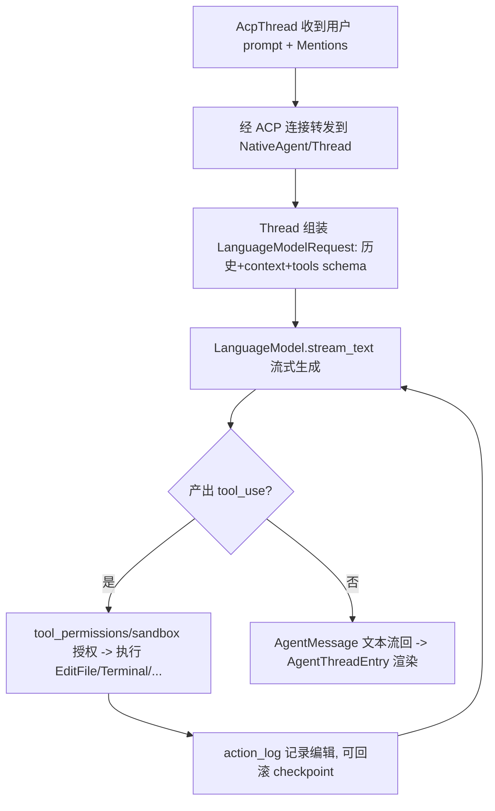

# Deep Reference: agent / acp_thread / language_model

> 参考手册级：Zed 的 AI Agent 由三层构成——`crates/language_model`（**模型/Provider 抽象**）、`crates/agent`（**原生 Agent 服务器 + Thread + 工具**，`agent.rs` 285KB、`thread.rs` 345KB、31 个 tool）、`crates/acp_thread`（**provider 无关的会话/条目模型**，UI 面向）。三者以 **ACP（Agent Client Protocol）** 为契约解耦，使"内置 agent"与"外部 ACP agent（如 claude-code/gemini）"共用同一 UI。→ Provider 具体厂商见 [Model-Providers.md](Model-Providers.md)。

## 1. `crates/language_model`：模型抽象
| 类型 | 位置 | 角色 |
|---|---|---|
| `trait LanguageModel` | [language_model.rs:91](../crates/language_model/src/language_model.rs) | 单个模型：`id`/`name`/`max_token_count`/`stream_text`/`supports_tools`… `LanguageModelTextStream`(L74) |
| `trait LanguageModelProvider` | [L366](../crates/language_model/src/language_model.rs) | 厂商：`provided_models`/`authenticate`/`default_model`/`settings_view` |
| `trait LanguageModelProviderState` | [L499](../crates/language_model/src/language_model.rs) | provider 动态状态（模型列表来源） |
| `struct LanguageModelRegistry` | [registry.rs:46](../crates/language_model/src/registry.rs) | 全局注册表：`SelectedModel`(L67)/`ConfiguredModel`(L96)/`Event`(L111)、`global`、model→provider 解析 |
| `struct ApiKeyConfiguration` / `ApiKeyState` | [L474](../crates/language_model/src/language_model.rs)/[api_key.rs:19](../crates/language_model/src/api_key.rs) | 密钥加载（env/文件） |
| `struct CompactionResult` | [L66](../crates/language_model/src/language_model.rs) | 上下文压缩 |
| `struct FakeLanguageModel(Provider)` | [fake_provider.rs:103](../crates/language_model/src/fake_provider.rs) | 测试桩 |
`request.rs`：`LanguageModelImageExt`、`LanguageModelRequest`（构造 messages/tools 请求体）。

## 2. `crates/agent`：原生 Agent 服务器 + Thread + 工具
### 2.1 顶层 `agent.rs`
| 类型 | 位置 | 角色 |
|---|---|---|
| `struct NativeAgent` | [agent.rs:440](../crates/agent/src/agent.rs) | **ACP `Agent` 实现**（`Entity`）：新会话、加载 skills、协调 `LanguageModels`(L255) |
| `struct NativeAgentConnection` | [L2194](../crates/agent/src/agent.rs) | 与某 client 的连接包装 |
| `struct NativeAgentSessionList` | [L3047](../crates/agent/src/agent.rs) | 会话列举 |
| `struct NativeThreadEnvironment` | [L3177](../crates/agent/src/agent.rs) | 运行环境（worktree/server/终端） |
| `struct NativeSubagentHandle` / `AcpTerminalHandle` | [L3451](../crates/agent/src/agent.rs)/[L3595](../crates/agent/src/agent.rs) | 子 agent / ACP 终端能力 |
| `trait SiblingThreadHost` | [L430](../crates/agent/src/agent.rs) | 兄弟线程（并行 agent）宿主 |
| `struct ProjectSnapshot` | [L90](../crates/agent/src/agent.rs) | 项目上下文快照 |
| Skills：`NativeAvailableSkill`/`SkillLoadingIssue*` | [L163](../crates/agent/src/agent.rs).. | 技能加载。→ [Agent.md] 与 `.agents/skills` |
### 2.2 会话 `thread.rs`（345KB）
| 类型 | 位置 | 角色 |
|---|---|---|
| `struct Thread` | [thread.rs:1261](../crates/agent/src/thread.rs) | **对话核心 `Entity`**；`id()->acp::SessionId`(L1498)、`summary`(L3839)、`send`/`start_completion`/`cancel`/checkpoint/regenerate |
| `enum Message` | [L203](../crates/agent/src/thread.rs) | `User`/`Assistant` |
| `struct UserMessage`/`enum UserMessageContent` | [L283](../crates/agent/src/thread.rs)/[L289](../crates/agent/src/thread.rs) | 文本+context+images |
| `struct AgentMessage`/`enum AgentMessageContent` | [L739](../crates/agent/src/thread.rs)/[L746](../crates/agent/src/thread.rs) | 文本 + tool_use |
| `enum CompactionInfo` | [L211](../crates/agent/src/thread.rs) | 上下文压缩边界 |
| `struct SubagentContext`/`SiblingThread*`/`AvailableAgents` | L143/L823/L862 | 子/兄弟 agent |
| `struct ThreadStore` | [thread_store.rs:12](../crates/agent/src/thread_store.rs) | 会话集合 |
| [db.rs](../crates/agent/src/db.rs)(45KB) | SQLite 持久化会话（[Persistence.md](Persistence.md)） |
### 2.3 工具（`tools/`，31 个，ACP tool handler）
每个工具 = `struct XxxTool` + `XxxToolInput`（JSON schema），被模型以 tool_use 调用。清单（大小）：
[edit_file_tool.rs](../crates/agent/src/tools/edit_file_tool.rs)(117KB，含冲突/retry)、[terminal_tool.rs](../crates/agent/src/tools/terminal_tool.rs)(152KB)、[read_file_tool.rs](../crates/agent/src/tools/read_file_tool.rs)(75KB)、[write_file_tool.rs](../crates/agent/src/tools/write_file_tool.rs)(55KB)、[grep_tool.rs](../crates/agent/src/tools/grep_tool.rs)(51KB)、[list_directory_tool.rs](../crates/agent/src/tools/list_directory_tool.rs)(41KB)、[skill_tool.rs](../crates/agent/src/tools/skill_tool.rs)、[edit_session.rs](../crates/agent/src/tools/edit_session.rs)(43KB)、web_search/fetch、go_to_definition/find_references/get_code_actions/apply_code_action/diagnostics、copy_path/delete_path/move_path/create_directory/rename/create_thread/spawn_agent/ask_user/find_path_tool、symbol_locator、context_server_registry（把 MCP 工具接入）、[tool_permissions.rs](../crates/agent/src/tools/tool_permissions.rs)。
### 2.4 权限与沙箱
- [tool_permissions.rs](../crates/agent/src/tool_permissions.rs)(83KB)：按工具/路径/命令的授权（always/once/reject）。
- [sandboxing.rs](../crates/agent/src/sandboxing.rs)(49KB)：命令执行沙箱（macOS seatbelt/Windows WSL），→ 底层 `crates/sandbox`（见 [Module-Index](Module-Index.md)）。
- [templates.rs](../crates/agent/src/templates.rs)/`templates/`：系统提示模板；[pattern_extraction.rs](../crates/agent/src/pattern_extraction.rs)：编辑模式抽取。

## 3. `crates/acp_thread`：provider 无关的会话模型（UI 面向）
| 类型 | 位置 | 角色 |
|---|---|---|
| `struct AcpThread` | [acp_thread.rs:2089](../crates/acp_thread/src/acp_thread.rs) | 面向 UI 的**通用会话 `Entity`**（包装任意 ACP agent 连接） |
| `enum AgentThreadEntry` | [L394](../crates/acp_thread/src/acp_thread.rs) | 会话条目：`User`/`Assistant`/`ToolCall`/`Checkpoint`/`Subagent`…（UI 渲染单元） |
| `UserMessage`/`AssistantMessage`/`AssistantMessageChunk` | L294/L330/L349 | 消息与流式 chunk |
| `struct Checkpoint` | [L305](../crates/acp_thread/src/acp_thread.rs) | 可回滚检查点（配合 [action_log]） |
| `enum CommandCategory` | [L89](../crates/acp_thread/src/acp_thread.rs) | 命令风险分类（沙箱/授权） |
| `SandboxPermission`/`SandboxAuthorizationDetails` | L136/L165 | 沙箱授权 |
| `struct Elicitation`/`ElicitationStatus` | L407/L414 | agent 反问用户（elicitation） |
| `enum MentionUri` / `struct MentionLink` | [mention.rs:20](../crates/acp_thread/src/mention.rs)/[L589](../crates/acp_thread/src/mention.rs) | `@file`/`@symbol`/`@web` 等上下文提及 |
| `connection.rs`：`ClientUserMessageId`/`AgentModelId`；`terminal.rs`：`SandboxWrap`/`Terminal` | | 连接与终端能力 |

## 4. 一次 agent 回合（真实流程）

## 5. 集成点
- UI 面板在 `crates/agent_ui`/`crates/assistant`（[Agent-and-AI.md](Agent-and-AI.md) 概览）。
- 编辑应用走 [streaming_diff](Data-Structures.md) + [action_log]。
- MCP 工具经 `context_server`（`context_server_registry`）。→ [Module-Index](Module-Index.md)。
- 外部 ACP agent 经 `agent_servers`/`acp_tools`。

## 6. 相关页
[Model-Providers.md](Model-Providers.md)、[Edit-Prediction.md](Edit-Prediction.md)、[Agent-and-AI.md](Agent-and-AI.md)、[Editor-Deep-Dive.md](Editor-Deep-Dive.md)。
