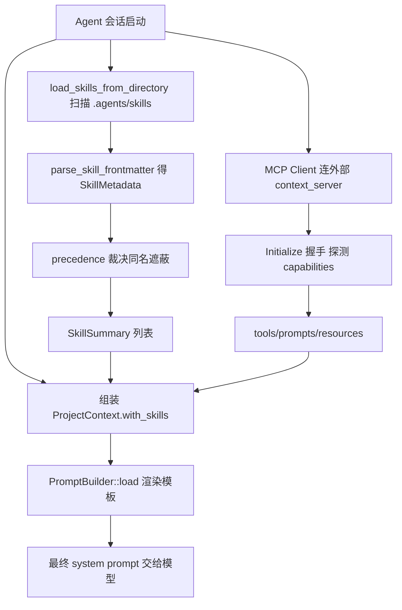

# Agent Skills / Prompt / Context Server 深入解析（Deep Dive）

> 本页覆盖 Zed Agent 的"上下文供给三件套"：`agent_skills`（技能发现/加载/作用域优先级）、`prompt_store`（系统提示模板引擎 + 用户提示持久化）、`context_server`（Model Context Protocol 客户端与内建服务端）。它们共同决定"喂给模型什么上下文"。共 3 个 crate。

## 1. 分层设计

- **技能层** `agent_skills`：把 `.agents/skills/` 下的 SKILL.md（带 YAML frontmatter）加载成 `Skill`，按 `SkillSource` 三级作用域（BuiltIn < Global < ProjectLocal）做同名遮蔽，产出 `SkillSummary` 注入提示。
- **提示层** `prompt_store`：`PromptBuilder`（prompts.rs）把 `ProjectContext`/`ContentPromptContext` 等结构化上下文渲染成最终 system prompt 字符串；`PromptStore`（prompt_store.rs，SQLite 持久）管理用户自定义提示与内建提示（`BuiltInPrompt`）。
- **外部上下文层** `context_server`：实现 MCP——`Client` 通过 `Transport`（stdio / http）连到外部 context server，用 `ModelContextServerProtocol`/`InitializedContextServerProtocol` 交换 `Tool`/`Prompt`/`Resource`；`McpServer`（listener.rs）反向把 Zed 自身暴露成一个 MCP 服务端。

## 2. 类型总览

### agent_skills（agent_skills.rs）

| 符号 | 文件:行 | 角色 |
| --- | --- | --- |
| `struct SkillScopeId(pub usize)` | :38 | 技能所属 project scope 的不透明 id |
| `enum SkillLoadWarning` | :56 | 非致命加载问题（如描述超长） |
| `struct Skill` | :75 | 已加载技能（metadata + body + warnings） |
| `enum SkillSource` | :97 | BuiltIn / Global / ProjectLocal |
| `fn precedence()` | :121 | 遮蔽优先级 0/1/2 |
| `fn matches_scope(scope)` | :172 | `/<scope>:<name>` 作用域匹配 |
| `struct SkillIndex` | :185 | Global：按 scope 分组的技能索引 |
| `struct ProjectSkillGroup` | :191 | 单 worktree 的技能集合 |
| `struct SkillsUpdatedHook` | :200 | 技能变更回调 global |
| `struct SkillMetadata` | :206 | frontmatter 解析结果 |
| `struct SkillSummary` | :222 | 注入提示的精简摘要 |
| `fn parse_skill_frontmatter(..)` | :266 | 解析 YAML 头 |
| `fn parse_skill_file_content(..)` | :304 | content → (SkillMetadata, body) |
| `async fn load_skills_from_directory(..)` | :540 | 目录发现（并发受 :40 上限约束） |
| `async fn load_skill_frontmatter(..)` | :624 | 只读头（懒加载） |
| `async fn read_skill_body(..)` | :669 | 读取技能正文 |

### prompt_store

| 符号 | 文件:行 | 角色 |
| --- | --- | --- |
| `fn init(cx)` | prompt_store.rs:27 | 注册 global |
| `struct PromptMetadata` | prompt_store.rs:42 | 用户提示元数据 |
| `enum BuiltInPrompt` | prompt_store.rs:62 | 内建提示（title/default_content） |
| `enum PromptId` | prompt_store.rs:91 | BuiltIn / User 二选一 |
| `struct UserPromptId(pub Uuid)` | prompt_store.rs:134 | 用户提示主键 |
| `struct PromptStore` | prompt_store.rs:157 | SQLite 持久存储 |
| `fn all_prompt_metadata(&self)` | prompt_store.rs:326 | 列出全部提示元数据 |
| `struct ProjectContext` | prompts.rs:35 | 工作树上下文根 |
| `fn with_skills(skills)` | prompts.rs:72 | 注入 `SkillSummary` 列表 |
| `struct WorktreeContext` | prompts.rs:88 | 单个 worktree |
| `struct RulesFileContext` | prompts.rs:95 | 规则文件 |
| `struct ContentPromptContext` | prompts.rs:112 | 内容生成提示上下文 |
| `struct ContentPromptContextV2` | prompts.rs:124 | V2 版 |
| `struct PromptBuilder` | prompts.rs:192 | 模板渲染引擎 |
| `fn load(fs, stdout_is_a_pty, cx)` | prompts.rs:197 | 从嵌入模板构建 |

### context_server

| 符号 | 文件:行 | 角色 |
| --- | --- | --- |
| `struct ContextServer` | context_server.rs:41 | 一个 context server 实例 |
| `struct ContextServerId(pub Arc<str>)` | context_server.rs:28 | 服务器标识 |
| `fn stdio(..)` / `fn http(..)` | context_server.rs:49 / :65 | 按传输方式构造 |
| `fn client()` | context_server.rs:106 | 取已初始化协议 |
| `fn auth_challenge()` | context_server.rs:113 | OAuth 挑战信息 |
| `trait Transport: Send+Sync` | transport.rs:15 | 传输抽象（stdio/http） |
| `struct ModelContextProtocol` | protocol.rs:19 | initialize 前协议 |
| `struct InitializedContextServerProtocol` | protocol.rs:81 | 已初始化协议 |
| `enum ServerCapability` | protocol.rs:87 | tools/prompts/resources 能力位 |
| `fn capable(cap)` | protocol.rs:97 | 能力查询 |
| `struct Client` | client.rs:165 | MCP JSON-RPC 客户端 |
| `enum RequestId` | client.rs:45 | 请求关联 id |
| `struct ModelContextServerBinary` | client.rs:158 | 待启动的 server 二进制规格 |
| `fn notify(method, params)` | client.rs:490 | 发送通知 |
| `struct McpServer` | listener.rs:34 | Zed 作为 MCP 服务端 |
| `fn add_tool<T: McpServerTool>(..)` | listener.rs:87 | 注册工具 |
| `fn handle_request<R: Request>(..)` | listener.rs:143 | 请求派发 |
| `struct InitializeParams/Response` | types.rs:154 / :276 | MCP 握手消息 |
| `struct ResourcesReadParams` | types.rs:190 | resources/read |
| `struct PromptsGetParams` | types.rs:206 | prompts/get |

## 3. 核心方法与调用锚点

**技能加载与作用域（agent_skills.rs）**
- `load_skills_from_directory(..)`(:540) 并发扫描目录（并发上限见 :40 注释），对每个 `SKILL.md` 先 `load_skill_frontmatter`(:624) 只解析 `SkillMetadata`(:206)，需要正文时再 `read_skill_body`(:669)——懒加载省 token。
- `parse_skill_frontmatter`(:266) / `parse_skill_file_content`(:304) 拆 YAML 头与 Markdown 体。
- 同名冲突由 `SkillSource::precedence`(:121) 裁决：`ProjectLocal`(2) > `Global`(1) > `BuiltIn`(0)，注释(:112-120)强调"新增变体只需改这一处"。
- `matches_scope`(:172) 支撑 `/<scope>:<name>` 斜杠命令：BuiltIn/Global 匹配空前缀（:174），ProjectLocal 匹配 worktree 根名。
- 结果汇入 `SkillIndex`(:185，Global) 的 `ProjectSkillGroup`(:191)，变更经 `SkillsUpdatedHook`(:200) 通知。

**提示渲染（prompt_store / prompts.rs）**
- `PromptBuilder::load(fs, stdout_is_a_pty, cx)`(prompts.rs:197) 从内嵌模板构造；`new(loading_params)`(:210)。
- 调用方组装 `ProjectContext::new(worktrees)`(prompts.rs:52).`with_skills(skills)`(:72)，把技能摘要塞进上下文，再渲染成最终 system prompt。
- `PromptStore::new(db_path, cx)`(prompt_store.rs:217) 打开 SQLite，`global(cx)`(:212) 取共享实例；`PromptId`(:91) 区分 `BuiltInPrompt`(:62) 与 `UserPromptId`(:134)。

**MCP 客户端（context_server）**
- `ContextServer::stdio`/`http`(context_server.rs:49/:65) 依 `Transport`(transport.rs:15) 建立连接。
- `Client::stdio(..)`(client.rs:171)/`new(..)`(:195) 启动 `ModelContextServerBinary`(:158) 并做 JSON-RPC 握手。
- 初始化后得到 `InitializedContextServerProtocol`(protocol.rs:81)，用 `capable(ServerCapability)`(:97) 判断是否支持 tools/prompts/resources，再发 `types.rs` 中的 `ResourcesReadParams`(:190)/`PromptsGetParams`(:206) 等请求。

**Zed 作为 MCP 服务端（listener.rs）**
- `McpServer::new(cx)`(:55) 起一个本地 socket server（`socket_path()` :196）；`add_tool::<T: McpServerTool>()`(:87) 注册工具；`handle_request::<R: Request>()`(:143) 按请求类型派发，响应封装 `ToolResponse<T>`(:426)。

## 4. 上下文装配流程

## 5. 集成点

- `agent`/`agent_ui` 在构造对话上下文时调用 `agent_skills` 取 `SkillSummary`、调 `prompt_store::PromptBuilder` 渲染系统提示。
- `context_server` 被 `acp_thread`/`agent` 用作外部工具来源，OAuth 流程见 `oauth.rs`（106KB，MCP HTTP 服务器授权）。
- `prompt_store` 的 SQLite 表通过 `db`/`sqlez` 建域（见 Persistence 页）；`rules_to_skills_migration.rs`（39KB）把旧 rules 迁移成 skills。
- `McpServer`(listener.rs) 让外部 MCP 客户端反过来调用 Zed 内建工具（socket IPC）。

## 6. 相关页

- [Agent-Deep-Dive](Agent-Deep-Dive.md)（对话/工具执行主体）
- [Model-Providers-Deep-Dive](Model-Providers-Deep-Dive.md)（渲染出的提示最终送往 provider）
- [Persistence-Deep-Dive](Persistence-Deep-Dive.md)（`prompt_store` 的 SQLite 域）
- [Agent-and-AI](Agent-and-AI.md)（Agent 族概览）
