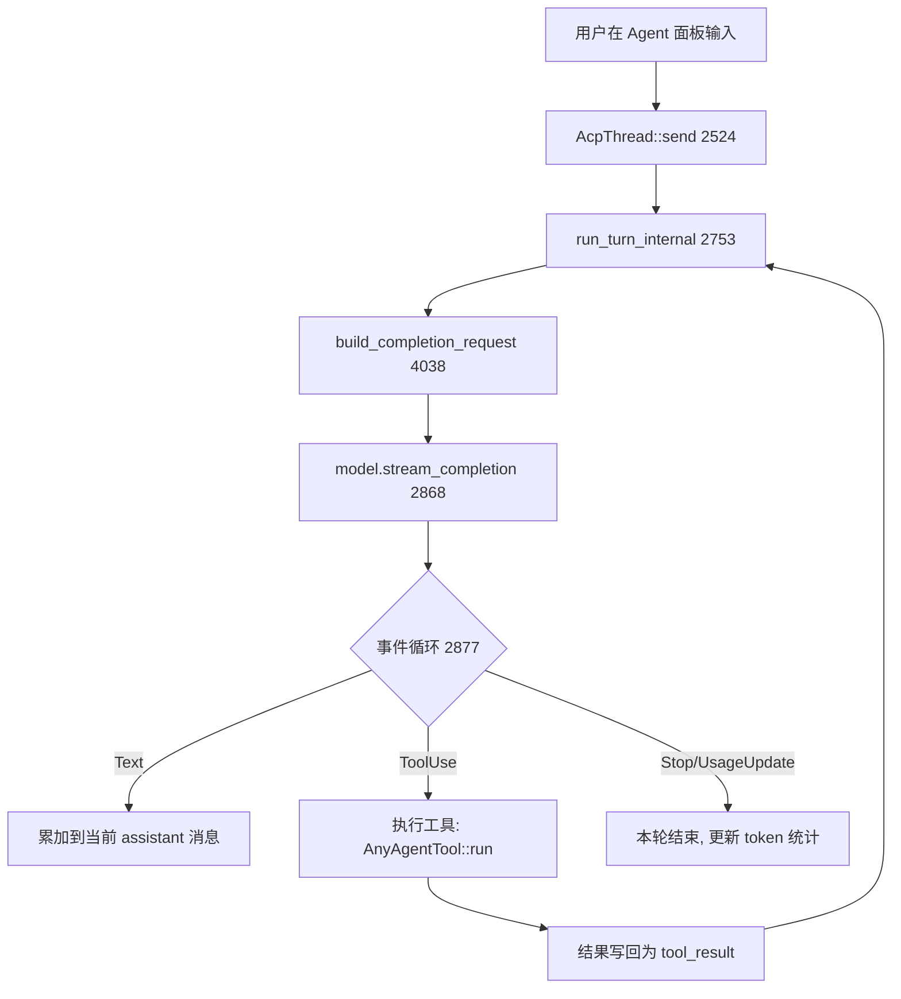

# Agent & AI（模型接入 / 对话请求流程 / 工具调用）

Zed 的 AI 能力分三层：**Provider（厂商接入）** → **LanguageModel（统一模型抽象）** → **Agent Thread（对话 + 工具循环）**。相关 crate：[`language_model_core`](../crates/language_model_core)、[`language_model`](../crates/language_model)、[`language_models`](../crates/language_models)、[`agent`](../crates/agent)、[`acp_thread`](../crates/acp_thread)、[`edit_prediction`](../crates/edit_prediction)。

## 1. 职责划分

| crate | 职责 | 关键类型 / 文件 |
|---|---|---|
| `language_model_core` | 与 UI 无关的基础类型：请求/事件/错误/token 统计、ProviderId 常量 | `LanguageModelCompletionEvent`(`language_model_core.rs:36`)、`TokenUsage`(L511)、`LanguageModelToolUse`(L578)、`StopReason`(L503) |
| `language_model` | **模型与 Provider 的 trait 抽象**、全局注册表 | `LanguageModel`(`language_model.rs:91`)、`LanguageModelProvider`(L366)、`LanguageModelRegistry`(`registry.rs:46`) |
| `language_models` | 各厂商 **具体实现**（20 个 provider） | `provider/`：`anthropic.rs`、`open_ai.rs`、`ollama.rs`、`bedrock.rs`、`cloud.rs`(Zed)、`google.rs`、`mistral.rs`、`deepseek.rs`、`x_ai.rs`、`open_router.rs`、`llama_cpp.rs`、`lmstudio.rs`、`copilot_chat.rs` … |
| `agent` | 对话线程、工具集、权限、沙箱 | `thread.rs`(AcpThread)、`tools/`、`tool_permissions.rs`、`sandboxing.rs` |
| `acp_thread` | Agent Client Protocol 下的共享会话模型（UI 与后端解耦） | `AcpThread`、`ClientUserMessageId` |
| `edit_prediction` | 内联编辑预测（next-edit / ghost text） | `EditPredictionStore`(`edit_prediction.rs:164`) |

## 2. 模型抽象：`LanguageModel` trait

定义于 [`language_model.rs:91`](../crates/language_model/src/language_model.rs)，是所有厂商模型的统一接口：

- **身份**：`id()` / `name()` / `provider_id()` / `provider_name()`（L92-95）。
- **能力查询**：`supports_thinking()`(L137)、`supports_images()`(L194)、`supports_tools()`(L197)、`supports_tool_choice()`(L200)、`max_token_count()`(L213)。UI 据此决定可选项。
- **核心方法 `stream_completion()`（L218）**：输入 `LanguageModelRequest`，返回一个 `BoxStream<LanguageModelCompletionEvent>` 异步事件流——这是所有对话的底座。
  - `stream_completion_text()`（L230）：在其上过滤出纯 `Text` 事件，拼成文本流。
  - `stream_completion_tool()`（L296）：在其上等待首个完整的 `ToolUse` 事件（供结构化输出场景）。

`LanguageModelProvider` trait（L366）则负责“一个厂商”：`provided_models()`(L374)、`default_model()`(L372)、`is_authenticated()`(L378)、`authenticate()`(L379)、`set_api_key()`(L382)。

## 3. 注册与解析：`LanguageModelRegistry`

[`registry.rs:46`](../crates/language_model/src/registry.rs) 是全局单例（`Global`）：

- `global(cx)`(L127) / `read_global(cx)`(L131)：任意处以 `App` 取用。
- `register_provider::<T>()`(L162)：Zed 启动时注册内置 providers；扩展安装时注册扩展提供的 providers，并订阅其状态变化事件。
- `providers()`(L189) / `visible_providers()`(L206)：枚举（`zed.dev` 恒排首位，隐藏的内置被过滤）。
- 解析“当前默认模型”：`default_model()` 依据 settings 里用户选择 → 回落到 provider 默认，`thread.rs` 每轮都重新读取以支持中途切换模型。

## 4. 一次对话请求的完整调用流程

以 Agent 面板发送一条消息为例（[`agent/src/thread.rs`](../crates/agent/src/thread.rs)）：

关键点：
1. **`send()`（L2524）**：把用户内容作为一条 `User` 消息追加进历史，触发一个 turn。
2. **`run_turn_internal()`（L2753）**：turn 的主循环，处理“请求→工具→再请求”的多轮往返。
3. **`build_completion_request()`（L4038）**：把历史消息 + 系统提示 + 当前可用工具（`turn.tools`，逐个转成 `LanguageModelRequestTool::function`）组装成 `LanguageModelRequest`。
4. **`model.stream_completion(request, cx).await`（L2868）**：拿到事件流。
5. **事件循环（L2877）**：用 `futures::select!` 同时竞速 *模型事件* / *已完成工具的结果*（`FuturesUnordered`）/ *取消信号*；`Text`/`Thinking` 增量交给 UI，`ToolUse` 派发给对应工具。
6. **工具结果回流**：每个 `run_turn_internal` 迭代在 L2843 重新 `refresh_turn_tools` 并重读模型，使“中途换模型 / 开关工具 / 改 profile”在工具轮次之间即时生效。
7. **错误重试**：`retry_completion_error()`（L3108）对可重试错误（限流等）做退避重试。

## 5. 工具系统（Tools）

工具在 [`agent/src/tools.rs`](../crates/agent/src/tools.rs) 用 `tools!` 宏（L199）集中声明，编译期生成 `ALL_TOOL_NAMES` 与 `built_in_tools()`（L163）。当前 **24 个内置工具**，覆盖文件读写、终端、检索、诊断、子代理等：

| 工具 | 文件 | 作用 |
|---|---|---|
| `EditFileTool` | `tools/edit_file_tool.rs` | 对已打开 buffer 做 diff 式编辑（带审阅） |
| `WriteFileTool` / `ReadFileTool` | `tools/write_file_tool.rs` / `read_file_tool.rs` | 创建/覆盖、读取文件 |
| `TerminalTool` | `tools/terminal_tool.rs` | 执行 shell 命令 |
| `GrepTool` / `FindPathTool` / `ListDirectoryTool` | `tools/*` | 内容/路径检索、目录列举 |
| `FetchTool` / `WebSearchTool` | `tools/fetch_tool.rs` / `web_search_tool.rs` | 抓 URL、联网搜索 |
| `DiagnosticsTool` / `GoToDefinitionTool` / `FindReferencesTool` | `tools/*` | LSP 诊断与代码导航 |
| `SpawnAgentTool` / `CreateThreadTool` | `tools/spawn_agent_tool.rs` / `create_thread_tool.rs` | 派生子代理 / 兄弟会话 |
| `SkillTool` | `tools/skill_tool.rs` | 激活 Agent Skills |

抽象有两层：
- **`AgentTool`**（关联类型 `Input`/`Output`、`const NAME`、`description()`、`input_schema()`、`run()`）——编译期泛型，供具体工具实现。
- **`AnyAgentTool`**（[`thread.rs:5145`](../crates/agent/src/thread.rs)）——对象安全版本，`Thread` 内部以 `Erased<Arc<T>>` 统一持有与调度（L5176 的 blanket impl）。
- 注册入口：`add_tool::<T>()`（L2216）、`add_default_tools()`（L2185 附近集中装配）。

**三重门禁**（tools.rs L184-198 注释明示）决定某工具是否真正到达模型：① Agent Profile 的 `tools` 允许列表（`enabled_tools` 过滤）；② 权限 UI 必须登记该工具；③ `tool_feature_flag_enabled()`（L233）特性开关。此外受限工作区下 `FetchTool`、`TerminalTool` 被 `allow_in_restricted_mode()` 禁用（L279 测试）。

## 6. 内联编辑预测（Edit Prediction）

与“对话”并行的低延迟路径：[`EditPredictionStore`](../crates/edit_prediction/src/edit_prediction.rs)（L164）持有 `Client` 与当前 `EditPredictionModel`（`set_edit_prediction_model()`，L1075）。编辑器光标处根据上下文（`edit_prediction_context`）异步拉取预测，渲染为 ghost text；指标由 `edit_prediction_metrics` 采集。Copilot 作为其中一种 provider（`copilot_chat`）。

## 7. 关键符号速查

| 符号 | 位置 | 作用 |
|---|---|---|
| `LanguageModel::stream_completion` | `language_model/src/language_model.rs:218` | 统一流式补全入口 |
| `LanguageModelCompletionEvent` | `language_model_core/src/language_model_core.rs:36` | Text/Thinking/ToolUse/Stop/UsageUpdate 事件 |
| `LanguageModelProvider` | `language_model/src/language_model.rs:366` | 厂商 Provider 抽象 |
| `LanguageModelRegistry::register_provider` | `language_model/src/registry.rs:162` | 注册 provider（内置或扩展） |
| `AcpThread::send` | `agent/src/thread.rs:2524` | 提交用户消息、启动 turn |
| `run_turn_internal` | `agent/src/thread.rs:2753` | 对话-工具多轮主循环 |
| `build_completion_request` | `agent/src/thread.rs:4038` | 组装请求（消息+工具） |
| `AnyAgentTool::run` | `agent/src/thread.rs:5161` | 工具执行（擦除后统一签名） |
| `EditPredictionStore` | `edit_prediction/src/edit_prediction.rs:164` | 内联预测状态与模型 |

## 8. 与其他页面的关系
- Provider 通过扩展注册：见 [Architecture.md](Architecture.md)、[Language-and-Project.md](Language-and-Project.md) 的扩展体系。
- 内联预测在编辑器中的渲染：[Editor.md](Editor.md)。
- Zed 云推理走的 RPC/实时链路：[Collaboration-and-Call.md](Collaboration-and-Call.md)。
