# Architecture（整体架构与模块分层）

Zed 是一个 Cargo workspace（[`Cargo.toml`](../Cargo.toml)），`crates/` 下 **244 个成员 crate**，最终由 `crates/zed` 装配成 `zed` 二进制。下面按"自底向上"的分层给出各层职责、代表 crate 与关键类型。

## 1. 分层总览

```mermaid
graph TB
    subgraph L6[应用装配层]
        ZED[crates/zed 主程序]
        CLI[crates/cli]
        COLLAB["crates/collab 服务端（已移除）"]
        RS["crates/remote_server（已移除）"]
    end
    subgraph L5[特性层]
        AGENT[agent / agent_ui]
        PRED[edit_prediction]
        CALL["call / collab_ui（已移除）"]
        VIM[vim / which_key]
        DBG[debugger_ui / dap_adapters]
        EXT[extension / extension_host]
        PROV[open_ai / anthropic / ollama ...]
    end
    subgraph L4[编辑与 UI 面板层]
        EDITOR[editor]
        WS[workspace]
        PANELS[project_panel / command_palette / outline / search ...]
        PICKER[picker / menu / breadcrumbs]
    end
    subgraph L3[语言与项目核心]
        LANG[language / language_core / languages]
        PROJ[project]
        MB[multi_buffer]
        LSP[lsp]
    end
    subgraph L2[基础设施]
        UTIL[util / collections / fs / rope / paths]
        SET[settings / theme / icons / assets]
        NET[client / rpc / http_client / db / clock]
    end
    subgraph L1[平台与渲染层]
        GPUI[gpui]
        PLAT[gpui_platform / gpui_wgpu / gpui_windows / gpui_linux / gpui_macos]
    end

    L1 --> L2 --> L3 --> L4 --> L5 --> L6
```

## 2. 各层代表 crate 与关键类型

### L1 平台与渲染层
| crate | 职责 | 关键类型 / 入口 |
|---|---|---|
| `gpui` | UI 框架核心：应用循环、窗口、元素树、事件、Action、文本系统 | `Application`、`App`、`Context<T>`、`Entity<T>`、`Window`、`Element`、`Task` |
| `gpui_platform` | 平台后端选择（macOS/Linux/Windows/Web） | `current_platform()` |
| `gpui_wgpu` | 基于 wgpu 的 GPU 渲染器 | 场景合成 / primitive batch |
| `gpui_windows` / `gpui_linux` / `gpui_macos` | 各系统平台实现（窗口、剪贴板、IME、事件源） | `WindowsPlatform` 等 |
| `gpui_macros` | `#[derive(Render)]`、`keymap!`、`object` 等宏 | — |

详见 [GPUI.md](GPUI.md)。

### L2 基础设施
| crate | 职责 |
|---|---|
| `rope` | 行文本数据结构（编辑缓冲区的底层） |
| `fs` | 文件系统抽象 `RealFs` + trait `Fs` |
| `paths` | 数据/配置目录（`APP_NAME_LOWERCASE` 等） |
| `settings` / `settings_content` | 设置系统、`watch_config_file` |
| `theme` / `icons` / `assets` | 主题与资源 |
| `client` / `rpc` / `http_client` / `db` / `clock` | 网络、RPC、SQLite、逻辑时钟 |

### L3 语言与项目核心
| crate | 职责 | 关键类型 |
|---|---|---|
| `language` / `language_core` | Buffer、语法高亮、Tree-sitter 集成、LSP 客户端封装 | `Buffer`、`Language`、`LanguageServer` |
| `languages` | 各内建语言配置（含 **Python 环境探测 `pet-*`**） | `LanguageRegistry` |
| `project` | 项目模型：worktree、search、任务、诊断聚合 | `Project`、`Worktree` |
| `multi_buffer` | 跨文件虚拟缓冲（diff / findings 视图基础） | `MultiBuffer` |
| `lsp` | LSP 协议类型封装 | — |

详见 [Language-and-Project.md](Language-and-Project.md)。

### L4 编辑与 UI 面板层
| crate | 职责 |
|---|---|
| `editor` | 核心编辑器控件（详见 [Editor.md](Editor.md)） |
| `workspace` | 窗口/面板/项目树容器，`AppState`、`Pane` |
| `project_panel` / `outline` / `search` / `command_palette` / `file_finder` / `project_symbols` / `breadcrumbs` / `tab_switcher` / `title_bar` / `notifications` | 各类面板与全局 UI |
| `picker` | 模糊选择器基类（command_palette/file_finder 的公共底座） |

### L5 特性层
| crate | 职责 |
|---|---|
| `agent` / `agent_ui` / `acp_thread` / `acp_tools` | AI 助手与对话（详见 [Agent-and-AI.md](Agent-and-AI.md)） |
| `edit_prediction*` | 内联编辑预测 |
| `audio` | 音频管线（cpal/rodio）；原 `call` / `collab_ui` / `livekit_client` 已移除（详见 [Collaboration-and-Call.md](Collaboration-and-Call.md)） |
| `open_ai` / `anthropic` / `google_ai` / `ollama` / `mistral` / `bedrock` / `deepseek` / `codestral` / `open_router` / `lmstudio` / `llama_cpp` | 各模型 Provider |
| `extension` / `extension_host` / `extensions_ui` | 扩展系统（WASM） |
| `vim` / `which_key` / `terminal` / `debugger_ui` / `dap_adapters` | 编辑增强 |

### L6 应用装配层
| crate | 职责 |
|---|---|
| `crates/zed` | **桌面主程序**：`main()` 装配全部子系统（详见 [Startup-Flow.md](Startup-Flow.md)） |
| `cli` | `zed` 命令行入口 |
| `collab`（已移除） | 协作服务端（仅依赖 `livekit_api`，不含 webrtc） |

## 3. 关键设计约束

1. **单线程 UI + 后台执行器**：所有 `Entity`/视图状态变更只能在 GPUI 主线程通过 `Context` 完成；耗时工作走 `cx.background_executor()` / `cx.spawn()`。
2. **依赖注入靠 Global**：大量子系统以 `::set_global(...)` / `::global(cx)`（`UpdateGlobal`/`Global` trait）挂载到 `App`，启动时统一注册（见 [Startup-Flow](Startup-Flow.md)）。
3. **平台差异用 `cfg` 收敛**：渲染、平台后端、以及音频/RTC 的替身实现都通过 `#[cfg(...)]` 切换；Windows 上的 webrtc/spectre 裁剪即是一例（见 [Building-on-Windows](Building-on-Windows.md)）。
