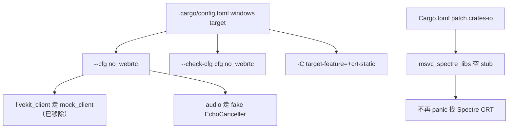

# Building on Windows（MSVC 工具链 / webrtc 与 spectre 裁剪）

本页记录 **在本仓库内把桌面编辑器在 Windows MSVC 下编译起来** 所需的配置与本地改动，是对官方 [docs/src/development/windows.md](../docs/src/development/windows.md) 的补充。核心两块裁剪：**`no_webrtc`（绕开 libwebrtc/LiveKit）** 与 **`msvc_spectre_libs` patch（绕开 Spectre CRT）**。

## 1. 官方前置工具链（MSVC）

| 依赖 | 说明 |
|---|---|
| rustup + stable | 见 [`rust-toolchain.toml`](../rust-toolchain.toml)（当前 `channel = "1.98.1"`） |
| Visual Studio / Build Tools | 需 `MSVC v*** C++ x64/x86 build tools` + **`Spectre-mitigated libs`** + “Desktop development with C++” 工作负载 |
| Windows SDK | 至少 `10.0.20348.0`（文档推荐 Windows11SDK.26100） |
| CMake | 被 `wasmtime-c-api` 依赖，需在 `PATH` |

> 注：官方文档把 **Spectre-mitigated libs** 列为必装，因为 `pet-*`（Python 环境探测）会经 `msvc_spectre_libs` 强制链接它们；本项目已用第 4 节的 patch **免除此要求**。

## 2. 本地构建配置总览



三处关键文件：
- [`.cargo/config.toml`](../.cargo/config.toml)（L12-22）：注入 `--cfg no_webrtc` 与 `--check-cfg`、强制 `crt-static`。
- [`Cargo.toml`](../Cargo.toml)（`[patch.crates-io]`，L976-996）：`msvc_spectre_libs` path stub。
- [`build-patches/msvc_spectre_libs/`](../build-patches/msvc_spectre_libs)：no-op 替身 crate。

> **切勿用环境变量 `RUSTFLAGS`**：它会整体覆盖 `.cargo/config.toml` 里的 `rustflags`（含上面这些必需项），导致链接失败或难诊断的错误（官方文档“Setting RUSTFLAGS breaks builds”一节）。要加自定义 flag，请在 config.toml 的对应 `target`/`build` 段追加。

## 3. webrtc 裁剪：`no_webrtc`

**动机**：`libwebrtc`/`webrtc-sys` 需要下载预编译 WebRTC 二进制，且 `webrtc-sys` 的构建脚本按 **仅 Linux** 供给，MSVC 下无法完成。

> ⚠️ 历史：`livekit_client` / `call` 已从本 fork 移除（提交 `移除call和remote`），下面关于二者的门控/补偿点描述仅作参考。`--cfg no_webrtc` 仍然生效，但现仅作用于 `audio`（仍依赖 `libwebrtc`）。

**做法**：`--cfg no_webrtc` 复用 Zed 内建替身机制。原 `livekit_client` 的门控条件（`crates/livekit_client/src/lib.rs:13-68`）：

```
any(test, feature = "test-support",
    all(target_os = "windows", target_env = "gnu"),
    target_os = "freebsd",
    no_webrtc)
```

命中即编译 `mock_client` + `pub mod test`，不链接真实 livekit（该 crate 已移除）。当前仍然生效的是 `audio` 侧：改用 fake `EchoCanceller`（`crates/audio/src/audio_pipeline/echo_canceller.rs`）。这样整条 webrtc/LiveKit 原生依赖被裁掉。

**补偿点（易漏，历史）**：任何直接引用真实 `RtcStats::*` 变体的代码，必须用同一判定切到替身版，否则报 E0599。原 `call/src/call_impl/diagnostics.rs`（已移除）：`compute_remote_audio_stats`、`extract_metrics` 各有替身/真实两版门控，均已补 `no_webrtc`。替身符号见 `livekit_client/src/test.rs`（已移除；`RtcStats` 空枚举 L50、`SessionStats` L44）。详见 [Collaboration-and-Call.md](Collaboration-and-Call.md) 第 5 节。

`--check-cfg cfg(no_webrtc)` 用于声明该自定义 cfg，避免 `unexpected_cfgs` lint 报错。

## 4. spectre 裁剪：`msvc_spectre_libs` 空 stub（方案 A）

**依赖链**：`crates/languages`（Python 环境探测）→ `pet`、`pet-core`、`pet-conda`、`pet-poetry`、`pet-reporter`、`pet-virtualenv` …（共 24 个 `pet-*`，workspace 定义见 [Cargo.toml](../Cargo.toml) L743-749，源 `microsoft/python-environment-tools`）→ **都带 `features = ["error"]`** 依赖 `msvc_spectre_libs`。

**上游行为**：`vendor/msvc_spectre_libs/build.rs` 在 `cfg(all(windows, target_env="msvc"))` 下探测 Spectre CRT 库，缺库时因启用了 `error` feature 而 `panic!("No spectre-mitigated libs were found...")`（L38）。该 crate **无任何公开 API**（`src/lib.rs` 为空，全仓无 `use`），一切逻辑都在 build.rs。

**本地改动**：
1. 新建 [`build-patches/msvc_spectre_libs/`](../build-patches/msvc_spectre_libs)：
   - `Cargo.toml`：`version = "0.1.3"`（匹配 Cargo.lock，满足 `pet-*` 的 `^0.1.1`）、保留 `error = []` 空特性（否则依赖解析失败）。
   - `build.rs`：`fn main() {}`——不加 link-search、不 panic。
   - `src/lib.rs`：空。
2. [`Cargo.toml`](../Cargo.toml) `[patch.crates-io]` 追加（L996）：
   ```toml
   msvc_spectre_libs = { path = "build-patches/msvc_spectre_libs" }
   ```

**为何用 `[patch.crates-io]` 而非直接改 vendor/**：本仓 `.cargo/config.toml` 用 `replace-with = "vendored-sources"`（L31-32、L198-199），手改 `vendor/` 会触发 `.cargo-checksum.json` 校验失败。path patch 是官方支持且已在同环境验证的做法——同段已有 `scratch = { path = "corgi-patches/scratch" }`（L1008）先例，无需 `[workspace]`/`exclude` 也能生效。

> 首次 `cargo build` 后，Cargo.lock 会自动把 `msvc_spectre_libs` 的 source 从 registry 改为该 path（预期内）。回退：删除该 patch 行与 `build-patches/msvc_spectre_libs/` 即可恢复要求 Spectre 库的原状。

## 5. 为什么不能用 `windows-gnu` 编译桌面

曾有以 GNU 工具链绕开 MSVC 的想法，结论是 **不可行**（分析，非改动）：
- （历史理由）原 `livekit_client`（已移除）无条件依赖 `scap`（屏幕捕获）→ `windows-capture`，二者依赖 MSVC 专属的 Windows API 组件/构建方式，GNU 目标缺少稳定支持；官方亦明确 **不支持 MSYS2/mingw-w64 的 Zed**（windows.md“Installing from msys2”）。
- `.cargo/config.toml` 强制 `crt-static`（L16-17），GNU 静态 CRT 链接易出问题。
- 官方 CI 的 Windows 产物是 MSVC 构建的 `Zed-x86_64.exe` / `Zed-aarch64.exe`（本 fork 的打包清单 `EXPECTED_ASSETS` 里已无 `zed-remote-server-*`），并不产出用 GNU 构建的桌面。
- 即便 `rust-toolchain.toml` 目前仍列 `targets = ["x86_64-pc-windows-gnu"]`，也不改变上述阻塞——真正可编译桌面的是 **MSVC**。

因此路线确定为：**MSVC + `no_webrtc` + spectre stub**，而非切换 GNU。

## 6. 构建与常见坑

```sh
# 在开发者命令行（VS Developer PowerShell / 终端）中：
cargo build -p zed            # 或 cargo run
cargo build --release         # release（gpui_windows 会调 fxc.exe 编译着色器）
```

| 现象 | 处理 |
|---|---|
| `No spectre-mitigated libs were found` | 已由第 4 节 patch 消除；若仍出现，确认 `[patch.crates-io]` 生效 |
| 找不到 `RtcStats::InboundRtp` 等（E0599，历史） | webrtc 门控漏补 `no_webrtc`，见第 3 节补偿点（`call`/`livekit_client` 已移除） |
| `STATUS_ACCESS_VIOLATION`（rust-lld） | 换链接器 / 调整 `.cargo/config.toml` 层级 |
| `Invalid RC path selected` | 设 `ZED_RC_TOOLKIT_PATH` 到 `Windows Kits\10\bin\<ver>\x64` |
| `path too long`（`pet`） | `git config --system core.longpaths true` + 启用 Windows `LongPathsEnabled` |
| 启动即 `NoSupportedDeviceFound` | Windows 走 **Vulkan**（`gpui_wgpu`），更新 GPU 驱动 |

## 7. 关键文件 / 符号速查

| 项 | 位置 | 作用 |
|---|---|---|
| windows rustflags | `.cargo/config.toml:12-22` | 注入 `no_webrtc`、`--check-cfg`、`crt-static` |
| `livekit_client` 门控（已移除） | `crates/livekit_client/src/lib.rs:13-68` | 真实 ↔ mock 二选一 |
| diagnostics 补偿（已移除） | `crates/call/src/call_impl/diagnostics.rs` | `compute_remote_audio_stats`/`extract_metrics` 双版本 |
| `RtcStats`/`SessionStats` 替身（已移除） | `crates/livekit_client/src/test.rs:50`/`44` | 空枚举/精简结构 |
| `audio` fake `EchoCanceller`（仍生效） | `crates/audio/src/audio_pipeline/echo_canceller.rs` | `no_webrtc` 下不链接 `libwebrtc` 的实现 |
| spectre patch 行 | `Cargo.toml:996` | path 替换 `msvc_spectre_libs` |
| spectre stub | `build-patches/msvc_spectre_libs/{Cargo.toml,build.rs}` | 0.1.3 + 空 `error` 特性 + no-op build.rs |
| 官方 Windows 指南 | `docs/src/development/windows.md` | 工具链与故障排查 |

## 8. 与其他页面的关系
- webrtc 替身的完整 API 面：[Collaboration-and-Call.md](Collaboration-and-Call.md)。
- `pet-*` 因何被引入（Python 探测）：[Language-and-Project.md](Language-and-Project.md) 第 4 节。
- 平台相关 crate（`gpui_windows`/`gpui_wgpu`）在整体架构中的位置：[Architecture.md](Architecture.md)。
