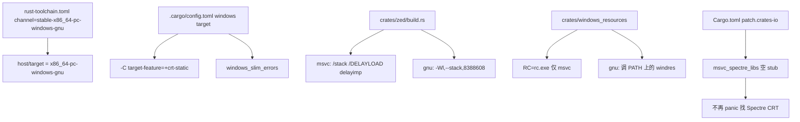

# Building on Windows（GNU 工具链 / spectre 裁剪）

本页记录 **在本仓库内把桌面编辑器在 Windows 下编译起来** 所需的配置与本地改动，是对官方 [docs/src/development/windows.md](../docs/src/development/windows.md) 的补充。**工具链已切换为 `stable-x86_64-pc-windows-gnu`（mingw-w64）**，见第 5 节；曾经的 **`no_webrtc`（绕开 libwebrtc/LiveKit）** 已随 webrtc 依赖链一并移除，本页只在第 3 节保留其历史记录。

## 1. 官方前置工具链（GNU / mingw-w64）

| 依赖 | 说明 |
|---|---|
| rustup + **`stable-x86_64-pc-windows-gnu`** | 见 [`rust-toolchain.toml`](../rust-toolchain.toml)。`channel` **必须写全三元组**：只写 `"stable"` 时 rustup 会按 `~/.rustup/settings.toml` 的 `default_host_tuple`（本机是 msvc）解析，等于没切 |
| mingw-w64 GCC（**真**编译器） | 需要 `gcc` / `g++` / **`windres`**。本机在 `C:\mingw64`（GCC 12.3.0），把 `C:\mingw64\bin` 加进 `PATH` |
| Windows SDK | 仍需：release 构建由 `crates/gpui_windows/build.rs` 调 `fxc.exe` 编 HLSL。至少 `10.0.20348.0`（文档推荐 Windows11SDK.26100） |
| CMake | 被 `wasmtime-c-api` 依赖，需在 `PATH` |
| Visual Studio / Build Tools | 切到 GNU 后**不再必需**（Spectre-mitigated libs 也不再需要）；只在要回到 MSVC 构建时装 |

> ⚠️ rustup 自带的 `lib\rustlib\x86_64-pc-windows-gnu\bin\self-contained\x86_64-w64-mingw32-gcc.exe` **只能当链接器**，同目录 `GCC-WARNING.txt` 原文："cannot be used for compiling C files"。而依赖图里 `libsqlite3-sys`（`features=["bundled"]`，编 SQLite）、`zstd-sys`、tree-sitter 语法、`aws-lc-sys` 都要真编译器，所以必须另装 mingw-w64。

> 注：官方文档把 **Spectre-mitigated libs** 列为 MSVC 构建的必装项，因为 `pet-*`（Python 环境探测）会经 `msvc_spectre_libs` 强制链接它们；本项目已用第 4 节的 patch 免除此要求。切到 GNU 后，该 crate 的 build.rs 整体包在 `cfg(target_env = "msvc")` 里，本来就 no-op。

## 2. 本地构建配置总览



关键文件：
- [`rust-toolchain.toml`](../rust-toolchain.toml)：`channel = "stable-x86_64-pc-windows-gnu"`——host 决定用哪套工具链。
- [`.cargo/config.toml`](../.cargo/config.toml)（Windows target 段）：`windows_slim_errors` 与强制 `crt-static`（对 msvc/gnu 都生效；`--cfg no_webrtc`/`--check-cfg` 已删除）。原先的 `TMP`/`TEMP` → `target/cl-tmp` hack 已移除（见第 6 节）。
- [`crates/zed/build.rs`](../crates/zed/build.rs)：MSVC 分支 `/stack`、`/DELAYLOAD:windowsperformancerecordercontrol`、`delayimp`；GNU 分支 `-Wl,--stack,8388608`。
- [`crates/windows_resources/src/windows_resources.rs`](../crates/windows_resources/src/windows_resources.rs)：`ZED_RC_TOOLKIT_PATH → RC` 仅在 msvc 下生效。
- [`Cargo.toml`](../Cargo.toml)（`[patch.crates-io]` 段）：`msvc_spectre_libs` path stub（GNU 下上游本就 no-op，保留无害）。
- [`build-patches/msvc_spectre_libs/`](../build-patches/msvc_spectre_libs)：no-op 替身 crate。

> **切勿用环境变量 `RUSTFLAGS`**：它会整体覆盖 `.cargo/config.toml` 里的 `rustflags`（含上面这些必需项），导致链接失败或难诊断的错误（官方文档“Setting RUSTFLAGS breaks builds”一节）。要加自定义 flag，请在 config.toml 的对应 `target`/`build` 段追加。

## 3. webrtc 裁剪（已移除 · 历史）

> ⚠️ 历史：本 fork 曾用自定义 `--cfg no_webrtc` 绕过 `libwebrtc`/`webrtc-sys`：二者需要下载预编译 WebRTC 二进制，且 `webrtc-sys` 的构建脚本按 **仅 Linux** 供给，MSVC 下无法完成。该裁剪**已完全移除**——`.cargo/config.toml` 不再注入 `--cfg no_webrtc` 或 `--check-cfg cfg(no_webrtc)`，`livekit_client` / `call` / `collab_ui` / `livekit_api` 已删除，`audio` 也不再有 `libwebrtc` 依赖：回声消除（AEC）连同 fake `EchoCanceller`（原 `crates/audio/src/audio_pipeline/echo_canceller.rs`）一并删除。本 fork 现在没有 webrtc cfg、没有 libwebrtc 依赖、也没有替身 AEC。

原替身判定条件（`livekit_client`，已移除）：

```
any(test, feature = "test-support",
    all(target_os = "windows", target_env = "gnu"),
    target_os = "freebsd",
    no_webrtc)
```

命中即编译 `mock_client` + `pub mod test`，不链接真实 livekit；同时任何直接引用真实 `RtcStats::*` 变体的诊断代码（原 `call/src/call_impl/diagnostics.rs` 的 `compute_remote_audio_stats`、`extract_metrics`）也必须做同样门控，否则报 E0599。这些补偿点都随 `call`/`livekit_client` 一起消失，仅作历史参考；详见 [Collaboration-and-Call.md](Collaboration-and-Call.md) 第 5 节。

## 4. spectre 裁剪：`msvc_spectre_libs` 空 stub（方案 A）

**依赖链**：`crates/languages`（Python 环境探测）→ `pet`、`pet-core`、`pet-conda`、`pet-poetry`、`pet-reporter`、`pet-virtualenv` …（共 24 个 `pet-*`，workspace 定义见 [Cargo.toml](../Cargo.toml) 的 `[workspace.dependencies]`，源 `microsoft/python-environment-tools`）→ **都带 `features = ["error"]`** 依赖 `msvc_spectre_libs`。

**上游行为**：上游 `msvc_spectre_libs-0.1.3/build.rs`（在 `~/.cargo/registry/src/...` 里）整体包在 `cfg(all(target_os = "windows", target_env = "msvc"))` 中探测 Spectre CRT 库，缺库时因启用了 `error` feature 而 `panic!("No spectre-mitigated libs were found...")`。该 crate **无任何公开 API**（`src/lib.rs` 为空，全仓无 `use`），一切逻辑都在 build.rs。因此切到 GNU 后它本来就什么都不做。

**本地改动**：
1. 新建 [`build-patches/msvc_spectre_libs/`](../build-patches/msvc_spectre_libs)：
   - `Cargo.toml`：`version = "0.1.3"`（匹配 Cargo.lock，满足 `pet-*` 的 `^0.1.1`）、保留 `error = []` 空特性（否则依赖解析失败）。
   - `build.rs`：`fn main() {}`——不加 link-search、不 panic。
   - `src/lib.rs`：空。
2. [`Cargo.toml`](../Cargo.toml) `[patch.crates-io]` 段追加：
   ```toml
   msvc_spectre_libs = { path = "build-patches/msvc_spectre_libs" }
   ```

**为何用 `[patch.crates-io]` 而不是直接改依赖源码**：本仓的依赖来自 cargo registry（`~/.cargo/registry/src/...`）而不是仓库内的 `vendor/`（本 checkout 没有 `vendor/` 目录，`.cargo/config.toml` 里也没有 `[source]` 替换段），改 registry 缓存会被校验/覆盖，所以 path patch 才是可行做法——上面第 2 条的 `msvc_spectre_libs = { path = "build-patches/msvc_spectre_libs" }` 即 `[patch.crates-io]` 段内的 path patch，无需 `[workspace]`/`exclude` 也能生效。

> 首次 `cargo build` 后，Cargo.lock 会自动把 `msvc_spectre_libs` 的 source 从 registry 改为该 path（预期内）。回退：删除该 patch 行与 `build-patches/msvc_spectre_libs/` 即可恢复要求 Spectre 库的原状。

## 5. 工具链：已切到 `x86_64-pc-windows-gnu`（mingw-w64）

原先"GNU 不可行"的结论已作废，改为用 GNU 构建。改动点：

- [`rust-toolchain.toml`](../rust-toolchain.toml)：`channel` 写成全三元组 `stable-x86_64-pc-windows-gnu`。
- [`crates/zed/build.rs`](../crates/zed/build.rs)：MSVC 专属的 `/stack`、`/DELAYLOAD`、`delayimp` 留在 `target_env = "msvc"` 分支；GNU 分支给 `-Wl,--stack,8388608`。**delay-load 未在 GNU 下复刻**（若确实需要，用 `-Wl,--delayload=<dll>` + mingw 的 `libdelayimp.a`）。
- [`crates/windows_resources/src/windows_resources.rs`](../crates/windows_resources/src/windows_resources.rs)：`ZED_RC_TOOLKIT_PATH → RC` 用 `cfg!(target_env = "msvc")` 门控——`embed-resource 3.0.6` 在非 msvc 分支里**硬编码** `Command::new("windres")`，根本不读 `RC`。
- [`Cargo.toml`](../Cargo.toml) 的 `msvc_spectre_libs` stub：**保留**。上游 `build.rs` 整体包在 `cfg(all(target_os = "windows", target_env = "msvc"))` 里，GNU 下本来就是 no-op。

原判断的逐条更正：

- `scap` / `windows-capture`（屏幕捕获）是纯 Rust + `windows` crate，**没有 build.rs**，不存在"MSVC 专属构建方式"。
- `aws-lc-rs` 官方平台表把 `x86_64-pc-windows-gnu` 列为 ✓ 构建 ✓ 测试。
- 真正的门槛是 **C 工具链**与 **`windres`**（第 1 节），不是 Rust 侧。
- 官方 docs 的 msys2 免责声明（"unofficial MSYS2 packages"）说的是**第三方打包**，不等于不能自己用 mingw-w64 编译。
- **尚未验证**：`rust-analyzer` 组件在 gnu host 上是否存在（本机该工具链 `bin\` 下没有 `rust-analyzer.exe`，上游 release 也只发 `-msvc` 产物），因此 `components` 里暂时去掉了它；要加回来先跑 `rustup component list --toolchain stable-x86_64-pc-windows-gnu`。
- 若链接报 `.weak.__rustc_debug_gdb_scripts_section__` 多重定义（GCC 15.x 的 weak symbol 回归，windows-rs 为此加过 workaround），加 `-C link-arg=-Wl,--allow-multiple-definition`；本机 GCC 12.3.0 不需要。

## 6. 构建与常见坑

```sh
# 普通终端即可（不再需要 VS Developer PowerShell）
# 前提：PATH 里有 C:\mingw64\bin（gcc / g++ / windres）
cargo build -p zed            # 或 cargo run
cargo build --release         # release（gpui_windows 会调 fxc.exe 编译着色器）
```

| 现象 | 处理 |
|---|---|
| `Couldn't to execute windres ...` | PATH 里没有 `windres.exe`。`embed-resource` 调的是**不带前缀**的 `windres`，而 MSYS2 只提供 `x86_64-w64-mingw32-windres`，需要自己做别名/软链；`C:\mingw64\bin` 里本来就有 `windres.exe` |
| cc/gcc 报找不到 C 编译器 | rustup 自带的 self-contained `x86_64-w64-mingw32-gcc.exe` 只能链接、编不了 C。装/指向真 mingw-w64（本机 `C:\mingw64`），必要时设 `CC_x86_64_pc_windows_gnu` / `CXX_x86_64_pc_windows_gnu` |
| `.weak.__rustc_debug_gdb_scripts_section__` 多重定义 | GCC 15.x 的 weak symbol 回归；加 `-C link-arg=-Wl,--allow-multiple-definition` |
| 启动报缺 `libgcc_s_seh-1.dll` / `libwinpthread-1.dll` | `+crt-static` 没生效（或被删）；要么保留该 flag，要么把这两个 DLL 随包分发 |
| `No spectre-mitigated libs were found` | 仅 MSVC 相关；已由第 4 节 patch 消除，GNU 下不该出现 |
| 找不到 `RtcStats::InboundRtp` 等（E0599，历史，已不可能） | webrtc 门控漏补 `no_webrtc`；`call`/`livekit_client` 与整个 webrtc 轴已移除 |
| `Invalid RC path selected` | 仅 MSVC 相关：设 `ZED_RC_TOOLKIT_PATH` 到 `Windows Kits\10\bin\<ver>\x64` |
| `D8050`（`cl.exe`，仅 MSVC） | `.cargo/config.toml` 里原来的 `TMP`/`TEMP` → `target/cl-tmp` 已移除（该目录在当前工作区不存在）；再遇到就把 `TMP`/`TEMP` 指向真实存在的可写目录 |
| `STATUS_ACCESS_VIOLATION`（rust-lld） | 换链接器 / 调整 `.cargo/config.toml` 层级 |
| `path too long`（`pet`） | `git config --system core.longpaths true` + 启用 Windows `LongPathsEnabled` |
| 启动即 `NoSupportedDeviceFound` | Windows 走 **Vulkan**（`gpui_wgpu`），更新 GPU 驱动 |

## 7. 关键文件 / 符号速查

| 项 | 位置 | 作用 |
|---|---|---|
| toolchain channel | `rust-toolchain.toml` | `stable-x86_64-pc-windows-gnu`（必须写全三元组） |
| windows rustflags | `.cargo/config.toml`（Windows target 段） | `windows_slim_errors`、`crt-static`（`no_webrtc` 注入已删除） |
| zed 链接参数 | `crates/zed/build.rs`（`if cfg!(windows)`） | msvc：`/stack`、`/DELAYLOAD`、`delayimp`；gnu：`-Wl,--stack,8388608` |
| RC 工具选择 | `crates/windows_resources/src/windows_resources.rs` | msvc 读 `RC`（rc.exe）；gnu 用 PATH 上的 `windres` |
| `livekit_client` 门控（已移除） | `crates/livekit_client/src/lib.rs:13-68` | 真实 ↔ mock 二选一 |
| diagnostics 补偿（已移除） | `crates/call/src/call_impl/diagnostics.rs` | `compute_remote_audio_stats`/`extract_metrics` 双版本 |
| `RtcStats`/`SessionStats` 替身（已移除） | `crates/livekit_client/src/test.rs:50`/`44` | 空枚举/精简结构 |
| `audio` AEC（已移除） | 原 `crates/audio/src/audio_pipeline/echo_canceller.rs` | 曾以 fake `EchoCanceller` 避开 `libwebrtc`；AEC 实现已随 webrtc 删除 |
| spectre patch 行 | `Cargo.toml`（`[patch.crates-io]` 段） | path 替换 `msvc_spectre_libs`（GNU 下无实际作用） |
| spectre stub | `build-patches/msvc_spectre_libs/{Cargo.toml,build.rs}` | 0.1.3 + 空 `error` 特性 + no-op build.rs |
| 官方 Windows 指南 | `docs/src/development/windows.md` | 工具链与故障排查（内容仍以 MSVC 为准） |

## 8. 与其他页面的关系
- webrtc 替身（已移除）的历史记录：[Collaboration-and-Call.md](Collaboration-and-Call.md)。
- `pet-*` 因何被引入（Python 探测）：[Language-and-Project.md](Language-and-Project.md) 第 4 节。
- 平台相关 crate（`gpui_windows`/`gpui_wgpu`）在整体架构中的位置：[Architecture.md](Architecture.md)。
