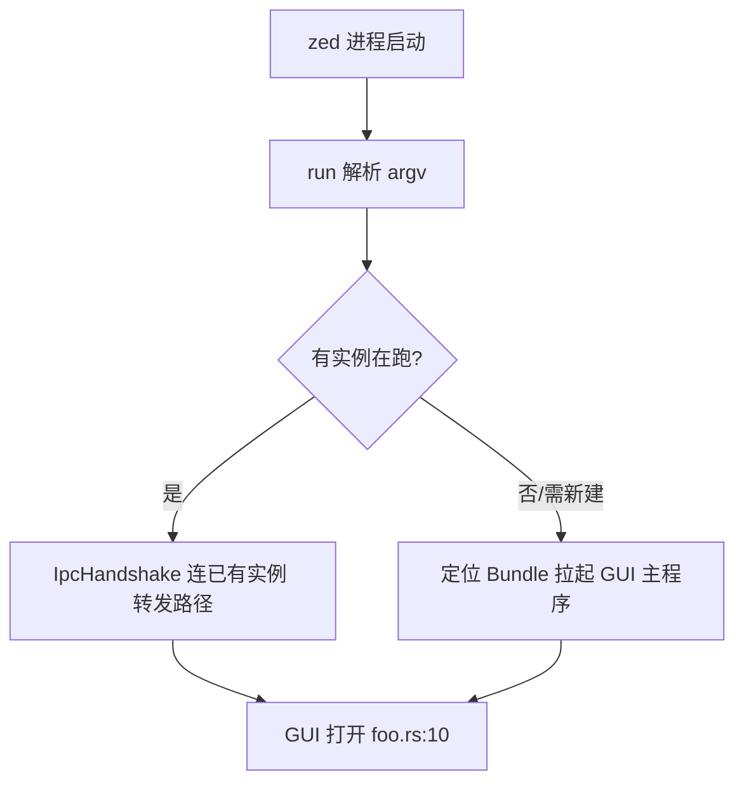

# CLI 启动器与打包 深入解析（Deep Dive）

> 本页覆盖 `cli` crate（`zed` 命令行入口：一个轻量启动器，负责决定"直开/新建实例"并通过 IPC 与已运行实例对话）与 `install_cli`（把 `zed` 二进制安装到 PATH / 注册 `zed://` scheme）。关联：`zed` 主程序、`paths`、`release_channel`。原关联的 `remote_server`、WSL 路径转换与 `--remote`/`--wsl` 入口已随远程开发栈从本 fork 移除。

## 1. 分层设计

`cli` 不是"第二个编辑器"，而是**进程编排器**：

- **请求建模层** `cli.rs`：`enum CliRequest`/`CliResponse`/`OpenBehavior` 定义"用户想干什么"与"如何回应"。
- **决策/执行层** `main.rs`(53KB)：解析 argv→判定行为（前台直开、连已有实例、装 app bundle）→建立 IPC 握手（`IpcHandshake`）→转发或拉起 GUI。
- **安装层** `install_cli`：`install_cli_binary` 把当前二进制复制到 PATH 上，`register_zed_scheme` 注册 `zed://` URL handler（Linux desktop entry / macOS）。

## 2. 类型总览

### cli（cli.rs / main.rs）

| 符号 | 文件:行 | 角色 |
| --- | --- | --- |
| `struct IpcHandshake` | cli.rs:9 | CLI↔GUI 握手（含返回 channel） |
| `enum OpenBehavior` | cli.rs:18 | 打开方式 |
| `enum CliBehaviorSetting` | cli.rs:48 | 用户设置的行为 |
| `enum CliRequest` | cli.rs:56 | OpenPaths/OpenExisting/Restart（原 OpenRemote/Wsl 已移除） |
| `enum CliResponse` | cli.rs:78 | IpcNeedRestart/Quit/… |
| `fn run()` | main.rs:484 | 主逻辑 |
| `fn parse_path_with_position(..)` | main.rs:166 | `file:line:col` 解析 |
| `fn expand_directory_diff_pairs(..)` | main.rs:212 | 目录 diff 配对 |
| `fn anonymous_fd(path)` | main.rs:801 | 读 `/dev/fd` 类特殊路径 |
| `fn prompt_open_behavior()` | main.rs:846 | 交互询问行为 |
| `enum Bundle` | main.rs:1325 | macOS .app 定位 |
| `fn completions(..)` | completions.rs | 生成 shell 补全脚本 |

### install_cli

| 符号 | 文件 | 角色 |
| --- | --- | --- |
| `install_cli.rs` | 0.3KB | `main` 入口 |
| `async fn install_script(cx)` | install_cli_binary.rs:26 | 生成/执行安装脚本 |
| `struct CliInstallFailed` | :103 | 失败标记 |
| `struct InstalledZedCli` | :126 | 安装结果（guard，Drop 清理） |
| `register_zed_scheme.rs` | 0.3KB | 注册 `zed://` |

## 3. 核心方法与调用锚点

**请求解析（cli.rs）**
- `CliRequest`(:56) 枚举所有 CLI 意图：`OpenPaths`（普通打开）、`OpenExisting`（复用窗口）、`Restart` 等（原 `OpenRemote`/`Wsl` 已随远程开发栈移除）；`CliResponse`(:78) 告知上层是否需重启/退出。
- `OpenBehavior`(:18)/`CliBehaviorSetting`(:48) 承载 `cli.default_open_behavior` 设置（如始终新建 vs 复用）。

**主流程（main.rs）**
- `main()`(:477)→`run()`(:484)：解析 flags（`--wait`/`--dev`/`--foreground`/`--existing`/`--new`/`--add`/`--remove`/`--install-cli`/`--completions`），据 `CliRequest` 分派。
- 路径处理：`parse_path_with_position`(:166) 支持 `path:行:列`；目录成对时 `expand_directory_diff_pairs`(:212)/`expand_directory_pair`(:236)/`collect_files`(:283) 造 diff；`anonymous_fd`(:801) 支持从管道/`/dev/stdin` 读入。
- 跨平台：macOS 用 `enum Bundle`(:1325) 在 `.app` 内定位真实可执行与资源；`prompt_open_behavior`(:846) 无头时询问。
- IPC：与已运行实例建立 socket，交换 `IpcHandshake`(:9)，把待开路径序列化转发给 GUI，避免"每个 `zed` 命令都新起进程"。

**安装（install_cli_binary.rs）**
- `install_script(cx)`(:26) 生成临时安装脚本、`Command` 提权/复制到 `~/.local/bin` 或 `/usr/local/bin`；`InstalledZedCli`(:126) 作为成功 guard。`register_zed_scheme.rs` 在 Linux 写 `.desktop` 让 `zed://open?...` 能唤起 Zed。

## 4. `zed foo.rs:10` 的决策流程

## 5. 集成点

- `cli` 是 `default-members` 之外的独立二进制（`crates/zed` 才是真正的编辑器 GUI）；它靠 `paths` 定位数据目录、靠 IPC socket 与 `zed` 通信。
- `--install-cli`/`zed install` 落到 `install_cli`；`zed_env_vars` 提供 `ZED_*` 常量。
- `release_channel` 决定 `zed`/`zed-dev`/`zed-nightly` 各自的 bundle id 与 PATH 名。

## 6. 相关页

- [Startup-Flow](Startup-Flow.md)（GUI 主程序启动，与 CLI 对接）
- [Building-on-Windows](Building-on-Windows.md)（打包/PATH 相关）
- [Telemetry-and-Updates-Deep-Dive](Telemetry-and-Updates-Deep-Dive.md)（`release_channel` 与安装器）
