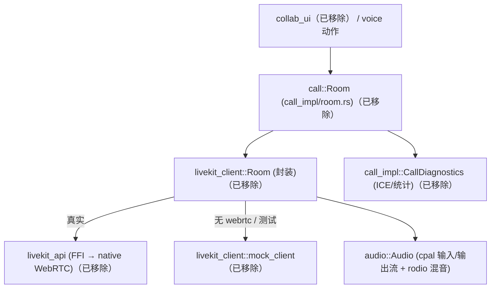
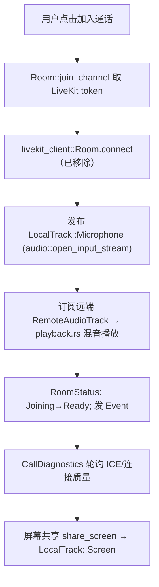

# Call 与音视频深挖（实时通话 · LiveKit RTC · 音频管线）

> ⚠️ 历史文档：本页描述的 `call` / `collab_ui` / `livekit_client` / `livekit_api` 栈已从本 fork 移除（提交 `移除call和remote`）。以下内容仅作参考，代码已不存在。仅 `audio` crate（cpal/rodio 音频管线）仍在本 fork 中。

> 返回 [Home](Home) · [Module-Index](Module-Index)
>
> 概览见 [Collaboration-and-Call.md](Collaboration-and-Call.md)；协作协议/频道/房间业务见 [Collab-Deep-Dive.md](Collab-Deep-Dive.md)。本页聚焦**实时音视频（RTC）栈**：`call`（房间/成员/麦克风/屏幕共享业务）· `livekit_client`（对 `livekit` 的封装 + mock 后端）· `livekit_api`（FFI 绑定）· `audio`（cpal/rodio 音频管线）。所有符号均来自 `grep`/`read` 确证（`文件:行号`）。

## 1. 分层总览

## 2. `call`（已移除 · 房间业务 · `crates/call/src/call_impl/`）

`call.rs` 为薄壳（re-export），实体在 `call_impl/`（`mod.rs` 28KB + `room.rs` 70KB + `participant.rs` + `diagnostics.rs`）：

| 类型 | 位置 | 角色 |
| --- | --- | --- |
| `struct Room` | room.rs:73 | **当前通话房间 Entity**：成员、本地轨道、状态；`enum Event`(36) 广播变更 |
| `async fn join_channel` / `join` / `join_project` | room.rs:222 / 240 / 1209 | 加入频道通话 / 项目协作通话（换取 LiveKit token 并连接） |
| `fn leave` / `leave_internal` | room.rs:314 / 320 | 离房、释放轨道 |
| `fn toggle_mute` | room.rs:1626 | 麦克风静音切换 |
| `fn share_screen` / `share_screen_wayland` / `unshare_screen` | room.rs:1476 / 1549 / 1668 | 屏幕共享（Linux 走 portal/wayland 分支） |
| `struct LiveKitRoom` | room.rs:1813 | 对底层 RTC 房间的持有/适配 |
| `enum LocalTrack` | room.rs:1859 | 本地轨道：`Camera`/`Screen`/`Microphone` |
| `enum RoomStatus` | room.rs:1872 | `Idle`/`Joining`/`Ready`/`Error` 生命周期 |
| `struct ActiveCall` / `IncomingCall` / `ActiveCallEntity` | mod.rs:392 / 384 / 89 | 全局"当前通话"状态、来电、`Global` 包装；`OneAtATime`(352) 互斥锁 |
| `struct LocalParticipant` / `RemoteParticipant` | participant.rs:12 / 27 | 本地/远端参与者（`Id`、`call_contract`、音量、说话状态） |
| `struct CallDiagnostics` / `CallStats` / `CallDiagnosticsSnapshot` / `Report` | diagnostics.rs:67 / 21 / 54 / 62 | 通话质量诊断（`RemoteAudioDiagnostics`、`InboundCounters`、`ComputedNetworkStats`、ICE/连接质量轮询） |

> `diagnostics.rs` 是通话遥测/自检子系统（与 Windows `no_webrtc` 场景的 mock 路径协同，见 [Building-on-Windows.md](Building-on-Windows.md)）。

## 3. `livekit_client`（已移除 · RTC 封装 + Mock · `crates/livekit_client/src/`）

对 `livekit`（经 `livekit_api`）的**新类型封装 + trait 化后端**，使真实 RTC 与 mock 可互换：

| 类型 | 位置 | 角色 |
| --- | --- | --- |
| `struct Room` | livekit_client.rs:40 | 封装 RTC 房间（连接/发布/订阅/事件回调） |
| `RemoteVideoTrack`(23)/`RemoteAudioTrack`(25)/`RemoteTrackPublication`(27)/`RemoteParticipant`(29) | livekit_client.rs | 远端媒体（包 `livekit::*`） |
| `LocalVideoTrack`(32)/`LocalAudioTrack`(34)/`LocalTrackPublication`(36)/`LocalParticipant`(38) | livekit_client.rs | 本地媒体（摄像头/麦克风/屏幕） |
| `struct ParticipantIdentity` | livekit_client.rs:49 | 参与者身份 |
| `mock_client/`(3) | mock_client.rs | **无 WebRTC 后端**：以本地合成实现同一套接口（Windows/测试/无网络） |
| `livekit_client/playback.rs`(43KB) | — | 远端音频混音/播放调度 |
| `remote_video_track_view.rs` / `record.rs` / `linux.rs` | — | GPUI 视频视图、录制、Linux 适配 |

## 4. `audio`（音频 I/O · `crates/audio/src/`）

基于 `cpal`（设备 I/O）+ `rodio`（混音/源处理）：

| 符号 | 位置 | 角色 |
| --- | --- | --- |
| `struct Audio` | audio_pipeline.rs:48 | 全局音频管理（`init`/`ensure_devices_initialized` 31） |
| `fn open_input_stream`(117) / `open_output_stream`(177) / `open_test_output`(170) | audio_pipeline.rs | 麦克风采集 / 扬声器播放流 |
| `fn resolve_device`(152) / `struct AudioDeviceInfo`(202) / `AvailableAudioDevices`(241) | audio_pipeline.rs | 设备枚举与选择 |
| `enum Sound` | audio.rs:22 | 内置音效（加入/离开/消息，`assets/sounds/`） |
| `struct AudioSettings` | audio_settings.rs:7 | 音量/静音设置 |
| `rodio_ext.rs`：`ConstantSampleRate`/`ToMono`/`Replayable`/`ProcessBuffer`… | audio_pipeline/rodio_ext.rs | 自定义 `Source` 算子（重采样/单声道/循环） |

## 5. 加入频道通话的时序

## 6. 集成 / 相关页

- 上层（已移除）：`collab_ui`（通话面板/成员列表）、`voice` 动作；仍在的 `channel`（频道→房间映射）见 [Collab-Deep-Dive.md](Collab-Deep-Dive.md)。
- 底层：`livekit_api`（已移除，native FFI）、`cpal`/`rodio`；GPUI 纹理视频。
- 深页：[Collab-Deep-Dive.md](Collab-Deep-Dive.md)、[Remote-Deep-Dive.md](Remote-Deep-Dive.md)、[GPUI-Platform-Backends-Deep-Dive.md](GPUI-Platform-Backends-Deep-Dive.md)
- 概览：[Collaboration-and-Call.md](Collaboration-and-Call.md) · [Building-on-Windows.md](Building-on-Windows.md)
- 导航：[Home](Home) · [Module-Index](Module-Index)
