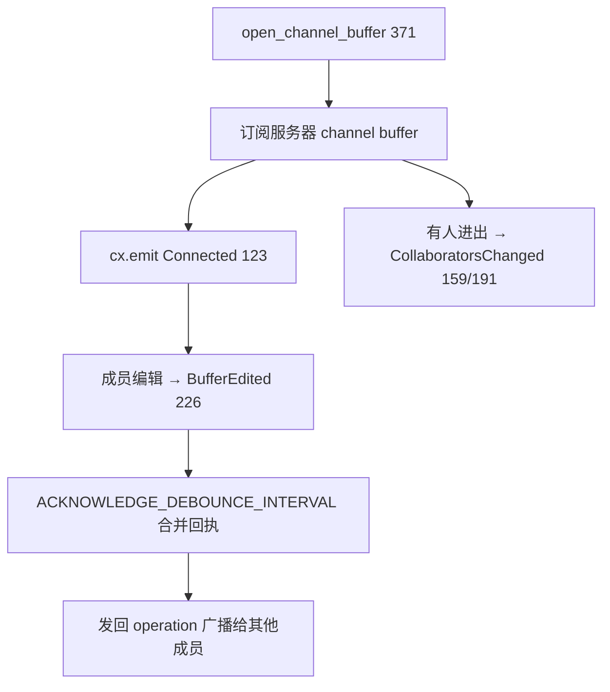

# Channels & Collab UI（频道 / 协作侧栏 / 通话通知）

**频道（Channels）** 是 Zed 的社区空间：成员列表、文字聊天、共享笔记（channel notes）。底层数据/协议在 [`channel`](../crates/channel)，界面在 [`collab_ui`](../crates/collab_ui)。它与"共享项目 / 语音通话"共用 [`client`](../crates/client) 的 RPC 通道（见 [Collaboration-and-Call.md](Collaboration-and-Call.md)）。

## 1. 分层职责

| 层 | 类型 | 位置 | 职责 |
|---|---|---|---|
| 频道存储 | `ChannelStore` | [`channel_store.rs:36`](../crates/channel/src/channel_store.rs) | 全局：频道树、成员、消息、订阅状态 |
| 频道元数据 | `Channel` | [`channel_store.rs:56`](../crates/channel/src/channel_store.rs) | 单个频道（id/slug/隐私/成员计数） |
| 成员身份 | `ChannelMembership` | [`channel_store.rs:108`](../crates/channel/src/channel_store.rs) | 是否成员/管理员、pending 等 |
| 频道事件 | `ChannelEvent` | [`channel_store.rs:139`](../crates/channel/src/channel_store.rs) | 频道增删改/成员变化通知 |
| 频道树索引 | `ChannelIndex` | [`channel_index.rs:8`](../crates/channel/src/channel_store/channel_index.rs) | 父子层级、路径查询 |
| 共享笔记 | `ChannelBuffer` | [`channel_buffer.rs:22`](../crates/channel/src/channel_buffer.rs) | 频道内多人协作的文本笔记 buffer |
| 笔记事件 | `ChannelBufferEvent` | [`channel_buffer.rs:36`](../crates/channel/src/channel_buffer.rs) | Connected/BufferEdited/CollaboratorsChanged… |
| 协作侧栏 | `CollabPanel` | [`collab_panel.rs:261`](../crates/collab_ui/src/collab_panel.rs) | 左侧 Dock：浏览频道/联系人/通话 |
| 频道视图 | `ChannelView` | [`channel_view.rs:45`](../crates/collab_ui/src/channel_view.rs) | 打开某频道：聊天 + notes 主界面（`Item`） |

## 2. ChannelStore：频道数据的单一来源

`ChannelStore`（channel_store.rs:36）是 `Global` 单例，`init`（[L25](../crates/channel/src/channel_store.rs)）向 `Client` 注册各类 RPC 消息处理器（收到服务器推送就更新本地缓存并 `cx.emit(ChannelEvent)`）。它维护：

- 频道树：`ChannelIndex`（channel_index.rs:8）记录父子关系，`Channel::is_root_channel`（L89）/`root_id`（L93）判断层级；`slug`（L97）生成 URL 片段。
- 单个频道：`Channel`（L56）；`link`（L72）/`notes_link`（L81）拼出 `https://zed.dev/channel/...` 分享链接。
- 成员：`ChannelMembership`（L108）区分 member / guest / pending；加入/退出走 `Client::request` 发 RPC。
- 共享笔记：`open_channel_buffer`（[L371](../crates/channel/src/channel_store.rs)）惰性打开该频道的 `ChannelBuffer`。

## 3. 频道笔记（ChannelBuffer）

`ChannelBuffer`（channel_buffer.rs:22）本质是一个**跨成员同步的 `Buffer`**：服务器持有权威版本，客户端订阅并收发 CRDT 操作（复用 [Editing-Deep-Dive.md](Editing-Deep-Dive.md) 里的 `Operation` 机制）。`ChannelBufferEvent`（L36）驱动 UI：

`ACKNOWLEDGE_DEBOUNCE_INTERVAL`（channel.rs:8 re-export）把高频"已收到"回执去抖动合并，减少 RPC 往返。断开时发 `Disconnected`（L279）。

## 4. CollabPanel：协作侧栏

`CollabPanel`（collab_panel.rs:261）是左侧 `Dock` 面板（约 4350 行），承担：

- 浏览可加入的频道树（数据来自 `ChannelStore`）、联系人（`UserStore`）。
- 显示"当前通话/共享项目"的协作者列表，点击可**跟随（follow）**某人。
- 行内动作：加入/离开频道、创建频道（弹 `collab_panel/channel_modal.rs`）、搜索联系人（`collab_panel/contact_finder.rs`）。

## 5. ChannelView：聊天 + 笔记主界面

`ChannelView`（channel_view.rs:45）是打开频道后的 `Item`，进右侧 `Dock` 或独立 Pane。它合并两块内容：**消息流**（文字聊天，历史消息经 RPC 拉取，新消息实时推送）与**共享笔记**（内嵌 `ChannelBuffer` 的 `Editor`）。消息里的 Markdown 用 [markdown](Markdown-and-Preview.md) 渲染，`@提及` 解析自 `UserStore`。`ChannelStore` 变更通过订阅触发 `ChannelView` `cx.notify` 重绘。

## 6. 通话与共享通知（notifications）

`collab_ui/src/notifications/`：
- `incoming_call_notification.rs`：有人呼叫时的右下角提示（接/拒），驱动 `call` 的 `IncomingCall`（见 [Collaboration-and-Call.md](Collaboration-and-Call.md)）。
- `project_shared_notification.rs`：协作者把项目分享给你时弹出，一键加入共享 workspace。
`call_stats_modal.rs`：通话中查看音视频质量统计（数据来自 livekit `SessionStats`）。`panel_settings.rs` 持久化面板偏好。

## 7. 关键符号速查

| 符号 | 位置 | 作用 |
|---|---|---|
| `ChannelStore` | `channel/src/channel_store.rs:36` | 频道数据全局存储 |
| `ChannelStore::init` | `channel_store.rs:25` | 注册 RPC 处理器 |
| `ChannelStore::open_channel_buffer` | `channel_store.rs:371` | 打开共享笔记 |
| `struct Channel` | `channel_store.rs:56` | 频道元数据 |
| `ChannelMembership` | `channel_store.rs:108` | 成员/权限 |
| `enum ChannelEvent` | `channel_store.rs:139` | 频道变更通知 |
| `ChannelIndex` | `channel_store/channel_index.rs:8` | 频道父子索引 |
| `ChannelBuffer` | `channel/src/channel_buffer.rs:22` | 多人共享笔记 buffer |
| `enum ChannelBufferEvent` | `channel_buffer.rs:36` | 笔记连接/编辑事件 |
| `CollabPanel` | `collab_ui/src/collab_panel.rs:261` | 左侧协作面板 |
| `ChannelView` | `collab_ui/src/channel_view.rs:45` | 频道聊天 + 笔记视图 |

## 8. 与其他页面的关系
- RPC 通道与 `Client`/`Peer`：[Collaboration-and-Call.md](Collaboration-and-Call.md)。
- 频道笔记的同步靠 CRDT buffer：[Editing-Deep-Dive.md](Editing-Deep-Dive.md)。
- 消息 Markdown 渲染：[Markdown-and-Preview.md](Markdown-and-Preview.md)。
- 面板停靠（左 Dock）与 Item：[Workspace-Pane-Dock.md](Workspace-Pane-Dock.md)。
