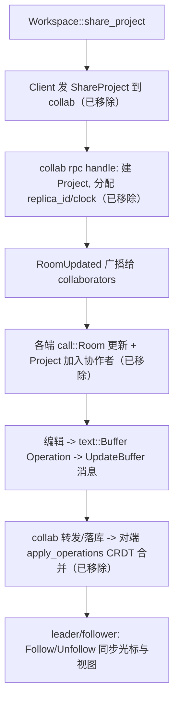

# Deep Reference: collaboration (client / call / collab / channel / collab_ui)

> ⚠️ 历史文档：本页描述的 `crates/call` / `crates/collab` / `crates/collab_ui` 与 `livekit_client` / `livekit_api` 已从本 fork 移除（提交 `移除call和remote`）。以下内容仅作参考，代码已不存在。`crates/client` 与 `crates/channel` 仍在本 fork 中。

> 参考手册级：多人协作由五 crate 分层——`crates/client`（**连 collab 服务器的客户端 + `UserStore`**）、`crates/call`（**本地房间状态机 `Room`**）、`crates/collab`（**云端服务器**）、`crates/channel`（**频道/共享 markdown**）、`crates/collab_ui`（**协作面板/聊天**）。音视频曾走 `livekit_client`/`livekit_api`（WebRTC），该轴连同 `no_webrtc` 替身机制已一并移除。CRDT 同步底座为 [text::Buffer](Text-Buffer-Deep-Dive.md) + `clock::Lamport`。

## 1. `crates/client`：客户端连接与身份 [`client.rs`](../crates/client/src/client.rs)(86KB)
| 类型 | 位置 | 角色 |
|---|---|---|
| `struct Client` | [L207](../crates/client/src/client.rs) | 与 collab 服务器的单例连接：`connect`/`authenticate`（凭 `Credentials`）、内部 `Peer`、订阅、自动重连 `reconnect`(L1718)、`proto_client`（`AnyProtoClient`）、心跳/遥测 |
| `struct ClientState` | [L333](../crates/client/src/client.rs) | 连接可变状态（world/version、pending、observed sequence） |
| `struct ClientCredentials`/`CredentialsProvider` | [L355](../crates/client/src/client.rs) | 登录令牌（`credentials_provider`） |
| `struct ClientSettings` | [L104](../crates/client/src/client.rs) | server 地址等。→ [Settings-and-Themes.md](Settings-and-Themes.md) |
[`user.rs`](../crates/client/src/user.rs)(37KB)：
| 类型 | 位置 | 角色 |
|---|---|---|
| `struct UserStore` | [L109](../crates/client/src/user.rs) | 当前用户 + 联系人 + 在线状态缓存（`Entity`）；`user`(当前)/`contacts`/`user_cache` |
| `struct User` | [L57](../crates/client/src/user.rs) | 用户档案（id/name/avatar…） |
| `struct Contact` / `enum ParticipantIndex` | [L95](../crates/client/src/user.rs)/[L54](../crates/client/src/user.rs) | 好友/在线 |
| `struct Collaborator` | [L65](../crates/client/src/user.rs) | 协作者（user_id + connection_id） |
| `enum Event` | [L137](../crates/client/src/user.rs) | `Updated`/`ContactRequestAccepted`… |
其它：[telemetry.rs](../crates/client/src/telemetry.rs)(37KB 事件上报)、[llm_token.rs](../crates/client/src/llm_token.rs)（LLM 计费 token）、[proxy.rs](../crates/client/src/proxy.rs)、[zed_urls.rs](../crates/client/src/zed_urls.rs)。

## 2. `crates/call`（已移除）：本地房间状态机 `call_impl/`
| 类型 | 位置 | 角色 |
|---|---|---|
| `struct Room` | `crates/call/src/call_impl/room.rs:73` | **本地对共享房间的建模 `Entity`**：`channel_name`/`role_for_user`(L609)、`pending_projects`、`participant_index`、followers/leaders 映射、`rejoined` |
| `mod.rs` | `crates/call/src/call_impl/mod.rs`(28KB) | `init`（注册全局 `Room` store、订阅服务器 `RoomUpdated`/`CallUpdated`）、请求封装 |
| `participant.rs` | `crates/call/src/call_impl/participant.rs` | 参与者（`ParticipantLayout`） |
| `diagnostics.rs` | `crates/call/src/call_impl/diagnostics.rs` | 通话诊断（媒体/网络） |
职责：维护"**谁在共享哪个项目、谁跟随谁、capability**"，把 `Workspace` 的 [leader/follower](Workspace-Deep-Dive.md) 语义与服务器 `Room` 对齐；调用 `livekit_client` 建音频房间（属已移除的历史实现）。→ `crates/livekit_client`/`livekit_api`（已移除；WebRTC；历史上 Windows MSVC 下走 mock 路径，该裁剪也已移除，见构建笔记）。

## 3. `crates/collab`（已移除）：云端服务器（`main.rs` + `rpc.rs` 146KB + Postgres）
| 部分 | 位置 | 角色 |
|---|---|---|
| 入口 | `crates/collab/src/main.rs` | 启动 axum HTTP + WebSocket；`Server{peer, db, livekit, tx}` |
| RPC 路由 | `crates/collab/src/rpc.rs` | `handle_websocket_request`(L1228)、`handle_metrics`(L1306)；每个 `handle_xxx` 处理一种请求（`JoinRoom`/`ShareProject`/`UpdateBuffer`/…），向 `Peer` 收发 `Envelope`，`RoomUpdated`(L4002) |
| 数据库 | `crates/collab/src/db.rs`(24KB) + `crates/collab/src/db/` | sqlx/Postgres：`Project`(L580)、`Room`、`Channel`、`User`、`Buffer` 等持久化 + 内存态 |
| REST API | `crates/collab/src/api/` | 频道、RPC 版本、stripe/proxy 等外部集成 |
| lib | `crates/collab/src/lib.rs` | `Server` 组装、`Session` |
`crates/proto` 定义所有 `Room`/`Project`/`Buffer`/`Channel` 消息；服务器是权威 `Peer`（`ConnectionId` 路由）。服务端连同其部署脚手架（`compose.yml`/`Dockerfile-collab`/`script/deploy-collab`/k8s 清单）均已从本 fork 移除。

## 4. `crates/channel`：频道与共享 markdown [`channel_store.rs`](../crates/channel/src/channel_store.rs)
| 类型 | 位置 | 角色 |
|---|---|---|
| `struct ChannelStore` | [L36](../crates/channel/src/channel_store.rs) | 频道树/成员/聊天（`Entity`）；`channel_ledger`、订阅 `ChannelUpdated`/`ChannelMessageSent` |
| `struct Channel` / `ChannelState` | [L56](../crates/channel/src/channel_store.rs)/[L65](../crates/channel/src/channel_store.rs) | 频道（含 rpc/ephemeral 消息） |
| `struct ChannelMembership` / `enum ChannelRole` | [L108](../crates/channel/src/channel_store.rs) | 成员与权限（member/admin/guest…） |
| `enum ChannelEvent` | [L139](../crates/channel/src/channel_store.rs) | 本地变更广播 |
| `struct ChannelIndex` | [channel_index.rs:8](../crates/channel/src/channel_store/channel_index.rs) | 路径/父子索引 |
| `struct ChannelBuffer` | [channel_buffer.rs:22](../crates/channel/src/channel_buffer.rs) | **共享 markdown 编辑的 CRDT 缓冲**（把 `text::Buffer` 操作经服务器转发合并） |

## 5. `crates/collab_ui`（已移除）：协作面板与聊天 `collab_panel.rs`
| 类型 | 位置 | 角色 |
|---|---|---|
| `struct CollabPanel` | `crates/collab_ui/src/collab_panel.rs:261` | 左/右 dock `Item`：频道树、联系人、通话中项目、`ChannelEditingState`(L241)；`CollabNotificationToast`(L4176) |
| `struct ChannelView` | `crates/collab_ui/src/channel_view.rs:45` | 单频道聊天 + 共享 markdown（`impl Item`/`SearchableItem`） |
| `struct ChannelModal` | `crates/collab_ui/src/collab_panel/channel_modal.rs:32` | 新建/改名频道 |
| `struct ContactFinder` | `crates/collab_ui/src/collab_panel/contact_finder.rs:12` | 搜索/加好友 |
| 通知 | `crates/collab_ui/src/notifications/` | `ProjectSharedNotification`(L81)、`IncomingCallNotification`(L62) |
| `CollaborationPanelSettings` | `crates/collab_ui/src/panel_settings.rs:6` | 显示设置 |
还有 `collab_ui` 里的标题栏项目指示器、加入/离开确认弹窗等（均随该 crate 移除）。

## 6. 共享一个项目（历史流程）

## 7. 与其它子系统的关系
- CRDT 合并/anchor 稳定性依赖 [Text-Buffer-Deep-Dive.md](Text-Buffer-Deep-Dive.md)。
- `Workspace` 的 leader/follower 与 `Item` 序列化在 [Workspace-Deep-Dive.md](Workspace-Deep-Dive.md)。
- `Project` 的 `collab_client`/`client_state`（`Collab{capability,replica_id}`）见 [Project-Deep-Dive.md](Project-Deep-Dive.md)。
→ 概览页 [Collaboration-and-Call.md](Collaboration-and-Call.md)。
