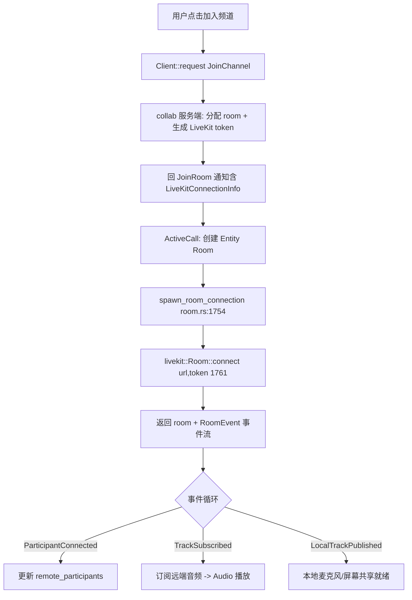

# Collaboration & Call（RPC / 协同 / 音视频 / no_webrtc 替身）

Zed 的实时能力有两条链路：**RPC（数据协同）** 走自研 `rpc`/`client`/`collab`；**音视频/屏幕共享（Call）** 走 `livekit_client` + `audio`。二者在 MSVC 下通过 `no_webrtc` 用替身绕开 webrtc/LiveKit 原生依赖。相关 crate：[`proto`](../crates/proto)、[`rpc`](../crates/rpc)、[`client`](../crates/client)、[`collab`](../crates/collab)、[`channel`](../crates/channel)、[`call`](../crates/call)、[`collab_ui`](../crates/collab_ui)、[`livekit_client`](../crates/livekit_client)、[`livekit_api`](../crates/livekit_api)、[`audio`](../crates/audio)。

## 1. 职责划分

| crate | 职责 | 关键类型 / 文件 |
|---|---|---|
| `proto` | 所有 RPC 消息的 protobuf 定义（请求/响应/通知） | `proto::` 类型、`LiveKitConnectionInfo` |
| `rpc` | 传输与分发：连接、心跳、超时、请求路由 | `Peer`(`peer.rs:60`)、`ProtoClient`(`proto_client.rs`)、`Connection`(`conn.rs`) |
| `client` | 应用侧高层封装：登录、状态、请求/订阅 | `Client`(`client.rs:207`)、`connect()`(L1091)、`request()`(L1736) |
| `collab` | **服务端**（独立进程）：房间/频道/用户持久化 + RPC 处理 | `main.rs`、`rpc.rs`(146KB 处理器)、`db.rs`(Postgres)、`api.rs`、`services/`(LiveKit token) |
| `channel` | 频道与成员模型 | `Channel`、`ChannelMembership` |
| `call` | 客户端通话：房间、参与者、麦克风/屏幕 | `ActiveCall`(`call_impl/mod.rs:392`)、`Room`(`call_impl/room.rs:73`) |
| `livekit_client` | LiveKit 抽象层，**真实/替身双实现** | `RoomEvent`(`lib.rs:138`)、`livekit_client.rs` ↔ `mock_client.rs` |
| `audio` | 声音播放与设备/混音 | `Audio`(`audio_pipeline.rs:48`)、`Sound`(`audio.rs:22`) |

## 2. RPC 消息机制（数据协同底座）

三类信封（`proto` 定义、`rpc` 分发）：
- **Request / Response**：`Client::request::<T>()`（[`client.rs:1736`](../crates/client/src/client.rs)）发出请求，返回 `Task<T::Response>`；服务端 `collab::rpc` 注册同名 handler。
- **Notification**：单向（如 buffer 编辑、光标移动），`Peer::forward_send`（[`peer.rs:491`](../crates/rpc/src/peer.rs)）广播给同房间其他 peer。
- **转发**：跨服务器时用 `Peer::forward_request`（L305）。

连接生命周期：`Client::connect()`（L1091）建立 WebSocket → `authenticate()` 换取 `PeerId`（`peer_id()`，L666）→ 进入 `Status::Connected`。`Peer` 维护 `KEEPALIVE_INTERVAL=1s`、`WRITE_TIMEOUT=2s`、`RECEIVE_TIMEOUT=10s`（L94-96），入站通道容量 256（L132，测试下为 1）。

**协同编辑**：`Project` 通过 `Client` 把 buffer 的 `Operation`（Rope 编辑）、worktree 变更、光标位置作为 RPC 通知在 peer 间双向同步，实现同一 `Buffer`/`Project` 的实时协作。

## 3. 加入频道与通话的流程



关键结构：
- **`ActiveCall`**（[`call_impl/mod.rs:392`](../crates/call/src/call_impl/mod.rs)）持有 `room: Option<(Entity<Room>, Vec<Subscription>)>`（L393）与若干订阅。
- **`Room`**（[`call_impl/room.rs:73`](../crates/call/src/call_impl/room.rs)）：`local_participant()`(L591)、`remote_participants()`(L599)、`connection_quality()`(L580)、`get_stats()`→`livekit::SessionStats`(L551)、`mute_on_join()`(L277)。
- **连接建立**：`spawn_room_connection()`(L1754) 用服务端下发的 `proto::LiveKitConnectionInfo`（server_url + token）调 `livekit::Room::connect()`(L1761)，得到 `(Room, events)`，随后把 `RoomEvent`（[`lib.rs:138`](../crates/livekit_client/src/lib.rs)：`ParticipantConnected`/`TrackSubscribed`/`ActiveSpeakersChanged`/`ConnectionStateChanged` …）逐条并入状态。
- **麦克风**：静音切换在 L1728-1750 依据 `LocalTrack::{None,Pending,Published}` 调 `share_microphone` / `track_publication.mute|unmute`，并 `Audio::play_sound(Sound::Mute/Unmute)`（L1723/1725）。

## 4. 音频（audio crate）

[`Audio`](../crates/audio/src/audio_pipeline.rs)（L48）基于 rodio/cpal，管理输出混音器与设备；`init()`(L28)、`open_input_stream()`(L117)、`resolve_device`。提示音 `Sound`（[`audio.rs:22`](../crates/audio/src/audio.rs)）枚举加入/离开/静音/屏幕共享/Agent 完成等，统一走 `Audio::play_sound`。采样固定 48kHz、双声道（L6-7）。回声消除（AEC）依赖 webrtc 原生库——见下节替身。

## 5. no_webrtc 替身机制（本项目关键裁剪）

`livekit_client` 用**对称门控**在“真实实现”与“mock 实现”间二选一。判定条件统一为：

```
any(test, feature = "test-support",
    all(target_os = "windows", target_env = "gnu"),
    target_os = "freebsd",
    no_webrtc)
```

见 [`lib.rs:13-68`](../crates/livekit_client/src/lib.rs)：命中则编译 `mod mock_client` + `pub mod test`（`pub use mock_client::*`），否则编译 `mod livekit_client`。自定义 `--cfg no_webrtc` 由 [`.cargo/config.toml`](../.cargo/config.toml) 在 Windows target 注入，使 **MSVC 构建也走 mock**，从而不需要 webrtc/LiveKit 原生库。

替身符号位于 [`test.rs`](../crates/livekit_client/src/test.rs)：`RtcStats` 是**空枚举**（L50）、`SessionStats { publisher_stats, subscriber_stats }`（L44），`mock_client::{Room, LocalParticipant, ...}` 复刻真实 API 但不做网络。`mock_client/` 下再分 `participant.rs`/`publication.rs`/`track.rs`。

**连带补偿点**：`call` 里凡引用真实 `RtcStats` 变体（`InboundRtp`/`CandidatePair`/`RemoteInboundRtp`）的诊断代码，也必须用同一判定切到“替身版”，否则 MSVC+no_webrtc 下会编译真实版却找不到变体（E0599）。[`call_impl/diagnostics.rs`](../crates/call/src/call_impl/diagnostics.rs) 的 `compute_remote_audio_stats`、`extract_metrics` 各有替身/真实两版即属此类——已补 `no_webrtc`。`room.rs` 里 `use livekit::{...}` 的 `livekit` 实为 `livekit_client as livekit` 别名，符号由 mock 覆盖，无需改动。

音频侧同理：webrtc 的 AEC 在 `no_webrtc` 下改用 fake `EchoCanceller`，避免链接 `webrtc-sys`（仅 Linux 可用）。

> 完整构建步骤与 `msvc_spectre_libs` patch 见 [Building on Windows.md](Building-on-Windows.md)。

## 6. 关键符号速查

| 符号 | 位置 | 作用 |
|---|---|---|
| `Peer` | `rpc/src/peer.rs:60` | 连接集合、心跳、请求路由/转发 |
| `Client::connect` / `request` | `client/src/client.rs:1091` / `1736` | 建立连接 / 发起 RPC |
| `collab::rpc` | `collab/src/rpc.rs` | 服务端各类请求处理器 |
| `ActiveCall` | `call/src/call_impl/mod.rs:392` | 客户端“当前通话”状态容器 |
| `Room::connect`（真实） | `livekit_client/src/livekit_client.rs:52` | 连 LiveKit 房间 |
| `spawn_room_connection` | `call/src/call_impl/room.rs:1754` | 用 token 建房并接入事件流 |
| `RoomEvent` | `livekit_client/src/lib.rs:138` | 房间事件（参与者/轨道/连接） |
| `RtcStats`（空枚举） | `livekit_client/src/test.rs:50` | no_webrtc/test 下的统计替身 |
| `Audio` / `Sound` | `audio/src/audio_pipeline.rs:48` / `audio.rs:22` | 播放/设备 / 提示音 |

## 7. 与其他页面的关系
- RPC 也用于 LSP/远程开发：见 [Language-and-Project.md](Language-and-Project.md)、`remote`/`ssh_remote`。
- 通话 UI（成员列表、屏幕共享窗口）：`collab_ui` crate，渲染细节见 [GPUI.md](GPUI.md)。
- 平台裁剪全貌：[Building-on-Windows.md](Building-on-Windows.md)。
