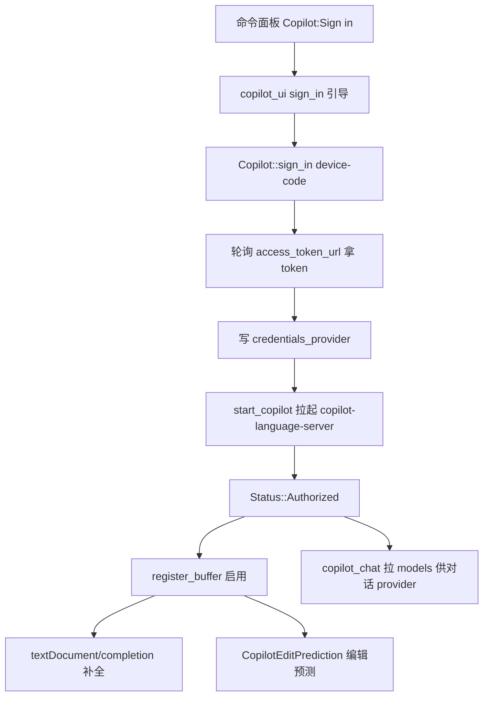

# GitHub Copilot 栈 深入解析（Deep Dive）

> 本页覆盖 Zed 集成 GitHub Copilot 的三个 crate：`copilot`（下载/运行 `copilot-language-server`，做代码补全 + 作为编辑预测 provider）、`copilot_chat`（Copilot Chat 的后端 API 客户端：模型清单、OAuth、流式对话）、`copilot_ui`（登录/授权引导界面）。关联：`edit_prediction`（`Copilot` 作为其 provider 之一）、`language_model`（`copilot_chat` 作为对话模型 provider，见 Model-Providers 页）。

## 1. 分层设计

Copilot 走两条独立又交汇的路：

- **补全/预测路** `copilot`：管理一个外部 LSP 进程 `copilot-language-server`（`--stdio`），既提供传统 `textDocument/completion`，也实现 Zed 的编辑预测协议。`Copilot`（Entity）持凭据、管生命周期，`CopilotEditPrediction`(:307) 把它适配成 `edit_prediction` 的 provider。
- **对话路** `copilot_chat`：纯 HTTP 客户端（无 LSP），封装 GitHub OAuth device-code 流 + Copilot OpenAI 兼容端点，产出 `Model` 清单与流式 `ChatMessage`；被 `language_models` 里的 `copilot_chat` provider 消费。
- **授权 UI** `copilot_ui`：`sign_in.rs` 提供"设备码/浏览器"登录引导，成功后把 token 写入共享凭据存储（`credentials_provider`）。

## 2. 类型总览

### copilot（copilot.rs，68KB）

| 符号 | 文件:行 | 角色 |
| --- | --- | --- |
| `enum Status` | :106 | Disabled/Error/Starting/Authenticating/Authorized |
| `struct Completion` | :234 | 一次补全结果 |
| `struct Copilot` | :240 | 主 Entity：server/凭据/状态 |
| `enum Event` | :249 | 状态变更事件 |
| `struct GlobalCopilotAuth(pub Entity<Copilot>)` | :257 | 全局登录态 |
| `struct CopilotEditPrediction` | :307 (`pub(crate)`) | 编辑预测 provider 适配 |
| `fn set_global(..)` | :260 | 注册 |
| `fn try_get_or_init(app_state, cx)` | :275 | 惰性初始化 |
| `fn start_copilot(..)` | :442 | 下载并拉起 LSP server |
| `fn sign_in(cx)` | :743 | 登录（device code） |
| `fn sign_out(cx)` | :818 | 登出 |
| `fn reinstall(cx)` | :841 | 重装 server 二进制 |
| `fn language_server()` | :866 | 取 `Arc<LanguageServer>` |
| `fn register_buffer(buffer, cx)` | :874 | 为新 buffer 启用补全 |
| `fn status()` | :1210 | 当前状态 |
| `fn fake(cx)` | :519 | 测试桩 |

### copilot_chat（copilot_chat.rs，66KB）

| 符号 | 文件 | 角色 |
| --- | --- | --- |
| `struct CopilotChatConfiguration` | :28 | 域名/端点集合 |
| `fn oauth_domain/graphql_url/chat_completions_url/..` | :33/:41/:54 | URL 构造 |
| `fn device_code_url`/`access_token_url` | :70/:74 | OAuth 端点 |
| `enum Role` | :93 | system/user/assistant |
| `enum ModelSupportedEndpoint` | :124 | chat-completion / responses |
| `struct Model` | :162 | 一个可用模型（能力/上限） |
| `enum ModelVendor` | :238 | OpenAI/Claude/Gemini |
| `enum ChatMessagePart`/`ImageUrl` | :253/:261 | 多模态片段 |
| `struct Request`/`Function`/`Tool`/`ToolChoice` | :353/:368/:376/:382 | 请求与工具 |
| `enum ChatMessage`/`ChatMessageContent`/`ToolCall` | :390/:414/:442 | 对话消息 |
| `fn uses_streaming`/`supports_tools`/`max_token_count` | :266/:286/:278 | 模型能力查询 |
| `model.rs`(72KB)/`responses.rs`(14KB) | — | 模型清单/响应流 |
| `copilot_oauth.rs`(5KB) | — | 设备码授权 |

### copilot_ui

| 符号 | 文件 | 角色 |
| --- | --- | --- |
| `copilot_ui.rs` | 1.1KB | 状态栏/命令注册 |
| `sign_in.rs`(40KB) | — | 登录引导 UI |

## 3. 核心方法与调用锚点

**生命周期与鉴权（copilot.rs）**
- `Copilot::new`(:317)/`try_get_or_init`(:275) 惰性建全局 `GlobalCopilotAuth`(:257)；`start_copilot`(:442) 负责首次下载并 `--stdio` 拉起 LSP server（凭据从 `credentials_provider` 读取）。
- `sign_in(cx)`(:743) 走 GitHub device-code：显示一次性码→轮询 `access_token_url`→存 token→`Status`(:106) 转 `Authorized`；`sign_out`(:818)/`reinstall`(:841) 反向操作。`status()`(:1210) 汇总，`is_authenticated`(:733)/`is_authorized`(:123) 判权限。

**补全 / 编辑预测双用**
- `language_server()`(:866) 暴露 `Arc<LanguageServer>`；`register_buffer`(:874) 对每个打开的 buffer 注册，触发 `textDocument/completion`→`Completion`(:234)。
- `CopilotEditPrediction`(:307) 实现 `edit_prediction` 的 provider 契约，把 Copilot 的 ghost-text 预测接进统一预测管线（与 Zeta 并列，见 Edit-Prediction 页）。

**对话 API（copilot_chat.rs）**
- `CopilotChatConfiguration`(:28) 集中所有 URL：`chat_completions_url`(:54)/`responses_url`(:58)/`models_url`(:66)/`device_code_url`(:70)/`access_token_url`(:74)。
- `model.rs` 拉模型清单成 `struct Model`(:162)（`uses_streaming`:266 / `supports_tools`:286 / `max_token_count`:278 / `ModelVendor`:238）。
- 对话用 `Request`(:353) 携带 `ChatMessage`(:390) 序列 + `Tool`/`ToolChoice`(:376/:382)；`responses.rs` 解析 SSE 流回 `ChatMessageContent`(:414)/`ToolCall`(:442)。
- 授权 `copilot_oauth.rs` 复用同一 device-code 机制。

## 4. Copilot 登录与补全流程

## 5. 集成点

- `edit_prediction` 把 `CopilotEditPrediction`(:307) 当作可选 provider（与 Zeta 云模型并列）；`language_models` 把 `copilot_chat` 注册成一个 `LanguageModelProvider`（见 Model-Providers 页的 `copilot_chat.rs`）。
- token 与凭据经 `credentials_provider`（见 Sandbox-Credentials 页）跨补全/对话共享。
- `copilot_ui` 的 `sign_in.rs` 是 `Status`(:106) 的驱动 UI；状态栏指示器读 `status()`(:1210)。
- `copilot` 依赖 `lsp` crate 管理 server 进程；`request.rs` 封装补全请求体。

## 6. 相关页

- [Model-Providers-Deep-Dive](Model-Providers-Deep-Dive.md)（`copilot_chat` 作为对话 provider）
- [Edit-Prediction-Deep-Dive](Edit-Prediction-Deep-Dive.md)（Copilot 作为预测 provider）
- [Language-Deep-Dive](Language-Deep-Dive.md)（`LanguageServer`/补全协议）
- [Agent-and-AI](Agent-and-AI.md)（Copilot 族概览）
