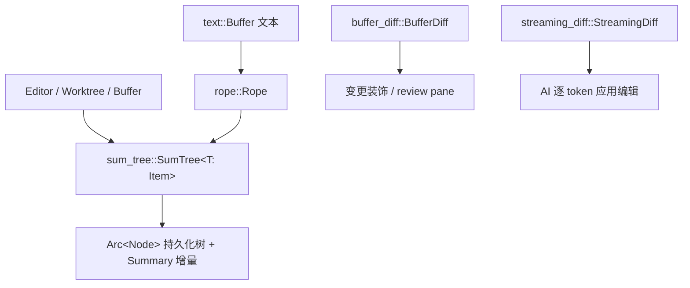

# Data Structures（sum_tree / rope / diff 底座）

本页覆盖 Zed 编辑内核之下的**通用数据结构底座**：[`sum_tree`](../crates/sum_tree)（函数式 B+ 树）、[`rope`](../crates/rope)（文本序列）、[`buffer_diff`](../crates/buffer_diff) 与 [`streaming_diff`](../crates/streaming_diff)。`text::Buffer` / `Worktree` / `MultiBuffer` 等都构建在它们之上。

## 1. 分层关系

## 2. sum_tree：带增量摘要的持久化树
[`crates/sum_tree/src/sum_tree.rs`](../crates/sum_tree/src/sum_tree.rs)

| 符号 | 位置 | 作用 |
|---|---|---|
| `trait Item` | [L34](../crates/sum_tree/src/sum_tree.rs) | 元素需声明其 `Summary` 与 `Dimension` |
| `trait Summary` | [L51](../crates/sum_tree/src/sum_tree.rs) | 可 combine 的聚合量（长度/字节数/最大行…） |
| `struct SumTree<T: Item>` | [L213](../crates/sum_tree/src/sum_tree.rs) | `Arc<Node<T>>` 根，克隆即结构共享 |
| `SumTree::iter` | [L392](../crates/sum_tree/src/sum_tree.rs) | 顺序遍历 |
| `SumTree::cursor` | [L597](../crates/sum_tree/src/sum_tree.rs) | 定位游标 |
| `SumTree::edit` | [L1190](../crates/sum_tree/src/sum_tree.rs) | 在区间上 splice，产生新树 |
| `Cursor<'a,'b,T,D>` | [`cursor.rs:30`](../crates/sum_tree/src/cursor.rs) | 按 `Dimension` 二分定位 |

**核心思想**：每个节点缓存子树的 `Summary`；`Cursor` 可凭任意实现 `Dimension` 的量（如"第 N 个字符""某坐标点"）在 O(log n) 内定位，无需线性扫描。文本按字符数/行数、worktree 按路径排序都能复用同一结构。[`tree_map.rs`](../crates/sum_tree/src/tree_map.rs) 另提供基于 SumTree 的有序映射（`iter` L176/L350）。

## 3. rope：文本的底层表示
[`crates/rope/src/rope.rs`](../crates/rope/src/rope.rs)

| 符号 | 位置 | 作用 |
|---|---|---|
| `struct Rope` | [L26](../crates/rope/src/rope.rs) | `SumTree<Chunk>` 封装的文本串 |
| `struct Chunk` | [`chunk.rs:17`](../crates/rope/src/chunk.rs) | 叶子：一段文本 + 各种维度缓存 |
| `struct Point` | [`point.rs:9`](../crates/rope/src/point.rs) | 行列坐标（row, column） |
| `Rope::chars_at` | [L340](../crates/rope/src/rope.rs) | 从偏移正向迭代 char |
| `Rope::reversed_chars_at` | [L344](../crates/rope/src/rope.rs) | 反向迭代（退格/词界） |
| `Rope::clip_point` | [L553](../crates/rope/src/rope.rs) | 把越界 `Point` 夹到合法位置（按 `Bias`） |
| `Rope::len` | [L316](../crates/rope/src/rope.rs) | UTF-8 字节长度 |

大文件编辑、锚点、坐标换算都靠 Rope 的 O(log n) 切片，避免整串拷贝。`text::Buffer`（[Editing-Deep-Dive.md](Editing-Deep-Dive.md)）内部即用 Rope 存内容、用 SumTree 存 CRDT 操作日志。

## 4. buffer_diff：两个 buffer 的差异模型
[`crates/buffer_diff/src/buffer_diff.rs`](../crates/buffer_diff/src/buffer_diff.rs)

| 符号 | 位置 | 作用 |
|---|---|---|
| `struct BufferDiff` | [L22](../crates/buffer_diff/src/buffer_diff.rs) | 编辑 buffer 与基线（保存点/对照文本）的活差异 |
| `trait DiffOperations` | [L31](../crates/buffer_diff/src/buffer_diff.rs) | 如何把 hunk 应用到目标（接受/还原） |
| `struct RestoreDiffOperations` | [L53](../crates/buffer_diff/src/buffer_diff.rs) | "还原"语义实现 |
| `set_base_text_snapshot` | [L116](../crates/buffer_diff/src/buffer_diff.rs) | 换基线文本 |
| `struct DiffHunk` | [L157](../crates/buffer_diff/src/buffer_diff.rs) | 单段差异（行区间 + 新旧文本） |
| `enum DiffHunkStatusKind` | [L133](../crates/buffer_diff/src/buffer_diff.rs) | Added/Deleted/Modified/Conflict |
| `enum DiffHunkSecondaryStatus` | [L142](../crates/buffer_diff/src/buffer_diff.rs) | hunk 是否已处理 |
| `struct PendingHunk` / `enum PendingSense` | [L182](../crates/buffer_diff/src/buffer_diff.rs) / [L206](../crates/buffer_diff/src/buffer_diff.rs) | 待计算 hunk |

`BufferDiff` 是 `MultiBuffer` 折叠 diff、`buffer_diff` UI 与"接受/回退 AI 编辑"的共同数据源。

## 5. streaming_diff：AI 边生成边应用
[`crates/streaming_diff/src/streaming_diff.rs`](../crates/streaming_diff/src/streaming_diff.rs)

用于 Agent/编辑预测在模型**逐 token 输出**时，把"新文本"实时算成最小编辑并应用到 buffer，避免整体替换闪烁：

| 符号 | 位置 | 作用 |
|---|---|---|
| `enum CharOperation` | [L107](../crates/streaming_diff/src/streaming_diff.rs) | 保留/删除/插入 单字符操作 |
| `struct StreamingDiff` | [L114](../crates/streaming_diff/src/streaming_diff.rs) | 增量 diff 状态机 |
| `StreamingDiff::new` | [L130](../crates/streaming_diff/src/streaming_diff.rs) | 以旧文本初始化 |
| `StreamingDiff::push_new` | [L149](../crates/streaming_diff/src/streaming_diff.rs) | 喂入新片段 → 产出 `CharOperation` |
| `StreamingDiff::finish` | [L276](../crates/streaming_diff/src/streaming_diff.rs) | 收尾，产出剩余操作 |
| `struct LineDiff` / `enum LineOperation` | [L289](../crates/streaming_diff/src/streaming_diff.rs) / [L282](../crates/streaming_diff/src/streaming_diff.rs) | 行级聚合 |
| `LineDiff::push_char_operations` | [L305](../crates/streaming_diff/src/streaming_diff.rs) | 字符操作折成行操作 |

调用链：`new(old)` → 多次 `push_new(chunk)` → `finish()` 得 `Vec<CharOperation>` → `LineDiff::push_char_operations` → `line_operations()` → 应用到 `Buffer`。

## 6. 与其他页面的关系
- 上层文本/CRDT：[Editing-Deep-Dive.md](Editing-Deep-Dive.md)。
- 折叠 diff 展示：[Editing-Deep-Dive.md](Editing-Deep-Dive.md) 的 `MultiBuffer`。
- Worktree 用 SumTree 存条目：[Project-Panel-and-FS.md](Project-Panel-and-FS.md)。
- AI 流式应用：[Agent-and-AI.md](Agent-and-AI.md)。
