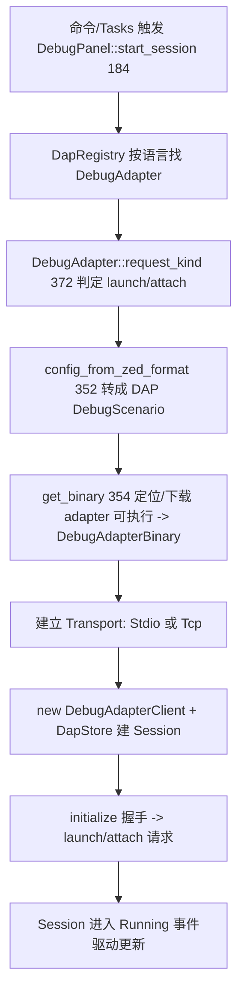

# Debugger（DAP 协议 / 会话状态 / 调试 UI）

Zed 调试基于微软 **Debug Adapter Protocol（DAP）**，分三层：

- [`dap`](../crates/dap)：DAP 协议与"如何跟一个 debug adapter 进程通信"的纯实现（transport、client、adapter 抽象）。
- [`project/src/debugger`](../crates/project/src/debugger)：调试**会话状态模型**（`Session`/`Thread`/`StackFrame`/`DapStore`），是协作与 RPC 的一部分。
- [`debugger_ui`](../crates/debugger_ui)：GPUI 视图（面板、变量表、调用栈、断点）。

另有 [`dap_adapters`](../crates/dap_adapters)（内置各语言 adapter 定义）、[`debug_adapter_extension`](../crates/debug_adapter_extension)（扩展贡献 adapter）、依赖外部 `dap_types` crate 定义 DAP 报文类型。核心文件：`dap/src/{client,transport,adapters,registry}.rs`、`project/src/debugger/{session,dap_store}.rs`、`debugger_ui/src/{debugger_panel,session}.rs`。

## 1. 分层职责

| 层 | 类型 | 位置 | 职责 |
|---|---|---|---|
| 协议客户端 | `DebugAdapterClient` | [`client.rs:32`](../crates/dap/src/client.rs) | 与单个 adapter 进程通信，收发 DAP 报文，`SessionId`(L19) |
| 传输 | `Transport` trait | [`transport.rs:60`](../crates/dap/src/transport.rs) | `TcpTransport`(L472)/`StdioTransport`(L649)/`FakeTransport`(L739) |
| Adapter 抽象 | `DebugAdapter` trait | [`adapters.rs:349`](../crates/dap/src/adapters.rs) | `config_from_zed_format`/`get_binary`/`request_kind` |
| 任务定义 | `DebugTaskDefinition` | [`adapters.rs:144`](../crates/dap/src/adapters.rs) | launch/attach 的 JSON 配置；`TcpArguments`(L108) |
| 注册表 | `DapRegistry` | [`registry.rs:41`](../crates/dap/src/registry.rs) | 按语言名解析 adapter；`DapLocator` trait(L16) |
| 会话模型 | `Session` | [`session.rs:691`](../crates/project/src/debugger/session.rs) | 一次调试会话的完整状态机 |
| 会话状态 | `SessionState` | [`session.rs:154`](../crates/project/src/debugger/session.rs) | Starting/Running/Waiting 等 |
| 存储 | `DapStore` | [`dap_store.rs:94`](../crates/project/src/debugger/dap_store.rs) | 持有所有 `Session` + client + 断点，随 Project 存在 |
| UI 会话 | `DebugSession` | [`session.rs:17`](../crates/debugger_ui/src/session.rs) | GPUI 视图：包 `Entity<Session>`(L59) + `Entity<RunningState>`(L88) |
| 运行视图 | `RunningState` | [`session/running.rs:68`](../crates/debugger_ui/src/session/running.rs) | 变量/调用栈/断点/控制台 |
| 面板 | `DebugPanel` | [`debugger_panel.rs:61`](../crates/debugger_ui/src/debugger_panel.rs) | 右侧 Dock 的 `Item`，多会话切换 |

## 2. 一次"启动调试"的调用流程

1. **入口**：`DebugPanel::start_session`（[debugger_panel.rs:184](../crates/debugger_ui/src/debugger_panel.rs)）；也可由 adapter 主动发起 `handle_start_debugging_request`（L438）。配置来自 `tasks.json` / `.zed/debug.json`，`insert_task_into_editor`（L1257）用于就地编辑任务。
2. **解析 adapter**：`DapRegistry`（registry.rs:41）按语言查 `DebugAdapter`，其 `request_kind`（L372）从 JSON 的 `request` 字段判 `Launch`/`Attach`，`config_from_zed_format`（L352）把 Zed 配置翻译为标准 DAP 场景，`get_binary`（L354）负责找到或下载 adapter 二进制（`DebugAdapterBinary` L194 / `AdapterVersion` L258 / `GithubRepo` L269）。
3. **建立通道**：按 adapter 类型选 `StdioTransport`（子进程 stdin/stdout，L649）或 `TcpTransport`（网络，L472）。
4. **握手**：`DebugAdapterClient`（client.rs:32）用 `next_sequence_id`（L169）为每个请求编号，`on_request<R: dap_types::requests::Request>`（L191）注册反向请求处理（如 `readMemory`、`startDebugging`）。

## 3. Transport：DAP 报文如何流动

`Transport` trait（transport.rs:60）定义双向字节通道；DAP 用 `Content-Length: N\r\n\r\n{json}` 的报文框格。`RequestHandling<T>`（L53）区分"这是请求（需应答）还是事件"。`IoKind`(L46)/`LogKind`(L40) 支撑 `add_log_handler`（client.rs:183）抓 adapter 日志。`FakeTransport`（L739）+ `FakeTransportKind`（L749）专供测试（配合 `init_test` client.rs:276）。

## 4. 会话状态模型（Session）

[`Session`](../crates/project/src/debugger/session.rs)（L691）是运行期核心，`SessionState`（L154）枚举生命周期、`SessionStateEvent`（L813）驱动 UI 刷新。线程与栈：`Thread`（L121）、`StackFrame`（L84）。执行控制方法：

- [`continue_program`](../crates/project/src/debugger/session.rs)（L2315）/ `continue_thread`（L2319）
- `step_in`（L2398）/ `step_out`（L2430）/ `step_back`（L2462）
- [`evaluate`](../crates/project/src/debugger/session.rs)（L2797）/ `evaluate_variable_value`（L2867）—— 监视表达式 / hover 求值
- `breakpoints_enabled`（L2089）

这些方法把用户操作转成对应 DAP 请求（`continue`、`next`、`stepIn`…）发给 client，再由 adapter 回报 `stopped`/`output`/`breakpoint` 等事件，回填 `Session` 状态。`DapStore`（dap_store.rs:94）通过 `DapStoreEvent`（L59）通知 Project/订阅者。

## 5. UI 层（debugger_ui）

`DebugSession`（debugger_ui/session.rs:17）把模型 `Session` 与 `RunningState`（session/running.rs:68）包成视图；`RunningState` 内含调用栈、`VariableList`（[variable_list.rs:190](../crates/debugger_ui/src/session/running/variable_list.rs)）、断点列表、控制台。`DebugPanel`（L61）是右侧 `Dock` 里的 `Item`，`active_session`（L147）在当前多个调试会话间切换，`load`（L160）从工作区恢复。`new_process_modal.rs` / `attach_modal.rs` 提供"新建/附加"配置的表单弹窗。

## 6. 关键符号速查

| 符号 | 位置 | 作用 |
|---|---|---|
| `DebugAdapterClient` | `dap/src/client.rs:32` | 与 adapter 进程通信 |
| `DebugAdapterClient::on_request` | `client.rs:191` | 注册反向 DAP 请求处理 |
| `Transport` / `StdioTransport` | `dap/src/transport.rs:60/649` | DAP 报文通道 |
| `DebugAdapter` trait | `dap/src/adapters.rs:349` | 语言 adapter 抽象 |
| `request_kind` | `adapters.rs:372` | 判定 launch/attach |
| `DapRegistry` | `dap/src/registry.rs:41` | adapter 注册与解析 |
| `Session` / `SessionState` | `project/src/debugger/session.rs:691/154` | 会话状态机 |
| `Session::step_in` | `session.rs:2398` | 单步进入 |
| `DapStore` | `project/src/debugger/dap_store.rs:94` | 会话集合与断点存储 |
| `DebugSession` | `debugger_ui/src/session.rs:17` | 会话 GPUI 视图 |
| `DebugPanel::start_session` | `debugger_ui/src/debugger_panel.rs:184` | 启动调试入口 |

## 7. 与其他页面的关系
- adapter 由扩展贡献：[Extension-System.md](Extension-System.md)（`register_debug_adapter_proxy`）。
- 调试配置写在 tasks/JSON：[Tasks-and-Tooling.md](Tasks-and-Tooling.md)。
- 断点/hover 求值发生在编辑器内：[Editor.md](Editor.md)。
