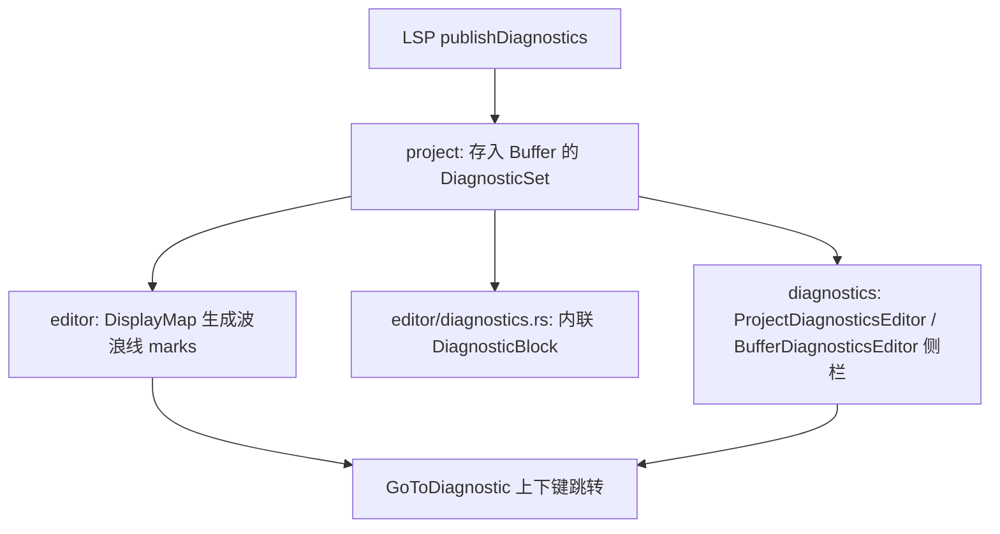
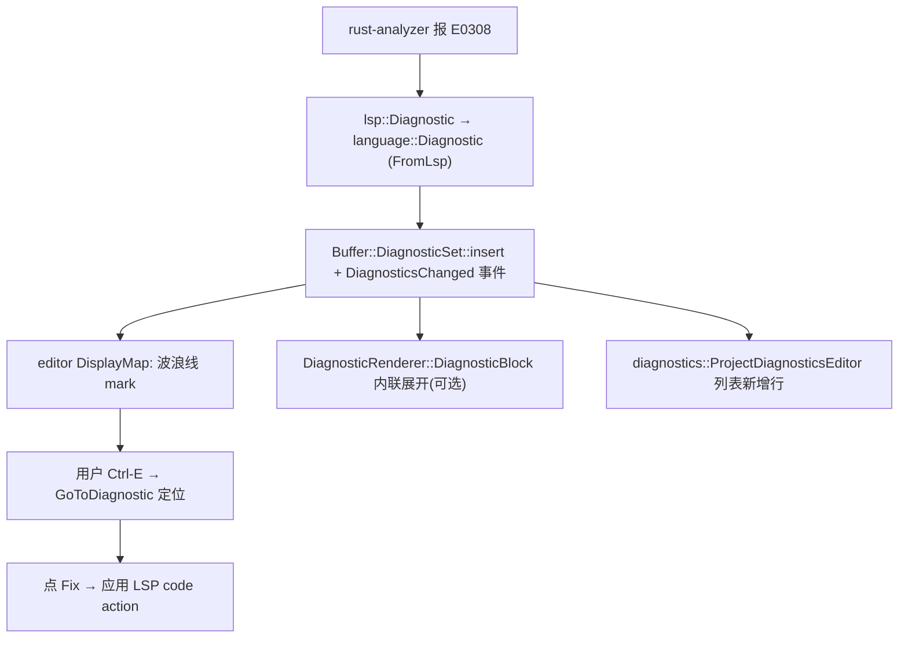

# Diagnostics 深挖（诊断 · 从 LSP 到内联块与侧栏）

> 返回 [Home](Home) · [Module-Index](Module-Index)
>
> 概览见 [LSP-Features.md](LSP-Features.md)。本页是**函数/类型级参考手册**，沿数据流覆盖诊断全链：`language`（数据模型）→ `project`（按缓冲聚合）→ `editor`（波浪线 / 内联块 / 跳转动作）→ `diagnostics`（项目/缓冲诊断侧栏与渲染）。所有符号均来自 `grep`/`read` 确证（`文件:行号`）。
>
> 注：早期 `crates/timeline`（git blame 变更条）已并入 `editor` 的 git gutter / change list，故本页不单列。

## 1. 数据流总览

## 2. `language`（数据模型）

| 类型 | 位置 | 角色 |
| --- | --- | --- |
| `struct Diagnostic` | `language/src/diagnostic.rs:240` | 单条诊断：`source`/`message`/`severity`/`range`(Excerpt)、代码修正 `is_fixable`、LSP `code`/`tags`/`data` |
| `struct DiagnosticSet` | `language/src/diagnostic_set.rs:22` | 有序诊断集合（按 range 索引，支持 `for_range`/游标查询），持于 `Buffer` |
| `enum DiagnosticSeverity` | `project/src/project_settings.rs:351` | `Error`/`Warning`/`Information`/`Hint` |
| `DiagnosticSeverityContent` | `settings_content/src/project.rs:917` | 设置序列化形态 |
| `FromLsp` 转换 | `language/src/diagnostic.rs` | LSP `lsp::Diagnostic` ↔ `language::Diagnostic`（含多字节 offset 修正） |

## 3. `project`（聚合与刷新）

- 每个 `Buffer` 持 `DiagnosticSet`；LSP 服务器 `publishDiagnostics` 经 `Project` 落缓冲并发 `BufferEvent::DiagnosticsChanged`。
- 严重级别阈值 / 是否展示由 `ProjectSettings`（`project_settings.rs`）驱动：`DiagnosticSeverity`(351)、`GoToDiagnosticSeverityFilter`（跳转时过滤级别）。
- `WorktreeStore::diagnostics`(worktree_store.rs:374) 暴露 worktree 级诊断汇总。

## 4. `editor`（呈现与导航 · `editor/src/diagnostics.rs` + `display_map`）

| 符号 | 位置 | 角色 |
| --- | --- | --- |
| `struct GoToDiagnostic` | `editor/src/actions.rs:331` | 上/下条诊断跳转动作（`offset`/severity 过滤） |
| `fn toggle_diagnostics` | `editor/src/diagnostics.rs:313` | 总开关（`ToggleDiagnostics`） |
| actions | `editor/src/diagnostics.rs:612` | `ToggleCodeLens`/`ToggleDiagnostics`/`ToggleInlayHints`/`ToggleInlineDiagnostics` |
| `severity`/`GoToDiagnosticSeverityFilter` | diagnostics.rs:100/113/132/208 | 各级别筛选逻辑 |
| `struct BlockMap` | `editor/src/display_map/block_map.rs:38`（+`BlockProperties`282/`BlockSnapshot`75/`BlockRow`110） | **块系统**：诊断内联块、悬停下拉的载体 |
| 波浪线 marks | `display_map` | 由 `DiagnosticSet` 生成高亮/下划线（`DiagnosticRenderer` 上色） |

> 内联展开：`DiagnosticRenderer`（见 §5）实现 `RenderBlock`，把一条 `Diagnostic` 渲染成可展开的代码块（含 code actions 按钮），插入 `BlockMap`。

## 5. `diagnostics` crate（UI 与渲染 · `crates/diagnostics/src/`）

| 文件 | 关键类型 | 角色 |
| --- | --- | --- |
| `diagnostics.rs`(43KB) | `ProjectDiagnosticsEditor`(75，`impl Item` 732)、`IncludeWarnings`(66)、`enum RetainExcerpts`(154) | **项目级诊断列表**（跨文件，树形 + excerpt 预览），`Item` 入 Dock |
| `buffer_diagnostics.rs`(39KB) | `BufferDiagnosticsEditor`(48) | **当前缓冲诊断**（侧边卡片流，光标随滚动切换） |
| `diagnostic_renderer.rs`(13.5KB) | `DiagnosticRenderer`(20)、`DiagnosticBlock`(201) | 内联块渲染器（错误信息 + `Fix` code action 按钮） |
| `items.rs`(10.6KB) | `DiagnosticIndicator`(18) | 列表行组件（严重级别图标/计数/文件路径） |
| `toolbar_controls.rs`(6.8KB) | `ToolbarControls`(12)、`trait DiagnosticsToolbarEditor`(16) | 状态栏诊断按钮（错误/警告计数，点开侧栏） |

## 6. 一条错误的完整旅程

## 7. 集成 / 相关页

- 依赖：`editor`（`BlockMap`/actions）、`language`（模型）、`project`（聚合/设置）、`picker`（诊断行复用高亮）；`gpui` 渲染。
- 深页：[Editor-Deep-Dive.md](Editor-Deep-Dive.md)、[Language-Deep-Dive.md](Language-Deep-Dive.md)、[Project-Deep-Dive.md](Project-Deep-Dive.md)、[Picker-Family-Deep-Dive.md](Picker-Family-Deep-Dive.md)、[LSP-Features.md](LSP-Features.md)
- 导航：[Home](Home) · [Module-Index](Module-Index)
