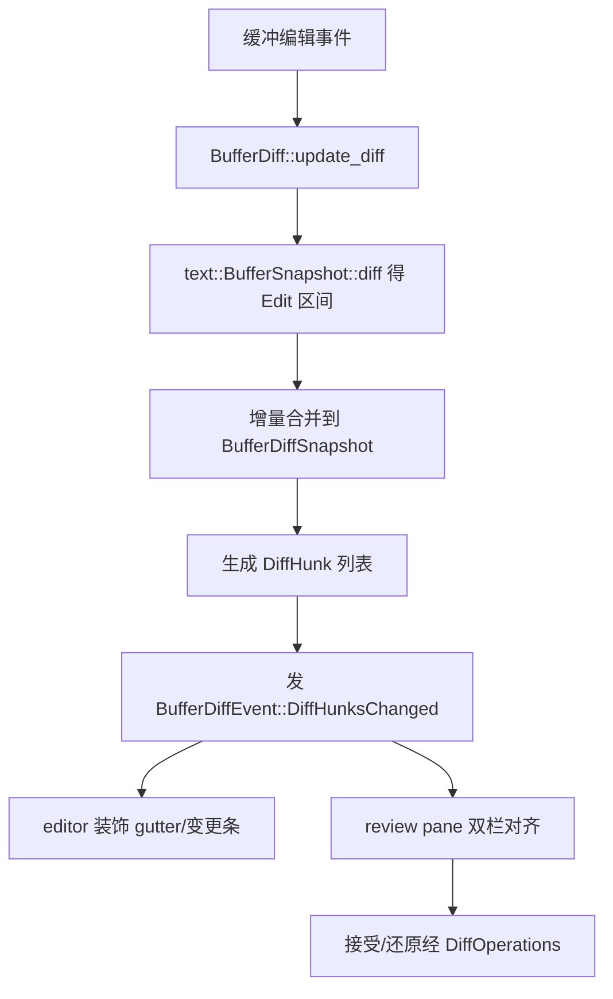

# Diff 引擎 深入解析（Deep Dive）

> 本页覆盖 Zed 的差异计算内核：`buffer_diff`（编辑器内"缓冲 vs 基线文本"的增量 diff 快照，驱动变更装饰、review pane 与"接受/回退"编辑）与 `streaming_diff`（字符/行级增量 diff，服务 AI 逐 token 流式改写与编辑预测落字）。二者与 `sum_tree`/`text`(rope) 的 `diff` 及 `language::Buffer` 的 diff 协作。

## 1. 分层设计

- **`text`/`sum_tree` 底座**：`BufferSnapshot::diff(new_text, old_text)` 计算 `Vec<Edit>`（区间级），是最原始的 Myers-ish 差分。
- **`buffer_diff`（快照引擎）**：把某个编辑缓冲相对"基线文本"（保存点 / 对照文本 / 冲突 base）持续维护成一个 `BufferDiffSnapshot`，提供 hunk 查询、坐标映射（缓冲↔基线）、增量重算，并挂 `DiffOperations`（hunk 应用抽象，见 §3）。
- **`streaming_diff`（流式差分）**：不要求全文在手，随字符流入 `push_new` 逐步吐 `CharOperation`，再由 `LineDiff` 聚合出行级操作——用于把模型"边生成边 diff"的编辑即时呈现。

## 2. 类型总览

### buffer_diff（buffer_diff.rs，4396 行 / 155KB）

| 符号 | 文件:行 | 角色 |
| --- | --- | --- |
| `struct BufferDiff` | :22 | GPUI Entity：`base_text_buffer`+`diff_snapshot`+`operations` |
| `trait DiffOperations` | :31 | `stage`/`unstage`/`supports_*` 能力 |
| `struct RestoreDiffOperations` | :53 | 仅支持 restore（非 git 场景） |
| `struct BufferDiffSnapshot` | :88 | 一次 diff 的不可变快照 |
| `struct BufferDiffUpdate` | :108 | 增量更新描述 |
| `struct DiffHunkStatus` | :127 | hunk 装饰状态（色条/图标） |
| `enum DiffHunkStatusKind` | :133 | Added/Deleted/Modified/Conflict |
| `enum DiffHunkSecondaryStatus` | :142 | 二级 diff（index vs worktree）状态 |
| `struct DiffHunk` | :157 | 单个 hunk（缓冲/基线区间对） |
| `struct PendingHunk` | :182 | 尚未提交的 hunk |
| `enum PendingSense` | :206 | 待定的增/删方向 |
| `struct DiffHunkSummary` | :216 | hunk 概览（用于 minimap/列表） |
| `struct DiffChanged` | :1593 | 变更事件负载 |
| `enum BufferDiffEvent` | :1601 | `DiffHunksChanged` 等 |
| `fn assert_hunks(..)` | :2423 | 测试断言辅助 |

### streaming_diff（streaming_diff.rs，37KB）

| 符号 | 文件:行 | 角色 |
| --- | --- | --- |
| `enum CharOperation` | :107 | Keep/Insert/Delete 单字符操作 |
| `struct StreamingDiff` | :114 | 字符级流式差分器 |
| `enum LineOperation` | :282 | 行级 Keep/Replace/Insert/Delete |
| `struct LineDiff` | :289 | 把字符操作聚合成行操作 |

## 3. 核心方法与调用锚点

**`BufferDiff` 构造与更新（buffer_diff.rs）**
- `new(..)`(:190) / `new_with_base_text_buffer`(:1635) / `new_unchanged`(:1650) / `new_with_base_text`(:1689)：不同基线来源的入口。
- `update_diff(..)`(:1969)：缓冲变更后增量重算 `diff_snapshot`，产出 `BufferDiffUpdate`(:108) 并发 `BufferDiffEvent`(:1601)。
- `set_base_text_snapshot(..)`(:116)：切换基线（如 git 版本更新时）。

**hunk 查询与坐标映射**
- `hunks_intersecting_range(..)`(:364) / `hunks_intersecting_range_rev(..)`(:430)：按可视区间取 hunk（前向/反向）。
- `buffer_point_to_base_text_range(..)`(:791) / `base_text_range_for_buffer_range(..)`(:415) / `range_to_hunk_range(..)`(:490)：缓冲坐标↔基线坐标换算，review 编辑器靠它对齐两侧。
- `changed_row_counts()`(:338) 返回 (added, deleted)；`secondary_diff()`(:351) 取二级 diff（与另一个 `BufferDiff` 对照）。
- `base_texts_definitely_eq(other)`(:515) 快速判等，避免重算。

**`DiffOperations`（hunk 应用抽象）**
- `supports_staging()`/`supports_unstaging()`/`supports_restore()`(:32/:33/:34)：能力协商。
- `stage(diff, buffer, buffer_ranges, cx)`(:35) / `unstage(..)`(:43)：把选中 hunk 应用到索引区。本仓库只剩 `RestoreDiffOperations`(:53)——`supports_staging`/`supports_unstaging` 都返回 `false`，只做还原；`TestDiffOperations`(:70) 供测试。

**`StreamingDiff`（streaming_diff.rs）**
- `new(old)`(:130) 以旧文本初始化；`push_new(text)`(:149) 随流入返回可安全提交的 `Vec<CharOperation>`（保守边界，未定部分先吐 `Keep`）；`finish()`(:276) 收尾吐剩余。
- `LineDiff::push_char_operation(op, old_text)`(:315) 把字符操作聚合成行；`finish(old_text)`(:453)；`line_operations()`(:462) 产出 `Vec<LineOperation>`。

## 4. 增量 diff 更新流程

## 5. 流式 diff（AI 场景）

模型逐 token 产出新文本时，`StreamingDiff` 允许在"全文尚未完成"时就提交稳定前缀的编辑：`push_new` 只输出已被后续字符"确认"的 `CharOperation`，边界处暂不吐（避免抖动）。`agent`/`edit_prediction` 用它把流式改写实时映射到缓冲，再由 `LineDiff` 聚合成行级 diff 供 UI 高亮"正在写入"。

## 6. 集成点

- `editor` 的变更装饰、`multi_buffer` 的 review 模式都读写 `BufferDiff`。
- `project` 在保存/checkout 时更新 `base_text`，触发 `set_base_text_snapshot`(:116)。
- `language::Buffer` 持有 diff 基线；`sum_tree`/`text` 提供底层 `diff` 与 `Edit`。
- `agent`/`edit_prediction` 依赖 `streaming_diff` 做流式落字。

## 7. 相关页

- [Text-Buffer-Deep-Dive](Text-Buffer-Deep-Dive.md)（`text`/`BufferSnapshot::diff`/`Edit`）
- [Multi-Buffer-Deep-Dive](Multi-Buffer-Deep-Dive.md)（review 双栏呈现 hunk）
- [Sum-Tree-Deep-Dive](Sum-Tree-Deep-Dive.md)（差分依赖的区间树）
- [Editing-Deep-Dive](Editing-Deep-Dive.md)（编辑操作族概览）
