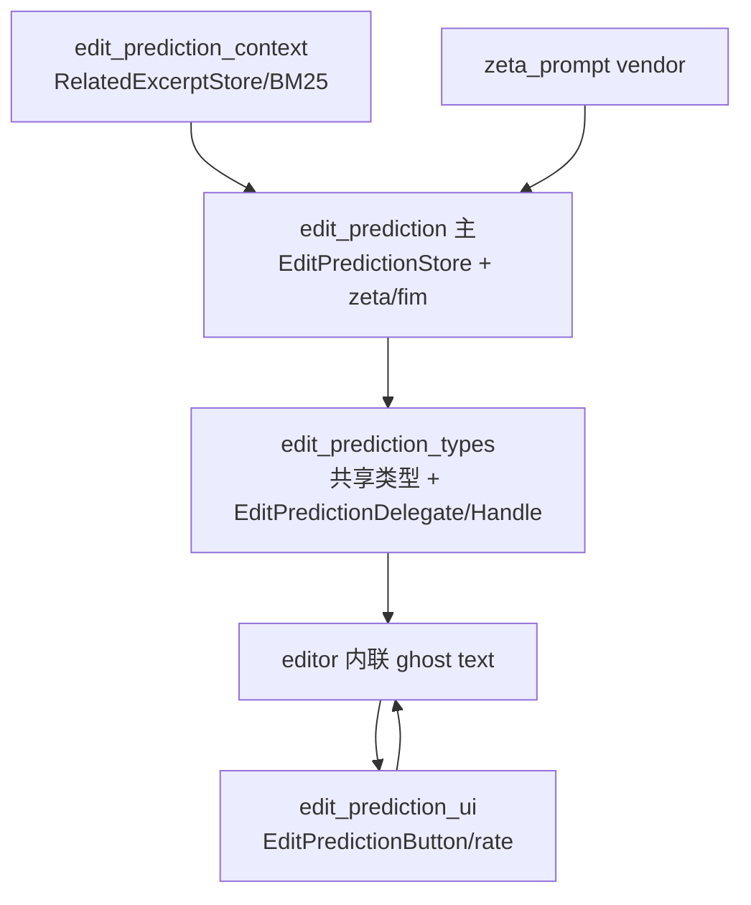
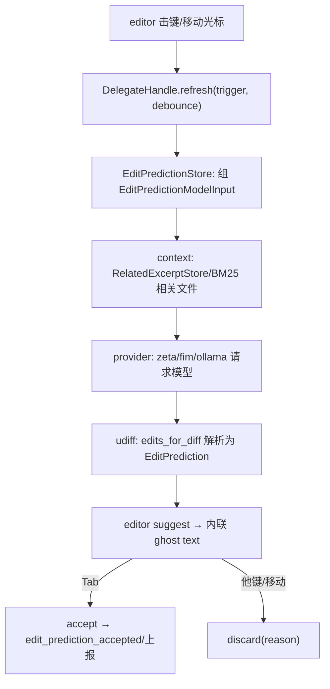

# Edit Prediction 深挖（编辑预测 · 全链）

> 返回 [Home](Home) · [Module-Index](Module-Index)
>
> 概览见 [Edit-Prediction.md](Edit-Prediction.md)。本页是**函数/类型级参考手册**，覆盖 edit_prediction 全族：`edit_prediction_types`（共享类型 + 双 delegate 抽象）· `edit_prediction`（`EditPredictionStore` 中心 + zeta/fim/ollama 多 provider）· `edit_prediction_context`（相关上下文检索）· `edit_prediction_ui`（按钮/评分）· editor 内联渲染。所有符号均来自 `grep`/`read` 确证（`文件:行号`）。

## 1. 分层总览

## 2. `edit_prediction_types`（抽象契约层）

单文件 `edit_prediction_types.rs`，定义 provider 与 editor 之间的**双向抽象**：

| 类型 | 位置 | 角色 |
| --- | --- | --- |
| `enum EditPrediction` | 121 | 预测结果：`Local{ edits, cursor_position, edit_preview }` \| `Jump{ snapshot, target }`（跨文件跳转） |
| `struct PredictedCursorPosition` | 80 | 预测后的光标落点 |
| `struct EditPredictionId`（见主 crate）/ `EditPredictionIconSet` | 33 | 状态按钮图标集 |
| `enum SuggestionDisplayType` | 104 | 展示形态：`GhostText`/`DiffPopover`/`Jump`（埋点用） |
| `enum Direction` | 115 | `Prev`/`Next`（多预测切换） |
| `enum EditPredictionGranularity` | 350 | 接受粒度（行/词等） |
| `enum EditPredictionDiscardReason` | 7 | 丢弃原因 |
| `enum EditPredictionRequestTrigger` | 13 | 触发源（击键/光标移动…） |
| `enum DataCollectionState` | 137 | 数据收集：`Unsupported`/`Enabled`/`Disabled`（含是否开源项目） |
| **`trait EditPredictionDelegate`** | 168 | **provider 实现面**：`is_enabled`/`refresh`/`accept`/`discard`/`suggest`/`is_refreshing`/`icons`/`data_collection_state`/`usage`/`supports_jump_to_edit`… |
| **`trait EditPredictionDelegateHandle`** | 220 | **editor 持有的类型擦除句柄**（转发上面方法，供任意 provider 复用） |

> 设计：`Delegate`（具体 provider 实现，`Context<Self>`）与 `DelegateHandle`（对象安全的转发句柄）分离，让 editor 只依赖句柄、由主 crate 把句柄操作派发到实体 delegate。

## 3. `edit_prediction`（主 crate · `EditPredictionStore` 中心）

`edit_prediction.rs`（3165 行）核心类型：

| 类型 | 行 | 角色 |
| --- | --- | --- |
| `struct EditPredictionStore` | 158 | **中心协调器**（Entity，`EditPredictionStoreGlobal` 全局）：持 `client`/`user_store`/`llm_token`、`projects: HashMap<EntityId,ProjectState>`、`edit_prediction_model`、退避 `request_backoff_until`、实验 `preferred/available_experiments`、可评分队列 `rateable_predictions`/`rated_predictions`、拒绝/结算 mpsc |
| `enum EditPredictionModel` | 185 | 当前后端：`Zeta` \| `Fim{format}` \| `SweepPrompt` |
| `struct EditPredictionModelInput` | 191 | 请求入参：`buffer`/`snapshot`/`position`/`events`/`related_files`/`editable_context`/`mode`/`trigger`/`diagnostic_search_range`/`allow_jump`… |
| `struct Zeta2RawConfig` | 152 | 直连 Zeta2 raw 端点（自构 prompt，含 `ZetaFormat`） |
| `enum DebugEvent` | 210 | 生命周期埋点：`ContextRetrievalStarted/Finished`(211/212)、`EditPredictionStarted/Finished`(213/214) |
| `struct StoredEvent` | 247 | 缓冲编辑事件（`zeta_prompt::Event` + 前后快照），供 prompt 重建；`can_merge` 合并相邻手改/预测事件 |
| `struct ZedEditPredictionDelegate` | zed_edit_prediction_delegate.rs:18 | Zed 云 provider 对 `EditPredictionDelegate` 的实现 |

`prediction.rs`：`EditPredictionId`(10)、`enum EditPredictionInputs`(26)、`struct EditPredictionResult`(32, `new_rejected` 108)、`struct EditPrediction`(138, `interpolate` 152 / `targets_buffer` 159)。

**多后端/传输模块**（`edit_prediction/src/`）：

- `zeta.rs`（40KB）：`request_prediction_with_zeta`(41)、`zeta2_prompt_input`(787)、`compute_edits`(885)/`compute_edits_and_cursor_position`(894)、`edit_prediction_accepted`(841)、`active_buffer_diagnostics`(704)
- `fim.rs`（11KB）：fill-in-middle prompt 格式化（`EditPredictionPromptFormat`）
- `sweep_prompt.rs`（18KB）：sweep 实验 prompt 组装
- `ollama.rs`（5KB）：本地 Ollama 推理后端
- `open_ai_compatible.rs` / `open_ai_response.rs`：OpenAI 兼容端点
- `udiff.rs`（31KB）：`edits_for_diff`(299) 把模型返回的 unified diff 解析为缓冲编辑；`OpenedBuffers`(28)
- `cursor_excerpt.rs`（22KB）：光标周边摘录；`license_detection.rs`（31KB）：生成片段许可证/代码匹配检测；`data_collection.rs`（15KB）：训练数据同意与上报；`example_spec.rs`：评测样例

## 4. `edit_prediction_context`（上下文检索）

为 prompt 组装"相关文件/编辑历史"上下文：

- `edit_prediction_context.rs`：`struct RelatedExcerptStore`(41) + `enum RelatedExcerptStoreEvent`(62) —— 缓存与刷新相关摘录
- `bm25_context.rs`（21KB）：基于 BM25 的相关文件检索
- `editable_context.rs`（42KB）：可编辑上下文（最近改动/待纳入 prompt 的文件集合）
- `git_log_context.rs`：提交历史上下文；`assemble_excerpts.rs`：摘录拼装；`fake_definition_lsp.rs`：LSP 定义抽取（测试替身）

## 5. `edit_prediction_ui` + editor 内联

- `edit_prediction_button.rs`（74KB）：`struct EditPredictionButton`(61) —— 状态栏总开关/状态
- `edit_prediction_context_view.rs`：展示当前预测使用了哪些上下文
- `rate_prediction_modal.rs`（63KB）：对已结算预测点赞/反馈（喂 `rateable_predictions`）
- `edit_prediction_ui.rs`：`init(cx)`(39) 注册动作/设置
- **editor 侧**：通过 `EditPredictionDelegateHandle` 拉取 `EditPrediction`，以 ghost text 元素内联渲染，`Tab` 接受（走 `accept`）、他键/移动触发 `discard`。

## 6. 预测生命周期

## 7. 配置 / 集成

- 设置：`EditPredictionSettings`（`crates/language/src/language_settings.rs:487`），`PredictEditsMode`。
- 依赖：`zeta_prompt`（vendor prompt/事件）、`cloud_llm_client`/`telemetry`、`edit_prediction_context`、`gpui`/`language`/`editor`。
- 与 [Agent-Deep-Dive.md](Agent-Deep-Dive.md)（工具型编辑）、[Editor-Deep-Dive.md](Editor-Deep-Dive.md)（内联渲染宿主）协作。

## 8. 相关页

- 概览：[Edit-Prediction.md](Edit-Prediction.md)
- 深页：[Editor-Deep-Dive.md](Editor-Deep-Dive.md)、[Agent-Deep-Dive.md](Agent-Deep-Dive.md)、[Language-Deep-Dive.md](Language-Deep-Dive.md)、[Data-Structures.md](Data-Structures.md)、[Model-Providers.md](Model-Providers.md)、[Network-And-HTTP.md](Network-And-HTTP.md)、[GPUI-Deep-Dive.md](GPUI-Deep-Dive.md)
- 导航：[Home](Home) · [Module-Index](Module-Index)
