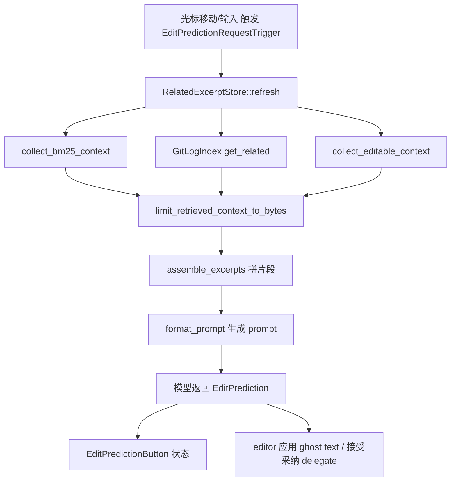

# 编辑预测：类型 / 上下文 / UI / CLI 深入解析（Deep Dive）

> 本页覆盖 `edit_prediction` 核心引擎**周边**的四个 crate：`edit_prediction_types`（跨层共享枚举与 delegate trait）、`edit_prediction_context`（检索上下文的组装：BM25 / git log / 可编辑区）、`edit_prediction_ui`（状态栏按钮、上下文检视、评分弹窗）、`edit_prediction_cli`（离线评测 / prompt 格式化 / headless 跑批工具链）。核心 diff/接受逻辑见 [Edit-Prediction-Deep-Dive](Edit-Prediction-Deep-Dive.md)。

## 1. 分层设计

编辑预测（Zeta）是"数据面 + 控制面 + 观测面"的组合：

- **契约层** `edit_prediction_types`：定义 `enum EditPrediction`、`EditPredictionDelegate`/`EditPredictionDelegateHandle` 等，让引擎（`edit_prediction`）与 UI/CLI 解耦——UI 只需实现 delegate。
- **上下文层** `edit_prediction_context`：决定"给模型看哪些相关代码"，含 BM25 检索、最近 git 提交相关文件、光标可编辑区收集，结果汇入 `RelatedExcerptStore`。
- **UI 层** `edit_prediction_ui`：状态栏 `EditPredictionButton`（74KB，展示工作/冷却/关闭态）、`EditPredictionContextView`（可视化被检索到的上下文）、`RatePredictionModal`（用户给预测打分）。
- **CLI/评测层** `edit_prediction_cli`：一个多子命令的 headless 工具（`main.rs` 66KB），做 prompt 组装（`format_prompt.rs` 66KB）、从真实仓库拉样本（`pull_examples.rs` 74KB）、切分提交（`split_commit.rs` 86KB）、打分（`score.rs`）、修复（`repair.rs`）、词级 diff（`word_diff.rs`）等，服务于模型迭代与 A/B。

## 2. 类型总览

### edit_prediction_types（edit_prediction_types.rs）

| 符号 | 文件:行 | 角色 |
| --- | --- | --- |
| `enum EditPredictionDiscardReason` | :7 | 丢弃原因 |
| `enum EditPredictionRequestTrigger` | :13 | 触发源（光标移动/接受后/…） |
| `struct EditPredictionIconSet` | :33 | 按钮图标集 |
| `struct PredictedCursorPosition` | :80 | 预测后的光标落点 |
| `enum SuggestionDisplayType` | :104 | inline / ghost / hover |
| `enum EditPrediction` | :121 | 一条预测（Diff / Multiple / Workspace） |
| `enum DataCollectionState` | :137 | 数据收集授权态 |
| `trait EditPredictionDelegate` | :168 | 宿主（editor）回调接口 |
| `trait EditPredictionDelegateHandle` | :220 | 引擎侧对 delegate 的句柄 |
| `enum EditPredictionGranularity` | :350 | 采纳事件粒度 |

### edit_prediction_context

| 符号 | 文件 | 角色 |
| --- | --- | --- |
| `struct RelatedExcerptStore` | edit_prediction_context.rs:41 | 缓存"相关文件/摘录"的 GPUI Entity |
| `enum RelatedExcerptStoreEvent` | :62 | 上下文刷新事件 |
| `fn refresh(buffer, position, cx)` | :143 | 依光标位置重算上下文 |
| `fn related_files(cx)` | :147 | 取相关文件 |
| `fn set_related_files(files, cx)` | :163 | 注入检索结果 |
| `pub use zeta_prompt::{ContextSource,RelatedExcerpt,RelatedFile}` | :36 | 类型来自 `zeta_prompt` |
| `async fn collect_bm25_context(..)` | bm25_context.rs:33 | BM25 相关代码检索 |
| `struct GitLogIndex` | git_log_context.rs:17 | 路径→共现文件索引 |
| `async fn build_git_log_index(dir)` | git_log_context.rs:79 | 扫 git log 建共现 |
| `async fn collect_editable_context(..)` | editable_context.rs:65 | 收集可编辑区上下文 |
| `fn limit_retrieved_context_to_bytes(..)` | editable_context.rs:145 | 按字节预算裁剪 |
| `fn assemble_excerpts(..)` | assemble_excerpts.rs | 把摘录拼成最终片段 |

### edit_prediction_ui

| 符号 | 文件 | 角色 |
| --- | --- | --- |
| `fn init(cx)` | edit_prediction_ui.rs:39 | 注册 Action/global |
| `EditPredictionButton` | edit_prediction_button.rs(74KB) | 状态栏预测开关/状态 |
| `EditPredictionContextView` | edit_prediction_context_view.rs | 上下文可视化检视 |
| `RatePredictionModal` | rate_prediction_modal.rs(63KB) | 预测质量打分弹窗 |

### edit_prediction_cli（关键子文件）

| 文件 | 角色 |
| --- | --- |
| `main.rs`(66KB) | clap 子命令总入口 |
| `format_prompt.rs`(66KB) | 把上下文渲染成模型 prompt |
| `pull_examples.rs`(74KB) | 从真实仓库拉训练/评测样本 |
| `split_commit.rs`(86KB) | 把 git 提交切成可评测样本 |
| `predict.rs` / `anthropic_client.rs` / `openai_client.rs` | 直连模型跑预测 |
| `score.rs`(33KB) / `word_diff.rs` / `reorder_patch.rs` | 预测打分与补丁规整 |
| `retrieve_context.rs`(22KB) | headless 复用上下文检索 |
| `headless.rs` / `load_project.rs` | 无 UI 初始化工程 |

## 3. 核心方法与调用锚点

**共享契约（edit_prediction_types.rs）**
- `enum EditPrediction`(:121) 是贯穿引擎→UI→CLI 的载荷；`SuggestionDisplayType`(:104) 决定呈现形态；`PredictedCursorPosition`(:80) 让"接受后光标去哪"跨层一致。
- 宿主 `editor` 实现 `trait EditPredictionDelegate`(:168)，引擎通过 `EditPredictionDelegateHandle`(:220) 反向调用（应用/回滚 diff、上报采纳 `EditPredictionGranularity`:350）。
- `DataCollectionState`(:137) 承载"是否允许收集训练数据"的用户授权，决定 CLI/遥测能否取样。

**上下文组装（edit_prediction_context.rs）**
- `RelatedExcerptStore::new(project, cx)`(:103) 建缓存；每次光标移动 `refresh(buffer, position, cx)`(:143) 触发后台检索，完成后 `set_related_files`(:163) 并 emit `RelatedExcerptStoreEvent`(:62)。
- 检索三来源：`collect_bm25_context`(bm25_context.rs:33)（词法相关性）+ `build_git_log_index`/`get_related`(git_log_context.rs:79/:47)（历史共现文件）+ `collect_editable_context`(editable_context.rs:65)（当前可编辑片段）。
- 统一经 `limit_retrieved_context_to_bytes`(editable_context.rs:145) 按 token/字节预算裁剪，`assemble_excerpts.rs` 拼成送模型的片段。`RelatedFile`/`RelatedExcerpt`/`ContextSource` 复用 `zeta_prompt`(:36)。

**UI（edit_prediction_ui）**
- `init(cx)`(:39) 注册；`EditPredictionButton` 依引擎事件切换 spinner/工作/冷却/关闭；`EditPredictionContextView` 把 `RelatedExcerptStore` 内容可视化以便调参；`RatePredictionModal` 收集人工评分回灌。

**CLI（edit_prediction_cli/main.rs）**
- headless：`load_project.rs`→`retrieve_context.rs`（复用 context 层）→`format_prompt.rs`（渲染 prompt）→`predict.rs`/`anthropic_client.rs`/`openai_client.rs`（直调模型）→`score.rs`/`word_diff.rs`（与真实 diff 比对打分）。
- 数据管线：`pull_examples.rs`+`split_commit.rs`+`synthesize.rs` 生产样本，`repair.rs` 修坏样本，`split_dataset.rs` 划分。

## 4. 一次预测的上下文与呈现

## 5. 集成点

- `edit_prediction`（核心引擎）实现检索调度与 diff 应用，消费 `edit_prediction_types` 契约与 `edit_prediction_context` 检索结果。
- `editor` 实现 `EditPredictionDelegate`(:168) 把预测渲染成 ghost text 并处理 Tab 采纳。
- `zed` 启动 `edit_prediction_ui::init`；状态栏挂 `EditPredictionButton`。
- `edit_prediction_cli` 在离线复现同一条链（context→prompt→模型→score），是 Zeta 模型迭代的评测台，不参与运行时。
- `zeta_prompt` 提供 `RelatedFile` 等类型与 prompt 模板（见 Model-Providers/Agent 相关页）。

## 6. 相关页

- [Edit-Prediction-Deep-Dive](Edit-Prediction-Deep-Dive.md)（核心引擎/diff 应用/采纳）
- [Edit-Prediction](Edit-Prediction.md)（编辑预测族概览）
- [Agent-Skills-and-Context-Deep-Dive](Agent-Skills-and-Context-Deep-Dive.md)（`zeta_prompt` 上下文类型）
- [Tooling-Evals-Utilities](Tooling-Evals-Utilities.md)（`eval_cli` 评测框架）
