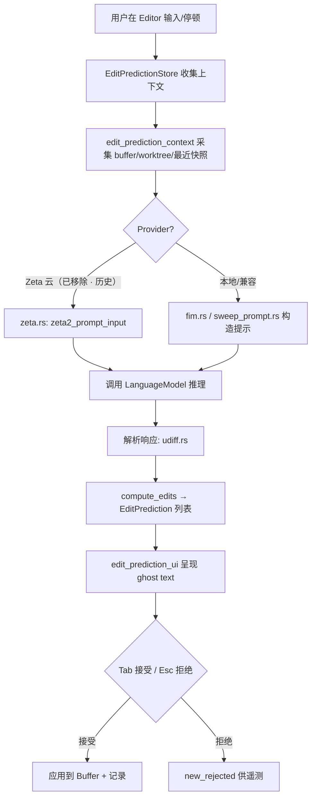

# Edit Prediction（编辑预测 / Zeta 全链详解）

覆盖 [`edit_prediction`](../crates/edit_prediction)（引擎与存储）、[`edit_prediction_types`](../crates/edit_prediction_types)、[`edit_prediction_context`](../crates/edit_prediction_context)、[`edit_prediction_metrics`](../crates/edit_prediction_metrics)、[`edit_prediction_ui`](../crates/edit_prediction_ui)、[`edit_prediction_cli`](../crates/edit_prediction_cli)。这是 Zed 的"下一步编辑预测"（ghost text，内部代号 Zeta）子系统，是 [Agent-and-AI.md](Agent-and-AI.md) 的一块深挖。

## 1. 端到端流程

## 2. 存储与数据模型

| 符号 | 位置 | 作用 |
|---|---|---|
| `struct EditPredictionStore` | [`edit_prediction.rs:158`](../crates/edit_prediction/src/edit_prediction.rs) | 全局预测状态（每 buffer 的 pending 预测、光标位置） |
| `impl EditPredictionStore` | [L947](../crates/edit_prediction/src/edit_prediction.rs) / [L2433](../crates/edit_prediction/src/edit_prediction.rs) | 主逻辑与 delegate 实现 |
| `EditPredictionStore::register_buffer` | [L1267](../crates/edit_prediction/src/edit_prediction.rs) | 打开 buffer 时纳入管理 |
| `struct EditPrediction` | [`prediction.rs:138`](../crates/edit_prediction/src/prediction.rs) | 单个预测（编辑集 + 位置 + 状态） |
| `struct EditPredictionId` | [L10](../crates/edit_prediction/src/prediction.rs) | 预测标识（`SharedString`） |
| `EditPrediction::new_rejected` | [L108](../crates/edit_prediction/src/prediction.rs) | 构造"已拒绝"记录（用于指标） |
| `EditPrediction::interpolate` | [L152](../crates/edit_prediction/src/prediction.rs) | 锚点随 buffer 更新做位置插值 |
| `EditPrediction::targets_buffer` | [L159](../crates/edit_prediction/src/prediction.rs) | 判断预测是否命中该 buffer |
| `enum EditPredictionProvider` | [`settings_content/src/language.rs:92`](../crates/settings_content/src/language.rs) | 提供方选择（Ollama/OpenAI 兼容 API；`zed`/云端选项已移除 · 历史，未知值回落 `None`） |

## 3. 提示构造：多种策略并存

- **Zeta（Zed 自研云模型，云端推理已移除 · 历史；下述 prompt 机械仍在）**：[`zeta.rs`](../crates/edit_prediction/src/zeta.rs) —— `zeta2_prompt_input`（[L787](../crates/edit_prediction/src/zeta.rs)）组装结构化输入；`compute_edits`（[L885](../crates/edit_prediction/src/zeta.rs)）/ `compute_edits_and_cursor_position`（[L894](../crates/edit_prediction/src/zeta.rs)）把模型输出折成 buffer 编辑。提示模板由 [`zeta_prompt`](../crates/zeta_prompt) crate 生成。
- **FIM（Fill-In-Middle）**：[`fim.rs`](../crates/edit_prediction/src/fim.rs) —— `request_prediction`（[L26](../crates/edit_prediction/src/fim.rs)）、`infer_prompt_format`（[L170](../crates/edit_prediction/src/fim.rs)）按模型推断 `<prefix>/<suffix>` 标记格式。
- **Sweep**：[`sweep_prompt.rs`](../crates/edit_prediction/src/sweep_prompt.rs) —— `request_prediction`（[L46](../crates/edit_prediction/src/sweep_prompt.rs)）、`build_prompt`（[L207](../crates/edit_prediction/src/sweep_prompt.rs)）。
- **OpenAI 兼容后端**：[`open_ai_compatible.rs`](../crates/edit_prediction/src/open_ai_compatible.rs)（`open_ai_compatible_api_url` L9、token 管理 L27-52）。（响应解析模块 `open_ai_response.rs` 已移除 · 历史）

## 4. 多文件 diff 与许可门控

- [`udiff.rs`](../crates/edit_prediction/src/udiff.rs)：`edits_for_diff`（[L299](../crates/edit_prediction/src/udiff.rs)）解析 unified-diff，支持一次预测**跨多文件**编辑；`get`/`buffers`（L31/35）管理涉及的文件 buffer。
- [`license_detection.rs`](../crates/edit_prediction/src/license_detection.rs)：`spdx_identifier`（[L71](../crates/edit_prediction/src/license_detection.rs)）、`is_project_open_source`（[L390](../crates/edit_prediction/src/license_detection.rs)）—— 依据 LICENSE 判断项目是否开源，用于云端模型的合规门控。
- [`metrics.rs`](../crates/edit_prediction/src/metrics.rs)：`count_tree_sitter_errors`（L6）等，为预测质量提供指标（配合 [`edit_prediction_metrics`](../crates/edit_prediction_metrics)）。

## 5. 上下文采集（edit_prediction_context / _types）
[`edit_prediction_types`](../crates/edit_prediction_types/src/edit_prediction_types.rs) 定义跨 crate 共享的输入/事件类型（如 `EditPredictionContext`、`RecentSnapshot`、worktree 快照等）；[`edit_prediction_context`](../crates/edit_prediction_context) 负责从编辑器/工作区**采集**这些上下文（光标周边、最近编辑快照、相邻文件），喂给第 3 节的提示构造。

## 6. UI 呈现（edit_prediction_ui）

| 符号 | 位置 | 作用 |
|---|---|---|
| `edit_prediction_ui::init` | [`edit_prediction_ui.rs:39`](../crates/edit_prediction_ui/src/edit_prediction_ui.rs) | 注册 actions/settings |
| `struct EditPredictionButton` | [`edit_prediction_button.rs:61`](../crates/edit_prediction_ui/src/edit_prediction_button.rs) | 状态栏按钮/菜单 |
| `set_completion_provider` | [L1477](../crates/edit_prediction_ui/src/edit_prediction_button.rs) | 切换提供方 |
| `get_available_providers` | [L1488](../crates/edit_prediction_ui/src/edit_prediction_button.rs) | 枚举可用提供方 |
| `struct RatePredictionsModal` | [`rate_prediction_modal.rs:58`](../crates/edit_prediction_ui/src/rate_prediction_modal.rs) | 预测质量打分（👍/👎）反馈 |
| `struct EditPredictionContextView` | [`edit_prediction_context_view.rs:35`](../crates/edit_prediction_ui/src/edit_prediction_context_view.rs) | 可视化"模型看到了哪些上下文" |

ghost text 的实际绘制与 Tab 接受由 [Editor](Editor.md) 侧完成（`Editor` 通过 delegate 与 `EditPredictionStore` 协作，delegate 见 [`zed_edit_prediction_delegate.rs`](../crates/edit_prediction/src/zed_edit_prediction_delegate.rs)）。

## 7. 与其他页面的关系
- 上层 Agent 使用同一 `LanguageModel`：[Model-Providers.md](Model-Providers.md)。
- ghost text 落在编辑器：[Editor.md](Editor.md) / [Editing-Deep-Dive.md](Editing-Deep-Dive.md)。
- 应用编辑的流式 diff：[Data-Structures.md](Data-Structures.md) 的 `StreamingDiff`。
- 许可/合规门控与 `Worktree`：[Project-Panel-and-FS.md](Project-Panel-and-FS.md)。
