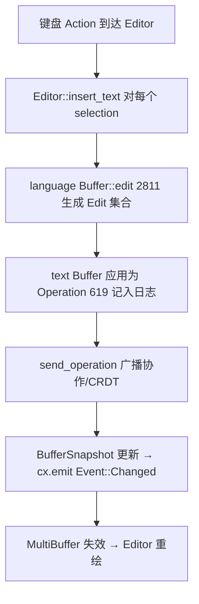
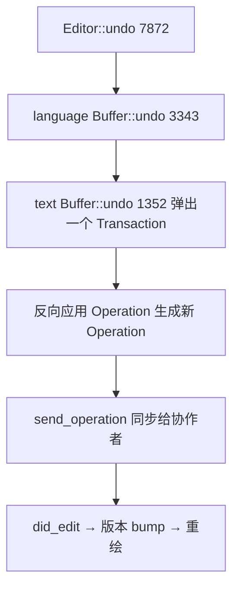

# Editing Deep Dive（缓冲区 / 多光标 / 撤销 / 片段 / 多缓冲）

本页拆解 Zed 编辑内核的**分层数据模型**与高频编辑能力。自顶向下三层，越底越纯粹：

- [`editor`](../crates/editor)：`Editor` 视图 + 选择/光标 + 键入处理（GPUI 层）。
- [`language`](../crates/language)：`Buffer` = 文本 + 语法树 + 语言服务器 + CRDT 协作元数据。
- [`text`](../crates/text)：`text::Buffer` = 基于 **Rope + CRDT 操作日志** 的最小可协作文本内核。

另有 [`multi_buffer`](../crates/multi_buffer)：把"多个 `Buffer` 的若干片段 + diff"缝合成**单一展示面**（用于审查差异、搜索结果、诊断列表等）。

## 1. 三层数据模型

| 层 | 类型 | 位置 | 职责 |
|---|---|---|---|
| 视图 | `Editor` | [`editor.rs:951`](../crates/editor/src/editor.rs) | GPUI 视图，持有 `MultiBuffer`、选择集、光标 |
| 逻辑缓冲 | `language::Buffer` | [`buffer.rs:101`](../crates/language/src/buffer.rs) | 文本 + Tree-sitter + LSP + 事务/版本 |
| 文本内核 | `text::Buffer` | [`text.rs:59`](../crates/text/src/text.rs) | Rope + CRDT 操作日志（`Operation`） |
| 缝合面 | `MultiBuffer` | [`multi_buffer.rs:74`](../crates/multi_buffer/src/multi_buffer.rs) | 多片段/多 buffer 拼成一个可滚动视图 |
| 稳定位置 | `Anchor` | [`anchor.rs:11`](../crates/text/src/anchor.rs) | 跨编辑仍稳定的点（CRDT 友好） |

`language::Buffer` 内部把纯文本工作委托给 `self.text: text::Buffer`（`undo`/`edit` 都转发给它，见 buffer.rs:3347 `self.text.undo()`）。`Editor` 不直接持有 `Buffer`，而是持有 `MultiBuffer`，因此普通编辑与"差异审查视图"能共用同一套渲染代码。

## 2. 键入 → 缓冲的调用流程

一次编辑总是包在**事务（Transaction）**里：`start_transaction`（[buffer.rs:2569](../crates/language/src/buffer.rs)）…`end_transaction`（L2585）。落在同一"合并窗口"内的多次小改（如连续打字）会被折叠成**一个撤销单元**。`edit`（L2811）是主入口，另有 `edit_before`（L2833）、`edit_non_coalesce`（L2854，强制不合并）。

## 3. 撤销 / 重做（基于 CRDT 事务日志）

- 视图层：`Editor::undo`（[editor.rs:7872](../crates/editor/src/editor.rs)）/ `Editor::redo`（L7898）——绑定 `Undo`/`Redo` Action。
- 逻辑层：`Buffer::undo`（buffer.rs:3343）转交内核并广播 `Operation`；还有 `undo_transaction`（L3358，撤销指定事务）、`undo_to_transaction`（L3375，撤到某事务为止）、`undo_operations`（L3394，按 `Lamport` 时钟计数撤销）。
- 内核层：`text::Buffer`（text.rs:59）用 `History`（L153，私有）维护 `HistoryEntry`（L127）栈，每个 `Transaction`（L135）是一组 `Operation`（L619）。

因为撤销本身也被表达成新的 `Operation`，所以**在多人实时协作下 undo 只回退自己那次事务、不影响他人**（Lamport 时钟 + `ReplicaId` 标识来源），这正是选 CRDT 而非"记录 diff 快照"的原因。

## 4. 多光标 / 多选择

`Editor` 的选择集是 `Vec<Selection>`，键入/删除对所有选择各执行一遍。常用命令：

- `add_selection_above` / `add_selection_below`（[selection.rs:323/333](../crates/editor/src/selection.rs)）：在上下行同列加光标。
- 选中相同词、列编辑、`split` 选区等（`selection.rs` / editor 的 `actions.rs`）。
- 位置用 `Anchor`（anchor.rs:11）而非绝对偏移保存——编辑发生后锚点自动随 `Operation` 平移，多光标因此不会错位。

## 5. 代码片段（Snippet）

`Editor::insert_snippet`（[editor.rs:4925](../crates/editor/src/editor.rs)）/ `insert_snippet_with_autoindent`（L4943）解析 `$1`、`${2:placeholder}` 语法，插入后把各 tabstop 变成**多个同步选择**（改一处所有占位同改），`Tab` 在占位间跳转。补全项里的 snippet 走 `insert_snippet_at_selections`（[input.rs:1198](../crates/editor/src/input.rs)）。运行期片段由 [`snippet_provider`](../crates/snippet_provider) 提供，扩展也能贡献 snippets（见 [Extension-System.md](Extension-System.md)）。

## 6. MultiBuffer：把差异 / 结果缝成一面

`MultiBuffer`（multi_buffer.rs:74）由若干 **excerpt**（每个是从某 `Buffer` 取的区间）拼接而成，配 `MultiBufferSnapshot`（L694）做只读遍历（`MultiBufferRows`/`Chunks`/`Bytes` L1089/1096/1116）。它的价值：

- **审查/差异视图**：同一文件的 base/left/right 版本作为多个 excerpt 并排，`MultiBufferDiffHunk`（L133）标记差异块。
- **搜索/诊断列表**：`Search.md`/`LSP-Features.md` 里"跨文件结果 + 上下文"就是一个 MultiBuffer。
- 坐标换算：`buffer_point_to_anchor`（L1939）、`text_anchor_for_position`（L2008）在"显示坐标 ↔ 底层 buffer 坐标"间转换，编辑仍落回各自真实 `Buffer`。

## 7. 关键符号速查

| 符号 | 位置 | 作用 |
|---|---|---|
| `Editor` | `editor/src/editor.rs:951` | 编辑视图 |
| `Editor::undo` / `redo` | `editor.rs:7872/7898` | 撤销/重做入口 |
| `Editor::insert_snippet` | `editor.rs:4925` | 片段展开 |
| `add_selection_above/below` | `editor/src/selection.rs:323/333` | 多光标 |
| `language::Buffer` | `language/src/buffer.rs:101` | 逻辑缓冲（文本+语法+LSP） |
| `Buffer::edit` | `buffer.rs:2811` | 应用一次编辑 |
| `Buffer::start/end_transaction` | `buffer.rs:2569/2585` | 合并撤销单元 |
| `text::Buffer` | `text/src/text.rs:59` | CRDT 文本内核 |
| `text::Buffer::undo` | `text.rs:1352` | 事务级撤销 |
| `enum Operation` | `text/src/text.rs:619` | CRDT 操作 |
| `Anchor` | `text/src/anchor.rs:11` | 稳定位置 |
| `MultiBuffer` | `multi_buffer/src/multi_buffer.rs:74` | 多片段缝合面 |

## 8. 与其他页面的关系
- Buffer 的 Tree-sitter/LSP 侧：[Language-and-Project.md](Language-and-Project.md)、[LSP-Features.md](LSP-Features.md)。
- 查找替换作用在 buffer 上：[Search.md](Search.md)。
- CRDT 操作经 RPC 同步：[Collaboration-and-Call.md](Collaboration-and-Call.md)。
- `Editor`/`MultiBuffer` 作为 `Item` 进 Pane：[Workspace-Pane-Dock.md](Workspace-Pane-Dock.md)。
- Editor 渲染三阶段：[GPUI-Internals.md](GPUI-Internals.md)、[Editor.md](Editor.md)。
