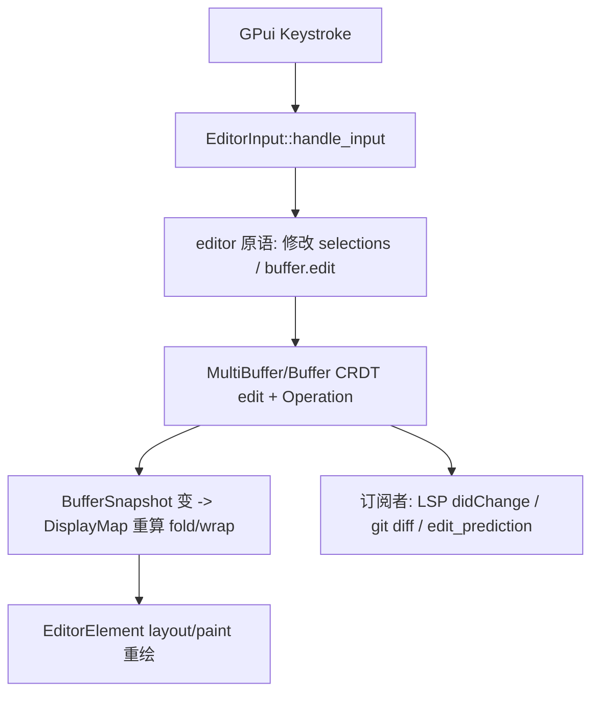

# Deep Reference: editor

> 参考手册级：`crates/editor`（Zed 最大的 UI crate，`editor.rs` 480KB + `element.rs` 517KB + `display_map.rs` 171KB …）。`Editor` 是一个 GPUI `Entity`，把 [`multi_buffer`](Multi-Buffer-Deep-Dive.md) 的文本渲染成可交互、可协作、带全套 LSP 叠加层的编辑面。本页按**子系统文件**穷举职责与关键符号。

## 1. 核心实体
- `struct Editor`（[editor.rs:951](../crates/editor/src/editor.rs)）：主 `Entity`。构造 `new`(L1882)、`new_file`(L2934)、`new_in_workspace`(L2954)；`snapshot(window,cx)->EditorSnapshot`(L3086) 取只读快照供元素/算法使用。
- `enum EditorMode`（[editor.rs:470](../crates/editor/src/editor.rs)）：`SingleLine`｜`AutoHeight{min_lines,max_lines}`｜`Full{scale_ui_elements_with_buffer_font_size,show_active_line_background,sizing_behavior}`｜`Minimap{parent:WeakEntity<Editor>}`。`full()`(L490) 便捷构造。决定测量/布局/是否可滚动。
- 相关枚举：`SizingBehavior`(L456)、`SelectMode`(L448：`Line`/`Word`/`All`)、`SelectPhase`(L417，拖拽选择状态机)、`ColumnarMode`(L442，块选择)、`Navigated`(L348)、marker `ActiveDebugLine`/`DebugStackFrameLine`(L335/336)、冲突标记 `ConflictsOuter/Ours/Theirs*`(L338-342)。
- `struct EditorSnapshot`、`struct VisualLine`、`struct DisplayPoint`：display 层坐标（见 §3）。

## 2. 输入 / 命令（键盘→动作）
| 文件 | 大小 | 职责 |
|---|---|---|
| [`input.rs`](../crates/editor/src/input.rs) | 126KB | `EditorInput`：把 GPui `Keystroke` 结合 IME/vim 前置处理，转成 editor 原语（插入/删除/换行/undo…）。`handle_input`/`replace_to_whitespace` 等 |
| [`actions.rs`](../crates/editor/src/actions.rs) | 38KB | 全部 editor `Action`（`MoveToStartOfLine`、`SelectUp`、`DeleteToPreviousWordStart`、`Fold`、`JoinLines`…）与 `actions!` 声明清单 |
| [`movement.rs`](../crates/editor/src/movement.rs) | 62KB | 游标运动内核：`word/paragraph/line` 边界、`clip`、`find_next_word_end`、`movement` 系列 fn（被 vim motions 复用） |

## 3. 显示层：`display_map.rs`（缓冲区→屏幕的行映射核心）
[`display_map.rs`](../crates/editor/src/display_map.rs)（171KB）把 `MultiBuffer` 的行经多级变换映射为**可见行**：
```
Buffer text (MultiBuffer)
  └─ BlockMap    (inlays/装饰块, foldable)
      └─ FoldMap (代码折叠 …/ 摘要)
          └─ WrapMap (软换行 soft-wrap)
              └─ TabMap (tab→空格列)
                  └─ LineWrapper/TextWrapper 逐行切分
                      └─ DisplayPoint / DisplayRow (屏幕坐标)
```
- 关键类型：`DisplayMap`、`DisplayedText`、`WrapSnapshot`、`FoldMap`、`BlockMap`、`Inlay`。
- `EditorSnapshot` 持有当前 `DisplayMap` 快照，`EditorElement` 靠它做命中测试与绘制。
- 坐标链：`BufferRow`→(fold/wrap)→`DisplayRow`；`DisplayPoint`↔`VisualLine`↔`MultiBufferPoint`（见 [Multi-Buffer-Deep-Dive.md](Multi-Buffer-Deep-Dive.md)）。

## 4. 渲染：`element.rs`（GPUI Element 实现）
[`element.rs`](../crates/editor/src/element.rs)（517KB，Zed 最大文件之一）：`struct EditorElement` 实现 `RenderOnce`/`Element`。职责：
- `layout`：按 `EditorMode` 计算尺寸；`paint`：绘制文本 runs（`ShapedLine`/`LineWithInvisibles`）、光标、选区背景、gutter、行号、缩进引导、高亮括号、diagnostic下划线、inlays、git hunks、ghost text。
- 命中测试：`point_for_position`/`coordinates_for_position`（像素→`DisplayPoint`）。
- 子模块目录 [`element/`](../crates/editor/src/element)。光标闪烁由 [`blink_manager.rs`](../crates/editor/src/blink_manager.rs)（`BlinkManager`）驱动。

## 5. 选区系统
- [`selection.rs`](../crates/editor/src/selection.rs)（95KB）：`Selection`/`SelectionWithReversedAnchors`、`map_selections`、列选择。
- [`selections_collection.rs`](../crates/editor/src/selections_collection.rs)（56KB）：`SelectionsCollection<T>`（多光标集合，`all_overlapping_ranges`、`disjoint`、`primary`、`change`）。基于 [text::Selection](Text-Buffer-Deep-Dive.md)。
- [`cursor_animation.rs`](../crates/editor/src/cursor_animation.rs)：光标动画（vim 跳转）。

## 6. 与 Workspace / 持久化集成
- [`items.rs`](../crates/editor/src/items.rs)（124KB）：`impl Item for Editor`（title/tab、reused、nav history）+ `impl ToolbarItem`、搜索/预览集成。把 Editor 接进 [Workspace-Pane-Dock.md](Workspace-Pane-Dock.md)。
- [`persistence.rs`](../crates/editor/src/persistence.rs)（21KB）：`SerializedEditor`/`BufferIdsInOrder`/`ExcerptInfo`，存 SQLite（[Persistence.md](Persistence.md)），重启恢复多 buffer 布局。
- [`split.rs`](../crates/editor/src/split.rs)（200KB）：`SplitEditor`/`EditorSlice`——把同一 `MultiBuffer` 拆成多个可视 pane（diff 并排、拖放分栏）。

## 7. LSP 叠加层（每类一文件，真实清单）
| 能力 | 文件 | 说明 |
|---|---|---|
| 补全 | [completions.rs](../crates/editor/src/completions.rs)(61KB) + [code_context_menus.rs](../crates/editor/src/code_context_menus.rs)(82KB) | `CompletionProvider`/`CompletionsMenu`/`CodeContextMenus`（含 snippets、buffers、copilot） |
| 代码动作 | [code_actions.rs](../crates/editor/src/code_actions.rs)(22KB) | `quick_fix`/`refactor`/`source` Actions 聚合 |
| Hover | [hover.rs? ]→[hover_links.rs](../crates/editor/src/hover_links.rs)(120KB)+[hover_popover.rs](../crates/editor/src/hover_popover.rs)(125KB) | 链接/文本 hover、`HoverPopover`、`Markdown` 渲染 |
| 签名帮助 | [signature_help.rs](../crates/editor/src/signature_help.rs)(20KB) | 参数提示 |
| 文档符号 | [document_symbols.rs](../crates/editor/src/document_symbols.rs)(47KB) | `highlight_symbol` 关联高亮 |
| 颜色 | [document_colors.rs](../crates/editor/src/document_colors.rs)(29KB) | 颜色预览装饰 |
| 链接 | [document_links.rs](../crates/editor/src/document_links.rs) | 可点 URL |
| 可运行 | [runnables.rs](../crates/editor/src/runnables.rs)(54KB) | code lens 运行按钮 |
| CodeLens | [code_lens.rs](../crates/editor/src/code_lens.rs)(69KB) | LSP codeLens 折叠/缓存 |
| 语义高亮 | [semantic_tokens.rs](../crates/editor/src/semantic_tokens.rs)(115KB) | LSP semantic tokens 叠加层 |
| 诊断 | [diagnostics.rs](../crates/editor/src/diagnostics.rs)(32KB) | severity→下划线/inline |
| Inlay Hints | [inlays.rs](../crates/editor/src/inlays.rs)+[inlays/](../crates/editor/src/inlays) | LSP inlay hint（类型/参数名） |
| 折叠 | [fold.rs](../crates/editor/src/fold.rs)(38KB)+[folding_ranges.rs](../crates/editor/src/folding_ranges.rs)(44KB) | 语法折叠区间 |
| 括号 | [bracket_colorization.rs](../crates/editor/src/bracket_colorization.rs)(75KB)+[highlight_matching_bracket.rs](../crates/editor/src/highlight_matching_bracket.rs) | Rainbow brackets |
| 链接编辑 | [linked_editing_ranges.rs](../crates/editor/src/linked_editing_ranges.rs) | LSP linked editing（改名同步） |
| Emmet | [emmet_ext.rs](../crates/editor/src/emmet_ext.rs)(59KB) | 前端缩写展开 |
| 语言特定 | [rust_analyzer_ext.rs](../crates/editor/src/rust_analyzer_ext.rs)/[clangd_ext.rs](../crates/editor/src/clangd_ext.rs)/[jsx_tag_auto_close.rs](../crates/editor/src/jsx_tag_auto_close.rs) | 特定 LSP 行为 |
详见 [LSP-Features.md](LSP-Features.md)。

## 8. Git / 协作 / 预测
- [git.rs](../crates/editor/src/git.rs)(117KB)：`git::blame`、`hunks`（uncommitted changes 侧栏 gutter）、`GitState`。→ [Git-Integration.md](Git-Integration.md)。
- [`edit_prediction.rs`](../crates/editor/src/edit_prediction.rs)(98KB)：ghost text 的 editor 侧接线（`EditPredictionButton`、accept/reject、pending state）。→ [Edit-Prediction.md](Edit-Prediction.md)。
- 协作：`set_collaboration_hub(Box<dyn CollaborationHub>)`(L3160)、多光标他人选区渲染。→ [Collaboration-and-Call.md](Collaboration-and-Call.md)。
- [bookmarks.rs](../crates/editor/src/bookmarks.rs)(23KB)：文件内书签跳转。
- [clipboard.rs](../crates/editor/src/clipboard.rs)(28KB)：复制粘贴、多行剪贴板。
- [mouse_context_menu.rs](../crates/editor/src/mouse_context_menu.rs)、[inline_input.rs](../crates/editor/src/inline_input.rs)（inline assist 输入框）。
- 配置：[config.rs](../crates/editor/src/config.rs)/[editor_settings.rs](../crates/editor/src/editor_settings.rs)。→ [Settings-and-Themes.md](Settings-and-Themes.md)。

## 9. 一次按键的端到端流程


## 10. 相关页
底座：[Multi-Buffer-Deep-Dive.md](Multi-Buffer-Deep-Dive.md)。渲染框架：[GPUI-Deep-Dive.md](GPUI-Deep-Dive.md)。概览：[Editor.md](Editor.md)、[Editing-Deep-Dive.md](Editing-Deep-Dive.md)。
