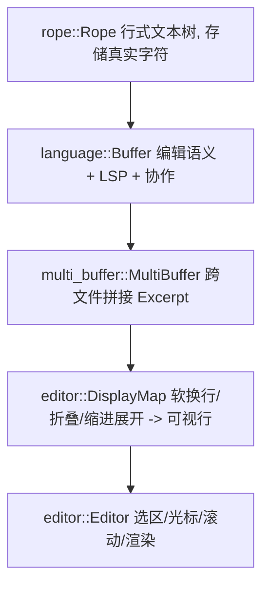
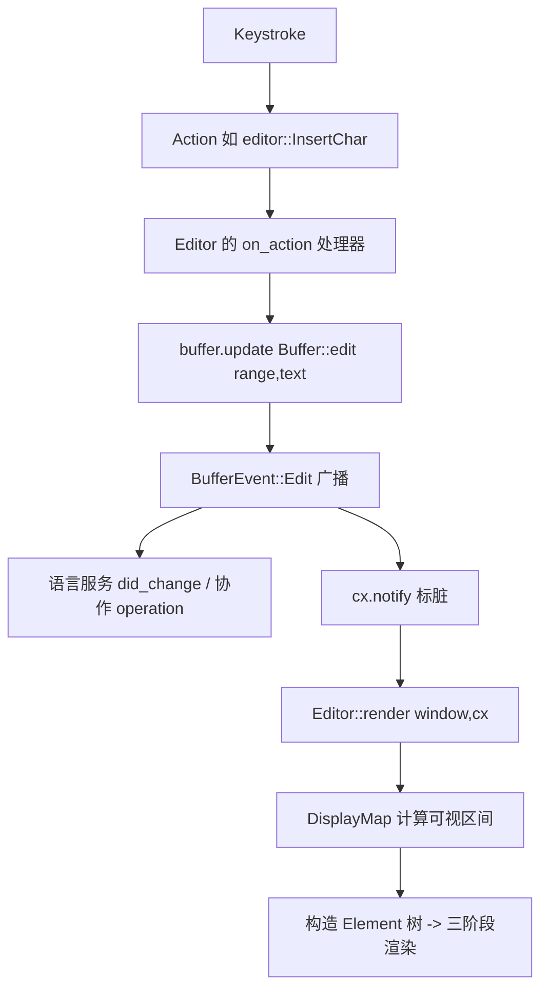

# Editor（编辑器：输入 → 缓冲区 → 渲染）

核心 crate：[`crates/editor`](../crates/editor)（`editor.rs` 逾 1.2 万行）。它把"文本数据模型"与"可视编辑控件"分层解耦。

## 1. 数据模型的四个层次

| 层 | crate / 文件 | 职责 | 关键点 |
|---|---|---|---|
| `Rope` | `crates/rope` | 不可变友好的行/字符存储，支持高效插入删除 | 位置用 `Point`(row,col) 与 `Offset` |
| `Buffer` | `crates/language/src/buffer.rs` | 一次编辑事务、语法、诊断、与语言服务/协作同步 | `fn edit(...)`(L2811)、`enum BufferEvent`(L318) |
| `MultiBuffer` | `crates/multi_buffer` | 把多个 Buffer 的若干 `Excerpt` 拼成一个逻辑缓冲（diff/findings/预览用） | 位置在 excerpt 间映射 |
| `DisplayMap` | `crates/editor/src/display_map.rs` | 在缓冲区之上叠加"显示变换"：软换行、tab 展开、折叠、inlay | 生成可视行 `DisplayPoint` |
| `Editor` | `crates/editor/src/editor.rs` | 选区、光标、滚动、动作处理、`Render` | `enum EditorMode`(L470)、`impl Render for Editor`(L12365) |

`EditorMode` 决定编辑器形态：`SingleLine`（搜索框等）、多行（代码）、以及 `Editor` 可作为 diff 的一侧（`change_display_lines` 相关）。

## 2. 从按键到重绘的调用流程

对应真实机制：
1. **输入变 Action**：见 [GPUI.md](GPUI.md) 第 4 节。字符输入对应 `InsertChar` 一类 Action，编辑动作（删除行、选择、撤销等）各有 Action。
2. **修改缓冲区**：处理器调用 `Entity<Buffer>`/`Entity<MultiBuffer>` 的 `update`，内部落到 `Buffer::edit(vec![(range, text)], cx)`（[buffer.rs L2811](../crates/language/src/buffer.rs)）；相邻编辑会被合并（`edit`），或显式不合并（`edit_non_coalesce`）。
3. **事件外发**：`Buffer` 变更触发 `BufferEvent`（L318），驱动：
   - LSP `textDocument/didChange`（见 [Language-and-Project.md](Language-and-Project.md)）；
   - 协作模式下产生 CRDT operation 广播（见 [Collaboration-and-Call.md](Collaboration-and-Call.md)）；
   - 语法高亮/诊断的重新计算。
4. **重绘**：`cx.notify()` → 下一帧调用 `Editor::render`（L12365）→ 借 `DisplayMap` 求出当前滚动窗口内的可视行 → 生成文本图元 → 交 GPUI `Element::request_layout/prepaint/paint` 上屏。

## 3. 选区、锚点与撤销

- **Selections**：`Editor` 维护一组 `Selection<Anchor>`；`Anchor`（`crates/language`）是"随缓冲区编辑自动平移"的鲁棒位置，优于裸 `Point`。
- **撤销/重做**：`Buffer` 内部 `transaction`/history 记录每次 `edit` 的逆操作；`actions::Undo`/`Redo` 触发回滚/重放。
- **多光标**：`Editor` 的 `selections_shared()` 支持并列多个选区，编辑一次作用于全部。

## 4. 关键函数速查

| 函数 / 类型 | 位置 | 作用 |
|---|---|---|
| `Editor::new(mode, show_gutter, ...)` | `editor.rs:1882` | 构造编辑器视图实体 |
| `impl Render for Editor::render` | `editor.rs:12365` | 每帧构建元素树 |
| `Buffer::edit` / `edit_before` / `edit_non_coalesce` | `buffer.rs:2811+` | 应用一次编辑（合并/不合并/前插） |
| `Buffer::edit_via_marked_text` | `buffer.rs:3583` | 按 marked text 应用（IME 组合） |
| `BufferEvent` | `buffer.rs:318` | 变更通知（Edit / Reparse / LanguageServerUpdated …） |
| `Capability::ReadWrite` / `editable()` | `buffer.rs:92` | 缓冲区是否可写（只读预览用） |
| `MultiBuffer` / `Excerpt` | `crates/multi_buffer` | 跨文件逻辑缓冲与片段 |

## 5. 相关子系统
- **语法高亮/补全**：由 `Buffer` + `Language` + LSP 提供，见 [Language-and-Project.md](Language-and-Project.md)。
- **内联预测（ghost text）**：`edit_prediction*` 在选区处渲染候选，接受即转成一次 `Buffer::edit`，见 [Agent-and-AI.md](Agent-and-AI.md)。
- **Vim 模式**：`crates/vim` 拦截按键、维护 modal state，最终仍复用 `Editor` 的编辑 API。
