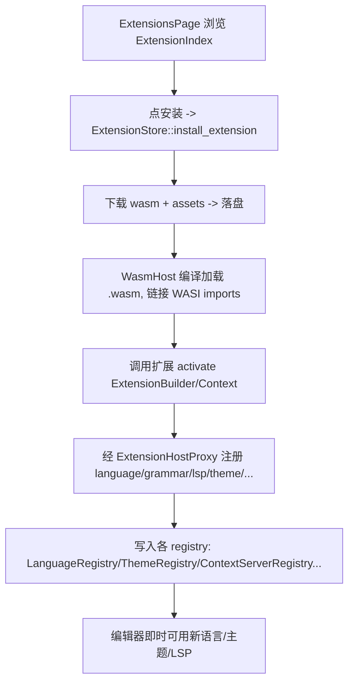

# Deep Reference: extensions (extension_api / extension / extension_host / extensions_ui)

> 参考手册级：扩展系统四 crate——`crates/extension_api`（**扩展作者面向的 WASM ABI**）、`crates/extension`（**宿主侧类型/manifest/proxy**）、`crates/extension_host`（**发现/安装/运行 wasm 的引擎**）、`crates/extensions_ui`（**市场页 `Item`**）。扩展以 **WASM**（`wasmtime`）加载，通过 `ExtensionHostProxy` 向宿主注册语言/语法/LSP/主题/斜杠命令/debug adapter/context server/agent server 等。→ 概览 [Extension-System.md](Extension-System.md)。

## 1. `crates/extension_api`：扩展作者 ABI（编译进 wasm）
| 类型 | 位置 | 角色 |
|---|---|---|
| `trait Extension` | [extension_api.rs:69](../crates/extension_api/src/extension_api.rs) | **扩展作者实现**：`activate(&mut ExtensionBuilder, &ExtensionContext)`、`language_server_candidates`、`context_server_completion`、`slash_command`… |
| `macro register_extension!` | [L290](../crates/extension_api/src/extension_api.rs) | 生成 `#[no_mangle]` 导出（`zed::register_extension!(MyExtension)`） |
| `fn register_extension(build: fn()->Box<dyn Extension>)` | [L337](../crates/extension_api/src/extension_api.rs) | 注册构造闭包 |
| [http_client.rs](../crates/extension_api/src/http_client.rs)/[process.rs](../crates/extension_api/src/process.rs)/[settings.rs](../crates/extension_api/src/settings.rs) | | wasm 侧可调的 HTTP / 子进程 / 设置（均经 host import 回调，受能力约束） |
通过 `wit-bindgen`（WASI）与宿主互操作；扩展二进制用 `extension-builder` 编译为 `.wasm`。

## 2. `crates/extension`：宿主侧类型与清单
| 类型 | 位置 | 角色 |
|---|---|---|
| `trait Extension`（宿主版） | [extension.rs:50](../crates/extension/src/extension.rs) | 宿主内运行的扩展契约（比 api 版更丰富：`context_server`/`indexed_docs`/`settings_profile`…） |
| `struct ExtensionHostProxy` | [extension_host_proxy.rs:26](../crates/extension/src/extension_host_proxy.rs) | **注册面**：扩展 `activate` 时调 `register_language`/`register_grammar`/`register_language_server`/`register_theme`/`register_icon_theme`/`register_snippet_provider`/`register_slash_command`/`register_debug_adapter`/`register_context_server`/`register_indexed_docs_provider`/`register_agent_profile`…（`Global`(L14)） |
| `struct ExtensionManifest` | [extension_manifest.rs:84](../crates/extension/src/extension_manifest.rs) | `extension.toml`（id/name/version/schema + 各贡献表）；`SchemaVersion`(L43) |
| `LibManifestEntry`/`GrammarManifestEntry`/`LanguageServerManifestEntry`/`ContextServerManifestEntry`/`SlashCommandManifestEntry`/`DebugAdapterManifestEntry`/`AgentServerManifestEntry` | [L226](../crates/extension/src/extension_manifest.rs).. | 各类贡献的清单条目 |
| `types/`：`Completion`/`Symbol`/`SymbolKind`（[lsp.rs](../crates/extension/src/types/lsp.rs)）、`SlashCommand`/`SlashCommandOutput`（[slash_command.rs](../crates/extension/src/types/slash_command.rs)）、`ContextServerConfiguration`（[context_server.rs](../crates/extension/src/types/context_server.rs)）、`project_queries`/`debugger` | | 跨 wasm 边界的结构化类型 |
`ExtensionHostProxy` 是"注册到的地方"——实际注册目标即各子系统 registry（`LanguageRegistry`、`ThemeRegistry`、`ContextServerRegistry`、`DebugRegistry`、`AgentRegistry`；见 [Language-Deep-Dive.md](Language-Deep-Dive.md)/[Agent-Deep-Dive.md](Agent-Deep-Dive.md)）。

## 3. `crates/extension_host`：引擎与生命周期 [`extension_host.rs`](../crates/extension_host/src/extension_host.rs)(89KB)
| 类型 | 位置 | 角色 |
|---|---|---|
| `struct ExtensionStore` | [L160](../crates/extension_host/src/extension_host.rs) | **核心 `Entity`（全局 `GlobalExtensionStore` L211）**：加载/启用/安装/更新/卸载扩展；维护 `ExtensionIndex`；`install_extension`/`activate_extension`/`get_extension`；`Event`(L201)/`ExtensionOperation`(L194) |
| `struct ExtensionIndex` | [L216](../crates/extension_host/src/extension_host.rs) | **市场索引**（下载自 cloud）：`ExtensionIndexEntry`(L278)、`ExtensionIndexThemeEntry`(L284)/`IconThemeEntry`(L290)/`LanguageEntry`(L296) |
| `struct WasmHost` | [wasm_host.rs:48](../crates/extension_host/src/wasm_host.rs) | **运行单个扩展 wasm**（`wasmtime` Engine/Store/Module）：加载 `.wasm`、链接 WASI imports、调 `extension_api::Extension` 方法、缓存 |
| [capability_granter.rs](../crates/extension_host/src/capability_granter.rs) | WASI **能力授权/沙箱**（网络/进程按 grant 放行） |
| [headless_head.rs / headless_host.rs](../crates/extension_host/src/headless_host.rs) | headless（CLI/remote server）用扩展宿主 |
| [extension_settings.rs](../crates/extension_host/src/extension_settings.rs) | `ExtensionSettings`（enabled/disabled 列表）。→ [Settings-and-Themes.md](Settings-and-Themes.md) |

## 4. `crates/extensions_ui`：市场页 [`extensions_ui.rs`](../crates/extensions_ui/src/extensions_ui.rs)
| 类型 | 位置 | 角色 |
|---|---|---|
| `struct ExtensionsPage` | [L380](../crates/extensions_ui/src/extensions_ui.rs) | 中心区 `Item`（`impl Item` L1544）：浏览/搜索/安装/管理扩展，dev 模式（`RebuildDevExtension` L62） |
| `struct ExtensionCard` | [components/extension_card.rs:119](../crates/extensions_ui/src/components/extension_card.rs) | 列表卡片（图标/描述/安装按钮/评分） |
| `struct ExtensionVersionSelector` | [extension_version_selector.rs:17](../crates/extensions_ui/src/extension_version_selector.rs) | 版本选择（含 dev 分支） |

## 5. 安装并激活一个扩展（真实流程）

## 6. dev 与分发
- 本地开发：`zed --dev-extension` / `extensions_ui` 的 dev 卡片，`RebuildDevExtension` 触发 `extension-builder` 重编。
- 发布：`crates/extension_cli`（打包/校验 manifest）、cloud 市场（`crates/cloud_api_*`，见 [Model-Providers.md](Model-Providers.md)）。
- 远程：remote server 经 `headless_host` + `ProtoClient` 同步扩展（[Remote-Deep-Dive.md](Remote-Deep-Dive.md)）。

## 7. 相关页
概览 [Extension-System.md](Extension-System.md)；被注册目标 [Language-Deep-Dive.md](Language-Deep-Dive.md)、[Agent-Deep-Dive.md](Agent-Deep-Dive.md)、[Debugger-Deep-Dive.md](Debugger-Deep-Dive.md)、[Settings-and-Themes.md](Settings-and-Themes.md)。
