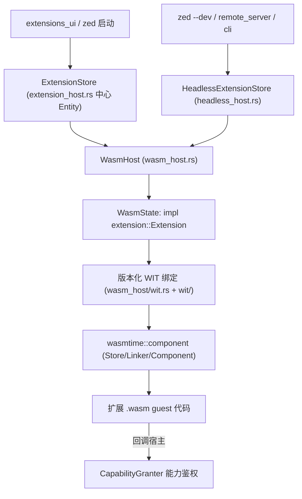
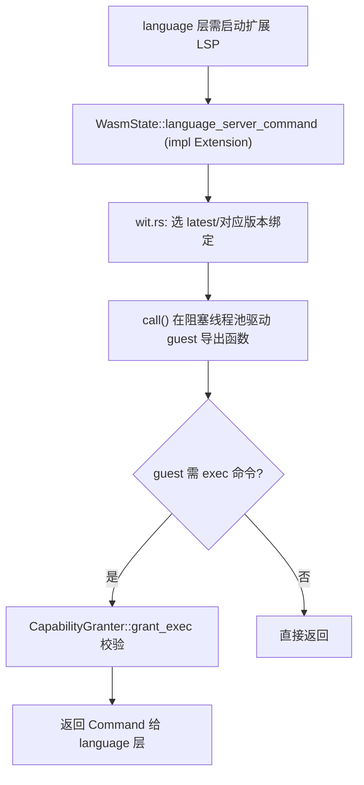

# Extension Host 深挖（Wasmtime 组件宿主 · 版本化 WIT · 能力授权 · Headless）

> 返回 [Home](Home) · [Module-Index](Module-Index)
>
> 概览见 [Extension-System.md](Extension-System.md)；扩展**生态/API 层**（`extension_api`、`ExtensionManifest`、`ExtensionStore` 市场、扩展 UI）见 [Extension-Deep-Dive.md](Extension-Deep-Dive.md)。本页聚焦 **`extension_host` crate 的运行时内核**——把第三方扩展编译成的 Wasm 组件加载、链接、调用、鉴权、热更新。所有符号均来自 `grep`/`read` 确证（`文件:行号`）。

## 1. 分层总览

`extension_host` 是"进程内沙箱"：Rust 侧实现宿主（host），第三方扩展以 Wasm 组件形式运行，二者通过 **WIT 接口**跨边界通信，宿主负责引擎缓存、增量编译、能力授权、版本兼容与热重载。

## 2. `extension_host.rs`（89KB · 中心协调器）

| 类型 | 位置 | 角色 |
| --- | --- | --- |
| `struct ExtensionStore` | extension_host.rs:160 | **全局扩展管理器 Entity**（`pub proxy: Arc<ExtensionHostProxy>`161）：本地扩展表、索引、下载/安装/升级/卸载、激活 |
| `struct GlobalExtensionStore` | extension_host.rs:211 | `Entity<ExtensionStore>` 的 `Global` 包装 |
| `enum RemoteClientState` / `RemoteSyncSignal` / `RemoteSyncExtensions` | extension_host.rs:181 / 188 / 239 | 与云端 registry 的同步状态机 |
| `enum ExtensionOperation` | extension_host.rs:194 | 安装/升级/卸载/重建 等操作枚举（UI 进度用） |
| `enum Event` | extension_host.rs:201 | 广播：扩展变更、索引刷新 |
| `struct ExtensionIndex` / `ExtensionIndexEntry` | extension_host.rs:216 / 278 | 远程扩展索引（可安装列表）；子条目 `…ThemeEntry`(284)/`…IconThemeEntry`(290)/`…LanguageEntry`(296) |
| `fn init` | extension_host.rs:314 | 注册全局、订阅设置、启动索引同步；`extension_host_proxy: Arc<ExtensionHostProxy>`(315/366) 注入 |

**生命周期方法**：`install_extension`(824) · `upgrade_extension`(982) · `uninstall_extension`(1013)（下载→解压→`load_extension`→经 proxy 注册语言/语法/主题→写 `Event`）。

## 3. `wasm_host.rs`（39.7KB · Wasmtime 运行时）

| 类型 | 位置 | 角色 |
| --- | --- | --- |
| `struct WasmHost` | wasm_host.rs:48 | 宿主：持有 `wasmtime::Engine`、下载/编译 `.wasm`、`load_extension` 产出 `WasmExtension` |
| `struct WasmExtension` | wasm_host.rs:63 | 一个已加载扩展的句柄（`Arc<WasmState>`） |
| `struct WasmState` | wasm_host.rs:542 | **实现 `extension::Extension` trait**——把 trait 方法调用转发进 Wasm guest；`impl WasmState`(944) |
| `struct IncrementalCompilationCache` | wasm_host.rs:1008 | 磁盘增量编译缓存（加速冷启动，按 WasmHash 命中） |
| `fn load_extension` | wasm_host.rs:643 | 编译组件 + 实例化 guest + 绑定 host imports |
| `async fn call` / `call_with_language_server_status_source` | wasm_host.rs:912 / 884 | 统一入口：在阻塞线程池上驱动一次 guest 导出函数调用（含超时/状态） |
| `wasm_engine` | 由 wit.rs:21 `use super::{WasmState, wasm_engine}` 引用 | 进程级共享 `Engine` 构造 |

## 4. 版本化 WIT（`wasm_host/wit.rs` 49KB + `wit/` 目录）

跨边界契约用 **WIT** 定义并按扩展 API 版本分代，向后兼容旧扩展：

- `wit.rs` 顶部逐代声明模块（wit.rs:1-10）：`since_v0_0_1`、`since_v0_0_4`、`since_v0_0_6`、`since_v0_1_0`、`since_v0_2_0`、`since_v0_3_0`、`since_v0_4_0`、`since_v0_5_0`、`since_v0_6_0`、`since_v0_8_0`，其中 `use since_v0_8_0 as latest;`(24)。
- `wit/`（10 项）为各版本 `.wit` 接口文件；宿主按 manifest 声明的 `api version` 选择绑定代。
- 关键生成类型：`zed::extension::lsp::*`(36)、`context_server::ContextServerConfiguration`(35)、`slash_command::{…Completion, …Output}`(39)、`dap::StartDebuggingRequestArgumentsRequest`(19)、`LanguageServerConfig`(41)。
- 运行时依赖 `wasmtime::{Store, component::{Component, Linker, Resource}}`(26-29)。
- 边界类型直接复用其它 crate：`task::{DebugScenario, SpawnInTerminal, TaskTemplate, ZedDebugConfig}`(17)（见 [Task-System-Deep-Dive](Task-System-Deep-Dive.md)）、`dap::DebugRequest`(11)、`lsp::LanguageServerName`(15)。

## 5. `capability_granter.rs`（4.8KB · 能力沙箱）

guest 想执行进程/网络等敏感操作时，宿主先经此鉴权：

| 符号 | 位置 | 角色 |
| --- | --- | --- |
| `struct CapabilityGranter` | capability_granter.rs:7 | 持 `granted_capabilities: Vec<ExtensionCapability>` + `manifest` |
| `fn new` | capability_granter.rs:13 | 用已授予能力构造 |
| `fn grant_exec` | capability_granter.rs:23 | 校验命令是否被 `manifest.allow_exec` 且 `ExtensionCapability::ProcessExec(..).allows(...)` 覆盖，否则 `bail` |

能力以 `ExtensionCapability`（来自 `extension` crate）表达，用户在授权弹窗里勾选后持久化到 `ExtensionSettings`。

## 6. `headless_host.rs`（29.2KB · 无 UI 宿主）

供 `zed`（CLI `--dev`/扩展开发）、`remote_server`、`cli` 复用同一 `WasmHost`，但走磁盘/同步而非 GPUI 实体：

| 符号 | 位置 | 角色 |
| --- | --- | --- |
| `struct ExtensionVersion` | headless_host.rs:30 | id + channel + 语义版本 |
| `struct HeadlessExtensionStore` | headless_host.rs:40 | 无头存储；`new`(63)/`sync_extensions`(102)/`install_extension`(512)/`handle_sync_extensions`(621)/`handle_install_extension`(662) |
| `struct LoadedExtension` | headless_host.rs:52 | 已加载扩展记录 |

`extension_settings.rs`(2.5KB)：`ExtensionSettings`（启用/禁用、授予能力、自动更新），作为 store 的 `Global` 设置输入。

## 7. 契约来源（`extension` crate）

`extension_host` 实现的是 `extension` 侧定义的抽象：

- `trait Extension`（extension/src/extension.rs:50）：`manifest`(52)/`work_dir`(55)/`language_server_command`(62)/`language_server_initialization_options`(70)/`labels_for_completions`(115)/`labels_for_symbols`(121)/`complete_slash_command_argument`(127)…——**由 `WasmState` 实现并转发进 guest**。
- `struct ExtensionHostProxy`（extension/src/extension_host_proxy.rs:26）：扩展注册回调的中转（`ExtensionLanguageProxy`/`ExtensionGrammarProxy` 等，extension_host.rs:19 引入），把扩展贡献的语言/语法/主题/命令登记回 `language`/`theme` 等全局注册表。

## 8. 一次「调用扩展提供的 LSP 命令」流程

## 9. 集成 / 相关页

- 上层生态/API：[Extension-Deep-Dive.md](Extension-Deep-Dive.md)（`extension_api`、`ExtensionManifest`、市场 `ExtensionStore`/UI）。
- 消费方：`language`（LSP/grammar）见 [Language-Deep-Dive.md](Language-Deep-Dive.md)；`agent`（context server / slash command）见 [Agent-Deep-Dive.md](Agent-Deep-Dive.md)；任务/DAP 见 [Task-System-Deep-Dive.md](Task-System-Deep-Dive.md)、[Debugger-Deep-Dive.md](Debugger-Deep-Dive.md)；`remote_server` 见 [Remote-Deep-Dive.md](Remote-Deep-Dive.md)。
- 概览：[Extension-System.md](Extension-System.md)
- 导航：[Home](Home) · [Module-Index](Module-Index)
