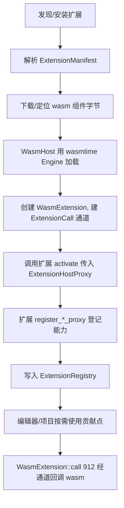

# Extension System（Wasm 扩展 / wasmtime 宿主 / 能力注册）

Zed 的扩展以 **WebAssembly** 形式加载运行，宿主用 **wasmtime 组件模型**。三个 crate 协作：[`extension`](../crates/extension)（宿主侧抽象与能力代理）、[`extension_api`](../crates/extension_api)（扩展作者 SDK / WIT 接口）、[`extension_host`](../crates/extension_host)（下载、编译、运行 wasm）。

## 1. 职责划分

| crate | 关键类型 | 位置 | 职责 |
|---|---|---|---|
| `extension` | `Extension` trait | [`extension.rs:50`](../crates/extension/src/extension.rs) | 扩展的统一接口（`manifest()` 等） |
| `extension` | `ExtensionHostProxy` | [`extension_host_proxy.rs:26`](../crates/extension/src/extension_host_proxy.rs) | 扩展向宿主**注册各类能力**的总入口 |
| `extension` | `ExtensionManifest` | `extension_manifest.rs` | 扩展元数据（id、版本、依赖、贡献点） |
| `extension` | `ExtensionBuilder` | `extension_builder.rs` | 宿主侧把 proxy 装配成可调用对象 |
| `extension_api` | WIT/生成绑定 | [`extension_api.rs`](../crates/extension_api/src/extension_api.rs) | 扩展作者编译进 wasm 的接口（含 `http_client`、`process`、`settings`） |
| `extension_host` | `WasmHost` | [`wasm_host.rs:48`](../crates/extension_host/src/wasm_host.rs) | 持有 wasmtime `Engine`、加载组件 |
| `extension_host` | `WasmExtension` | [`wasm_host.rs:63`](../crates/extension_host/src/wasm_host.rs) | 单个扩展实例，经 `ExtensionCall` 通道串行调用 |
| `extension_host` | `ExtensionRegistry` | [`extension_host.rs:1059`](../crates/extension_host/src/extension_host.rs) | 全局已激活扩展及其贡献（grammar/theme/LSP…） |

## 2. 扩展能贡献什么（能力面）

`ExtensionHostProxy` 暴露一组 `register_*_proxy`，几乎覆盖 Zed 所有可扩展点：

| 注册方法 | 贡献内容 |
|---|---|
| `register_language_proxy`(L71) | 新语言、语法高亮规则 |
| `register_grammar_proxy`(L67) | Tree-sitter grammar（`.wasm`） |
| `register_language_server_proxy`(L75) | LSP 服务器配置与启动 |
| `register_theme_proxy`(L63) | 主题/图标主题 |
| `register_snippet_proxy`(L79) | 代码片段 |
| `register_context_server_proxy`(L83) | MCP 上下文服务器 |
| `register_debug_adapter_proxy`(L87) | DAP 调试适配器 |
| `register_language_model_provider_proxy`(L93) | AI 模型 Provider（见 [Agent-and-AI.md](Agent-and-AI.md)） |

扩展在自己的 `activate` 里调用这些 proxy，把实现登记到宿主；`ExtensionRegistry` 汇总后，`project`/`workspace` 等即可发现并使用。

## 3. 加载与调用流程

关键点：
- **引擎共享**：`wasm_engine()`（wasm_host.rs:557）用 `OnceLock` 缓存全局 wasmtime `Engine`，避免重复初始化编译配置。
- **串行调用**：`WasmExtension` 持 `tx: UnboundedSender<ExtensionCall>`（L64），所有进入 wasm 的调用经此通道排队，保证扩展内单线程语义；`call::<T,Fn>()`（L912）是泛型入口，`call_with_language_server_status_source`（L884）等是其带上下文的特化。
- **状态**：`WasmState`（L542）保存 manifest、wasm 内存（`WasmBuffer`）与资源表（`ResourceTable`，跨边界对象句柄）。

## 4. 权限与沙箱

扩展能力经 [`capability_granter.rs`](../crates/extension_host/src/capability_granter.rs) 授予：wasm 只能走宿主提供的 `ExtensionApi`（`extension_api` 里的 `http_client`、`process`、`settings` 等），无法直接访问文件系统/网络——每次越界请求都要 manifest 声明对应能力，宿主校验后代理执行。`extension_host_proxy.rs` 的 proxy 均经 `RwLock<Option<Arc<dyn ...>>>` 持有，未注册即为 `None`，天然限制扩展能力范围。

## 5. 扩展类型与分发

- **语言扩展**：贡献 grammar + language + LSP（如 Python/Rust 插件）。
- **主题/图标扩展**：只贡献 theme proxy。
- **上下文/调试/模型扩展**：贡献 MCP server、DAP adapter 或 LLM provider。
`ExtensionManifest` 声明这些贡献点与依赖；扩展商店索引由云端提供，本地 `ExtensionRegistry` 维护已激活集合，扩展安装/卸载会触发语言模型注册表与 keymap 的更新（`LanguageModelRegistry::extension_installed`，见 [Agent-and-AI.md](Agent-and-AI.md)）。

## 6. 关键符号速查

| 符号 | 位置 | 作用 |
|---|---|---|
| `Extension` trait | `extension/src/extension.rs:50` | 扩展统一接口 |
| `ExtensionHostProxy` | `extension/src/extension_host_proxy.rs:26` | 能力注册总入口 |
| `register_*_proxy` | `extension_host_proxy.rs:63-93` | 各类贡献点注册 |
| `WasmHost` / `WasmExtension` | `extension_host/src/wasm_host.rs:48`/`63` | wasmtime 宿主 / 扩展实例 |
| `WasmExtension::call` | `wasm_host.rs:912` | 经通道调用 wasm |
| `wasm_engine` | `wasm_host.rs:557` | 全局共享 Engine（OnceLock） |
| `ExtensionRegistry` | `extension_host/src/extension_host.rs:1059` | 已激活扩展与贡献汇总 |
| `capability_granter` | `extension_host/src/capability_granter.rs` | 能力校验与授予 |

## 7. 与其他页面的关系
- 扩展注册的 LLM Provider：[Agent-and-AI.md](Agent-and-AI.md)。
- 扩展贡献的语言 grammar/LSP：[Language-and-Project.md](Language-and-Project.md)。
- 扩展贡献的 DAP adapter：[Debugger.md](Debugger.md)。
- 设置项里的扩展管理页：[Settings-and-Themes.md](Settings-and-Themes.md)。
