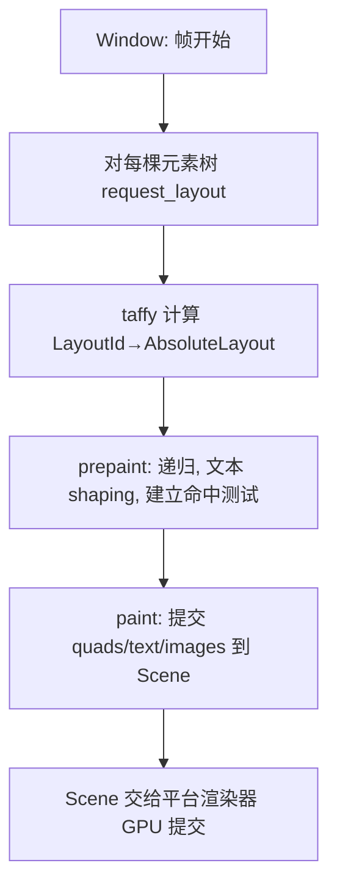

# Deep Reference: gpui

> 参考手册级：`crates/gpui`（Zed 自研 GPU UI 框架）。核心思想：**immediate-mode 元素树 + retained-mode Entity 状态**，单线程主循环 + 三阶段（layout→prepaint→paint）渲染，`Element::request_layout/prepaint/paint` 是其骨架。本页穷举核心类型、trait 生命周期、目录子系统与真实方法锚点。

## 1. 应用 / 上下文句柄
| 类型 | 位置 | 角色 |
|---|---|---|
| `struct App` | [app.rs:680](../crates/gpui/src/app.rs) | **全局状态与调度中心**（单例，主线程）。`new_entity`/`read`/`update`、`spawn`、`defer`、全局 `Global<T>` 存取、事件循环驱动 |
| `struct Context<'a,T>` | [app/context.rs:20](../crates/gpui/src/app/context.rs) | 在某 `Entity<T>` 内操作它的句柄。`subscribe`(L98)、`notify`(L229)、`spawn`(L237)、`on_action`(L735)、`update`/`read`/`defer`、`reserve` |
| `struct AsyncApp` / `Context::spawn` | [app/async_context.rs](../crates/gpui/src/app/async_context.rs) | 跨 `.await` 后回到主线程操作实体 |
| `struct TestAppContext` | [app/test_app.rs](../crates/gpui/src/app/test_app.rs) | 测试用（确定性调度，见 gpui-test skill） |
| `struct BenchAppContext` | [app/bench_context.rs](../crates/gpui/src/app/bench_context.rs) | 基准测试（gpui-bench） |
| `struct HeadlessAppContext` | [app/headless_app_context.rs](../crates/gpui/src/app/headless_app_context.rs) | 无窗口渲染 |

## 2. 实体（状态）系统
[app/entity_map.rs](../crates/gpui/src/app/entity_map.rs)
| 类型 | 位置 | 说明 |
|---|---|---|
| `struct Entity<T>` | [L414](../crates/gpui/src/app/entity_map.rs) | 强引用句柄（`Copy`）。`read(cx)`(L464)、`update(cx,f)`(L476)、`downgrade()`→`WeakEntity<T>`(L449)、`entity_id()`(L443) |
| `struct AnyEntity` | [L246](../crates/gpui/src/app/entity_map.rs) | 类型擦除实体（`read`L156、`entity_id`L278、`downgrade`L289） |
| `struct WeakEntity<T>` / `AnyWeakEntity` | entity_map.rs | 弱引用，防环 |
| `struct EntityId` | entity_map.rs | 内部 slot id |
- 状态更新：`cx.notify()` 标脏 → 帧调度重绘/重跑观察。观察用 `cx.observe`/`cx.subscribe_in`。
- `trait Render`（[element.rs:163](../crates/gpui/src/element.rs)）：`fn render(&mut self, window, cx)->impl IntoElement`——**View** 的渲染入口。
- `trait SingletonView`（view.rs）：进程级唯一视图（如某些 modal 宿主）。

## 3. `Element` 生命周期（框架骨架）
[element.rs](../crates/gpui/src/element.rs)
```rust
pub trait Element: IntoElement {           // L51
    fn id(&self) -> Option<ElementId>;      // L65  缓存键
    fn request_layout(&mut self, w, cx) -> LayoutId; // L73  度量(交给 taffy)
    fn prepaint(&mut self, w, cx);          // L83  二次布局/命中准备
    fn paint(&mut self, w, cx);             // L95  提交 Scene 绘制项
}
pub trait IntoElement { fn into_element(self) -> Self::Element; } // L145
pub trait Render { fn render(...) }         // L163  View
pub trait RenderOnce { fn render(self, w, cx) } // L179 一次性元素
pub trait ParentElement { fn children(&mut self)->&mut Vec<AnyElement>; fn with_children(...)} // L188
pub struct AnyElement(ArenaBox<dyn ElementObject>); // L588 类型擦除元素（arena 分配）
```
**三阶段流程**：

元素状态跨帧缓存靠 `id()`（相同 id 复用 `request_layout` 结果），这是 GPui 的 "retained 元素树 + immediate 描述" 混合模型。

## 4. `Window`：一帧的宿主
[window.rs:1144](../crates/gpui/src/window.rs)（321KB）。持有当前 `Scene`、`LayoutIds`、focus 栈、hitbox 树、input 路由。关键能力：
- 根渲染：`replace_root_view(AnyView)`、`draw` 帧内调度。
- 布局/绘制：`with_element`、`postpaint`。
- 输入：`handle Keystroke/MouseEvent`，经 focus → `on_action`/`interactive`。
- 坐标系：`Pixels`(geometry.rs:2677)、`Point<T>`(L85)、`Size<T>`(L396)、`Bounds<T>`(L723)、`corners`/`edges`（geometry.rs）。
- 无障碍：[window/a11y.rs](../crates/gpui/src/window/a11y.rs)（`struct Window` 的 accessibility 树，`AccessibilityId`）。
- 提示/菜单：[window/prompts.rs](../crates/gpui/src/window/prompts.rs)。

## 5. 声明式样式 / 交互
| 符号 | 位置 | 说明 |
|---|---|---|
| `trait Styled` | [styled.rs:22](../crates/gpui/src/styled.rs) | `div().text_sm().bg(...).size_4()` 全部链式样式方法（`styled.rs`+`style.rs`） |
| `struct Style` / `StyleRef` | [style.rs](../crates/gpui/src/style.rs)(54KB) | flexbox 样式模型（taffy 对齐） |
| `trait InteractiveElement` | [elements/div.rs:750](../crates/gpui/src/elements/div.rs) | `on_click`/`on_mouse_down`/`hover`/`track_...` |
| `trait StatefulInteractiveElement` | div.rs | 带 `&mut Entity` 状态的回调 |
| `trait Focusable` | [window.rs:701](../crates/gpui/src/window.rs) | 可聚焦元素（`FocusHandle`、键盘事件路由） |
| `struct Div` / `div()` | div.rs | 唯一内置容器元素（flex/grid） |
| `trait StyledText` | styled.rs | `RichText`、文本内联点击/hover |
| `trait FluentActions` / `Action` | [action.rs:117](../crates/gpui/src/action.rs) | `div().on_action(cx.listener(...))`；`Action` 是可序列化的命令对象 |

## 6. 内置元素（elements/）
[`elements/`](../crates/gpui/src/elements)：`div`(布局容器)、` anchored`(弹窗锚定 `Anchor`/`Overlap`)、` list`(虚拟列表 `ListState`/`UniformListState`)、` table`、` image`(`Image`/`AnyImage`)、` svg`、` canvas`、` surface`、` deferred`(离屏/`Deferred`)、` corner_radius`、` opaque`、` percentage_ext`。

## 7. 文本系统（text_system/）
[`text_system.rs`](../crates/gpui/src/text_system.rs)(42KB)+[`text_system/`](../crates/gpui/src/text_system)：
- `TextSystem`、`Style`（`Font`/`FontId`/`FontSize`/line height）。
- `LineLayout`/`ShapedLine`/`LineWrapper`：文本 measure/wrap/shaping（font-kit/核心文本）。editor 的 `DisplayMap` 输出交给它做 pixel 布局。
- `FontFeatures`、fallback 链。

## 8. 输入 / 键盘映射
| 符号 | 位置 | 说明 |
|---|---|---|
| `struct KeyContext` | [keymap/context.rs:10](../crates/gpui/src/keymap/context.rs) | 上下文栈（`"editor && !terminal"` 表达式） |
| `struct Keymap` / `Binding` | [keymap.rs](../crates/gpui/src/keymap.rs)(35KB)+[keymap/](../crates/gpui/src/keymap) | 键→`Action` 映射、`use_key_context` |
| `Keystroke`/`Modifier`/`KeyId` | [input.rs](../crates/gpui/src/input.rs) | 归一化键输入 |
| key dispatch | [key_dispatch.rs](../crates/gpui/src/key_dispatch.rs)(61KB) | pending keystrokes 匹配、which-key 数据来源 |
| mouse/scroll/gestures | [gestures.rs](../crates/gpui/src/gestures.rs)(91KB) | 拖拽/点击计数/track mouse |

## 9. 几何 / 颜色 / 动画
- geometry.rs(121KB)：`Point`/`Size`/`Bounds`/`Pixels`/`Degrees`/`Corners`/`Edges`/`Axis`/`SharedString`/`MonoOrFrac`/`Path`/`Vector`。
- color.rs(30KB)：`Rgba`/`Hsla`/`Opaque`/`black`/命名色；`Colors`（主题色板，见 [Settings-and-Themes.md](Settings-and-Themes.md)）。
- spring.rs(27KB)：`Animation`/`Spring`/`SpringParams` 物理动画。
- scene.rs(31KB)：`Scene`=`PaintQuad`/`PaintText`/`PaintImage`/`PaintPath`/`PaintSurface` 的绘制指令集合，交给平台后端。

## 10. 平台与渲染后端
`Platform` trait 与 `current_platform` 选择后端详见 [GPUI-Platform-Backends.md](GPUI-Platform-Backends.md)：macOS(Metal)/Windows(DirectX)/Linux(X11·Wayland·Headless, wgpu via [gpui_wgpu](GPUI-Platform-Backends.md))/Web/Test。`platform.rs`(108KB) 定义 `trait Platform`、`trait Window`（平台窗口）、`HeadlessWindow`。
- `Application`（[app.rs](../crates/gpui/src/app.rs) `application` 子模块）：`Application::new().run(|cx| ...)` 启动。
- executor：[executor.rs](../crates/gpui/src/executor.rs)（`BackgroundExecutor`、spawn 本地/全局）。
- asset：[asset_cache.rs](../crates/gpui/src/asset_cache.rs)/[assets.rs](../crates/gpui/src/assets.rs)（`Assets` trait、图标/字体）。

## 11. 与其它 Deep 页
- 编辑器元素实现：[Editor-Deep-Dive.md](Editor-Deep-Dive.md)。
- 平台后端：[GPUI-Platform-Backends.md](GPUI-Platform-Backends.md)。
- 概览：[GPUI.md](GPUI.md)、[GPUI-Internals.md](GPUI-Internals.md)。
