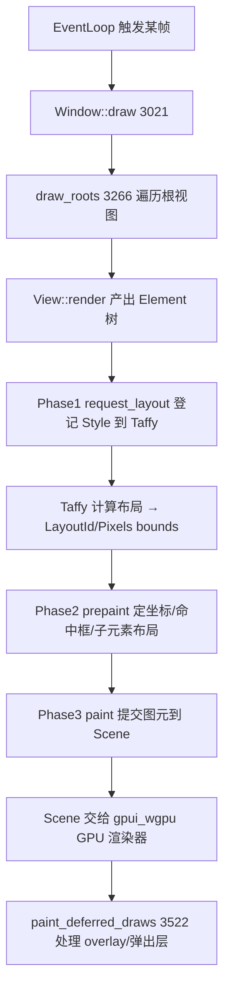

# GPUI Internals（事件循环 / 布局 / 绘制 / 实体系统）

本页深入 [GPUI.md](GPUI.md) 背后的实现机制：程序如何跑起来、界面怎么从"树"变成"像素"、事件与 Action 如何分发、`Entity`/`Context` 的拥有权模型。源码全部在 [`crates/gpui/src`](../crates/gpui/src)，跨平台部分拆到 `gpui_macos`/`gpui_linux`/`gpui_windows`/`gpui_wgpu` 等兄弟 crate。

## 1. 关键类型与文件

| 类型 | 位置 | 职责 |
|---|---|---|
| `App` | [`app.rs:680`](../crates/gpui/src/app.rs) | 全局应用状态：实体表、执行器、平台句柄 |
| `Application::run` | [`app.rs:231`](../crates/gpui/src/app.rs) | 事件循环入口，转交 `platform.run` |
| `Context<'a, T>` | [`app/context.rs:20`](../crates/gpui/src/app/context.rs) | 某实体内的一次可变更新上下文 |
| `Entity<T>` | [`app/entity_map.rs:414`](../crates/gpui/src/app/entity_map.rs) | 实体强句柄，`entity_id`(L443) |
| `AnyEntity::downcast` | [`entity_map.rs:299`](../crates/gpui/src/app/entity_map.rs) | 类型擦除句柄向下转型 |
| `EventEmitter<E>` | [`gpui.rs:296`](../crates/gpui/src/gpui.rs) | 可发事件的实体标记 |
| `Render` / `RenderOnce` | [`element.rs:163/179`](../crates/gpui/src/element.rs) | 视图渲染契约 |
| `Element` trait | [`element.rs:51`](../crates/gpui/src/element.rs) | 三阶段：`request_layout`(L73)/`prepaint`(L83)/`paint`(L95) |
| `Window` | [`window.rs:1144`](../crates/gpui/src/window.rs) | 单窗口绘制/事件/命中测试调度 |
| `LayoutId` | [`taffy.rs:385`](../crates/gpui/src/taffy.rs) | 布局节点（内部是 taffy `NodeId`） |
| `Scene` | [`scene.rs:41`](../crates/gpui/src/scene.rs) | 一帧收集到的全部绘制图元 |
| `Style` | [`style.rs:180`](../crates/gpui/src/style.rs) | 声明式样式（flex/绝对定位等） |
| `Pixels` | [`geometry.rs:2677`](../crates/gpui/src/geometry.rs) | 物理像素坐标单位 |

## 2. 事件循环（App 如何跑起来）

`Application::run(on_finish_launching)`（app.rs:231）本身不写循环，而是把启动闭包交给平台后端：`platform.run(Box::new(...))`（L237）。真正的"泵事件"由 `Platform` 实现（`gpui_macos`/`gpui_linux`/`gpui_windows`）在其原生事件循环里驱动——每次回调进入 `App`（`this.borrow_mut()`，L238）执行一帧的更新/绘制。`App` 持 `foreground_executor`(L296/L689) 与 `background_executor`(L291)，异步 `Task` 完成后回到前台执行器排队更新。`run_embedded`（L252）用于宿主自带事件循环的场景（如 Wasm、嵌入原生 App）。`quit`（L1029）退出。

> 所有权模型见 [`_ownership_and_data_flow.rs`](../crates/gpui/src/_ownership_and_data_flow.rs)：状态放进 `Entity`，靠 `Context`/`App` 借用而非 `&mut self`，避免渲染树的数据竞争。

## 3. 一帧的渲染管线（树 → 像素）

`Window::draw`（window.rs:3021）是每帧入口，`draw_roots`（L3266）自顶向下走视图树。每个 `Element` 严格走三阶段：
1. **request_layout**（element.rs:73）：把 `Style` 塞进 Taffy 布局引擎，拿回 `LayoutId`（taffy.rs:385，内部即 taffy 的 `NodeId`）。布局是 flexbox/grid 语义（[taffy.rs](../crates/gpui/src/taffy.rs)）。
2. **prepaint**（element.rs:83）：布局已定，计算自身 bounds、注册 `Frame`/命中测试区域、对子元素递归布局。
3. **paint**（element.rs:95）：把矩形（`paint_quad` window.rs:4265）、路径（`paint_path` L4336）、文字（走 `TextSystem`）、图片等图元写入本帧 `Scene`（scene.rs:41）。

`Scene` 汇总所有图元后交给 GPU 后端（`gpui_wgpu`）合成上屏。overlay/菜单等"浮在顶层"的内容延后到 `paint_deferred_draws`（L3522）单独一层绘制，保证 z 序。

## 4. 实体系统与事件（Entity / EventEmitter）

- 状态载体是 `Entity<T>`（entity_map.rs:414）：`cx.new(|cx| ...)` 创建、`entity.update(cx, |this, cx| ...)` 修改。句柄可 `downcast`（L299）从 `AnyEntity` 还原具体类型。
- 发事件：实体实现 `EventEmitter<E>`（gpui.rs:296）后 `cx.emit(e)` 广播；订阅方用 `cx.subscribe(&entity, |_, _, event, cx| ...)`，返回的 `Subscription`（[subscription.rs:150](../crates/gpui/src/subscription.rs)）析构即自动退订。这套是 Workspace/Editor 等所有响应式逻辑的基础。
- `Context<'a, T>`（app/context.rs:20）是"在实体 T 内部更新"的能力凭证：既能 `notify`（请求重绘自己），也能 `window`/`cx.new`/`spawn`。

## 5. 输入与 Action 分发

键盘/鼠标事件先到 `Window`，再经 keymap 翻译成 `Action`：

- `dispatch_keystroke_observers`（window.rs:2350）/ `dispatch_keystroke_interceptors`（L2374）处理原始按键。
- keymap 匹配（[keymap.rs](../crates/gpui/src/keymap.rs) + [key_dispatch.rs](../crates/gpui/src/key_dispatch.rs)）把键序列解析成一个 `&dyn Action`，沿焦点路径 `dispatch_action_on_node`（L6030）冒泡分发。
- 视图用 `on_action`（window.rs:6446 / key_dispatch.rs:333）注册某 Action 的处理器；`on_action_when`（L6466）带条件。`ViewContext::dispatch_action`（L628）/`Window::dispatch_action`（L2336）供代码主动触发。
- 鼠标命中依赖 prepaint 阶段登记的 `Frame`，`interactive.rs`/`gestures.rs` 把点击/拖拽/滚轮转成事件与 Action。

## 6. 关键符号速查

| 符号 | 位置 | 作用 |
|---|---|---|
| `Application::run` | `gpui/src/app.rs:231` | 启动事件循环 |
| `App::foreground_executor` | `app.rs:296` | 前台异步执行器 |
| `Window::draw` | `window.rs:3021` | 单帧绘制入口 |
| `Window::draw_roots` | `window.rs:3266` | 遍历根视图渲染 |
| `Element::request_layout` | `element.rs:73` | 布局阶段 |
| `Element::prepaint` | `element.rs:83` | 定位/命中登记 |
| `Element::paint` | `element.rs:95` | 提交图元 |
| `LayoutId` | `taffy.rs:385` | Taffy 布局节点 |
| `Scene` | `scene.rs:41` | 一帧图元集合 |
| `Entity<T>` | `app/entity_map.rs:414` | 实体强句柄 |
| `EventEmitter` | `gpui.rs:296` | 事件广播能力 |
| `Subscription` | `subscription.rs:150` | RAII 退订句柄 |
| `Window::on_action` | `window.rs:6446` | 注册 Action 处理 |

## 7. 与其他页面的关系
- 上层视图/三阶段用法示例见 [GPUI.md](GPUI.md)。
- `Item`/`Pane` 把视图接入应用外壳：[Workspace-Pane-Dock.md](Workspace-Pane-Dock.md)。
- `Element` 自定义绘制实例（终端网格）：[Terminal.md](Terminal.md)。
- Picker 的 `Render` + `EventEmitter`：[Picker-and-Commands.md](Picker-and-Commands.md)。
