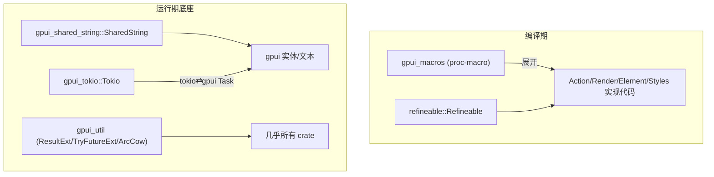

# GPUI 宏与工具底座深挖（proc-macro · Refineable 样式 · SharedString · Tokio 桥 · gpui_util）

> 返回 [Home](Home) · [Module-Index](Module-Index)
>
> 本页是**参考手册级**，覆盖支撑 `gpui` 的一组基础库：`gpui_macros`（过程宏）、`refineable`（样式级联合并）、`gpui_shared_string`（intern 字符串）、`gpui_tokio`（异步桥接）、`gpui_util`（通用工具）。它们与 [GPUI-Deep-Dive](GPUI-Deep-Dive.md)、[GPUI-Platform-Backends-Deep-Dive](GPUI-Platform-Backends-Deep-Dive.md) 互补。所有符号均来自 `grep`/`read` 确证（`文件:行号`）。

## 1. 分层总览

## 2. `gpui_macros`（过程宏 · `crates/gpui_macros/src/`）

入口文件 `gpui_macros.rs` 声明全部宏，展开逻辑分散在各 `derive_*.rs` / `styles.rs` / `test.rs`：

| 宏 | 位置 | 展开为 / 作用 |
| --- | --- | --- |
| `#[derive(Action)]` | gpui_macros.rs:19 → derive_action.rs | 为事件结构体实现 `Action`（`name`/`action_type`/属性 `#[action(...)]`） |
| `register_action!` | gpui_macros.rs:28 → register_action.rs `generate_register_action`(15) | 把 Action 绑定到 keymap context |
| `#[derive(IntoElement)]` | gpui_macros.rs:34 → derive_into_element.rs | 视图结构体 → `Element`（用于 `component`） |
| `#[derive(Render)]` | gpui_macros.rs:41 (derive_render.rs) | 生成 `Render::render` 样板 |
| `#[derive(AppContext)]` | gpui_macros.rs:58 → derive_app_context.rs | 为 `App`/`Context` 包装类型暴露 `.app`/`.cx`（属性 `#[app]`） |
| `#[derive(VisualContext)]` | gpui_macros.rs:91 → derive_visual_context.rs | 同理暴露 `.window`/`.cx`（属性 `#[window]`/`#[app]`） |
| `#[gpui::test]` | test.rs `generate_test_function`(119) | 驱动 `TestAppContext`，支持 `seed`/`seeds(..)`/`iterations`/`retries`/`on_failure`（文档见 gpui_macros.rs:151-181） |
| `#[gpui::bench]` | bench.rs | Criterion 风格基准测试宏 |
| property_test | property_test.rs | 随机属性测试宏（seed 驱动） |
| `#[derive(Reflection)]` 类 | derive_inspector_reflection.rs `generate_reflected_trait`(40) | 为 Inspector 反射类型字段 |

### 样式方法生成（`styles.rs` 51KB）

`style_helpers`/`visibility_style_methods`/`margin_style_methods`/`padding_style_methods`(gpui_macros.rs:99/105/111/117) 是 `macro_rules!`-级拼接；核心生成器：`generate_box_style_methods`(531)/`generate_methods`(589)/`generate_predefined_setter`(623)/`generate_custom_value_setter`(665)——把 `margin`/`padding`/`size`/`text_*` 等批量展开成 `StyleRefinement` 上的链式 setter，供 `div().ml_2()` 等使用。

## 3. `refineable`（样式级联合并 · refineable.rs 5.3KB）

`Styled` 系统的"增量覆盖"底座——把 `base` 样式与多层 `refinement` 合并：

| 符号 | 位置 | 角色 |
| --- | --- | --- |
| `trait Refineable` | refineable.rs:29 | `type Refinement: Refineable`，定义 `refine(&mut self, other: Option<Self::Refinement>)` |
| `trait IsEmpty` | refineable.rs:66 | refinement 是否为空（跳过合并） |
| `struct Cascade<S>` | refineable.rs:82 区 | 级联合并器；`reserve()`(100) 申请槽位、`base()`(109)、`set(slot, refin)`(117)、`merged()`(125) 计算最终样式 |

`gpui` 的 `Style`/`StyleRefinement`、`text::TextStyle` 等都实现 `Refineable`，由 `Cascade` 在布局前合并"基础 + 内联 + 主题"多层样式。

## 4. `gpui_shared_string`（intern 字符串 · 4.7KB）

| 符号 | 位置 | 角色 |
| --- | --- | --- |
| `struct SharedString(SmolStr)` | gpui_shared_string.rs:15 | 廉价 `Clone` 的字符串（小串内联 `SmolStr`），GPUI/实体系统里到处用作 key/label |
| `fn new(impl AsRef<str>)` | gpui_shared_string.rs:32 | 构造 |
| `fn as_str()` | gpui_shared_string.rs:37 | 借用 `&str` |
| `Deref<Target=str>` | :18 | 当 `str` 用 |

## 5. `gpui_tokio`（异步桥 · 3.1KB）

GPUI 前台 `Task` 与 tokio 后台运行时的互操作：

| 符号 | 位置 | 角色 |
| --- | --- | --- |
| `struct Tokio` | gpui_tokio.rs:50 | 持有 `tokio::runtime::Handle` 的 `Global` |
| `fn init` / `init_from_handle` | :12 / :28 | 创建/复用 tokio 运行时并注册 |
| `fn spawn` / `spawn_result` | :55 / :77 | 在 tokio 线程池跑 `Future`，结果回投为 `gpui::Task` |
| `fn handle(cx)` | :97 | 取共享 `Handle` |

## 6. `gpui_util`（通用工具 · lib.rs 21KB + arc_cow.rs）

被绝大多数 crate `use` 的地基工具：

| 符号 | 位置 | 角色 |
| --- | --- | --- |
| `trait ResultExt` | lib.rs:215 | `.log_err()` / `.context()` 增强 `Result`（链式 `LogErrorFuture`445） |
| `trait TryFutureExt` / `TryFutureExtBacktrace` | lib.rs:349 / 368 | `.log_err()` 让失败 future 打印日志 |
| `fn log_err` | lib.rs:331 | 记录 error 返回 |
| `fn new_std_command` / `get_powershell` / `get_windows_system_shell` | lib.rs:22/31 / 36 / 141 | 跨平台命令构造（Windows 隐藏控制台等） |
| `fn post_inc` | lib.rs:153 | 原子/普通自增 |
| `fn measure` | lib.rs:159 | 简单计时代码段 |
| `fn some_or_debug_panic` | lib.rs:191 | 调试期 panic 便利 |
| `struct ArcCow<T>` | arc_cow.rs | `Arc`/独占可写 Copy-on-write 容器 |

## 7. 相关页

- 主体：[GPUI-Deep-Dive.md](GPUI-Deep-Dive.md)（`App`/`Window`/`Element`/`Context` 生命周期）、[GPUI-Platform-Backends-Deep-Dive.md](GPUI-Platform-Backends-Deep-Dive.md)。
- 消费方：`ui` 组件库、`editor` 样式（`Cascade`/`Refineable`）、`gpui_test` 测试基建。
- 概览：[GPUI.md](GPUI.md) · [GPUI-Internals.md](GPUI-Internals.md)
- 导航：[Home](Home) · [Module-Index](Module-Index)
