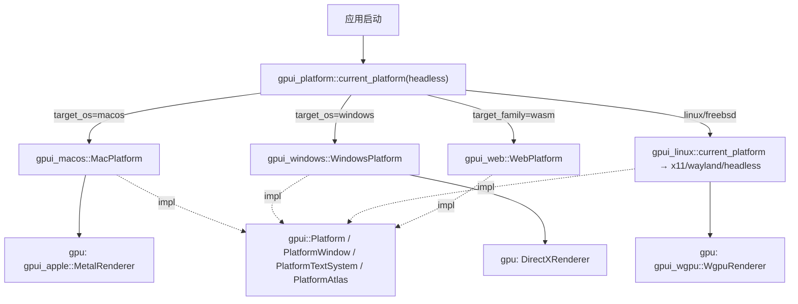
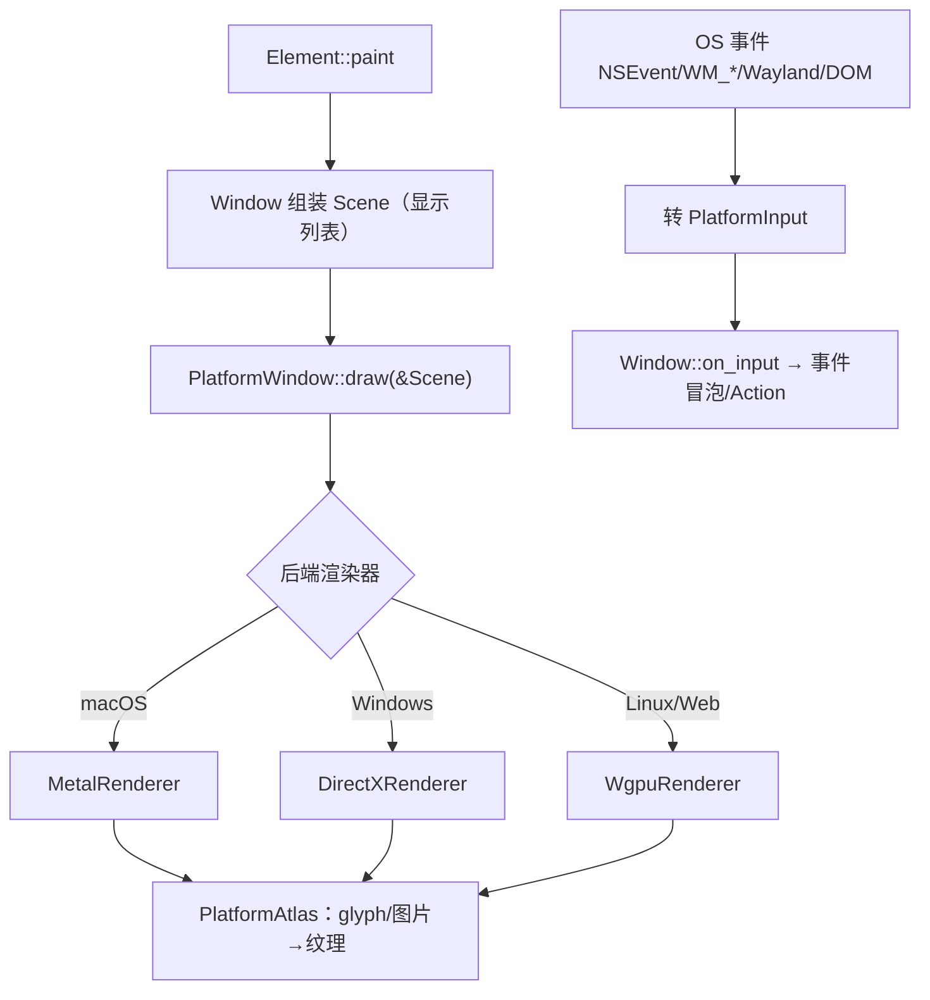

# GPUI 平台后端深挖（跨平台抽象 · macOS/Windows/Linux/wgpu/Web）

> 返回 [Home](Home) · [Module-Index](Module-Index)
>
> 概览见 [GPUI-Platform-Backends.md](GPUI-Platform-Backends.md)；GPUI 框架总览见 [GPUI.md](GPUI.md)、内部机制见 [GPUI-Internals.md](GPUI-Internals.md)、核心深页见 [GPUI-Deep-Dive.md](GPUI-Deep-Dive.md)。本页是**函数/类型级参考手册**，讲清 `gpui` 如何用一组 `trait` 抽象 OS，再由 `gpui_macos`/`gpui_windows`/`gpui_linux`/`gpui_wgpu`/`gpui_apple`/`gpui_web` 各自实现，以及 `gpui_platform` 如何按 `#[cfg]` 选后端。所有符号均来自 `grep`/`read` 确证（`文件:行号`）。

## 1. 分层与后端选择

`gpui_platform/src/gpui_platform.rs`（唯一"无需 `#[cfg]`"的入口）：

| 函数 | 行 | 作用 |
| --- | --- | --- |
| `fn current_platform(headless: bool) -> Rc<dyn Platform>` | 57 | 按 `#[cfg(target_os=...)]` 构造对应平台对象；macOS→`MacPlatform::new`、Windows→`WindowsPlatform::new`、Linux→`gpui_linux::current_platform`、wasm→`WebPlatform::new` |
| `fn application() -> gpui::Application` | 13 | `Application::with_platform(current_platform(false))`；wasm 下走 `application_with_web_backend` |
| `fn headless()` | 23 | 无窗口后端（测试/基准） |
| `fn background_executor()` | 9 | 取平台后台线程池 |
| `fn current_headless_renderer()` | 85 | 仅 macOS 提供 `MetalHeadlessRenderer`（bench/test-support） |

## 2. `gpui` 抽象层（`crates/gpui/src/platform.rs` · 3114 行）

四个核心 `trait` 构成"OS 契约"，各后端 `impl`：

| trait | 行 | 职责（关键方法） |
| --- | --- | --- |
| **`trait Platform`** | 126 | 进程/窗口/系统服务：`background_executor`/`foreground_executor`/`text_system`(127-129)、`run`/`quit`/`restart`/`activate`/`hide`(131-137)、`displays`/`primary_display`/`active_window`/`window_stack`(139-144)、`open_window(handle, WindowParams)->Box<dyn PlatformWindow>`(162)、`window_appearance`/`set_window_appearance`(169/179)、`open_url`/`prompt_for_paths`/`reveal_path`(186-201)、`on_quit`/`on_reopen`/`on_system_wake`(203-205)、移动生命周期 `on_app_lifecycle`/`on_memory_warning`(216/222)、`set_menus`/`set_dock_menu`(231/236)、`screen_capture_sources`(150) |
| **`trait PlatformWindow`** | 816 | 单窗口：`bounds`/`content_size`/`resize`/`scale_factor`(817-822)、`mouse_position`/`modifiers`(825-827)、`set_input_handler`(828)、`prompt`/`activate`/`minimize`/`zoom`/`toggle_fullscreen`(835-853)、事件回调 `on_request_frame`/`on_input`/`on_resize`/`on_close`/`on_appearance_changed`(857-866)、**`draw(&Scene)`**(868)、**`sprite_atlas()->Arc<dyn PlatformAtlas>`**(870)、`is_subpixel_rendering_supported`(871)、一组长尾 macOS 专有默认方法（tab/traffic light 等，873+） |
| **`trait PlatformTextSystem`** | 1077 | 字体度量/排版抽象（`Send + Sync`）：各后端用 CoreText / DirectWrite / Cosmic 实现 |
| **`trait PlatformAtlas`** | 1331 | 精灵图集（把 glyph/图片打包成 GPU 纹理） |
| `trait PlatformHeadlessRenderer` | 998 | 离屏渲染到图像（视觉测试用） |

平台无关几何/显示列表（`gpui/src/`）：`struct Scene`(scene.rs:41 GPU 帧内容/显示列表)、`struct Bounds<T>`(geometry.rs:723)、`struct Pixels`(geometry.rs:2677)、`struct Window`(window.rs:1144)、`struct App`(app.rs:680)、`trait Element`(element.rs:51)、`trait Action`(action.rs:117)。

> 关键设计：`gpui` 核心只发**平台无关 `Scene` 显示列表**，经 `PlatformWindow::draw(&Scene)` 交给后端渲染器；文本/图集也通过 trait 注入。所以同一套 UI 代码在四大 OS + wasm 上行为一致。

## 3. `gpui_macos` + `gpui_apple`（Cocoa / Metal）

- `platform.rs`（61KB）：`struct MacPlatform`(167) = `Mutex<MacPlatformState>` + `MainThreadMarker`（强制主线程访问 AppKit）；`impl Platform`(481)。
- `window.rs`（137KB）：`NSWindow`/`NSView` 封装、`PlatformWindow` 实现、标题栏/全屏/tab。
- `text_system.rs`（33KB）：CoreText 实现的 `PlatformTextSystem`。
- 其余：`display_link.rs`（VSync 帧驱动）、`pasteboard.rs`（18KB 剪贴板/拖放）、`keyboard.rs`（39KB 键映射）、`events.rs`（24KB NSEvent→`PlatformInput`）、`dispatcher.rs`（`MacDispatcher`：`RunLoop` 任务/定时器）、`display.rs`（`NSScreen`）、`screen_capture.rs`（`SCStream` 录屏）、`gpui_macos.rs`（模块装配）。
- **`gpui_apple`**（Metal 渲染器，被 macos 后端持有）：`struct MetalRenderer`(metal_renderer.rs:112) 实现 `draw(&Scene)`、`metal_atlas.rs`（`PlatformAtlas` 的 Metal 实现）、`shaders.metal`（50KB MSL 着色器：矩形/图片/glyph/下划线/阴影）。

## 4. `gpui_windows`（Win32 / DirectX 11 + DirectWrite）

| 文件 | 关键类型 | 角色 |
| --- | --- | --- |
| `platform.rs`（56KB） | `WindowsPlatform`(34)、`WindowsPlatformInner`(56)、`WindowsPlatformState`(65) | `impl Platform`；注册窗口类、DPI、消息循环 |
| `window.rs`（60KB） | `WindowsWindow`(35, `Rc<WindowsWindowInner>`)、`WindowsWindowState`(45)、`WindowsWindowInner`(93) | `PlatformWindow`（HWND、`WM_*`、拖放 `WindowsDragDropHandler` 1095） |
| `directx_renderer.rs`（73KB） | `DirectXRenderer`(39)、`DirectXRendererDevices`(61) | DXGI/D3D11 呈现 `Scene` |
| `directx_atlas.rs`（14KB） / `directx_devices.rs` | — | 精灵图集 / 设备与工厂 |
| `direct_write.rs`（76KB） | DirectWrite 文字系统 | `PlatformTextSystem`（`TextRenderer` 1382 栅格化 glyph） |
| `keyboard.rs`（11KB） | `WindowsKeyboardLayout`(17)、`WindowsKeyboardMapper`(22) | LCID→`Keystroke` |
| `events.rs`（65KB） | 窗口过程 | `WM_*`→`PlatformInput` |
| `dispatcher.rs` | `WindowsDispatcher`(28) | 主线程任务队列 + `MessageOnly` 窗口唤醒 |
| 其它 | `clipboard.rs`(13KB)、`vsync.rs`、`display.rs`、`direct_manipulation.rs`(12KB 触摸/手势)、`alpha_correction.hlsl`/`shaders.hlsl`/`color_text_raster.hlsl`（HLSL 着色器） | 系统服务 |

## 5. `gpui_linux`（X11 / Wayland / Headless）

`linux/platform.rs`：`struct LinuxPlatform
`(229) **泛型于窗口系统后端 `P`**，`gpui_linux::current_platform(headless)` 探测环境后选择具体后端：

- `linux/wayland/`（8 项）：Wayland 后端（`xdg-shell`、`wlr-layer-shell`、IM/文本输入）。
- `linux/x11/`（6 项）：X11 后端（Xlib/XCB 窗口与输入）。
- `linux/headless/`：无显示器后端（CI/测试）。
- `linux/dispatcher.rs`（12KB）：基于 `async-io`/信号管道的任务唤醒；`keyboard.rs`、`xdg_desktop_portal.rs`（6KB 沙箱下门户对话/通知）、`system_notifications.rs`。
- 文本：复用 `gpui_wgpu` 的 **CosmicText**（`cosmic_text_system.rs`）。

## 6. `gpui_wgpu`（跨平台 wgpu 渲染器 + Cosmic 文本）

Linux（及 Web/其它）GPU 呈现层：

| 类型/文件 | 行 | 角色 |
| --- | --- | --- |
| `struct WgpuRenderer` | wgpu_renderer.rs:206 | 用 wgpu 绘制 `Scene`（矩形/图片/path/glyph） |
| `struct WgpuSurfaceConfig` | 112 | 表面/格式配置 |
| `wgpu_atlas.rs`（17KB） / `wgpu_context.rs`（22KB） | — | `PlatformAtlas` / 设备-队列-表面封装 |
| `cosmic_text_system.rs`（49KB） | — | `PlatformTextSystem`（CosmicText/fontique 跨平台排版） |
| `shaders.wgsl`（52KB）/`shaders_webgl.wgsl`/`shaders_subpixel.wgsl` | — | WGSL 着色器 |

## 7. `gpui_web`（浏览器 / WASM）

`platform.rs`（30KB）：`struct WebPlatform`（`impl Platform`）+ `enum WebBackendPreference`（`Auto`/指定）；`new`/`new_with_backend` 供 `gpui_platform` 调用，附 `fetch_http_client`（`http_client.rs` 10KB 基于 `fetch`）、`init_logging`（`logging.rs`）。`window.rs`（33KB）用 DOM/Canvas 实现 `PlatformWindow`；`events.rs`（60KB）DOM 事件→`PlatformInput`；`ime_mirror.rs`（27KB）隐藏可编辑元素镜像以支持 IME；`dispatcher.rs`（15KB 基于 `requestAnimationFrame`/微任务）。渲染走 `gpui_wgpu` 的 WebGL 后端。

## 8. 渲染与事件流水线

## 9. 集成 / 相关页

- 桌面入口 `crates/zed` 调 `gpui_platform::application()`；`App`/`Window` 由 `gpui` 核心驱动，仅依赖本页 trait。
- 无头/视觉测试：`PlatformHeadlessRenderer`(998) + macOS `MetalHeadlessRenderer`；Linux `headless` 后端供 CI。
- 相关深页：[GPUI-Deep-Dive.md](GPUI-Deep-Dive.md)、[GPUI-Internals.md](GPUI-Internals.md)、[Editor-Deep-Dive.md](Editor-Deep-Dive.md)、[Terminal-Deep-Dive.md](Terminal-Deep-Dive.md)（ConPTY/portable_pty）、[Remote-Deep-Dive.md](Remote-Deep-Dive.md)（headless 后端；原 `remote_server` 已移除）。
- 导航：[Home](Home) · [Module-Index](Module-Index)