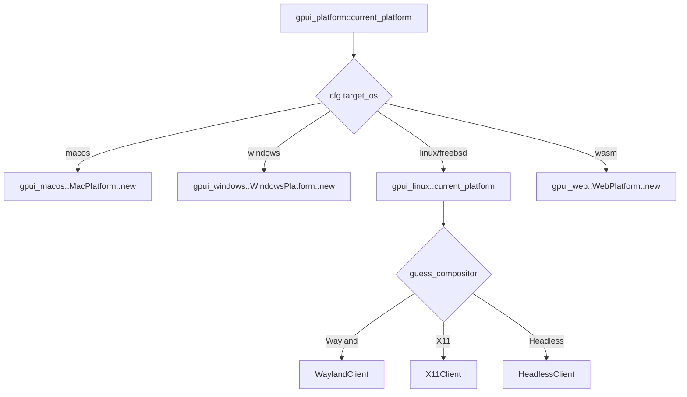

# GPUI Platform Backends（跨平台后端与渲染器）

本页解释 [GPUI-Internals.md](GPUI-Internals.md) 中"事件循环委托给 platform"背后，**各 OS 后端如何被选择与实现**。核心是 `gpui::Platform` trait 的多份实现 + 渲染器实现，由 [`gpui_platform`](../crates/gpui_platform) 在编译期按 `cfg` 装配。

## 1. 选择点：gpui_platform
[`gpui_platform.rs`](../crates/gpui_platform/src/gpui_platform.rs) 的 `current_platform(headless) -> Rc<dyn Platform>`（[L57](../crates/gpui_platform/src/gpui_platform.rs)）：

同文件还提供 `application()`(L13)、`headless()`(L23)、`background_executor()`(L9)，以及 wasm 专属 `application_with_web_backend`/`single_threaded_web`/`web_init`(L31/42/51) 与 `current_headless_renderer`（macOS Metal，L85）。

## 2. 各后端 `impl Platform`

| 后端 crate | 平台结构 | impl 位置 | 事件循环 / 图形 |
|---|---|---|---|
| [`gpui_macos`](../crates/gpui_macos) / [`gpui_apple`](../crates/gpui_apple) | `MacPlatform(Mutex<MacPlatformState>, MainThreadMarker)` | [`platform.rs:481`](../crates/gpui_macos/src/platform.rs)（结构 [L167](../crates/gpui_macos/src/platform.rs)） | Cocoa runloop + Metal |
| [`gpui_windows`](../crates/gpui_windows) | `WindowsPlatform` | [`platform.rs:408`](../crates/gpui_windows/src/platform.rs)（结构 [L34](../crates/gpui_windows/src/platform.rs)、`new` [L110](../crates/gpui_windows/src/platform.rs)） | Win32 消息循环 + DirectX |
| [`gpui_linux`](../crates/gpui_linux) | `LinuxPlatform { inner }` | `current_platform`（[linux.rs:30](../crates/gpui_linux/src/linux.rs)） | X11 / Wayland / Headless 客户端 |
| [`gpui_web`](../crates/gpui_web) | `WebPlatform` | [`platform.rs:290`](../crates/gpui_web/src/platform.rs)（结构 [L30](../crates/gpui_web/src/platform.rs)） | Wasm + WebGPU/Canvas |
| （gpui 内）`test`/`visual_test` | `TestPlatform` / `VisualTestPlatform` | [`gpui/src/platform/test/platform.rs:351`](../crates/gpui/src/platform/test/platform.rs) / [visual_test.rs:67](../crates/gpui/src/platform/visual_test.rs) | 无头测试平台 |

`Platform` trait 要求实现的能力（见 [GPUI-Internals.md](GPUI-Internals.md)）：`run`（进入本地事件循环）、创建/管理 window、剪贴板、光标、键盘映射、屏幕/缩放、绘制回调调度等。

- **Linux** 用内部 `enum`-like 的 `inner`（`WaylandClient`/`X11Client`/`HeadlessClient`）经 `gpui::guess_compositor()`（linux.rs:40）在运行时择一。
- **Windows** 的 `DirectX` 渲染与 `windows_resources`（图标/manifest）配合；`no_webrtc` 等构建开关影响其依赖（见 [Building-on-Windows.md](Building-on-Windows.md)）。
- **macOS** 强依赖 `MainThreadMarker`（保证主线程）+ `metal_renderer`。

## 3. 渲染器（`GpuRenderer` 的另一维）
[GPUI-Internals.md](GPUI-Internals.md) 的三阶段绘制最终把 `Scene`（图元）交给平台渲染器。存在两套渲染后端：

- **原生**：macOS Metal（`gpui_macos::metal_renderer`）、Windows DirectX（`gpui_windows`）。
- **跨平台 [`gpui_wgpu`](../crates/gpui_wgpu)**：基于 wgpu。
  | 符号 | 位置 | 作用 |
  |---|---|---|
  | `struct WgpuRenderer` | [`wgpu_renderer.rs:206`](../crates/gpui_wgpu/src/wgpu_renderer.rs) | `impl` GPUI 渲染器 |
  | `struct WgpuSurfaceConfig` | [L112](../crates/gpui_wgpu/src/wgpu_renderer.rs) | 表面配置 |
  | `struct WgpuContext` | [`wgpu_context.rs:9`](../crates/gpui_wgpu/src/wgpu_context.rs) | device/queue 封装 |
  | `struct WgpuAtlas` / `WgpuTextureInfo` | [`wgpu_atlas.rs:24`](../crates/gpui_wgpu/src/wgpu_atlas.rs) / [L42](../crates/gpui_wgpu/src/wgpu_atlas.rs) | 纹理图集（glyph/图片） |

## 4. 编译期/宏支撑
- [`gpui_macros`](../crates/gpui_macros)：`impl_actions!`、`derive RegisterAction`、`Styled`/`render` 相关宏（把 Action 与 keymap、element builder 关联）。
- [`gpui_shared_string`](../crates/gpui_shared_string)：`SharedString` intern，减少文本内存与克隆成本。
- [`gpui_tokio`](../crates/gpui_tokio)：`App`/`Context` 上运行 tokio future 的桥。
- [`gpui_util`](../crates/gpui_util)：面向 UI 的通用辅助（格式化、聚焦、`FormatDistance` 等）。

## 5. 与其他页面的关系
- 上层事件循环/实体系统：[GPUI-Internals.md](GPUI-Internals.md)。
- 启动时如何进入 `Application::run`：[Startup-Flow.md](Startup-Flow.md)。
- Windows 构建细节与依赖裁剪：[Building-on-Windows.md](Building-on-Windows.md)。
