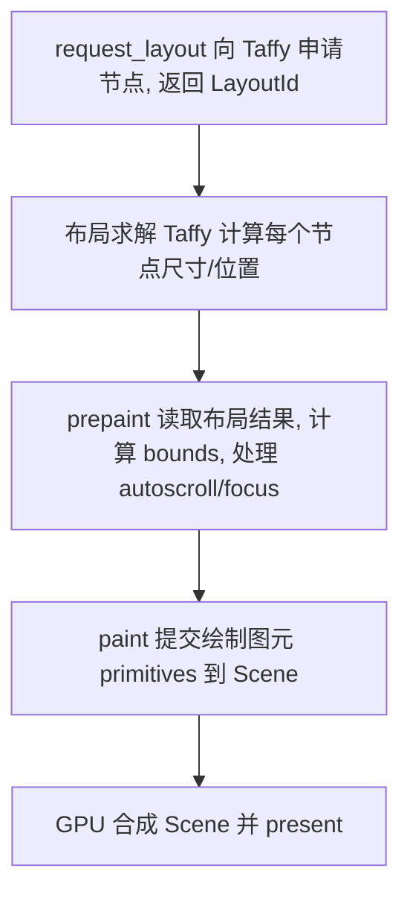
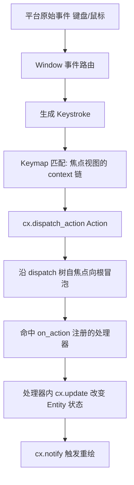

# GPUI（UI 框架：渲染三阶段 / 事件 / Action 分发）

GPUI 是 Zed 自研的 GPU 加速 UI 框架，位于 [`crates/gpui`](../crates/gpui)。它定义了 Zed 全部的界面组合方式、状态模型与事件循环。

## 1. 核心概念与类型

| 类型 | 文件 | 作用 |
|---|---|---|
| `Application` | `app.rs` | 应用对象，持有平台后端；`run(closure)` 启动事件循环 |
| `App` | `app.rs` | 主线程 UI 状态句柄（旧名 `ModelContext`）；一切 `cx` 的根 |
| `AppContext` | `app.rs` | trait，`App` 与 `Context<T>` 共享的上下文能力 |
| `Entity<T>` | `entity.rs` | 对某个组件/视图实例的句柄（引用计数 + 可更新） |
| `Context<T>` | `context.rs` | 在更新某个 `Entity<T>` 时使用的上下文 |
| `Window` | `window.rs` | 单个窗口（321KB，含绘制、焦点、输入路由） |
| `Element` / `IntoElement` / `Render` | `element.rs` / `view.rs` | UI 元素与视图抽象 |
| `Action` | `action.rs` | 可分发的"命令"（菜单项、键位绑定都落到 Action） |
| `Task<T>` | `task.rs` / `executor.rs` | 与事件循环协作的异步任务 |
| `Global` / `UpdateGlobal` | `global.rs` | 全局单例注册（启动流程大量使用） |

## 2. 元素模型：`Element` trait 的三阶段渲染

真实定义（[`element.rs` L51](../crates/gpui/src/element.rs)）：

```rust
pub trait Element: 'static + IntoElement {
    type RequestLayoutState;   // request_layout 产出，被后两阶段复用
    type PrepaintState;
    fn request_layout(&mut self, ...) -> (LayoutId, Self::RequestLayoutState);
    fn prepaint(&mut self, ..., state: &mut Self::RequestLayoutState) -> Self::PrepaintState;
    fn paint(&mut self, ..., state: &mut Self::RequestLayoutState, prepaint: Self::PrepaintState);
}
```

三阶段（一帧内自顶向下 + 自底向上组合）：



- **request_layout**：把样式（`style.rs`/`taffy.rs`）转成 Taffy flexbox 节点，返回 `LayoutId`。此时还不知道最终像素位置。
- **prepaint**：布局完成后可读真实边界（`Bounds`），用于文本测量、圆角裁剪、`AnyElement` 焦点分配（见 `element.rs` 中 `Drawable` 的 `phase` 状态机 L297–457）。
- **paint**：产出图元（矩形/文字/图片/路径），追加进 `Scene`（`scene.rs`），最终交给 `gpui_wgpu` 渲染器合成上屏。

`IntoElement`→`Element` 的转换由 `#[derive(Render)]`（`gpui_macros`）与 `view.rs` 的 `Render` 驱动：一个"视图"（如 `Editor`）实现 `Render`，被包裹成 `AnyView` 后作为元素参与上述三阶段。

## 3. 状态模型与并发

- **单线程 UI 状态**：`Entity<T>` 的读写只能在主线程通过 `Context<T>`：
  - `cx.update(|this, cx| ...)` / `entity.update(cx, |..|)`：变更状态；
  - `cx.notify()`：标脏，触发该视图在下一帧重新 `render`；
  - `cx.read(cx)` / `entity.read(cx)`：只读访问。
- **异步**：`cx.spawn(async move |cx| ...)` 返回 `Task`，`.detach()` 后即弃；跨线程回来后仍用 `update` 落回主线程。`AsyncApp` 是供异步上下文安全持有的 `App` 句柄。
- **后台执行器**：`app.background_executor()` / `cx.background_executor()` 跑与 UI 无关的计算（启动流程里的 `system_id()` 等即如此）。
- **全局单例**：`T::set_global(value, cx)` / `T::global(cx)`（`Global`/`UpdateGlobal`），是 Zed 服务注入的主方式（见 [Startup-Flow](Startup-Flow.md) 阶段 F）。

## 4. 事件与 Action 分发

输入自平台进入 GPUI 后，最终统一映射为 **Action**（键位/菜单/命令面板都指向同一个 Action 类型）。



- **键位映射**：`keymap.rs` + `assets/keymaps/`，`Keymap::bindings` 把 `Keystroke` 解析成 `Action`；`handle_keymap_file_changes`（启动阶段）负责热更新。
- **上下文（context）**：Action 只在特定"焦点上下文"（如 `workspace`、`editor`、`vim_mode`）下可触发，用于命令面板的启用/禁用与键位作用域（`key_dispatch.rs`、`command_palette_hooks`）。
- **注册处理**：视图用 `cx.on_action(cx, |view, action: &SomeAction, window, cx| ...)` 或 `cx.listen(...)` 订阅；分发时沿元素树的 `AnyView` 链向父级冒泡直到被处理。
- **交互元素**：`interactive.rs` 提供 `div().on_click(...)`、`on_action`、焦点句柄 `FocusHandle`，把回调挂到 `Element` 的 `prepaint/paint` 阶段。

## 5. 与平台后端的关系

- `gpui` 只定义 trait 与跨平台逻辑；实际窗口/事件源/渲染由各平台 crate 提供：`gpui_windows`、`gpui_linux`、`gpui_macos`（`gpui_platform::current_platform()` 选择）。
- 渲染后端 `gpui_wgpu`（wgpu）把 `Scene` 图元批次化为 GPU 绘制命令；`media.rs` 管理 GPU 资源。
- 这也是 Zed 桌面端对工具链敏感（如 Windows 需 MSVC）的根因层——见 [Building on Windows](Building-on-Windows.md)。
