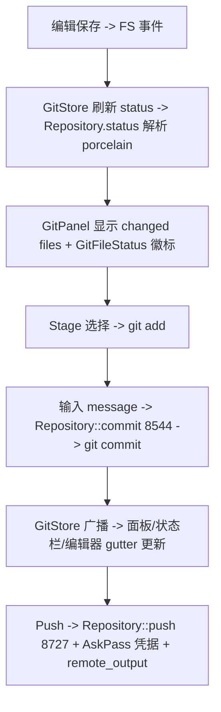

# Deep Reference: git (git / project::git_store / git_ui / git_ui_core)

> 参考手册级：Git 集成四层——`crates/git`（**纯 git 操作/状态解析**，`repository.rs` 239KB、`status.rs`）、`crates/project/src/git_store.rs`（**`GitStore`/`Repository` 权威状态 `Entity`**，供全项目共享，见 [Project-Deep-Dive.md](Project-Deep-Dive.md)）、`crates/git_ui`（**面板/图/差异视图**，`git_panel.rs` 572KB + `git_graph.rs` 294KB）、`crates/git_ui_core`（**可复用的 diff/worktree 组件**）。底层 shell out 真实 `git` CLI（非 libgit2）。→ 概览 [Git-Integration.md](Git-Integration.md)。

## 1. `crates/git`：状态与解析
### 状态 [`status.rs`](../crates/git/src/status.rs)
| 类型 | 位置 | 角色 |
|---|---|---|
| `struct GitFileStatus`/`enum FileStatus` | [status.rs:10](../crates/git/src/status.rs) | 一个文件的跟踪/暂存状态（组合位标志） |
| `struct TrackedStatus` / `UnmergedStatus` | [L31](../crates/git/src/status.rs)/[L18](../crates/git/src/status.rs) | 已跟踪（index/worktree 各一 `StatusCode`）/冲突（`UnmergedStatusCode` L24） |
| `enum StatusCode` / `enum StageStatus` | [L37](../crates/git/src/status.rs)/[L60](../crates/git/src/status.rs) | 增/删/改/重命名；暂存/未暂存/两者 |
| `struct TrackedSummary` / `GitSummary` | [L286](../crates/git/src/status.rs)/[L351](../crates/git/src/status.rs) | 计数汇总（ahead/behind/insertions/deletions） |
| `struct GitStatus` | [L431](../crates/git/src/status.rs) | 一次状态快照（条目表） |
| `enum DiffTreeType` / `struct TreeDiff` / `TreeDiffStatus` | [L501](../crates/git/src/status.rs)/[L516](../crates/git/src/status.rs)/[L521](../crates/git/src/status.rs) | 两棵树间 diff（用于图/分支对比） |
| `struct DiffStat` / `GitDiffStat` | [L571](../crates/git/src/status.rs)/[L577](../crates/git/src/status.rs) | +/- 行数统计 |
### 仓库对象 [`repository.rs`](../crates/git/src/repository.rs)(239KB) 与工具
| 类型 | 位置 | 角色 |
|---|---|---|
| `struct Branch` / `Upstream` / `UpstreamTracking` | [L233](../crates/git/src/repository.rs)/[L431](../crates/git/src/repository.rs)/[L467](../crates/git/src/repository.rs) | 本地/上游分支与追踪状态 |
| `struct Worktree` / `CreateWorktreeTarget` | [L291](../crates/git/src/repository.rs)/[L302](../crates/git/src/repository.rs) | `git worktree`（Zed 用其做"任务工作树"） |
| `struct CommitData` / `InitialGraphCommitData` / `CommitDataReader` | [L100](../crates/git/src/repository.rs)/[L112](../crates/git/src/repository.rs)/[L140](../crates/git/src/repository.rs) | 流式解析 `git log`（提交图） |
| `struct CommitOptions` | [L459](../crates/git/src/repository.rs) | 提交参数 |
| `struct Oid` | [git.rs:180](../crates/git/src/git.rs) | 对象 id（40 hex） |
| `struct RenameBranch` / `RestoreFile` / `enum RunHook` | [git.rs:153](../crates/git/src/git.rs)/[L165](../crates/git/src/git.rs)/[L403](../crates/git/src/git.rs) | 参数化操作 |
### blame / commit / 托管 / 远端
| 类型 | 位置 | 角色 |
|---|---|---|
| `struct Blame` / `BlameEntry` | [blame.rs:17](../crates/git/src/blame.rs)/[L196](../crates/git/src/blame.rs) | `git blame` 结果（行→提交）；编辑器 gutter 用（[Editor-Deep-Dive.md](Editor-Deep-Dive.md)） |
| `struct ParsedCommitMessage` | [commit.rs:11](../crates/git/src/commit.rs) | 拆分 subject/body/co-authored |
| `trait GitHostingProvider` / `struct GitHostingProviderRegistry` | [hosting_provider.rs:79](../crates/git/src/hosting_provider.rs)/[L162](../crates/git/src/hosting_provider.rs) | 生成 PR/commit **permalink**（github/gitlab/… 实现在 `crates/git_hosting_providers`） |
| `struct PullRequest` / `GitRemote` / `parse_git_remote_url` | [L15](../crates/git/src/hosting_provider.rs)/[L21](../crates/git/src/hosting_provider.rs)/[L240](../crates/git/src/hosting_provider.rs) | 远端解析 |
| `struct RemoteUrl` | [remote.rs:10](../crates/git/src/remote.rs) | 远端 URL 包装 |
`stash.rs`：`git stash` 支持。

## 2. `crates/project/src/git_store.rs`：权威状态 `Entity`
| 类型 | 位置 | 角色 |
|---|---|---|
| `struct GitStore` | [git_store.rs:101](../crates/project/src/git_store.rs) | **一个 worktree 的 git 权威 `Entity`**（`Project.git_store`）；监听 FS、缓存状态、协调冲突；`status()`(L233)、`checkpoint()`(L2133) |
| `struct GitStoreCheckpoint` | [L488](../crates/project/src/git_store.rs) | agent「检查点」基线（配合 [Agent-Deep-Dive.md](Agent-Deep-Dive.md) 回滚） |
| `struct Repository` | [L680](../crates/project/src/git_store.rs) | **对一个 `.git` 的封装**（真正的操作入口）：`status()`(L6296)、`show()`(L7152)、`commit()`(L8544)、`push()`(L8727)、`pull()`(L8815)、`create_worktree()`(L9190)、`checkpoint()`(L9853)、`add`/`stage`/`checkout_branch`/`list_branches`/`blame`… |
`GitStore` 聚合多个 `Repository`（嵌套仓库/子模块），向 UI/编辑器广播 `GitStoreEvent`（状态变更、提交完成）。→ [Project-Deep-Dive.md](Project-Deep-Dive.md)。

## 3. `crates/git_ui`：面板与视图
| 文件 / 类型 | 大小 | 角色 |
|---|---|---|
| `struct GitPanel`（[git_panel.rs:1103](../crates/git_ui/src/git_panel.rs)）`impl Item` | 572KB | 侧栏 dock `Item`：changed files 树、stage/unstage、提交框、分支、`GitPanelSettings`；订阅 `GitStore` |
| `git_graph.rs` | 294KB | **提交历史图**（自绘 DAG，滚动加载 `CommitDataReader`） |
| `project_diff.rs` | 73KB | "全部改动"多缓冲 diff 视图（跨文件，`impl Item`/`SearchableItem`） |
| `commit_view.rs` | 56KB | 单提交详情（diff 逐文件展开、permalink） |
| `branch_picker.rs` / `git_picker.rs` / `stash_picker.rs` / `worktree*` | 127KB/… | 分支/stash 选择器 |
| `conflict_view.rs` | 25KB | **三方合并冲突解决 UI**（ours/theirs/both） |
| `text_diff_view.rs` / `staged_diff.rs` / `unstaged_diff.rs` / `solo_diff_view.rs` / `diff_multibuffer.rs` | | 内联/分栏差异 |
| `blame_ui.rs` | 30KB | blame gutter 悬浮详情 |
| `clone.rs` / `commit_modal.rs` / `commit_tooltip.rs` / `repository_selector.rs` / `remote_output.rs` | | clone 弹窗、提交确认、仓库切换、push/pull 输出 |
| `git_ui.rs` | 49KB | `actions!`（`Git`/`Stage`/`Unstage`/`Commit`/`Pull`/`Push`/`ToggleGitPanel`/`Blame`…）与 `init` |
| `git_panel_settings.rs` | | 面板设置 |

## 4. `crates/git_ui_core`：可复用组件
| 类型 | 位置 | 角色 |
|---|---|---|
| `struct FileDiffView` | [file_diff_view.rs:32](../crates/git_ui_core/src/file_diff_view.rs) | 单文件 diff 渲染（`buffer_diff` 上层，被 editor gutter/其它复用） |
| `struct WorktreeService`/`RemoteBranchName`/`WorktreeCreateTarget`/`CreatedWorktreeWorkspace` | [worktree_service.rs:37](../crates/git_ui_core/src/worktree_service.rs).. | 创建/切换 `git worktree` 并打开其 Workspace |
| `struct WorktreePicker` | [worktree_picker.rs:42](../crates/git_ui_core/src/worktree_picker.rs) | worktree 选择 |
| `struct AskPassModal` | [askpass_modal.rs:15](../crates/git_ui_core/src/askpass_modal.rs) | git 凭据/2FA 输入（配合 `crates/askpass`） |
| `struct GitPickerPopover` | [git_ui_core.rs:23](../crates/git_ui_core/src/git_ui_core.rs) | 共享弹出容器 |

## 5. 一次提交（真实流程）

## 6. 相关页
概览 [Git-Integration.md](Git-Integration.md)；diff 底座 [Data-Structures.md](Data-Structures.md)、[Multi-Buffer-Deep-Dive.md](Multi-Buffer-Deep-Dive.md)；blame gutter [Editor-Deep-Dive.md](Editor-Deep-Dive.md)；checkpoint 回滚 [Agent-Deep-Dive.md](Agent-Deep-Dive.md)。
