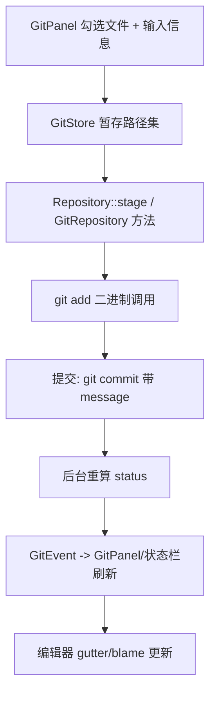

# Git Integration（GitStore / GitRepository / git_ui）

Zed 的 Git 支持分四层：底层 **shell out 到 `git` 二进制**（[`git`](../crates/git)）、项目级 **多仓管理 `GitStore`**（[`project/src/git_store.rs`](../crates/project/src/git_store.rs)）、**托管平台抽象**（[`git_hosting_providers`](../crates/git_hosting_providers)）、以及 **UI 面板**（[`git_ui`](../crates/git_ui)，其 `git_panel.rs` 约 572KB）。

## 1. 分层与核心类型

| 层 | 类型 | 位置 | 职责 |
|---|---|---|---|
| 抽象 | `GitRepository` trait | [`repository.rs:789`](../crates/git/src/repository.rs) | 统一 git 操作接口（异步、`Task`/`BoxFuture`） |
| 实现 | `Repository`（`Entity`） | `git` crate | 用 git 二进制实现 `GitRepository` |
| 管理 | `GitStore` | [`git_store.rs:101`](../crates/project/src/git_store.rs) | 持有 worktree 内全部仓库、活动仓库、状态缓存、事件 |
| 平台 | `GitHostingProvider` trait | [`hosting_provider.rs:79`](../crates/git/src/hosting_provider.rs) | 生成 PR 链接/头像 URL/提交永久链接 |
| UI | `GitPanel` 等 | `git_ui/src/git_panel.rs` | 变更列表、暂存、提交、分支、图 |

`git` crate 按职责拆文件：`repository.rs`（主接口）、`status.rs`、`commit.rs`、`blame.rs`、`stash.rs`、`remote.rs`、`hosting_provider.rs`。

## 2. `GitRepository`：以 git 二进制为后盾

trait 方法全部异步返回 `Task`/`BoxFuture`（避免阻塞主线程），例如（repository.rs）：
- `status(path_prefixes) -> Task<Result<GitStatus>>`（L845，实现 L1894：`git_binary_in_worktree()` + `git_status_args()`）。
- `diff_tree()`(L846)、`stash_entries()`(L848)、`remote_urls()`(L823)、`revparse_batch()`(L826)、`head_sha()`(L831)、`merge_message()`(L843)。

数据模型：`GitStatus`/`FileStatus`（工作区状态）、`CommitData`(L100)/`CommitSummary`(L512)/`CommitDetails`(L522)、`Branch`(L233)、`Upstream`(L431)/`UpstreamTrackingStatus`(L506，ahead/behind)、`BlameEntry`（`blame.rs`）。同一 trait 有 fake 实现供测试。

## 3. `GitStore`：多仓库与状态中枢

[`GitStore`](../crates/project/src/git_store.rs)（L101）由 `Project` 持有：
- `GitStore::local(...)`（L880）为本地 worktree 建立仓库集合；发现 `.git`、维护 `repositories: HashMap<RepositoryId, Entity<Repository>>`（`repositories()`，L3211）。
- `active_repository()`（L1252）：当前活动仓库（按聚焦 buffer 路径推断）。
- `Project` 对外暴露：`git_store()`（[project.rs:7589](../crates/project/src/project.rs)）、`active_repository()`(L6429)、`repositories()`(L6433)。
- 文件监视（`fs`/worktree 事件）触发后台 `status` 重算，产出 `GitEvent` 通知 `git_ui` 刷新变更列表与状态栏分支。

## 4. 一次提交（commit）的调用流程

对应真实机制：`git_ui::commit_view`（`commit_view.rs`）收集要暂存的 `FileStatus` 与提交信息；经 `GitStore` 找到对应 `Repository`，调用其 `GitRepository` 操作（底层是 `git add`/`git commit` 子进程）；完成后异步刷新状态，UI 通过事件订阅更新。冲突处理见 `conflict_view.rs`，diff 预览见 `staged_diff.rs`/`unstaged_diff.rs`/`text_diff_view.rs`。

## 5. Blame 与 gutter

[`git/src/blame.rs`](../crates/git/src/blame.rs) 计算每个 buffer 区间的 `BlameEntry`（commit sha、作者、时间），编辑器在 gutter 显示改动归属、悬浮显示提交详情（`git_ui::blame_ui`）。随 buffer 编辑与 HEAD 变化增量更新。

## 6. 托管平台（PR / permalink）

`GitHostingProvider` trait（hosting_provider.rs:79）定义：`name()`、构建 `PullRequest`(L15) 链接、`GitRemote`(L21)、`BuildPermalinkParams`(L60) 生成"文件某行在某 commit 的永久链接"、`ParsedGitRemote`(L235，owner/repo)。`GitHostingProviderRegistry`（L162）注册多家：GitHub/GitLab/Bitbucket 等在 `git_hosting_providers` crate 提供，`project` 用 remote URL 反查 provider，支撑"在浏览器打开""创建 PR""复制文件链接"。

## 7. 关键符号速查

| 符号 | 位置 | 作用 |
|---|---|---|
| `GitRepository` trait | `git/src/repository.rs:789` | git 操作统一异步接口 |
| `Repository::status`（impl） | `repository.rs:1894` | 调 git 二进制取状态 |
| `GitStore` | `project/src/git_store.rs:101` | 多仓/活动仓/状态缓存 |
| `GitStore::active_repository` | `git_store.rs:1252` | 当前活动仓库 |
| `Project::git_store` | `project/src/project.rs:7589` | 对外访问 GitStore |
| `GitHostingProvider` | `git/src/hosting_provider.rs:79` | PR/permalink/头像链接 |
| `GitPanel` | `git_ui/src/git_panel.rs` | 变更/暂存/提交主面板 |
| `BlameEntry` | `git/src/blame.rs` | 逐行归属信息 |

## 8. 与其他页面的关系
- Git 状态驱动 project panel 图标：[Workspace-Pane-Dock.md](Workspace-Pane-Dock.md)。
- gutter blame 渲染在编辑器：[Editor.md](Editor.md)。
- worktree 文件监视：[Language-and-Project.md](Language-and-Project.md) 第 3 节。
- diff/多缓冲渲染：`multi_buffer`、`buffer_diff`，见 [Editor.md](Editor.md)。
