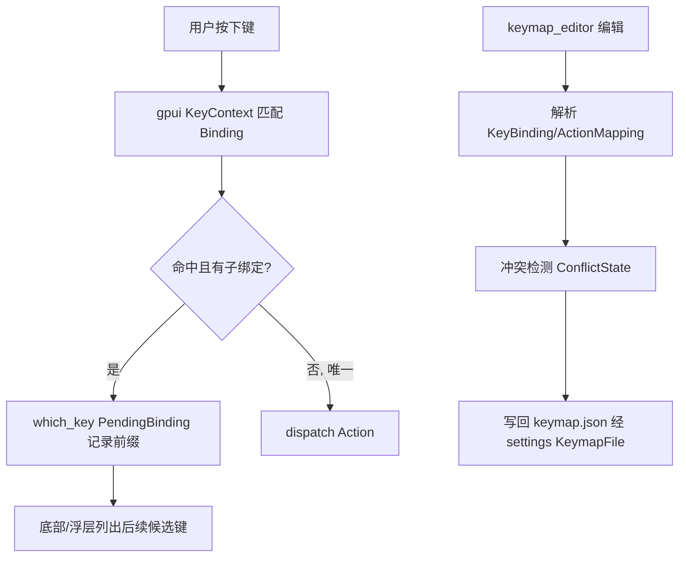

# 键位编辑与导航 深入解析（Deep Dive）

> 本页覆盖"改键 + 键位提示 + 文件/符号导航"三块：`keymap_editor`（可视化编辑 keymap.json 的界面，168KB）、`which_key`（which-key 风格的待输入键位提示浮层）、`file_finder`（模糊文件/历史导航 picker）。关联底座：`gpui` 的 `KeyContext`/`BindingObserver`、`settings` 的 `KeymapFile`、`fuzzy`/`picker`/`paths`。

## 1. 分层设计

- **键位内核**（在 `gpui`+`settings`）：`Keymap` 把 context→keystroke→Action 编成树；`keystroke` 匹配、`BindingObserver` 捕获一段前缀以判定"是否有后续绑定"——这正是 which_key 的基础。
- **可视化编辑层** `keymap_editor`：把当前 context 下生效的所有绑定解析成可搜索/可过滤/可冲突检测的行，提供"录入新键位→写回 keymap.json"。
- **提示浮层** `which_key`：订阅 `cx.on_keystroke`，当用户敲了一个"有后续子绑定"的前缀键，弹出后续可选键与动作名（Vim/Emacs which-key 体验）。
- **导航层** `file_finder`：`Item` + `Picker`，把工作树条目/历史/诊断喂给模糊匹配，Enter 打开文件；与 `project_symbols`/`outline` 并列构成"跳去某处"家族。

## 2. 类型总览

### keymap_editor（keymap_editor.rs，4000+ 行）

| 符号 | 文件:行 | 角色 |
| --- | --- | --- |
| `struct KeymapEditor` | :432 | 主 `Item`/Entity（可视编辑界面） |
| `enum SearchMode` | :192 | 按动作/键位搜索 |
| `enum FilterState` | :217 | 过滤态 |
| `struct SourceFilters` | :233 | 来源（default/user/project）过滤 |
| `struct ActionMapping` | :252 | context→action 映射 |
| `struct KeybindConflict`/`ConflictOrigin`/`ConflictState` | :258/:264/:308 | 冲突检测 |
| `enum PreviousEdit` | :466 | 可撤销的上一次编辑 |
| `struct KeyBinding` | :1748 | 一条解析后的绑定 |
| `struct KeybindInformation` | :1763 | 展示用绑定信息 |
| `struct ActionInformation` | :1782 | 动作元信息 |
| `enum ProcessedBinding` | :1809 | 处理后的绑定分类 |
| `enum KeybindContextString` | :1909 | context 段（context bar 点击） |
| `async fn remove_keybinding(..)` | :3690 | 删除并写回 |
| `struct ActionCompletionProvider` | action_completion_provider.rs | 动作名模糊补全 |

### which_key

| 符号 | 文件 | 角色 |
| --- | --- | --- |
| `fn init(cx)` | which_key.rs:79 | 订阅全局 keystroke |
| `struct PendingBinding` | which_key.rs:16 (`pub(crate)`) | 待展开的键位前缀 |
| `which_key_modal.rs` | (401 行) | 全屏 which-key 浏览 |
| `pending_keystrokes_indicator.rs` | (896 行) | 底部待输入键位指示 |

### file_finder（file_finder.rs，86KB）

| 符号 | 文件:行 | 角色 |
| --- | --- | --- |
| `struct FileFinder` | :66 | 组装 `Picker` 的 Entity |
| `struct FileFinderDelegate` | :357 | `Picker` 回调（搜索/确认） |
| `enum Event` | :846 | `Opened`/`Disconnected` |

## 3. 核心方法与调用锚点

**keymap_editor 解析与编辑（keymap_editor.rs）**
- `KeymapEditor`(:432) 读取当前活动 `KeyContext`，把生效绑定解析为 `KeyBinding`(:1748) 列表，按来源分类成 `ActionMapping`(:252)（区分 default / user / project / extension）。
- `SearchMode`(:192) + `SourceFilters`(:233) 组合过滤；`ActionCompletionProvider` 提供动作名模糊匹配。
- 冲突检测：`KeybindConflict`(:258)/`ConflictOrigin`(:264)/`ConflictState`(:308) 计算同一 keystroke 在相同 context 的多重绑定。
- 编辑落盘：新增/`remove_keybinding`(:3690) 改写 `keymap.json`（经 `settings` 的 `KeymapFile`），`PreviousEdit`(:466) 支持 undo。

**which_key 提示（which_key.rs）**
- `init(cx)`(:79) 注册 `BindingObserver`/keystroke 订阅。当一次按键命中"父绑定但仍有子绑定未决"，`PendingBinding`(:16) 记录该前缀，`pending_keystrokes_indicator` 在状态栏列出候选后续键与 `HumanizedActionName`；`which_key_modal` 提供全量浏览。

**file_finder 导航（file_finder.rs）**
- `FileFinder::new` 建 `Picker` 并把 `FileFinderDelegate`(:357) 交给它；`match_strings` 用 `fuzzy` 对工作树 path 打分，`confirm` 发 `Event::Opened`(:846) 让 workspace 打开文件。它同时支持多目录/多文件选择（`multi_select_tests.rs`）与"最近文件"模式。

## 4. 键位输入与提示流程

## 5. 集成点

- `keymap_editor`/`which_key` 都依赖 `gpui` 的 `Keymap`/`KeyContext`/`BindingObserver` 与 `settings::KeymapFile`；`keymap_editor` 由命令面板 `keymap_editor:Expand` 打开。
- `file_finder` 基于 `picker`+`fuzzy`+`project::Project`（工作树 entry），由 `workspace` Action `file_finder::Toggle` 调起（见 Picker-Family 页）。
- `keymap_editor/action_completion_provider` 复用 `command_palette_hooks` 的动作索引。

## 6. 相关页

- [Picker-Family-Deep-Dive](Picker-Family-Deep-Dive.md)（`file_finder` 依赖的 `Picker`/`fuzzy`）
- [Settings-and-Onboarding-Deep-Dive](Settings-and-Onboarding-Deep-Dive.md)（`KeymapFile`/settings 栈）
- [GPUI-Deep-Dive](GPUI-Deep-Dive.md)（`Keymap`/`KeyContext`/`Action` 内核）
