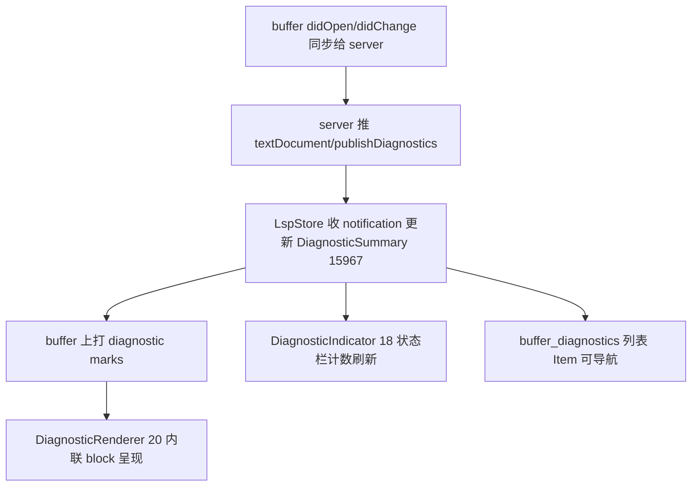

# LSP Features（语言服务器 / 诊断 / 大纲 / 调用层次）

语言智能的调度中枢是 `project` 里的 [`LspStore`](../crates/project/src/lsp_store.rs)（[lsp_store.rs:4488](../crates/project/src/lsp_store.rs)）：它管理所有语言服务器进程，并把"补全/悬停/跳转/格式化/代码操作"等统一成对 LSP 协议的请求。UI 侧散落在 [`diagnostics`](../crates/diagnostics)、[`outline`](../crates/outline)、[`call_hierarchy`](../crates/call_hierarchy)、[`project_symbols`](../crates/project_symbols) 等 crate。协议基础类型来自外部 `lsp` crate（`lsp_types`），封装在 [`crates/lsp`](../crates/lsp)。语言如何绑定到服务器见 [Language-and-Project.md](Language-and-Project.md)。

## 1. 分层职责

| 层 | 类型 | 位置 | 职责 |
|---|---|---|---|
| 服务器实体 | `LanguageServer` | [`lsp.rs:115`](../crates/lsp/src/lsp.rs) | 一个已启动的语言服务器句柄（读写 JSON-RPC） |
| 服务器身份 | `LanguageServerId` / `Name` | [`lsp.rs:154/171`](../crates/lsp/src/lsp.rs) | 进程标识 |
| 可执行文件 | `LanguageServerBinary` | [`lsp.rs:95`](../crates/lsp/src/lsp.rs) | 启动某服务器所需的 path+args+env |
| 选择器 | `LanguageServerSelector` | [`lsp.rs:146`](../crates/lsp/src/lsp.rs) | 按 id 定向请求到某服务器 |
| 调度中心 | `LspStore` | [`lsp_store.rs:4488`](../crates/project/src/lsp_store.rs) | 持有全部服务器，转发 buffer↔server 请求 |
| 命令抽象 | `LspCommand` / `CallHierarchyItem` | [`lsp_command.rs:334`](../crates/project/src/lsp_command.rs) | 把一次 LSP 交互封装为可复用命令 |
| 诊断汇总 | `DiagnosticSummary` | [`lsp_store.rs:15967`](../crates/project/src/lsp_store.rs) | 一个 buffer 的错误/警告/提示统计 |
| 状态栏指示 | `DiagnosticIndicator` | [`items.rs:18`](../crates/diagnostics/src/items.rs) | 底部栏错误/警告计数 |
| 内联呈现 | `DiagnosticRenderer` | [`diagnostic_renderer.rs:20`](../crates/diagnostics/src/diagnostic_renderer.rs) | 把诊断作为 Editor block 画在报错行下 |
| 诊断编辑视图 | `buffer_diagnostics` | [`buffer_diagnostics.rs`](../crates/diagnostics/src/buffer_diagnostics.rs) | 诊断列表 Item（`register` L256、`toggle_warnings` L644） |
| 大纲 | `OutlineView` | [`outline.rs:115`](../crates/outline/src/outline.rs) | 符号树（Tree-sitter + LSP documentSymbol） |

## 2. LspStore：请求的统一出口

`LspStore` 为每个 buffer 解析出对应的 `LanguageServer`（按语言/路径匹配，服务器缺失时按 `LanguageServerBinary` 启动），所有前端操作都汇聚到它的方法：

- [`hover`](../crates/project/src/lsp_store.rs)（L9029）—— 鼠标悬停文档。
- [`completions`](../crates/project/src/lsp_store.rs)（L7640）—— 自动补全。
- [`definitions`](../crates/project/src/lsp_store.rs)（L6941）—— 跳转定义（同一套还服务 references/type_definition/implementation）。
- [`code_actions`](../crates/project/src/lsp_store.rs)（L7564）—— quick fix / refactor 建议。
- [`format`](../crates/project/src/lsp_store.rs)（L12401）/ `format_ranges_via_lsp`（L2474）—— 全量/区域格式化。

调用流程：`Editor` 触发 → `buffer.update(...)` 找到其 `LanguageServerId` → `LspStore` 组装 `lsp::XxxParams` → 经 `LanguageServer` 发 JSON-RPC → 异步回包转成 Zed 内部类型（如 `Hover`、`Completion`）→ 回填 UI。

## 3. 诊断（Diagnostics）生命周期

LSP 主动 `publishDiagnostics` 推送诊断，`LspStore` 汇总成 `DiagnosticSummary`（L15967：error/warning/hint 计数）。[`diagnostics`](../crates/diagnostics) crate 负责三种呈现：
- **内联**：`DiagnosticRenderer`（diagnostic_renderer.rs:20）的 `diagnostic_blocks_for_group`（L23）把相邻报错合并成 Editor 的 `Block`，`render_block`（L210）绘制，`open_link`（L277）处理诊断里的超链接。
- **状态栏**：`DiagnosticIndicator`（items.rs:18）在底部显示计数并一键跳到下一条。
- **列表视图**：`buffer_diagnostics.rs` 的 `register`（L256）把它作为 `Item` 挂进 Pane，`toggle_warnings`（L644）过滤严重级，`editor()`(L670)/`summary()`(L675) 供 UI 取数。`ToolbarControls`（toolbar_controls.rs:12）是过滤工具条。`diagnostics.rs:69` 的 `init` 注册这些组件。

## 4. 大纲（Outline）与符号

`OutlineView`（outline.rs:115）展示当前 buffer 的符号树，数据来自**双轨**：优先 LSP `documentSymbol`，回退到 Tree-sitter 查询（见 [Language-and-Project.md](Language-and-Project.md)）。它本质是一个 [Picker](Picker-and-Commands.md) 风格的导航面板，点符号即跳位。跨文件符号搜索在 [`project_symbols`](../crates/project_symbols)（走 LSP `workspace/symbol`）。

## 5. 调用层次 / 高亮等命令

[`lsp_command.rs`](../crates/project/src/lsp_command.rs) 把"一次 LSP 往返"抽象成命令对象（`LspCommand` trait），`CallHierarchyItem`（L334）承载 incoming/outgoing 调用树，[`call_hierarchy`](../crates/call_hierarchy) 渲染它。`prepare_call_hierarchy` / `incoming_calls` / `outgoing_calls` 都经 `LspStore` 发出。同类还有 references、documentHighlights 等。

## 6. 服务器生命周期管理

- **启动**：buffer 打开→匹配语言→若无运行中服务器则按 `LanguageServerBinary`（由语言扩展或内置 `languages` 提供）spawn 进程，走 stdio JSON-RPC。
- **重启**：`restart_language_servers_for_buffers`（L12826）/ `restart_all_language_servers`（L12816）——改设置或服务器崩溃时重建。
- **扩展贡献**：语言扩展通过 `register_language_server_proxy`（见 [Extension-System.md](Extension-System.md)）声明如何下载/启动服务器。

## 7. 关键符号速查

| 符号 | 位置 | 作用 |
|---|---|---|
| `LanguageServer` | `lsp/src/lsp.rs:115` | 服务器进程句柄 |
| `LanguageServerBinary` | `lsp/src/lsp.rs:95` | 启动参数 |
| `LspStore` | `project/src/lsp_store.rs:4488` | 语言服务器调度中心 |
| `LspStore::hover` | `lsp_store.rs:9029` | 悬停请求 |
| `LspStore::completions` | `lsp_store.rs:7640` | 补全请求 |
| `LspStore::definitions` | `lsp_store.rs:6941` | 跳转定义 |
| `LspStore::code_actions` | `lsp_store.rs:7564` | 代码操作 |
| `LspStore::format` | `lsp_store.rs:12401` | 格式化 |
| `DiagnosticSummary` | `lsp_store.rs:15967` | 诊断统计 |
| `DiagnosticRenderer` | `diagnostics/src/diagnostic_renderer.rs:20` | 内联诊断块 |
| `DiagnosticIndicator` | `diagnostics/src/items.rs:18` | 状态栏指示 |
| `OutlineView` | `outline/src/outline.rs:115` | 符号大纲 |
| `CallHierarchyItem` | `project/src/lsp_command.rs:334` | 调用层次节点 |

## 8. 与其他页面的关系
- 语言→服务器绑定、Tree-sitter：[Language-and-Project.md](Language-and-Project.md)。
- 补全/悬停弹出用 Picker/popover：[Picker-and-Commands.md](Picker-and-Commands.md)。
- 诊断标记打在 buffer 上：[Editor.md](Editor.md)。
- 服务器二进制由扩展提供：[Extension-System.md](Extension-System.md)。
