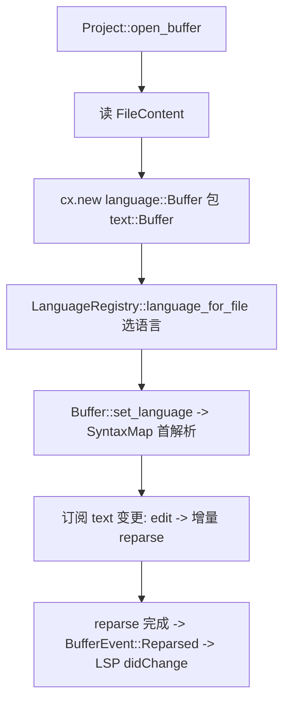

# Deep Reference: language

> 参考手册级：`crates/language`。该 crate 把 [`text::Buffer`](Text-Buffer-Deep-Dive.md) 升级为**"知道语言"的 Buffer**：叠加 tree-sitter 语法、语言配置、LSP 适配、诊断、outline、语义高亮，并管理**语言/语法的注册与加载**。`buffer.rs` 224KB、`language.rs` 72KB、`syntax_map.rs` 81KB。

## 1. `Buffer`：语言感知的文本（[buffer.rs:101](../crates/language/src/buffer.rs)）
`language::Buffer` 是 `Entity`，**内部包裹一个 `text::Buffer`**（`text: text::Buffer`），再加：
| 字段/概念 | 说明 |
|---|---|
| `language: Option<Arc<Language>>` | 当前语言 |
| `file: Option<Arc<dyn File>>` | 关联文件（路径、mtime、is_dirty） |
| `capability: Capability` | `Read`｜`ReadWrite`｜`Local`（本地/远端权限） |
| `syntax: SyntaxMap` | tree-sitter 解析栈快照 |
| `remote_id: text::BufferId` | 协作 id |

关键方法（真实锚点）：
| 方法 | 位置 | 说明 |
|---|---|---|
| `edit<I,S,T>(range, replacements, cx)` | [L2811](../crates/language/src/buffer.rs) | 编辑（转 `text::Buffer::edit` + 触发重解析 + `BufferChanged` 事件） |
| `language()` / `set_language(Option<Arc<Language>>,cx)` | [L1802](../crates/language/src/buffer.rs)/[L1540](../crates/language/src/buffer.rs) | 语言读写（切语言重解析、重订阅 LSP） |
| `capability()` / `set_capability(..,cx)` | [L1116](../crates/language/src/buffer.rs)/[L1613](../crates/language/src/buffer.rs) | 只读↔可编辑（协作权限） |
| `file()` | [L1492](../crates/language/src/buffer.rs) | `Arc<dyn File>` |
| `text_snapshot()`→`text::BufferSnapshot` | [L1486](../crates/language/src/buffer.rs) | 底层快照 |
| `outline(theme)->Outline<Anchor>` | [L4603](../crates/language/src/buffer.rs) | 语法符号树 |
| `diagnostics_for_range` / `diagnostic_group_count` | buffer.rs | 诊断查询 |
| `highlights_at(range, cx)` | buffer.rs | 语法高亮 run（tree-sitter highlight） |
| `has_outdated_syntax_parse()` / `syntax_ancient()` | buffer.rs | 是否待重解析 |
| `history()` / `start_transaction` / `undo` / `redo` | buffer.rs | 事务/撤销（代理到 text::Buffer） |
| `as_local()` / `localize(cx)` | buffer.rs | Remote→Local（打开本地副本） |
| `subscribe_to_buffer_events` | buffer.rs | 监听底层 text 变更以重解析/迁移 diagnostics |

事件 `BufferEvent`（buffer.rs）：`Modified`、`Reloaded`、`Reparsed`、`DiagnosticsUpdated`、`LanguageServerAdapterUpdated`、`DiffUpdated` 等。

## 2. `Language`（[language.rs:941](../crates/language/src/language.rs)）
一种语言的静态描述：`name`、`config: LanguageConfig`（extension、grammar、path_suffixes、line_comments、indent、brackets…）、`context_provider: Option<Arc<dyn ContextProvider>>`、`lsp_adapters: Vec<Arc<dyn LanguageServerAdapter>>`、`highlight_config`、`icon`。
- `LanguageConfigLoad`（language.rs）：从扩展/内建加载 TOML+grammar。
- `LanguageServerAdapter` trait（language/adapter_trait）：`server_id`/`get_language_server_id`/`to_lsp_params`——把 buffer 位置转成 LSP `TextDocumentPositionParams`（多语言→单 server 或反之）。
- `next_buffer_id` / `buffer_id_base`：本地 buffer id 分配。

## 3. `LanguageRegistry`（[language_registry.rs:37](../crates/language/src/language_registry.rs)）
全局语言/语法中心（`Arc`，跨项目共享）：
- `add(Arc<Language>)`/`remove`/`clear`、`languages()`、`language_for_name`/`language_for_file(path,open_cx)`/`language_for_syntax`。
- `adapters: Vec<Arc<dyn LanguageServerAdapter>>` + `adapter_server_ids`——LSP server id→adapter 反查。
- `wasm_url`/grammar loading via [`grammars`](Extension-System.md)；`load_language_at_runtime`（异步下载语法）。
- `register_context_provider`、`restart_language_servers`。
- 内建语言清单见 [`available_languages.rs`](../crates/language/src/available_languages.rs)。

## 4. `SyntaxMap`（[syntax_map.rs](../crates/language/src/syntax_map.rs)，81KB）
tree-sitter 的**分层解析**：一个 buffer 可含嵌入语言（HTML 内 JS、MD 内 code fence）。
- 维护 `Vec<Parse>`（每层一个 `tree_sitter::Parser`+`Vec<Snapshot>`）；`edit`/`splice` 后只重解析受影响区。
- `Snapshot`：不可变解析结果（供 `highlights`/`outline`/`text_objects`）。
- `TextAnchor`、`CapturedSyntaxNames`（选择器如 `function.name`）。

## 5. 诊断 / outline / 结构
| 类型 | 文件 | 说明 |
|---|---|---|
| `struct Diagnostic` / `enum DiagnosticSeverity` | [diagnostic.rs](../crates/language/src/diagnostic.rs) | LSP 诊断（range、message、is_primary、source、code、tags） |
| `struct DiagnosticSet` | [diagnostic_set.rs](../crates/language/src/diagnostic_set.rs) | 按行索引的诊断集合（`DiagnosticGroup`） |
| `struct Outline<T>` / `struct OutlineItem<T>` | [outline.rs](../crates/language/src/outline.rs) | 语法符号树（T=Anchor/Point），供 outline 面板与选择 |
| `struct Runnable` / `RunnableCapture` | [runnable.rs](../crates/language/src/runnable.rs) | code lens 可运行标记（来自 query） |
| `struct Toolchain` | [toolchain.rs](../crates/language/src/toolchain.rs) | 版本化运行时（rust/ruby…）选择 |
| `FileContent` | [file_content.rs](../crates/language/src/file_content.rs) | 打开文件内容（bytes + 编码/行尾元数据） |
| `struct Modeline` | [modeline.rs](../crates/language/src/modeline.rs) | vim `// vim:` modeline 解析 |

## 6. 设置 / 协议
- `LanguageSettings`/`LanguageConfig`（[language_settings.rs](../crates/language/src/language_settings.rs)，65KB）：per-language 合并设置（tab、formatter、bridge 等）。→ [Settings-and-Themes.md](Settings-and-Themes.md)。
- `proto.rs`（27KB）：把 `Buffer`/`Operation`/`Capability` 序列化进 RPC，支撑协作同步。→ [Collaboration-and-Call.md](Collaboration-and-Call.md)。
- `text_diff.rs`：文本 diff 工具。→ [Data-Structures.md](Data-Structures.md)。
- `task_context.rs`/`manifest.rs`：任务变量、包 manifest。→ [Tasks-and-Tooling.md](Tasks-and-Tooling.md)。

## 7. Buffer 生命周期（真实流程）

## 8. 相关页
- 底层文本：[Text-Buffer-Deep-Dive.md](Text-Buffer-Deep-Dive.md)。
- 上层：[Project-Deep-Dive.md](Project-Deep-Dive.md)、[LSP-Features.md](LSP-Features.md)、[Editor-Deep-Dive.md](Editor-Deep-Dive.md)。
- 概览：[Language-and-Project.md](Language-and-Project.md)。
