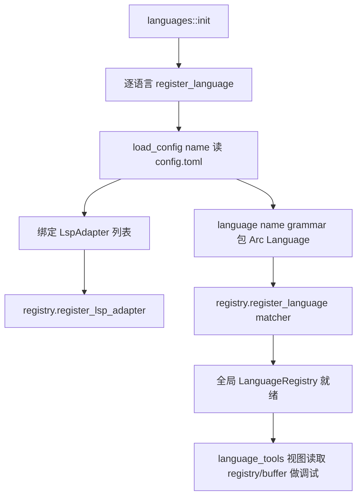

# 语言工具与内置语言注册 深入解析（Deep Dive）

> 本页覆盖两块"语言支撑"：`languages`（把 tree-sitter 语法 + LSP adapter + context provider 注册成 Zed 内置语言）与 `language_tools`（语言/LSP 的开发者调试视图：语法树、高亮树、LSP 日志、key context、状态栏 LSP 按钮）。关联：`language`/`lsp` crate（本体，见 Language-Deep-Dive）、`grammars`（编译期打包 tree-sitter crate）。

## 1. 分层设计

- **注册层** `languages`：一个"装配脚本"型 crate。`init` 为每种内置语言（Rust/Python/Go/TS/C/C++/JSON/YAML/Bash/CSS/Tailwind…）读取 `config`、绑定 `LspAdapter`、`ContextServerProvider`、`ToolchainLister`，注入全局 `LanguageRegistry`。`grammars` crate 用 feature `load-grammars` 决定是否内嵌 `.so`/静态语法。
- **诊断工具层** `language_tools`：面向语言服务使用者的"透视窗"——把 `language`/`lsp` 内部状态（语法树、highlight 缓存、LSP JSON-RPC 报文、当前 key context）可视化，通过命令面板 Action 打开。

## 2. 类型总览

### languages（lib.rs）

| 符号 | 文件:行 | 角色 |
| --- | --- | --- |
| `fn init(registry, fs, node, cx)` | lib.rs:58 | 注册全部内置语言总入口 |
| `fn register_language(..)` | lib.rs:341 | 单语言装配（下详） |
| `fn language(name, grammar)` | lib.rs:386 | tree-sitter `Language`→`Arc<Language>` |
| `cfg!(feature="load-grammars")` | lib.rs:395 | 运行时/内嵌语法开关 |
| 每语言模块 | `rust.rs`/`python.rs`/`go.rs`/`typescript.rs`/`c.rs`/`cpp.rs`/`json.rs`/`yaml.rs`/`bash.rs`/`css.rs`/`tailwind*.rs`/`eslint.rs`/`vtsls.rs`/`package_json.rs` | `LspAdapter` 实现 |

### language_tools

| 符号 | 文件 | 角色 |
| --- | --- | --- |
| `fn init(cx)` | language_tools.rs:18 | 注册 Action + 命令面板项 |
| `struct SyntaxTreeView` | syntax_tree_view.rs:93 | tree-sitter 语法树可视化 |
| `struct SyntaxTreeToolbarItemView` | syntax_tree_view.rs:105 | 工具栏入口 |
| `struct HighlightsTreeView` | highlights_tree_view.rs:136 | highlight 查询/缓存树 |
| `struct HighlightsTreeToolbarItemView` | highlights_tree_view.rs:153 | 工具栏入口 |
| `struct LspLogView` | lsp_log_view.rs:99 | LSP JSON-RPC 报文日志 |
| `struct LspLogToolbarItemView` | lsp_log_view.rs:110 | 工具栏入口 |
| `struct LspButton` | lsp_button.rs | 状态栏 LSP 状态按钮（`StatusItemView` :1278） |
| `struct KeyContextView` | key_context_view.rs:31 | 当前窗口 key context 栈 |

## 3. 核心方法与调用锚点

**`languages::init`（lib.rs:58）**
- 依次对每种语言调用内部 `register_language(&languages, name, adapters, context, toolchain, manifest_name, semantic_token_rules, cx)`(:341)。
- `register_language` 内：`load_config(name)`(:351) 读取随 crate 打包的 `config.toml`；`SettingsStore::update_global`(:353) 注册语义色规则；对每个 `LspAdapter` 调 `languages.register_lsp_adapter`(:358)；再 `languages.register_language`(:360) 绑定语法与 matcher。
- `language(name, grammar)`(:386) 把 `tree_sitter::Language`（来自 `grammars`）包成 `Arc<Language>`；`grammars_loaded = cfg!(any(feature="load-grammars", test))`(:395) 决定语法是动态加载还是内嵌。

**`language_tools::init`（language_tools.rs:18）**
- 注册 `DeploySyntaxTree`/`DeployHighlightTree`/`DeployLspLogView`/`ShowKeyContext` 等 Action，并把这些视图挂到命令面板与（debug 构建下）工具栏。

**调试视图的共性**
- 每个 `*View` 都是 GPUI `Entity`，实现 `Render`；对应 `*ToolbarItemView` 实现 `ToolbarItemView`（`SyntaxTreeToolbarItemView`:737、`HighlightsTreeToolbarItemView`:1087、`LspLogToolbarItemView`:911），在有/无活动编辑器时显隐。
- `SyntaxTreeView`(:93) 读取 `Editor` 当前 buffer 的 `SyntaxElement`，把 `tree_sitter::Node` 展开成可折叠 `TreeItem`，点击可跳转到对应字节范围。
- `LspLogView`(:99) 订阅 `lsp::LanguageServerId` 的收发报文，`Deploy` 时以 JSON 折叠列表呈现每个 request/response/notification。
- `LspButton`(lsp_button.rs，`impl StatusItemView`:1278) 在状态栏显示语言服务器就绪态/错误，点击打开 `LspLogView`。

## 4. 语言注册流程

## 5. 集成点

- `zed` 启动调用 `languages::init`（在 `language::init` 之后、扩展加载之前）填充内置语言；扩展可再注册同名/新语言覆盖。
- `language_tools` 依赖 `editor`/`workspace` 的 `ToolbarItemView`/`StatusItemView` trait 挂载；仅在 debug 构建或显式命令下部署，避免污染正式版工具栏。
- 每语言 `.rs`（如 `python.rs` 127KB、`rust.rs` 93KB）实现 `lsp::LspAdapter`（`server_id`/`language_server_binary`/`labels_for_completions`…）与 `project::ContextProvider`。
- `grammars` crate 汇集所有 tree-sitter grammar crate，`languages` 经 `language()`(:386) 消费。

## 6. 相关页

- [Language-Deep-Dive](Language-Deep-Dive.md)（`language`/`LanguageRegistry`/`LspAdapter` 本体）
- [Project-Deep-Dive](Project-Deep-Dive.md)（`ContextProvider`/工具链）
- [LSP-Features](LSP-Features.md)（LSP 功能族概览）
- [Language-and-Project](Language-and-Project.md)（语言与项目族概览）
