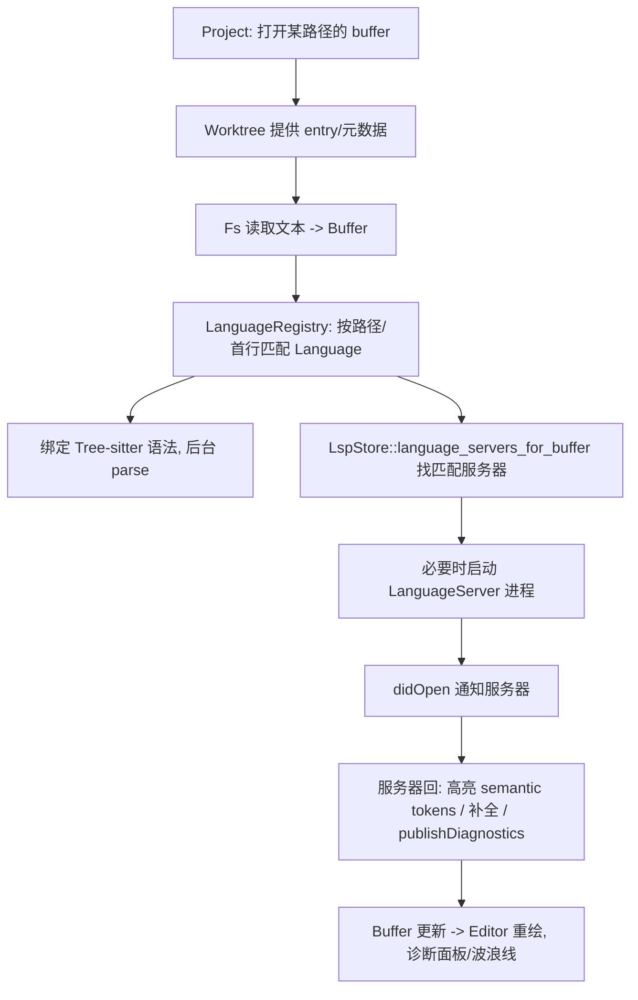

# Language & Project（LSP / worktree / 语言检测）

围绕"打开一个文件后，如何识别语言、启动语言服务、提供高亮/补全/诊断"这条主线，涉及三个 crate：[`language`](../crates/language)、[`languages`](../crates/languages)、[`project`](../crates/project)。

## 1. 职责划分

| crate | 职责 | 关键类型 / 文件 |
|---|---|---|
| `language` | 语言抽象与缓冲区语义、语法（Tree-sitter）、LSP 客户端封装 | `Buffer`、`Language`、`LanguageRegistry`(`language_registry.rs:37`)、`LanguageServer` |
| `languages` | 具体内建语言配置（Rust/Python/JS…），含 **Python 环境探测**（`pet-*`） | 各语言初始化函数 |
| `language_core` | 更底层的语言核心（被 language 复用） | — |
| `project` | 项目级模型：worktree、LSP 生命周期、搜索、诊断聚合、任务 | `Project`、`LspStore`(`lsp_store.rs`)、`Worktree`、`SearchHistory` |
| `lsp` | LSP 协议消息类型封装 | `lsp::` 类型 |
| `node_runtime` | 下载/管理 Node，供需要 Node 的语言服务器与扩展 | `NodeRuntime` |

## 2. 打开文件 → 语言服务介入的调用流程

对应真实机制：
1. **缓冲区与语言识别**：`Buffer` 关联一个 `Language`；`LanguageRegistry`（[`language_registry.rs:37`](../crates/language/src/language_registry.rs)）按文件扩展名、首行（shebang）、路径规则解析语言。
2. **语法解析**：`Language` 携带 Tree-sitter grammar，`Buffer` 在后台 `parse`，产出高亮与结构（outline 亦复用）。
3. **语言服务器定位**：`LspStore`（[`lsp_store.rs`](../crates/project/src/lsp_store.rs)）依据 buffer 语言与 worktree 根，用 `language_servers_for_buffer`(L1442) 找出应接管的服务器；缺失则按配置启动（可能经 `node_runtime` 提供 Node）。
4. **变更同步**：`Editor` 每次编辑触发 `BufferEvent`（见 [Editor.md](Editor.md)），`LspStore` 将其转成 `textDocument/didChange`；服务器回 `publishDiagnostics` 回流到 buffer 与诊断面板。

## 3. Worktree（文件系统视图）

- `Worktree`（`crates/project/src/worktree.rs`）递归扫描目录、维护 git 状态、忽略规则、entry 树；`Project` 持有若干 worktree。
- `project_panel` 直接渲染 `Worktree` 的 entry 树；文件监视复用启动阶段的 `watch_config_file`/FS 事件机制。
- `project_search.rs` 提供全项目搜索（后台 worker + 主线程 `open_buffers` 协作，见 L557 注释）。

## 4. 语言检测中的 `pet-*`（与依赖裁剪相关）

`crates/languages` 为支持 **Python** 的解释器 / 虚拟环境 / conda / poetry 探测，依赖微软 `python-environment-tools`（`pet`、`pet-core`、`pet-conda`、`pet-poetry`、`pet-reporter`、`pet-virtualenv`…，见 [workspace Cargo.toml](../Cargo.toml)）。
- 这些 `pet-*` 在 Windows 上会传递引入 `msvc_spectre_libs` —— 是 MSVC 构建的已知坑，本项目已用 `[patch.crates-io]` 空 stub 化解，详见 [Building on Windows.md](Building-on-Windows.md)。

## 5. 关键符号速查

| 符号 | 位置 | 作用 |
|---|---|---|
| `LanguageRegistry` | `language/src/language_registry.rs:37` | 语言集合与按路径/内容解析语言 |
| `Buffer` / `BufferEvent` | `language/src/buffer.rs` | 文本缓冲与变更事件 |
| `Language` | `language/src/language.rs` | 语言定义（grammar、配置、LSP adapter） |
| `LspStore::language_servers_for_buffer` | `project/src/lsp_store.rs:1442` | 为某 buffer 选择语言服务器 |
| `Worktree` | `project/src/worktree.rs` | 项目文件树 + git 状态 |
| `open_buffers` | `project/src/project_search.rs:558` | 搜索时由主线程代开缓冲 |

## 6. 与其他页面的关系
- 缓冲区编辑与渲染：[Editor.md](Editor.md)
- 补全/诊断 UI：`editor` + `diagnostics` crate
- 语言扩展（下载语法/LSP）：`extension` 体系（见 [Architecture.md](Architecture.md) L5）
