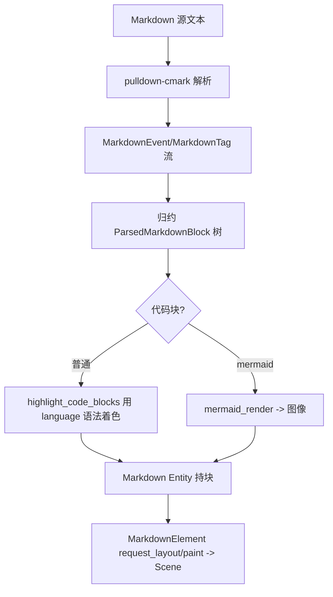

# Deep Reference: markdown & markdown_preview

> 参考手册级：`crates/markdown`（**可复用的 Markdown 渲染视图**，被 agent/outline_preview/onboarding 等广泛嵌入；`markdown.rs` 272KB）与 `crates/markdown_preview`（**编辑器内的预览面板 `Item`**）。管线：**源文本 → pulldown-cmark → 事件/标签流 → 解析块 → GPUI `Element` 绘制**。

## 1. `crates/markdown` 解析层 [`parser.rs`](../crates/markdown/src/parser.rs)(71KB)
基于第三方 `pulldown-cmark`，把 `&str` 解析为带标签的事件流（SAX 式），再归约成块树：
| 类型 | 位置 | 角色 |
|---|---|---|
| `enum MarkdownEvent` | [parser.rs:762](../crates/markdown/src/parser.rs) | `StartTag`/`EndTag`/`Text`/`Html`/`CodeBlock…` |
| `enum MarkdownTag` | [L802](../crates/markdown/src/parser.rs) | `Paragraph`/`Heading`/`List`/`Item`/`BlockQuote`/`CodeBlock`/`Table`/`Emphasis`/`Strong`/`Link`/`Image`… |
| `enum CodeBlockKind` | [L886](../crates/markdown/src/parser.rs) | `Indented`/`Fenced{info}` |
| `struct CodeBlockMetadata` | [L898](../crates/markdown/src/parser.rs) | 语言/是否 mermaid/来源范围 |
顶层入口 `parse_markdown(cx)` → `Vec<ParsedMarkdownBlock>`（块枚举，含样式化文本 spans）。

## 2. `crates/markdown` 渲染层 [`markdown.rs`](../crates/markdown/src/markdown.rs)(272KB)
| 类型 | 位置 | 角色 |
|---|---|---|
| `struct Markdown` | [markdown.rs:479](../crates/markdown/src/markdown.rs) | **核心 `Entity`**：持解析后的块 + 样式 + 选区状态；`new`/`parse`/`set_text`/`highlight_code_blocks`（异步用语言语法着色） |
| `struct MarkdownStyle` | [L108](../crates/markdown/src/markdown.rs) | 由主题派生的字体/颜色/间距（`HeadingLevelStyles`(L98)、`BlockQuoteKindColors`(L76)、`MarkdownFont`(L169)） |
| `struct MarkdownOptions` | [L515](../crates/markdown/src/markdown.rs) | 渲染选项：`CopyButtonVisibility`(L524)/`WrapButtonVisibility`(L531)/`CodeBlockRenderer`(L537) |
| `enum CodeBlockRenderer` | [L537](../crates/markdown/src/markdown.rs) | `Default`｜`Mermaid`（决定代码块用文本还是图形渲染） |
| `struct ParsedMarkdown` | [L1487](../crates/markdown/src/markdown.rs) | 解析产物（块 + 悬停/链接映射） |
| `struct MarkdownElement` | [L1619](../crates/markdown/src/markdown.rs) | **`impl Element`**：真正 layout/paint 的 GPui 元素（`AnyDiv`(L3446) 布局原语聚合块） |
| `struct RenderedMarkdown` | [L4557](../crates/markdown/src/markdown.rs) | 一次性渲染辅助 |
| `enum AutoscrollBehavior` | [L1611](../crates/markdown/src/markdown.rs) | 流式追加时自动滚底（agent 输出用） |
块渲染涵盖：标题/段落/有序无序列表/任务项/表格/引用/行内码/链接/图片/**代码块（语法高亮）**；支持文本选择（[selection.rs](../crates/markdown/src/selection.rs) 20KB）与复制按钮。

## 3. 附属模块
| 文件 | 角色 |
|---|---|
| [mermaid.rs](../crates/markdown/src/mermaid.rs)(67KB) | 渲染 ```mermaid 代码块→SVG/位图（依赖 `crates/mermaid_render`：内嵌浏览器/无头渲染） |
| [html/](../crates/markdown/src/html) + [html.rs](../crates/markdown/src/html.rs) | Markdown 内 HTML 片段处理 |
| [path_range.rs](../crates/markdown/src/path_range.rs) | `PathWithRange`(L4)/`LineCol`(L10)：源文件行→渲染块映射（点击跳转） |
| [selection.rs](../crates/markdown/src/selection.rs) | 选区/命中测试（跨块鼠标拖选） |
`gpui_util`、`theme` 提供样式来源。→ [Settings-and-Themes.md](Settings-and-Themes.md)。

## 4. `crates/markdown_preview`：编辑器预览面板
| 类型 | 位置 | 角色 |
|---|---|---|
| `struct MarkdownPreviewView` | [markdown_preview_view.rs:66](../crates/markdown_preview/src/markdown_preview_view.rs) | `Item`（`impl Item` L1608）：可 dock 的预览 tab，内嵌 `Markdown` + 可选同步 `Editor` |
| `enum MarkdownPreviewMode` | [L85](../crates/markdown_preview/src/markdown_preview_view.rs) | `SingleBuffer`｜`Split`（编辑/预览分栏，滚动同步） |
| `enum MarkdownPreviewEvent` | [L119](../crates/markdown_preview/src/markdown_preview_view.rs) | `ChangedMode`/`SavedAs`/`OpenedPreview`/`ClosedPreview` |
| `struct MarkdownPreviewSettings` | [markdown_preview_settings.rs:6](../crates/markdown_preview/src/markdown_preview_settings.rs) | 主题/字号 |
动作（markdown_preview.rs）：`TogglePreview`/`Open`/`Follow`/`ScrollCursorToTop`。打开时向 `Workspace` 注册为 `Item`（[Workspace-Deep-Dive.md](Workspace-Deep-Dive.md)），监听 `BufferEvent::Reparsed/Modified` 重渲染。

## 5. 渲染管线


## 6. 复用点
- agent 消息、context_server 说明、onboarding、outline_preview、release notes 均嵌 `Markdown`（[Agent-Deep-Dive.md](Agent-Deep-Dive.md)）。
- 语法高亮来自 `crates/language` 的 `SyntaxRegistry`（[Language-Deep-Dive.md](Language-Deep-Dive.md)）。
→ 概览页 [Markdown-and-Preview](Markdown-and-Preview.md)。
