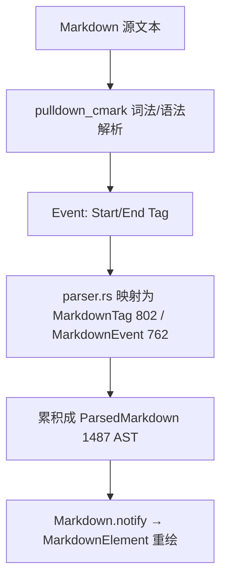

# Markdown & Preview（解析 / 渲染 Element / 实时预览）

[`markdown`](../crates/markdown) 是**通用 Markdown 渲染库**（不只是预览面板用——Agent 回复、Onboarding、hover 文档、README 都用它）；[`markdown_preview`](../crates/markdown_preview) 是编辑器旁的**实时预览 Item**。解析引擎用 Rust 的 `pulldown_cmark`，渲染走 GPUI 自定义 `Element`。核心文件：`markdown/src/{markdown.rs,parser.rs}`、`markdown_preview/src/markdown_preview_view.rs`。

## 1. 分层职责

| 层 | 类型 | 位置 | 职责 |
|---|---|---|---|
| 解析 | `pulldown_cmark` 事件→`MarkdownTag` | [`parser.rs:802`](../crates/markdown/src/parser.rs) | 把 CommonMark 事件规约为 Zed 标签枚举 |
| 解析事件 | `MarkdownEvent` | [`parser.rs:762`](../crates/markdown/src/parser.rs) | Start/End 标签流（含 `CodeBlockKind` L886） |
| 状态实体 | `Markdown` | [`markdown.rs:479`](../crates/markdown/src/markdown.rs) | 持源文本 + 后台解析出的 AST |
| 解析结果 | `ParsedMarkdown` | [`markdown.rs:1487`](../crates/markdown/src/markdown.rs) | 解析产物（供渲染读取） |
| 渲染 | `MarkdownElement` | [`markdown.rs:1619`](../crates/markdown/src/markdown.rs) | 自定义 `Element`，把 AST 画成界面 |
| 样式 | `MarkdownStyle` | [`markdown.rs:108`](../crates/markdown/src/markdown.rs) | 标题/正文/代码块/链接的颜色与字号 |
| 代码块渲染 | `CodeBlockRenderer` | [`markdown.rs:537`](../crates/markdown/src/markdown.rs) | 选择用 Editor 还是简化着色 |
| 预览视图 | `MarkdownPreviewView` | [`markdown_preview_view.rs:66`](../crates/markdown_preview/src/markdown_preview_view.rs) | 一个 `Item`（L1608），编辑↔预览同步 |
| 预览模式 | `MarkdownPreviewMode` | [`markdown_preview_view.rs:85`](../crates/markdown_preview/src/markdown_preview_view.rs) | Split / Single / PreviewOnly |

## 2. 解析流程（源文本 → 标签流）

[`parser.rs`](../crates/markdown/src/parser.rs) 直接 `use pulldown_cmark`，把它的 `Event`/`Tag` 翻译成 Zed 自己的 `MarkdownTag`（L802）/`MarkdownEvent`（L762）。例如 `Tag::Heading`（L381）、`Tag::BlockQuote`（L408）、`Tag::CodeBlock(Indented/Fenced)`（L329/L340）、`Tag::Link`（L306）。`build_heading_slugs`（L104）为每个标题生成锚点 slug（供目录/跳转）。`MetadataBlock`（L320）处理前置 YAML。

## 3. Markdown 实体与渲染

- `Markdown`（markdown.rs:479）是 `Entity`：`new`（L646）/`new_with_options`（L661）异步解析一段 markdown；`new_text`（L712）按纯文本快速构造。外部通过 [`parsed_markdown()`](../crates/markdown/src/markdown.rs)（L1071）取 `&ParsedMarkdown` 只读结果。
- 渲染由 `MarkdownElement`（L1619）承担，`MarkdownElement::new(markdown, style)`（L1640）绑定实体与 `MarkdownStyle`（L108）。它走 GPUI [三阶段](GPUI-Internals.md)：标题按 `HeadingLevel` 映射字号（H1→`text_3xl`…，L3325-3329），列表/引用/表格/链接分别成块，`rendered_text`（L1664）产出可复制的纯文本表示。
- 代码块用 `CodeBlockRenderer`（L537）决定：一种内嵌真实 `Editor`（可语法高亮/复制），一种轻量着色。Mermaid 图块交给 [`mermaid_render`](../crates/mermaid_render) crate 生成图片。

## 4. MarkdownPreviewView：编辑与预览并排

[`MarkdownPreviewView`](../crates/markdown_preview/src/markdown_preview_view.rs)（L66）`impl Item`（L1608），可进 `Pane`。三种 `MarkdownPreviewMode`（L85）：

- `Split`：左编辑右预览同屏；
- `Single`：在编辑/预览间来回切换；
- `PreviewOnly`：纯预览。

它订阅底层 `Buffer` 的变更事件（`MarkdownPreviewEvent` L119），文本一改就重建右侧 `Markdown` 实体并重渲染。`MarkdownPreviewDb`（L2148）持久化"哪些文件开了预览/模式"，`MarkdownPreviewSettings`（settings 文件 L6）控制是否滚动同步等。打开方式通常是对一个 `.md` buffer 触发 `TogglePreview`。

## 5. 关键符号速查

| 符号 | 位置 | 作用 |
|---|---|---|
| `Markdown` | `markdown/src/markdown.rs:479` | 解析状态实体 |
| `Markdown::new` | `markdown.rs:646` | 异步解析一段 markdown |
| `Markdown::parsed_markdown` | `markdown.rs:1071` | 取解析结果 |
| `ParsedMarkdown` | `markdown.rs:1487` | AST 产物 |
| `MarkdownElement` | `markdown.rs:1619` | GPUI 渲染 Element |
| `MarkdownStyle` | `markdown.rs:108` | 排版样式 |
| `CodeBlockRenderer` | `markdown.rs:537` | 代码块渲染策略 |
| `MarkdownTag` / `MarkdownEvent` | `markdown/src/parser.rs:802/762` | 解析标签/事件流 |
| `MarkdownPreviewView` | `markdown_preview/src/markdown_preview_view.rs:66` | 实时预览 Item |
| `MarkdownPreviewMode` | `markdown_preview_view.rs:85` | Split/Single/PreviewOnly |

## 6. 与其他页面的关系
- `MarkdownElement` 依赖渲染三阶段：[GPUI-Internals.md](GPUI-Internals.md)。
- Agent 回复用 `Markdown` 渲染模型输出：[Agent-and-AI.md](Agent-and-AI.md)。
- 预览是 `Item`，进 `Pane`：[Workspace-Pane-Dock.md](Workspace-Pane-Dock.md)。
- 编辑的 buffer 事件驱动预览刷新：[Editing-Deep-Dive.md](Editing-Deep-Dive.md)。
