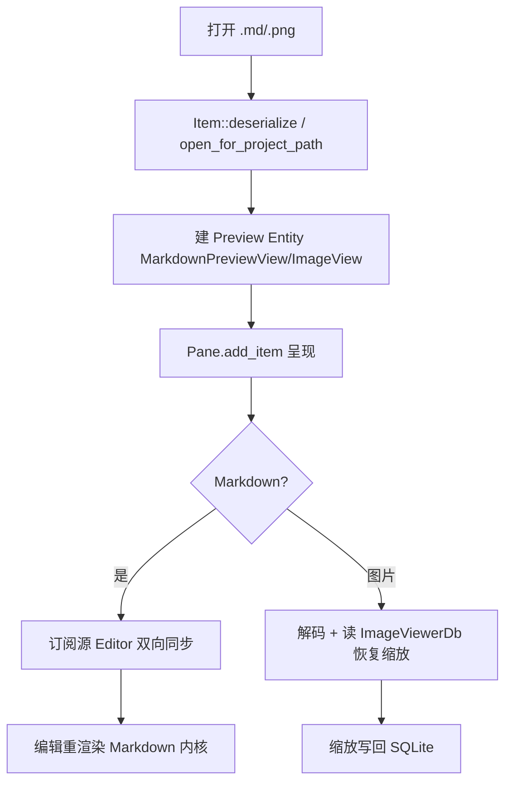

# 预览类 Item 深入解析（Deep Dive）

> 本页覆盖三个"在 Pane 里渲染非文本内容"的 workspace item：`markdown_preview`（Markdown 实时预览）、`image_viewer`（图片查看器 + 缩放/持久）、`component_preview`（UI 组件预览簿 preview 页）。它们是 `Item` trait 的典型实现，与 `markdown`（渲染内核）、`gpui`、`workspace::Pane` 协作。

## 1. 分层设计

- **`markdown`（内核）** 提供 `Markdown`/`MarkdownElement` GPUI 组件；`markdown_preview` 在其上加"编辑器 ↔ 预览"双向同步、跟随模式、TOC、mermaid/代码块。
- **`image_viewer`** 把二进制图片解码成 GPUI `Image`，提供缩放/平移/适应窗口，并用 SQLite（`ImageViewerDb`）记忆每张图的缩放状态。
- **`component_preview`** 是一个调试/开发工具：把 `ui` crate 各组件的 story 渲染成可浏览页面（配合 `story_book`/`ui_macros::register_component`）。

## 2. 类型总览

### markdown_preview（markdown_preview_view.rs，4368 行 / 158KB）

| 符号 | 文件:行 | 角色 |
| --- | --- | --- |
| `struct MarkdownPreviewView` | :66 | `Item` 实现，预览主体 |
| `enum MarkdownPreviewMode` | :85 | Default（固定源）/ Follow（跟随活动编辑器） |
| `fn to_db`/`from_db` | :93/:100 | 模式持久化 |
| `struct EditorState` | :108 | 绑定的源编辑器 + 订阅 |
| `struct SuppressedAutoPreviews` | :114 | Global：被抑制的自动预览集合 |
| `enum MarkdownPreviewEvent` | :119 | `SourceEditorChanged` 等 |
| `fn register(...)` | :130 | 初始化 |
| `fn open_preview_in_pane(..)` | :233 | 同 Pane 打开 |
| `fn open_preview_to_the_side_of_pane(..)` | :243 | 侧向分栏打开 |
| `fn new(..)` | :372 | 构造 |
| `fn open_for_project_path(..)` | :482 | 按项目路径打开 |

### image_viewer（image_viewer.rs，47KB）

| 符号 | 文件:行 | 角色 |
| --- | --- | --- |
| `struct ImageView` | :65 | 图片 `Item`（缩放/平移） |
| `enum ImageViewEvent` | :534 | 内容变更事件 |
| `struct ImageViewToolbarControls` | :834 | 缩放工具栏 |
| `struct ImageViewerDb(ThreadSafeConnection)` | :1362 | 每图缩放状态持久化 |
| `image_info.rs` | — | 尺寸/格式解码 |

### component_preview（component_preview.rs，35KB）

| 符号 | 文件:行 | 角色 |
| --- | --- | --- |
| `fn init(app_state, cx)` | :25 | 注册 preview 页 |
| `enum PreviewPage` | :87 | 预览页类型 |
| `struct ComponentPreview` | :93 | GPUI Entity 预览容器 |
| `struct ActivePageId(pub String)` | :695 | 当前页 id（Global） |
| `struct ComponentPreviewPage` | :884 | 单组件预览页 |
| `persistence.rs` | — | 预览状态持久 |

## 3. 核心方法与调用锚点

**Markdown 预览同步（markdown_preview_view.rs）**
- 两种模式（`MarkdownPreviewMode` :85）：`Default` 恒定预览指定源编辑器；`Follow` 随工作区活动编辑器切换（`to_db`/`from_db` :93/:100 持久到 DB）。
- `open_preview_in_pane`(:233) / `open_preview_to_the_side_of_pane`(:243) 用 `workspace::SplitDirection::Right` 放置预览；`open_for_project_path`(:482) 供"打开 .md 自动预览"。
- `EditorState`(:108) 订阅源 `Editor` 事件，编辑即重渲染 `Markdown`；`SuppressedAutoPreviews`(:114，Global) 记录用户手动关掉的自动预览，避免反复弹出。
- `MarkdownPreviewEvent::SourceEditorChanged`(:120) 通知 pane 刷新标题/图标。

**图片查看（image_viewer.rs）**
- `ImageView`(:65) 实现 `Item`，`Open` 时解码字节为 GPUI `Image`；缩放/平移状态经 `ImageViewerDb`(:1362，`ThreadSafeConnection`) 以 path 为键存 SQLite。
- `ImageViewToolbarControls`(:834) 提供 +/-/1:1/适应窗口；`ImageViewEvent`(:534) 驱动重载。

**组件预览（component_preview.rs）**
- `init(app_state, cx)`(:25) 注册；`ComponentPreview`(:93) 是容器 Entity，`PreviewPage`(:87) 枚举要渲染的 story，`ActivePageId`(:695，Global) 记录当前页；`ComponentPreviewPage`(:884) 渲染单组件。

## 4. 预览 item 生命周期

## 5. 集成点

- 三者都实现 `workspace::Item`（`tab_content`/`is_dirty`/`save`/`serialize`），注册进 item 类型表以便"重开工作区恢复"。
- `markdown_preview` 依赖 `markdown`（渲染）、`editor`（源）、`workspace`（分栏），mermaid 代码块经 `mermaid_render`。
- `image_viewer` 用 `db`/`sqlez`（`ThreadSafeConnection`）持久缩放（见 Persistence 页）。
- `component_preview` 与 `ui`/`ui_macros`/`story_book` 配合，是 `ui` 组件的开发预览面（见 UI-Primitives 页）。

## 6. 相关页

- [Markdown-Deep-Dive](Markdown-Deep-Dive.md)（渲染内核）
- [UI-Primitives-Deep-Dive](UI-Primitives-Deep-Dive.md)（被 component_preview 预览的组件）
- [Workspace-Deep-Dive](Workspace-Deep-Dive.md)（`Item` trait / `Pane`）
- [Misc-Items-and-Selectors](Misc-Items-and-Selectors.md)（本族概览）
