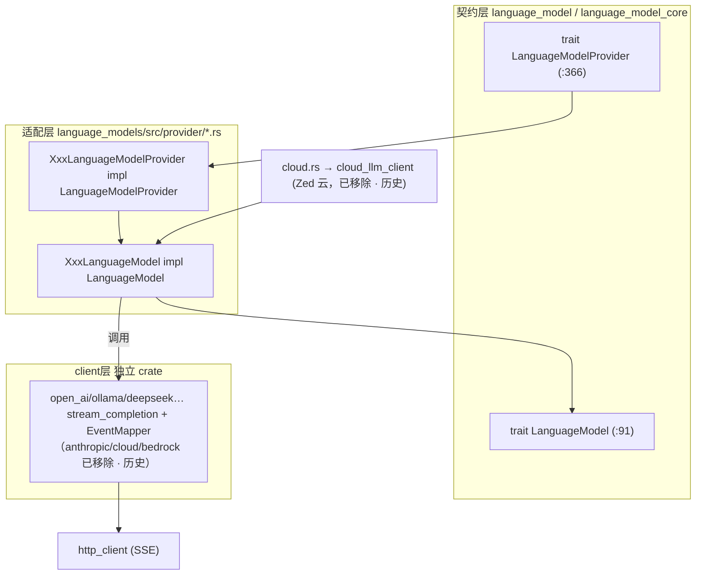
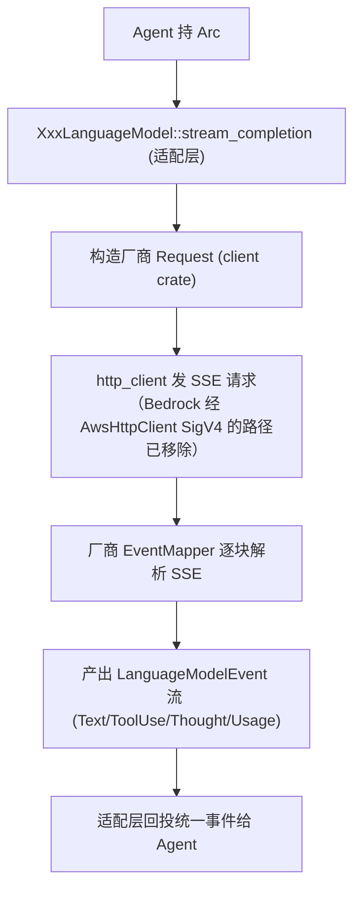

# 模型 Provider 深挖（`LanguageModel`/`Provider` 契约 · 两层架构 · 逐厂商 HTTP/SSE）

> 返回 [Home](Home) · [Module-Index](Module-Index)
>
> 概览见 [Model-Providers.md](Model-Providers.md)；`LanguageModel` 生态上层（Agent 如何调用）见 [Agent-Deep-Dive.md](Agent-Deep-Dive.md)。本页是**参考手册级**，穷举各厂商 provider 的**两层结构**（独立 HTTP client crate → `language_models` 适配层）与真实符号。所有 `文件:行号` 均来自 `grep`/`read` 确证。

## 1. 两层架构

- **契约层**（`crates/language_model/src/language_model.rs`）：`trait LanguageModel`(91)——`id`(92)/`name`(93)/`provider_id`(94)/`stream_completion`/`count_tokens`；`trait LanguageModelProvider`(366)——`id`(367)/`name`(368)/`list_models`/`default_model`/`authenticate`(379)。
- **适配层**（`crates/language_models/src/provider/`）：每个 `XxxLanguageModelProvider`(impl `LanguageModelProvider`) + `XxxLanguageModel`(impl `LanguageModel`)，把厂商协议翻译成统一 `LanguageModelRequest/Event`。
- **client 层**（独立 crate）：厂商原始 HTTP 请求体 / 响应解析 / SSE 事件映射。

## 2. 逐厂商映射表（适配层 `impl` 锚点 = `文件:行`）

| 厂商 | client crate | 适配层 `provider/…`（`LanguageModelProvider` / `LanguageModel`） |
| --- | --- | --- |
| Anthropic（已移除 · 历史） | `anthropic` | ~~`anthropic.rs`~~（`AnthropicLanguageModelProvider`）/ 兼容 ~~`anthropic_compatible.rs`~~ |
| OpenAI | `open_ai` | `open_ai.rs`:147 / 473 |
| OpenAI 兼容 | —（复用 `open_ai`） | `open_ai_compatible.rs`:102 / 334；`api_compatible.rs` |
| OpenAI 订阅（Codex）（已移除 · 历史） | `openai_subscribed` | `openai_subscribed.rs`:41（`impl LanguageModel` 在 client crate:745） |
| Ollama | `ollama` | `ollama.rs`:267 / 496 |
| LM Studio | `lmstudio` | `lmstudio.rs`:237 / 498 |
| llama.cpp | `llama_cpp` | `llama_cpp.rs`:539 / 874（76KB，含本地 HTTP） |
| Mistral（已移除 · 历史） | `mistral` | `mistral.rs`:153 / 289；Codestral→`codestral` crate（已移除 · 历史） |
| DeepSeek | `deepseek` | `deepseek.rs`:145 / 259 |
| xAI（Grok）（已移除 · 历史） | `x_ai` | `x_ai.rs`:134 / 341 |
| OpenRouter（已移除 · 历史） | `open_router` | `open_router.rs`:197 / 340 |
| opencode（已移除 · 历史） | `opencode` | `opencode.rs`:192 / 539 |
| Google Gemini（已移除 · 历史） | `google_ai` | ~~`google.rs`~~ |
| AWS Bedrock（已移除 · 历史） | `bedrock`（+ `aws_http_client` SigV4） | `bedrock.rs`(149KB，适配最厚) |
| Copilot Chat | `copilot_chat` | `copilot_chat.rs`:80 |
| Vercel AI Gateway（已移除 · 历史） | — | `vercel_ai_gateway.rs`:198 / 378 |
| **Zed 云托管**（已移除 · 历史） | `cloud_llm_client`/`cloud_api_*` | ~~`cloud.rs`(40KB)~~ |

## 3. Anthropic（已移除 · 历史 · 原 `crates/anthropic/src/`）

| 符号 | 位置 | 角色 |
| --- | --- | --- |
| `async fn stream_completion` | anthropic.rs:261 | 发 `POST /v1/messages`（SSE） |
| `struct Model` / `ModelCapabilities`(74) / `ThinkingCapability`(90)/`EffortCapability`(106) | anthropic.rs:122… | 模型能力表（thinking/effort/fast mode） |
| `supports_fast_mode`(24)/`requires_explicit_thinking_opt_out`(39)/`supports_forced_tool_use`(51) | anthropic.rs | 按 `model_id` 的能力判定 |
| `struct AnthropicEventMapper` | completion.rs:485 | SSE→`LanguageModelEvent` 状态机：`map_stream`(512)/`map_event`(528) |
| `AnthropicPromptCacheMode`(122)/`into_anthropic`(284) | completion.rs | 提示缓存 & 请求转换 |
| `BatchRequest` | batches.rs:9 | 批处理 API |

## 4. OpenAI（`crates/open_ai/src/`）

两套 API：Chat Completions（`open_ai.rs`）与 Responses（`responses.rs`）。

| 符号 | 位置 | 角色 |
| --- | --- | --- |
| `enum Model` / `enum Role` | open_ai.rs:65 / 31 | 模型/角色 |
| `struct Request`(679)/`StreamOptions`(666)/`enum ServiceTier`(715)/`ToolChoice`(725)/`ToolDefinition`(735)/`FunctionDefinition`(741) | open_ai.rs | Chat 请求体与工具 |
| `struct OpenAiResponseEventMapper` | completion.rs:732 | SSE→统一事件；`ChatCompletionMaxTokensParameter`(46) |
| Responses API：`Request`(18)/`ResponseInput`(173)/`ResponseMessageItem`(260)/`ResponseFunctionCallItem`(268)/`ResponseReasoningInputItem`(296) | responses.rs | `/v1/responses` 输入项模型（含推理/工具项） |

## 5. AWS Bedrock（已移除 · 历史 · `crates/bedrock/src/` + `aws_http_client`）

| 符号 | 位置 | 角色 |
| --- | --- | --- |
| `async fn stream_completion`（已移除） | bedrock.rs:35 | Converse API 流式；`struct Request`(261)/`Thinking`(186) |
| `aws_document_to_value` / `value_to_aws_document`（已移除） | bedrock.rs:141 / 160 | AWS `Document`⇄`serde_json::Value` |
| `enum ConverseModel`（已移除） | models.rs:49 | 型号目录（`from_id`242/`max_token_count`436/`supports_tool_use`539…） |
| `struct AwsHttpClient`（已移除 · 历史） | aws_http_client.rs:67 | 原描述为"**SigV4 签名**包装 `dyn HttpClient`"（不准确：该 crate 只适配传输，SigV4 由 aws-config/aws-sigv4 完成）；`convert_to_sdk_body`(95)/`convert_to_async_body`(99) |

## 6. Zed 云托管（已移除 · 历史 · 原 `crates/cloud_llm_client/src/`）

Zed 自有多租户推理协议（`cloud.rs` provider 走此 client）：

| 符号 | 位置 | 角色 |
| --- | --- | --- |
| `enum LanguageModelProvider` | cloud_llm_client.rs:92 | 云端支持的厂商枚举 |
| `CompletionBody`(221)/`enum CompletionEvent<T>`(253)/`CompletionRequestStatus`(233) | cloud_llm_client.rs | 云补全请求/流式事件 |
| `PredictEditsBody`(101)/`PredictEditsResponse`(158)/`Accept/Reject…Body`(164/173) | cloud_llm_client.rs | 编辑预测（Zeta）云协议（见 [Edit-Prediction-Deep-Dive](Edit-Prediction-Deep-Dive.md)） |
| `WebSearchBody`（已移除 · 历史） | cloud_llm_client.rs:275 | 云联网搜索；`web_search` 轴已于 batch-1 删除 |
| `PredictEditsV3Request`/`RawCompletionRequest` | predict_edits_v3.rs:32/19 · v4.rs:4 | 预测协议版本迭代 |

## 7. 一次 `stream_completion` 的跨层流程

## 8. 相关页

- 上层调用：[Agent-Deep-Dive.md](Agent-Deep-Dive.md)、[Edit-Prediction-Deep-Dive.md](Edit-Prediction-Deep-Dive.md)。
- 传输底座：`http_client`/`reqwest_client`/`http_proxy`（见后续 Network-HTTP 深页）。
- 概览：[Model-Providers.md](Model-Providers.md) · [Agent-and-AI.md](Agent-and-AI.md)
- 导航：[Home](Home) · [Module-Index](Module-Index)
