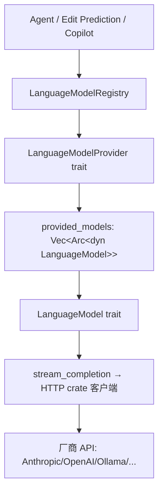
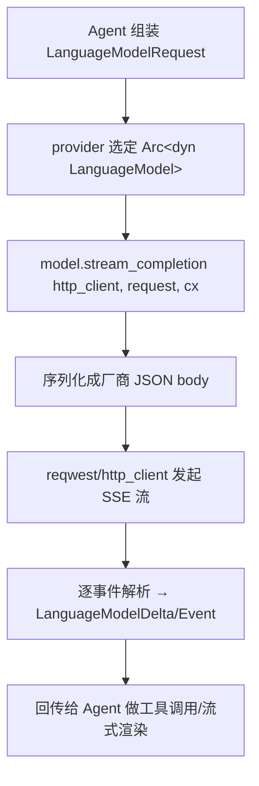

# Model Providers（模型 Provider 全厂商详解）

本页深挖 [Agent-and-AI.md](Agent-and-AI.md) 中"模型接入"这一层的完整实现：核心 trait 在 [`language_model`](../crates/language_model)，各厂商 provider 在 [`language_models/src/provider`](../crates/language_models/src/provider)，具体 HTTP 客户端各自独立 crate（`anthropic`/`open_ai`/`ollama`…；`bedrock`、`mistral`、`x_ai`、`open_router`、`opencode`、`openai_subscribed` 已移除）。

## 1. 两大抽象

### `trait LanguageModel`（[language_model.rs:91](../crates/language_model/src/language_model.rs)）
代表"一个可推理的模型"。关键方法（真实签名）：
- `id/name/provider_id/provider_name`(L92-95)、`upstream_provider_id`(L96) —— 标识与"上游真实厂商"（兼容网关用）。
- `is_latest`(L104) / `is_disabled -> Option<DisabledReason>`(L109) / `requires_data_retention`(L116) —— UI 标注与能力门控。
- `refusal_fallback_model_id`(L121) —— 被拒时同厂商回退模型。
- `telemetry_id`(L125)、`api_key`(L127) —— 遥测与鉴权。
- （下文）`stream_completion`/`generate_text` —— 真正的推理入口。

### `trait LanguageModelProvider`（[language_model.rs:366](../crates/language_model/src/language_model.rs)）
代表"一个厂商接入点"。关键方法：
- `provided_models`(L374) / `default_model`(L372) / `default_fast_model`(L373) / `recommended_models`(L375)。
- `is_authenticated`(L378) / `authenticate -> Task<Result<_,AuthenticateError>>`(L379) —— 鉴权状态与登录。
- `settings_view`(L380) / `set_api_key`(L382) —— 设置面板与 API Key 写入。
- `authentication_error_message`(L390) / （未配置凭据提示）—— 可覆写的错误文案（区分 API-key / 订阅 / 账户鉴权）。

## 2. 注册表 `LanguageModelRegistry`
[`registry.rs:46`](../crates/language_model/src/registry.rs)。`init` 时把各 provider 实现注册进表，UI（模型选择器、Agent 设置）从中枚举 providers → models；运行时按 `LanguageModelId` 解析出 `Arc<dyn LanguageModel>` 供 Agent 调用。

## 3. 全部 Provider 实现清单
[`language_models/src/provider.rs`](../crates/language_models/src/provider.rs) 声明的模块（每文件 = 一个 `impl LanguageModelProvider`）：

| Provider 模块 | 文件 | 对应 HTTP crate | 鉴权 |
|---|---|---|---|
| Anthropic | [anthropic.rs](../crates/language_models/src/provider/anthropic.rs) | `anthropic` | API key |
| Anthropic 兼容 | [anthropic_compatible.rs](../crates/language_models/src/provider/anthropic_compatible.rs) | `anthropic` | base_url + key |
| OpenAI | [open_ai.rs](../crates/language_models/src/provider/open_ai.rs) | `open_ai` | API key |
| OpenAI 兼容 | [open_ai_compatible.rs](../crates/language_models/src/provider/open_ai_compatible.rs) | `open_ai` | base_url + key |
| OpenAI 订阅（已移除 · 历史） | [openai_subscribed.rs](../crates/language_models/src/provider/openai_subscribed.rs) | `openai_subscribed` | ChatGPT 账户 OAuth |
| Mistral（已移除 · 历史） | [mistral.rs](../crates/language_models/src/provider/mistral.rs) | `mistral` | API key |
| DeepSeek | [deepseek.rs](../crates/language_models/src/provider/deepseek.rs) | `deepseek` | API key |
| Google (Gemini) | [google.rs](../crates/language_models/src/provider/google.rs) | `google_ai` | API key |
| Bedrock（已移除 · 历史） | [bedrock.rs](../crates/language_models/src/provider/bedrock.rs) (~149KB) | `bedrock` + `aws_http_client` | SigV4/region |
| xAI（已移除 · 历史） | [x_ai.rs](../crates/language_models/src/provider/x_ai.rs) | `x_ai` | API key |
| Codestral（已移除 · 历史） | （mistral 系，`codestral` crate 已删除）| `codestral` | API key |
| Ollama（本地）| [ollama.rs](../crates/language_models/src/provider/ollama.rs) | `ollama` | 无/本地 |
| LM Studio | [lmstudio.rs](../crates/language_models/src/provider/lmstudio.rs) | `lmstudio` | 本地 |
| llama.cpp | [llama_cpp.rs](../crates/language_models/src/provider/llama_cpp.rs) (~76KB) | `llama_cpp` | 本地 |
| OpenRouter（已移除 · 历史） | [open_router.rs](../crates/language_models/src/provider/open_router.rs) | `open_router` | API key |
| Vercel AI Gateway（已移除 · 历史） | [vercel_ai_gateway.rs](../crates/language_models/src/provider/vercel_ai_gateway.rs) | — | API key |
| opencode（已移除 · 历史） | [opencode.rs](../crates/language_models/src/provider/opencode.rs) | `opencode` | 账户 |
| Copilot Chat | [copilot_chat.rs](../crates/language_models/src/provider/copilot_chat.rs) | `copilot_chat` | GitHub 授权 |
| Zed Cloud | [cloud.rs](../crates/language_models/src/provider/cloud.rs) | `cloud_llm_client` | Zed 账号 |
| 通用 API 兼容 | [api_compatible.rs](../crates/language_models/src/provider/api_compatible.rs) | — | 自定义 |

## 4. 自定义请求头与兼容层
[`provider.rs`](../crates/language_models/src/provider.rs) 的 `resolve_custom_headers`（L31）：在设置加载时校验用户自定义 header，丢弃被 Zed 托管的保留头（`COMMON_RESERVED_HEADER_NAMES` L26：`Authorization`/`Content-Type`/`Accept`）与非法名，返回 `CustomHeaders`（`http_client`）。这让 `*_compatible` provider 能安全转发到任意 base_url。

## 5. 一次推理调用的流程

`LanguageModelRequest`/消息/工具定义类型在 [`language_model_core`](../crates/language_model_core)（见 [Module-Index.md](Module-Index.md)）。本地 provider（ollama/lmstudio/llama_cpp）额外负责探测/拉起本地服务并列举已下载模型。

## 6. 与其他页面的关系
- 上层使用：[Agent-and-AI.md](Agent-and-AI.md)。
- Copilot 补全旁路：见 `copilot_chat` provider。
- 设置面板/凭据：[Settings-and-Themes.md](Settings-and-Themes.md) + `credentials_provider`。
- HTTP 底座：见 G5 网络族（[Module-Index.md](Module-Index.md)）。
