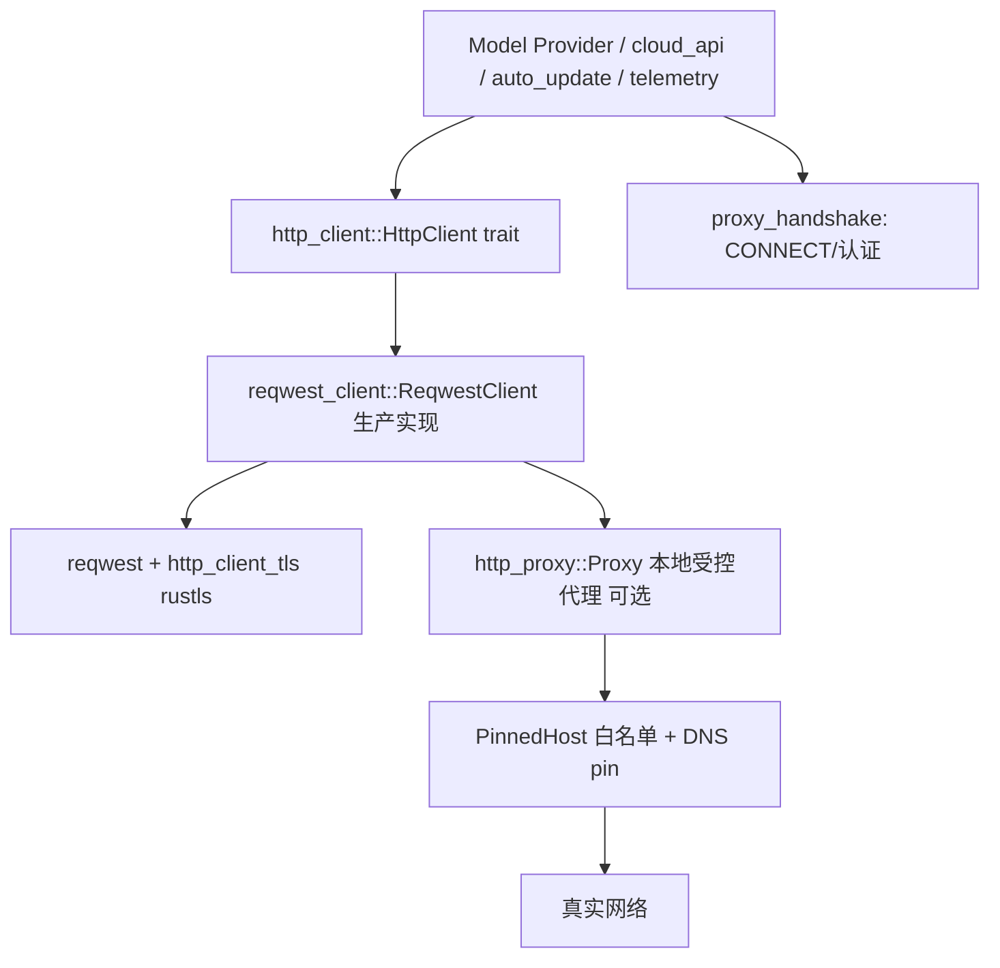

# Network & HTTP（http_client / reqwest / proxy 全链）

覆盖 [`http_client`](../crates/http_client)（抽象 trait）、[`reqwest_client`](../crates/reqwest_client)（生产实现）、[`http_client_tls`](../crates/http_client_tls)（TLS）、[`net`](../crates/net)（Unix socket）、[`http_proxy`](../crates/http_proxy)（本地受控代理）、[`proxy_handshake`](../crates/proxy_handshake)（CONNECT 握手）。这是**所有 AI provider、云 API、自动更新、遥测**共用的网络底座。

## 1. 分层

## 2. http_client：统一抽象
[`http_client.rs`](../crates/http_client/src/http_client.rs)

| 符号 | 位置 | 作用 |
|---|---|---|
| `trait HttpClient` | [L123](../crates/http_client/src/http_client.rs) | 全站唯一 HTTP 出口抽象 |
| `HttpClient::send` | [L128](../crates/http_client/src/http_client.rs) | 唯一必需方法：发 `http::Request<AsyncBody>` |
| `get` / `post_json` | [L133](../crates/http_client/src/http_client.rs) / [L154](../crates/http_client/src/http_client.rs) | 便捷封装（含 `RedirectPolicy`） |
| `user_agent` / `proxy` | [L124](../crates/http_client/src/http_client.rs) / [L126](../crates/http_client/src/http_client.rs) | 元信息 |
| `as_fake`（test-support） | [L172](../crates/http_client/src/http_client.rs) | 测试替换 |
| `struct CustomHeaders` | [L77](../crates/http_client/src/http_client.rs) | 注入的自定义头（见 [Model-Providers.md](Model-Providers.md)） |

用 `http` crate 的标准类型（`Request`/`Response`/`HeaderName`）+ 自定义 `AsyncBody`，使上层与具体实现（reqwest / 平台 / fake）解耦，也让 GPUI 的 `App`/`BackgroundExecutor` 能统一注入。

## 3. reqwest_client：生产实现
[`reqwest_client.rs`](../crates/reqwest_client/src/reqwest_client.rs)

| 符号 | 位置 | 作用 |
|---|---|---|
| `struct ReqwestClient` | [L21](../crates/reqwest_client/src/reqwest_client.rs) | `impl HttpClient`（基于 reqwest） |
| `ReqwestClient::new` | [L52](../crates/reqwest_client/src/reqwest_client.rs) | 默认构造 |
| `user_agent` | [L59](../crates/reqwest_client/src/reqwest_client.rs) | 带 UA |
| `proxy_and_user_agent` | [L66](../crates/reqwest_client/src/reqwest_client.rs) | 带代理 |
| `proxy_user_agent_and_read_timeout` | [L83](../crates/reqwest_client/src/reqwest_client.rs) | 全参构造 |
| `ReqwestClient::runtime()` | [L123](../crates/reqwest_client/src/reqwest_client.rs) | 共享 tokio 运行时（经 `gpui_tokio`） |

`http_client_tls` 提供 rustls 配置与根证书，保证跨平台一致 TLS。

## 4. net：本地 socket
[`crates/net/src`](../crates/net/src)：跨平台 `UnixListener`([listener.rs:18](../crates/net/src/listener.rs))/`UnixStream`([stream.rs:16](../crates/net/src/stream.rs))/`UnixSocket`([socket.rs:13](../crates/net/src/socket.rs))，并在 Windows 上以 AF_UNIX/`SOCKET` 实现（`accept`/`connect`/`into_split`）。供 IPC、oauth 回调、代理本地监听使用。

## 5. http_proxy：本地受控代理（安全边界）
[`crates/http_proxy/src`](../crates/http_proxy/src) —— 这是 Agent/沙箱网络治理的核心：起一个**本地代理**，对出站请求做**主机白名单 + IP 固定 + 私网屏蔽**。

| 符号 | 位置 | 作用 |
|---|---|---|
| `struct ProxyConfig` | [`proxy.rs:39`](../crates/http_proxy/src/proxy.rs) | 白名单/规则配置 |
| `ProxyHandle::spawn` | [L163](../crates/http_proxy/src/proxy.rs) | 启动 TCP 代理 |
| `spawn_unix` / `spawn_unix_temp` | [L216](../crates/http_proxy/src/proxy.rs) / [L207](../crates/http_proxy/src/proxy.rs) | Unix socket 代理 |
| `enum RequestMethod` / `RequestOutcome` / `DenyReason` | [L56](../crates/http_proxy/src/proxy.rs) / [L72](../crates/http_proxy/src/proxy.rs) / [L79](../crates/http_proxy/src/proxy.rs) | 请求/结果/拒绝原因 |
| `enum ProxyEvent` | [L119](../crates/http_proxy/src/proxy.rs) | 可观测事件（放行/拦截） |
| `struct UpstreamProxy` | [`upstream.rs:29`](../crates/http_proxy/src/proxy/upstream.rs) | 上游（企业）代理 |
| `UpstreamProxy::from_env` / `parse` / `bypasses` | [L83](../crates/http_proxy/src/proxy/upstream.rs) / [L105](../crates/http_proxy/src/proxy/upstream.rs) / [L178](../crates/http_proxy/src/proxy/upstream.rs) | 读 `HTTPS_PROXY`/`NO_PROXY` |
| `struct PinnedHost` | [`pinned_host.rs:60`](../crates/http_proxy/src/pinned_host.rs) | DNS 解析后固定 IP（防 TOCTOU/rebind） |
| `PinnedHost::resolve_for_allowlist` | [L92](../crates/http_proxy/src/pinned_host.rs) | 仅允许白名单主机 |
| `is_forbidden_ip` | [L158](../crates/http_proxy/src/pinned_host.rs) | 屏蔽回环/私网/链路本地 |

## 6. proxy_handshake：CONNECT 与认证
[`crates/proxy_handshake/src`](../crates/proxy_handshake/src)：处理"经代理建立到目标的隧道"。

| 符号 | 位置 | 作用 |
|---|---|---|
| `struct ProxySpec` | [`proxy_handshake.rs:50`](../crates/proxy_handshake/src/proxy_handshake.rs) | 代理 URL 解析结果 |
| `enum ProxyScheme` | [L61](../crates/proxy_handshake/src/proxy_handshake.rs) | http/https/socks 等 |
| `struct Credentials` | [L75](../crates/proxy_handshake/src/proxy_handshake.rs) | 代理认证 |
| `struct Target` | [L95](../crates/proxy_handshake/src/proxy_handshake.rs) | 目标主机端口 |
| `ProxySpec::parse` | [L170](../crates/proxy_handshake/src/proxy_handshake.rs) | 从 URL 解析 |
| `remote_dns` / `tls` | [L214](../crates/proxy_handshake/src/proxy_handshake.rs) / [L223](../crates/proxy_handshake/src/proxy_handshake.rs) | 远端解析 / TLS 能力 |
| `no_proxy_matches` | [L242](../crates/proxy_handshake/src/proxy_handshake.rs) | `NO_PROXY` 匹配 |
| `struct Handshake` / `enum Step` | [`handshake.rs:27`](../crates/proxy_handshake/src/handshake.rs) / [L34](../crates/proxy_handshake/src/handshake.rs) | 握手状态机 |
| `Handshake::advance` | [L125](../crates/proxy_handshake/src/handshake.rs) | 喂入响应推进 |
| `struct Tunneled<S>` | [`tokio.rs:55`](../crates/proxy_handshake/src/tokio.rs) | 握手完成后的隧道流封装 |

## 7. 与其他页面的关系
- 消费者：[Model-Providers.md](Model-Providers.md)、云 API、自动更新、遥测。
- 与 `sandbox` 配合限制 Agent 命令网络：见 [Module-Index.md](Module-Index.md) 第 1 类。
- tokio 运行时桥接：`gpui_tokio`（[GPUI-Internals.md](GPUI-Internals.md)）。
