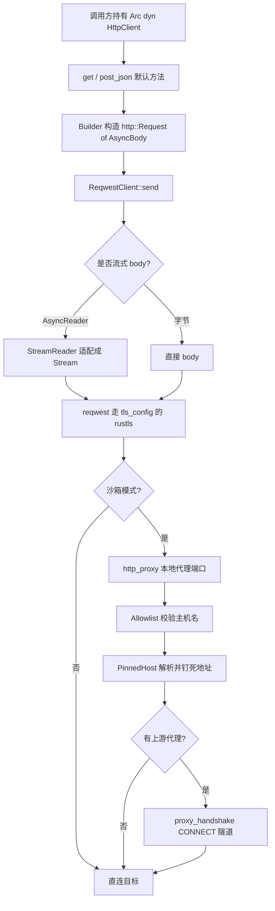

# Network & HTTP 深入解析（Deep Dive）

> 本页覆盖 Zed 的网络与 HTTP 抽象栈：`http_client`（契约层）、`reqwest_client`（默认实现）、`http_client_tls`（TLS 配置）、`http_proxy`（沙箱内进程级代理 + 允许清单）、`proxy_handshake`（CONNECT/SOCKS5 隧道握手）、`net`（Windows 平台 Unix 域套接字补齐）、`session`（应用会话标识）。共 7 个 crate。

## 1. 分层设计

Zed 把"发一个 HTTP 请求"抽象成可替换的 trait，让生产实现（reqwest）、测试实现（Fake）、以及沙箱受限实现（本地代理）互不耦合：

- **契约层** `http_client`：定义 `trait HttpClient`、请求/响应体 `AsyncBody`、URL 构建器 `HttpClientWithUrl`，以及测试替身 `FakeHttpClient`/`BlockedHttpClient`。全代码库只依赖此 trait。
- **实现层** `reqwest_client`：`struct ReqwestClient` 用 `reqwest` + 常驻 tokio runtime 实现 `send`，并把同步 `AsyncRead` 包装成流式 body。
- **TLS 层** `http_client_tls`：单一函数 `tls_config()` 产出 rustls `ClientConfig`，统一根证书与 ALPN。
- **代理策略层** `http_proxy`：一个跑在父进程里的 HTTP/HTTPS 代理，对沙箱子进程强制执行主机名允许清单，含 DNS 重绑定防护（`PinnedHost`）。
- **隧道握手层** `proxy_handshake`：解析 `HTTP CONNECT` 与 `SOCKS5` 的字节级状态机（`Handshake`/`Step`），供上层建立到上游代理的隧道。
- **平台补齐层** `net`：Windows 上没有原生 `UnixListener`/`UnixStream`，此 crate 用 `SOCKADDR_UN` 手动实现。
- **会话层** `session`：`Session`/`AppSession` 维护一次应用生命周期的会话 ID 与窗口栈（用于崩溃关联与"恢复上次会话"）。

## 2. 类型总览

| 符号 | 文件:行 | 角色 |
| --- | --- | --- |
| `trait HttpClient` | http_client.rs:123 | HTTP 客户端统一契约（`'static + Send + Sync`） |
| `enum RedirectPolicy` | http_client.rs:22 | 重定向策略（FollowAll / NoFollow） |
| `struct FollowRedirects` | http_client.rs:28 | newtype 请求扩展开关 |
| `struct RequestTimeout` | http_client.rs:31 | 单次请求超时（`Duration`） |
| `trait HttpRequestExt` | http_client.rs:33 | 对 `http::Request` 的条件式扩展 |
| `struct CustomHeaders` | http_client.rs:77 | `Arc<[(HeaderName,HeaderValue)]>` 批量头 |
| `trait RequestBuilderExt` | http_client.rs:104 | 给 reqwest/hyper builder 注入自定义头 |
| `struct HttpClientWithProxy` | http_client.rs:179 | 带可选 `proxy_url` 的 Deref 包装 |
| `struct HttpClientWithUrl` | http_client.rs:226 | 带 base_url，构建 Zed API/Cloud URL |
| `struct BlockedHttpClient` | http_client.rs:379 | 直接失败的占位实现 |
| `struct FakeHttpClient` | http_client.rs:424 | 测试替身，`Mutex<Option<FakeHttpHandler>>` |
| `struct ReqwestClient` | reqwest_client.rs:21 | 生产实现 |
| `struct StreamReader` | reqwest_client.rs:152 | 把 `AsyncRead` 适配成 `Stream` body |
| `fn tls_config()` | http_client_tls.rs:8 | 产出统一 rustls `ClientConfig` |
| `struct ProxyConfig` | proxy.rs:39 | 代理启动配置（允许清单 + 上游） |
| `enum RequestMethod` | proxy.rs:56 | CONNECT / 转发方法 |
| `enum RequestOutcome` | proxy.rs:72 | 单请求裁决结果 |
| `enum DenyReason` | proxy.rs:79 | 拒绝原因（不在清单 / 私网 IP 等） |
| `enum ProxyEvent` | proxy.rs:119 | allowed/denied/completed 事件上报 |
| `struct ProxyHandle` | proxy.rs:146 | 运行中代理句柄（`port`/`socket_path`） |
| `struct UpstreamProxy` | upstream.rs:29 | 链式上游 HTTP 代理（来自环境） |
| `struct UpstreamAuth` | upstream.rs:61 | 上游代理 Basic 认证 |
| `struct PinnedHost` | pinned_host.rs:60 | 连接钉死到首次批准地址 |
| `enum PinnedHostError` | pinned_host.rs:30 | 钉死/解析失败 |
| `struct Allowlist` | allowlist.rs:217 | 主机名允许清单 |
| `enum HostPattern` | allowlist.rs:25 | 精确名 / `*.` 子域通配 |
| `struct Handshake` | handshake.rs:27 | CONNECT 字节级状态机 |
| `enum Step` | handshake.rs:34 | 握手推进状态 |
| `struct ProxySpec` | proxy_handshake.rs:50 | 代理端点规格（scheme/credentials） |
| `enum ProxyScheme` | proxy_handshake.rs:61 | http/https/socks5 |
| `struct Tunneled<S>` | tokio.rs:55 / futures_io.rs:55 | 已建立隧道的连接包装 |
| `struct UnixSocket` | socket.rs:13 | Windows 抽象套接字 |
| `struct UnixListener` | listener.rs:15 / async_net.rs:21 | Windows UDS 监听器（同步/异步） |
| `struct UnixStream` | stream.rs:16 / async_net.rs:34 | Windows UDS 连接 |
| `struct Session` | session.rs:5 | 一次应用会话标识 |
| `struct AppSession` | session.rs:63 | GPUI global 包装，暴露 `id`/窗口栈 |

## 3. 核心方法与调用锚点

**契约 `trait HttpClient`（http_client.rs:123）**
- `user_agent()`(:124) / `proxy()`(:126)：读取客户端身份与代理 URL。
- `send(req: http::Request<AsyncBody>)`(:128)：唯一必需方法，返回 `BoxFuture<Result<Response<AsyncBody>>>`。
- `get(uri, body, follow_redirects)`(:133) / `post_json(uri, body)`(:154)：默认方法，内部构造 `Builder` 后转 `send`。
- `as_fake()`(:172)：仅 `test-support` feature 下暴露测试替身。

**`HttpClientWithUrl`（http_client.rs:226）—— Zed 服务寻址核心**
- `base_url()`(:261) / `set_base_url()`(:266)：可动态切换的后端基址。
- `build_url(path)`(:272)：拼接通用 URL。
- `build_zed_api_url(path, query)`(:277) / `build_zed_cloud_url(path)`(:293) / `build_zed_cloud_url_with_query(path, query)`(:306)：构造 api.zed.dev / cloud 端点。

**`ReqwestClient`（reqwest_client.rs:21）—— 生产实现**
- `new()`(:52) / `user_agent(agent)`(:59) / `proxy_and_user_agent(proxy, ua)`(:66)：构造。
- `proxy_user_agent_and_read_timeout(..)`(:83)：设置读超时——注释解释"静默停滞的流会被中止，而健康的流仅块间安静则不受影响"(:73-82)。
- `runtime()`(:123)：全局常驻 tokio runtime 引用。
- `proxy()`(:260) / `send()`(:268)：实现 `HttpClient`；`send` 内对 `http_client::Inner::AsyncReader(stream)`(:292) 调用 `reqwest::Body::wrap_stream(StreamReader::new(stream))`(:293)。

**`http_proxy` 本地代理（proxy.rs）**
- `spawn(config)`(:163)：TCP 端口启动；`spawn_unix_temp(path)`(:207) / `spawn_unix(path, config)`(:216)：Unix 域套接字启动。
- `ProxyHandle::port()`(:273) / `socket_path()`(:278)：回传给沙箱配置的目标地址。
- `UpstreamProxy::from_env()`(upstream.rs:83) / `parse()`(:105) / `bypasses()`(:178)：读取 `HTTPS_PROXY`/`HTTP_PROXY`/`NO_PROXY`。
- `PinnedHost::resolve()`(pinned_host.rs:75) / `resolve_allowing_any()`(:86) / `resolve_for_allowlist()`(:92) / `socket_addrs()`(:141)；`is_forbidden_ip()`(:158) 判私网/回环/link-local。

**`proxy_handshake` 状态机（handshake.rs）**
- `Handshake::new(spec, target)`(:66)：按 `ProxySpec`+`Target` 生成首个请求字节。
- `advance(received)`(:125)：喂入响应字节，返回下一个 `Step`。
- `tokio::establish::<S>()`(tokio.rs:16) / `futures_io::establish::<S>()`(futures_io.rs:16)：驱动状态机直到隧道建立，返回 `Tunneled<S>`（保留 leftover 字节）。
- `ProxySpec::parse(url)`(proxy_handshake.rs:170) / `remote_dns()`(:214) / `tls()`(:223)；`no_proxy_matches(no_proxy, host)`(:242)。

**`session`（session.rs）**
- `Session::test()`(:41) / `test_with_old_session(old_id)`(:50) / `id()`(:58)。
- `AppSession::new(session, cx)`(:70)；`id()`(:117) / `last_session_id()`(:121) / `last_session_window_stack()`(:130)。

## 4. 请求发送流程

## 5. DNS 重绑定防护

代理运行在沙箱之外，若不加限制，被沙箱进程请求的主名可能先通过清单校验、再解析到 `127.0.0.1`/私网，从而"重开"Seatbelt 已关闭的本地网络。防护链条（pinned_host.rs / proxy.rs 文档 :13-24）：

1. `Allowlist`（allowlist.rs:217）先按 `HostPattern`（精确名或 `*.` 通配）判定主机是否放行；IP 字面量目标除非全放行否则拒绝。
2. `PinnedHost::resolve_for_allowlist`(:92) 解析 DNS，`is_forbidden_ip`(:158) 拒绝回环/私有/link-local 结果。
3. 每条 TCP 连接钉死到首次批准地址（proxy.rs:19-24）：即使后续 keep-alive 请求换了 `Host` 头，也无法被路由到不同主机；链式上游时连纯 HTTP 也走隧道。

## 6. 集成点

- `client` crate 在登录时把 `HttpClientWithUrl` 装进全局，供所有 Zed 服务调用（`build_zed_api_url`）。
- `language_models` / 各厂商 client 只依赖 `Arc<dyn HttpClient>`，故测试用 `FakeHttpClient` 注入桩响应。
- `gpui_tokio` 与 `reqwest_client::runtime()`(:123) 共用同一 tokio 运行时，避免多 runtime 冲突。
- `sandbox` crate 启动终端命令时 `http_proxy::spawn`(:163) 起代理，并把返回的 `ProxyHandle::port()`(:273) 写进沙箱网络白名单，使子进程出网必须经此代理。
- `net` 的 Windows `UnixStream`/`UnixListener` 供 `remote`（原还包括已移除的 `collab`）在 Windows 上做本地 IPC。
- `session::AppSession` 注册为 GPUI global，`crashes`/遥测读取 `id()`(:117) 关联崩溃与更新事件。

## 7. 相关页

- [Telemetry-and-Updates-Deep-Dive](Telemetry-and-Updates-Deep-Dive.md)（`session` 与自动更新的衔接）
- [Persistence-Deep-Dive](Persistence-Deep-Dive.md)（配置/DB 迁移）
- [Extension-Host-Deep-Dive](Extension-Host-Deep-Dive.md)（扩展下载走 `http_client`）
- [Network-And-HTTP](Network-And-HTTP.md)（网络与 HTTP 族概览）
