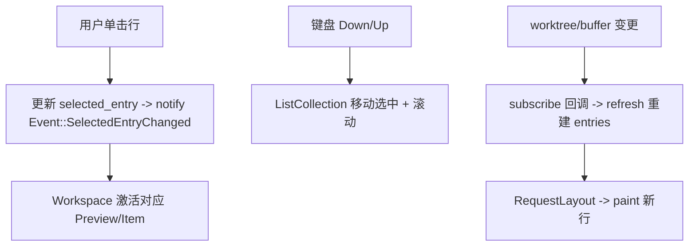

# Deep Reference: side panels (project_panel / outline_panel / call_hierarchy)

> 参考手册级：三个典型 **dock 面板 `Item`**。它们共享同一套 GPui/Workspace 约定（`impl Item` + `impl Render` + `ListCollection` 虚拟列表 + `Settings`），但各自管理不同的数据源与交互。是理解 [Workspace-Deep-Dive.md](Workspace-Deep-Dive.md) `Item`/`Dock` 机制的最佳样本。

## 0. 共同骨架
| 约定 | 来源 | 说明 |
|---|---|---|
| `impl Item for XxxPanel` | [workspace::Item](Workspace-Deep-Dive.md) | 提供 tab 内容、`is_dirty`/`save`、`project_path`、`activate`/`deactivate`、`to_item_proto`/`from_proto`（持久化恢复） |
| `ListCollection<ItemHandle>` | `crates/ui` | 虚拟化行（只渲染可见区）；键盘上下/展开折叠/多选 |
| `enum Event` | 各面板 | 向 `Workspace`/其它面板广播（如"选中项变了"→ 预览跟随） |
| `XxxSettings` | 各 `*_settings.rs` | `#[settings]` 声明式，见 [Settings-and-Themes.md](Settings-and-Themes.md) |
| 订阅数据源 `Entity` | `cx.subscribe(...)` | worktree/buffer 变更触发 `refresh` |

## 1. `crates/project_panel`：文件树 [`project_panel.rs`](../crates/project_panel/src/project_panel.rs)
| 类型 | 位置 | 角色 |
|---|---|---|
| `struct ProjectPanel` | [L137](../crates/project_panel/src/project_panel.rs) | 左 dock `Item`；持 `worktree: Entity<Worktree>`（[Project-Deep-Dive.md](Project-Deep-Dive.md)）、`entries: Vec<ProjectPanelEntry>`、选中/编辑态、`active_item_handle` |
| `enum Event` | [L596](../crates/project_panel/src/project_panel.rs) | `OpenedBuffer`/`UpdatedHistoryEntries`/`RootPathsChanged`… |
| `struct UndoManager` | [undo.rs:350](../crates/project_panel/src/undo.rs) | 文件操作（新建/重命名/移动/删除）可撤销栈 |
| `struct ProjectPanelSettings` | [project_panel_settings.rs:13](../crates/project_panel/src/project_panel_settings.rs) | `IndentGuidesSettings`(L43)/`ScrollbarSettings`(L48)/`AutoOpenSettings`(L61)、`file_icons`/`fold_single_child_dirs` |
数据流：`Worktree` 的 `SumTree<Entry>`（[Sum-Tree-Deep-Dive.md](Sum-Tree-Deep-Dive.md)）经 `flatten` 成可见 `ProjectPanelEntry` 列表 → 折叠/展开维护 `expanded_dirs` → `ListCollection` 渲染。
主要动作（actions.rs / project_panel.rs）：`NewFile`/`NewDirectory`/`Rename`/`Delete`/`Copy`/`Cut`/`Paste`、`ToggleCollapse`/`CollapseAll`、`ExpandDir`/`Open`/`RevealInFinder`、`CopyPath`/`CopyRelativePath`、drag&drop 移动。
辅助文件：`project_panel.rs` 内含 popup 菜单、`new_item`、`on_action`；另有 `items.rs`/`settings`。→ 概览 [Project-Panel-and-FS](Project-Panel-and-FS.md)。

## 2. `crates/outline_panel`：符号 + 文件混合树 [`outline_panel.rs`](../crates/outline_panel/src/outline_panel.rs)
| 类型 | 位置 | 角色 |
|---|---|---|
| `struct OutlinePanel` | [L115](../crates/outline_panel/src/outline_panel.rs) | 面板 `Item`：把**活动 buffer 的 symbol outline**（`Outline`，[Language-Deep-Dive.md](Language-Deep-Dive.md)）与 worktree 结构合成一棵可导航树 |
| `enum Event` | [L648](../crates/outline_panel/src/outline_panel.rs) | `SelectedEntryChanged`/`ActiveEntryChanged`/`OpenedBuffer`/`Refresh`… |
| `struct OutlinePanelSettings` | [outline_panel_settings.rs:8](../crates/outline_panel/src/outline_panel_settings.rs) | `SortBy`(名称/位置)、`Autoscroll`、`ScrollbarSettings`(L25)/`IndentGuidesSettings`(L33) |
两种模式：`Symbols`（函数/类/字段大纲）与 `Files`（文件树）；符号来自 `language::Buffer::outline`（[Multi-Buffer-Deep-Dive.md](Multi-Buffer-Deep-Dive.md)/Language），编辑/重解析后 `refresh`。选中符号 → 通知编辑器跳转（`Outline` 位置）。→ 概览 [LSP-Features](LSP-Features.md)。

## 3. `crates/call_hierarchy`：调用层级 [`call_hierarchy.rs`](../crates/call_hierarchy/src/call_hierarchy.rs)
| 类型 | 位置 | 角色 |
|---|---|---|
| `struct CallHierarchyView` | [L160](../crates/call_hierarchy/src/call_hierarchy.rs) | 中心区 `Item`：树状展示某函数的**调用者/被调用者**（LSP `callHierarchy/*`），方向切换 |
| `enum CallHierarchyMode` | [L32](../crates/call_hierarchy/src/call_hierarchy.rs) | `Incoming`（谁调用它）｜`Outgoing`（它调用谁） |
| `struct Call` / `struct CallDisplay` | [L48](../crates/call_hierarchy/src/call_hierarchy.rs)/[L57](../crates/call_hierarchy/src/call_hierarchy.rs) | 一条调用边 / 带 UI 元数据的展示态 |
| `struct CallHierarchySettings` | [L69](../crates/call_hierarchy/src/call_hierarchy.rs) | 默认方向等 |
| `struct CallHierarchyDelegate` | [L339](../crates/call_hierarchy/src/call_hierarchy.rs) | `ItemDelegate`（tab 渲染/导航） |
数据来自 `LspStore` 的 `PrepareCallHierarchy`/`IncomingCalls`/`OutgoingCalls`（[Project-Deep-Dive.md](Project-Deep-Dive.md) `lsp_store`），每展开一层再发一次请求（懒加载树）。由编辑器 `ToggleCallHierarchy` 动作从光标处发起（[Editor-Deep-Dive.md](Editor-Deep-Dive.md)）。→ 概览 [LSP-Features](LSP-Features.md)。

## 4. 面板通用交互（以 project_panel 为例）

## 5. 相关页
- `Item`/`Dock`/`PaneGroup` 布局根：[Workspace-Deep-Dive.md](Workspace-Deep-Dive.md)
- GPui `ListCollection`/元素机制：[GPUI-Deep-Dive.md](GPUI-Deep-Dive.md)
- 其它同类面板（`project_symbols`/`search`/`diagnostics`）见 [Module-Index.md](Module-Index.md) 与概览页 [Project-Panel-and-FS](Project-Panel-and-FS.md)、[Search](Search.md)。
