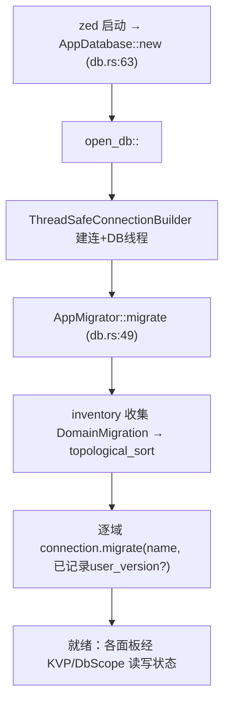

# 持久化深挖（SQLite：`sqlez`/`db` · 域迁移 · KVP · `migrator` 配置迁移）

> 返回 [Home](Home) · [Module-Index](Module-Index)
>
> 概览见 [Persistence.md](Persistence.md)。本页是**参考手册级**，覆盖 Zed 本地存储栈：`sqlez`（线程安全 SQLite 封装）· `db`（应用级 `AppDatabase`/键值存储 `KVP`/域迁移）· `sqlez_macros`（编译期 SQL 校验）· `migrator`（**另一套体系**：`settings.json`/`keymap.json` 的 JSON 结构迁移）。所有 `文件:行号` 均来自 `grep`/`read` 确证。

## 1. 两套"迁移"勿混淆

```mermaid
graph TB
    subgraph SQLite 存储栈
    SUE["sqlez: Connection/Statement/ThreadSafeConnection"]
    DB["db: AppDatabase + DomainMigration (inventory) + KVP"]
    MAC["sqlez_macros: sql! 编译期校验"]
    DB --> SUE
    MAC --> SUE
    end
    subgraph 配置文件迁移 (JSON)
    MIG["migrator: migrate_settings/migrate_keymap + migrations/m_日期/settings.rs"]
    end
    SUE -.存 KV/会话.-> DB
    MIG -.重写用户 settings.json.-> SET["settings crate"]
```

- **SQLite 迁移**：`db::AppMigrator` 按依赖顺序应用各 `DomainMigration`（SQL 建表/改表）。
- **配置迁移**：`migrator` crate 用 serde_json `Value` 变换重写用户 `settings.json`/`keymap.json`，与 SQLite 无关。

## 2. `sqlez`（SQLite 封装 · `crates/sqlez/src/`）

| 类型 | 位置 | 角色 |
| --- | --- | --- |
| `struct Connection` | connection.rs:12 | 原始 SQLite 连接（`libsqlite_sys`），`migrate` 入口 |
| `struct ThreadSafeConnection` | thread_safe_connection.rs:34 | **可跨线程 clone 的连接句柄**（channel 转发到 DB 线程） |
| `struct ThreadSafeConnectionBuilder<M: Migrator>` | thread_safe_connection.rs:44 | 建连并跑迁移器 `M` |
| `struct Statement<'a>` | statement.rs:11 | 预编译语句：`prepare`(40)/`bind<T:Bind>`(246)/`step`/`exec`(292) |
| `enum StepResult` / `enum SqlType` | statement.rs:25 / 31 | 步进结果（`Row`/`Done`）/ 列类型 |
| `trait Bind` / `trait Column` / `trait StaticColumnCount` | bindable.rs:19 / 23 / 12 | Rust⇄SQLite 列编解码（`#[derive]` 由 sqlez_macros 提供） |
| `trait Domain` / `trait Migrator` | domain.rs:3 / 12 | 域迁移单元 / 迁移器契约 |
| `fn migrate` | migrations.rs:37 | 应用命名迁移序列（记录 `user_version`/已应用表） |
| `savepoint.rs` | 4.8KB | 嵌套事务（SAVEPOINT/RELEASE/ROLLBACK TO） |
| `typed_statements.rs`：`fn exec` | typed_statements.rs:15 | 配合 `sql!` 的类型化语句缓存 |
| `struct UnboundedSyncSender<T>` | util.rs:11 | 同步无界 channel（DB 线程通信） |

## 3. `db`（应用级存储 · `crates/db/src/`）

| 类型 | 位置 | 角色 |
| --- | --- | --- |
| `struct AppDatabase(pub ThreadSafeConnection)` | db.rs:41 | **`Global`**（:43），进程唯一数据库句柄 |
| `fn new()` | db.rs:63 | `open_db::<AppMigrator>` 打开生产库并跑迁移 |
| `struct DomainMigration` | db.rs:30 | 一个功能域的迁移条目（`inventory` 自注册） |
| `struct AppMigrator` / `impl Migrator::migrate` | db.rs:46 / 49 | **收集所有 `DomainMigration`→`topological_sort`(51) 依赖排序→逐个 `connection.migrate`(54)** |
| `trait DbScope` / `struct GlobalDbScope` | db.rs:143 / 154 | 作用域化访问（`App`/`Context` 拿 DB） |
| `fn write_and_log` | db.rs:287 | 写事务 + 遥测记录，返回 `Task` |
| `struct KeyValueStore` | kvp.rs:12 | KVP 表（命名空间→键→值），UI 状态持久化底座 |
| `struct ScopedKeyValueStore` / `GlobalKeyValueStore` | kvp.rs:97 / 224 | 带作用域前缀 / 全局 KVP；`fn read`(103)/`read_kvp`(67) |
| `trait Dismissable` | kvp.rs:43 | "可忽略项"协议（记住用户关闭过的提示/面板） |

## 4. `sqlez_macros`（编译期 SQL · `crates/sqlez_macros/src/`）

- `pub fn sql!`（sqlez_macros.rs:16，`#[proc_macro]`）：在编译期把 SQL 字符串解析/校验并生成 `TypedStatement` 相关代码，配合 `exec!`/`prepare!` 与 `Bind`/`Column` derive，让查询在编译期就检查列数/类型。

## 5. `migrator`（配置/键位 JSON 迁移 · `crates/migrator/src/`）

**独立于 SQLite**，负责把旧版 `settings.json`/`keymap.json` 升级到当前 schema（供 `zed` 启动时调用，见 [Settings-and-Onboarding-Deep-Dive](Settings-and-Onboarding-Deep-Dive.md)）：

| 符号 | 位置 | 角色 |
| --- | --- | --- |
| `fn migrate_settings` | migrator.rs:159（166KB 主文件） | 解析 `settings.json`→按日期顺序应用变换→回写 |
| `fn migrate_keymap` | migrator.rs:120 | `keymap.json` 结构升级 |
| `fn migrate_edit_prediction_provider_settings` | migrator.rs:263 | 编辑预测 provider 专项迁移 |
| `migrations/m_YYYY_MM_DD/settings.rs`（41 目录） | 如 `m_2026_02_04`：`migrate_tool_permission_defaults` 等 | 每日期一个 `pub fn(&mut Value)->Result<()>` 幂等变换（改字段/枚举化/重命名/嵌套） |
| `patterns.rs` + `patterns/` | 0.5KB | 复用匹配模式（如 glob/键位映射） |

典型变换示例（均确证）：`make_auto_indent_an_enum`(m_2025_01_27)、`remove_formatters_on_save`(m_2025_10_02)、`rename_web_search_to_search_web`(m_2026_04_10)、`restructure_profiles_with_settings_key`(m_2026_04_01)、`migrate_builtin_agent_servers_to_registry`(m_2026_02_25)。

## 6. 打开数据库并迁移的流程



## 7. 相关页

- 使用方：`project`/`worktree`（历史）、`editor`（选择/标记）、`agent`（会话持久化）、各 `*_selector`/面板 UI 状态（KVP）。
- 配置迁移目标：[Settings-and-Onboarding-Deep-Dive.md](Settings-and-Onboarding-Deep-Dive.md)。
- 概览：[Persistence.md](Persistence.md)
- 导航：[Home](Home) · [Module-Index](Module-Index)
