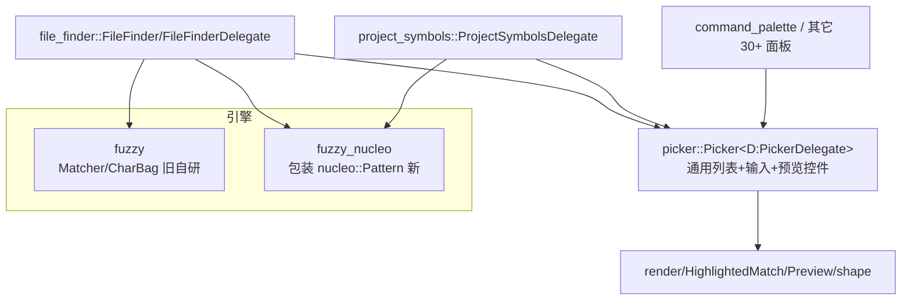
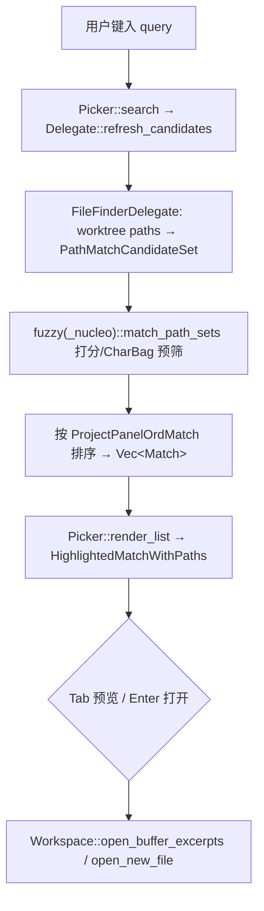

# Picker 家族深挖（选择器 · 模糊匹配 · 文件/符号查找）

> 返回 [Home](Home) · [Module-Index](Module-Index)
>
> 概览见 [Picker-and-Commands.md](Picker-and-Commands.md)。本页是**函数/类型级参考手册**，覆盖"选择器全家桶"：`picker`（通用 `Picker` 控件 + `PickerDelegate`）、`fuzzy` / `fuzzy_nucleo`（两套并存的模糊匹配引擎）、`file_finder`（文件查找）、`project_symbols`（项目符号跳转）。所有符号均来自 `grep`/`read` 确证（`文件:行号`）。

## 1. 分层总览

## 2. `picker`（通用选择器控件 · `picker.rs` 70KB）

| 类型 | 行 | 角色 |
| --- | --- | --- |
| `struct Picker<D: PickerDelegate>` | 127 | **泛型选择器 Entity**：托管查询输入框、候选列表、高亮、预览、页脚；`D` 决定内容 |
| `trait PickerDelegate` | 164 | **宿主面板实现面**：`selected_index`(171)、`confirm(secondary,..)`(255)、`search`/`refresh_candidates`(异步刷候选)、`render_list`、`update_match_count`、`placeholder`、`match_text`… |
| `enum Direction` | 53 | `Up`/`Down` 移动高亮 |
| `enum ScrollBehavior` | 59 | 滚动策略（`KeepCentered`/`ScrollOnlyIfInVisibleArea`…） |
| `struct ConfirmInput` | 94 | 确认输入（含 `secondary`） |
| `enum PickerEditorPosition` | 156 | 输入框在列表上/下 |

**支撑模块**（`crates/picker/src/`）：

- `highlighted_match_with_paths.rs`：`struct HighlightedMatch`(12) 单条候选（分数条 + 富文本高亮）、`struct HighlightedMatchWithPaths`(4) 带路径分段展示
- `preview.rs`：`struct Preview`(21)、`struct MatchLocation`(86)、`struct Update`(94) —— 右侧编辑器联动预览
- `shape.rs`（23KB）：`struct ViewportFraction`(155)、`struct SizeBounds`(228) —— 弹窗尺寸随视口自适应
- `footer.rs`(8KB)/`head.rs`(2.5KB)：底部快捷键/模式提示、头部；`persistence.rs`(5KB) 最近项持久化
- `render.rs`(18KB) + `render/window_controls.rs`（`DragPreview` 67）：渲染与窗口拖拽；`popover_menu.rs`：`struct PickerPopoverMenu<T,TT,P>`(11) 复用为右键菜单

> 设计：`Picker<D>` 只认 `PickerDelegate`，所有面板（命令面板、文件查找、符号跳转、主题选择…）都是"一个 delegate 实现 + 一个 `Picker` 实体"。

## 3. 模糊匹配双引擎（`fuzzy` vs `fuzzy_nucleo`）

两 crate **暴露同名 API 面**，可互换（迁移中）：

| 概念 | `fuzzy`（旧自研） | `fuzzy_nucleo`（新，包 `nucleo`） |
| --- | --- | --- |
| 字符串匹配 | `match_strings` + `struct StringMatch`(strings.rs:43)、`StringMatchCandidate`(16) | `match_strings`/`match_strings_async` + 同名 `StringMatch`(strings.rs:42)/`StringMatchCandidate`(20) |
| 路径匹配 | `match_path_sets`/`match_fixed_path_set` + `PathMatch`(paths.rs:25)、`PathMatchCandidate`(18)、`trait PathMatchCandidateSet`(37) | 同名(`paths.rs`:20/46/58) + 异步 |
| 打分核心 | `struct Matcher`(matcher.rs:14) + `trait MatchCandidate`(27)、`struct CharBag`(char_bag.rs:8) | `Query`(fuzzy_nucleo.rs:58) 持 `nucleo::Pattern` |
| 预处理 | —— | `enum Case{Smart,Ignore}`(16)、`enum LengthPenalty{On,Off}`(36) |

`fuzzy_nucleo` 关键设计（见源码注释）：**nucleo 层恒为大小写不敏感**（否则命令面板 `"Editor: Backspace"` 匹配不上动作名 `"editor: backspace"`）；`Case::Smart` 仅作**打分惩罚**——查询含大写时，逐字符大小写不符按 `SMART_CASE_PENALTY_PER_MISMATCH=0.9` 幂次降权（`count_case_mismatches` 91、`case_penalty` 120）。`positions_from_sorted`(130) 把字符级命中还原为字节偏移。`CharBag`(u64 位图) 用于快速预筛（候选须包含查询全部字符）。

## 4. `file_finder`（文件查找 · `file_finder.rs`）

| 类型 | 行 | 角色 |
| --- | --- | --- |
| `struct FileFinder` | 66 | 工作区 `Item`（承载 `Picker`，实现 `Item`/`SearchableItem`） |
| `struct FileFinderDelegate` | 357 | `PickerDelegate` 实现（`impl PickerDelegate` 1783）：查询→匹配 worktree 文件 |
| `struct ProjectPanelOrdMatch(PathMatch)` | 390 | 按项目面板序重排 `PathMatch` 分数 |
| `struct Matches` / `enum Match` | 416 / 422 | 文件匹配 + 新建文件（`New`）/已有（`Existing`）两态 |
| `struct SelectedMatch` | 470 | 当前选中 |
| `struct FileSearchQuery` | 852 | 拆分查询（含 `>`行号、路径分段） |
| `struct FoundPath` | 832 / `PathComponentSlice`(2205) | 命中路径及其分段高亮 |
| `enum Event` | 846 | 打开文件/关闭等 |

流程：输入 → `PathMatchCandidateSet`（worktree 文件）→ `match_path_sets` → 排序（`ProjectPanelOrdMatch`）→ 渲染 `HighlightedMatchWithPaths` → 预览/`Tab`/`Enter` 打开；支持"输入不存在的路径→创建文件"（`Match::New`）与 `line:col` 跳转。

## 5. `project_symbols`（项目符号跳转 · `project_symbols.rs` 24KB）

- `struct ProjectSymbolsDelegate`(41) —— `impl PickerDelegate`(110)；对 `project.symbols(cx, query)` 异步取 `SymbolsResponse`，展开为符号树条目（含文件路径图标、Kinds），选中跳 `Editor` 对应 `Anchor`。
- 复用 `fuzzy_nucleo::match_strings` 做二次过滤（本地缓存符号）。
- 与 outline 面板共享 `language::Symbol`/`FileSymbols` 模型（见 [Language-Deep-Dive.md](Language-Deep-Dive.md)）。

## 6. 一次"打开文件"调用链

## 7. 集成 / 相关页

- 消费者：命令面板 `command_palette`、`outline`、`theme_selector`、`file_finder`、`project_symbols`、`search` 等 30+ 面板皆依赖 `picker`。
- 深页：[Search-Deep-Dive.md](Search-Deep-Dive.md)、[Editor-Deep-Dive.md](Editor-Deep-Dive.md)、[Project-Deep-Dive.md](Project-Deep-Dive.md)、[Project-Panel-and-FS.md](Project-Panel-and-FS.md)、[Panels-Deep-Dive.md](Panels-Deep-Dive.md)、[Data-Structures.md](Data-Structures.md)
- 概览：[Picker-and-Commands.md](Picker-and-Commands.md)
- 导航：[Home](Home) · [Module-Index](Module-Index)
