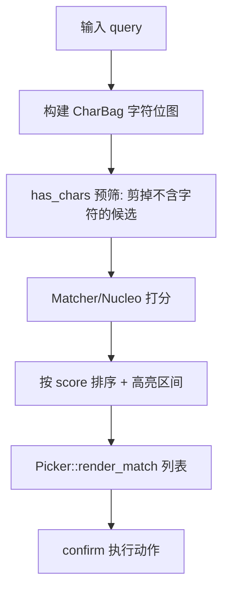

# Picker & Commands（选择器 / 命令面板 / 模糊匹配）

Zed 里凡是"输入框 + 实时过滤列表"的界面（命令面板、文件查找、符号跳转、Git 分支选择……）都复用同一套 **Picker** 框架（[`picker`](../crates/picker)）与 **fuzzy** 匹配引擎（[`fuzzy`](../crates/fuzzy) + 内嵌 nucleo）。

## 1. 三层结构

| 层 | 类型 | 位置 | 职责 |
|---|---|---|---|
| 协议 | `Picker` trait | [`picker.rs:19`](../crates/picker/src/picker.rs) | 一个"可搜索列表"需要实现什么 |
| 状态机 | `Picker<P: PickerDelegate>` | [`picker.rs:138`](../crates/picker/src/picker.rs) | 通用 UI：输入框、匹配列表、滚动、预览、footer |
| 委托 | 各 `*Delegate` | 如 `CommandPaletteDelegate`(`command_palette.rs:169`) | 提供候选、过滤逻辑、渲染与确认行为 |

`Picker` trait 约束：`'static + Sized + EventEmitter<Self::Event> + Render`（L19），核心方法：
- `filter_matches(query, cx) -> Task<Vec<Self::Match>>`（L120）：把查询转成有序匹配（通常后台线程算）。
- `render_match(...)`（L144）：绘制单条匹配。
- `selected_match(cx) -> Option<usize>`（L145）：当前高亮项。
- `confirm(secondary, window, cx)`（L190）：回车/双击选中（`secondary` 区分辅助动作）；`confirm_completion`(L248) 处理 Tab 补全。

## 2. 命令面板（Command Palette）

[`CommandPalette`](../crates/command_palette/src/command_palette.rs)（L38）本身是个"外壳视图"，内部持有 `picker: Entity<Picker<CommandPaletteDelegate>>`（L39）——这是 Zed 选择器的通用模式：**业务 struct 包一个 `Entity<Picker<Delegate>>`**。
- `CommandPaletteDelegate`（L169）持 `latest_query` 等，`impl Picker` 提供 `filter_matches`：遍历 `cx` 中所有已注册 `Action`，按 keymap 提示与名称模糊匹配，支持"带参数命令"（如 `editor: Delete Line`）。
- `Deploy` 等 Action 触发 `CommandPalette::toggle`；选中后 `confirm` 直接把对应 Action 分发给当前焦点（见 [GPUI-Internals.md](GPUI-Internals.md) 的 action 分发）。
- 命令过滤还受 `command_palette_hooks` 影响（按 context 启用/禁用/改名命令）。

## 3. 模糊匹配引擎（fuzzy crate）

[`fuzzy`](../crates/fuzzy) 提供打分与预筛：
- **`CharBag`**（[`char_bag.rs:8`](../crates/fuzzy/src/char_bag.rs)）：把候选字符串的字符集压成一个 `u64` 位图；`MatchCandidate::has_chars(bag)`（[`matcher.rs:27`](../crates/fuzzy/src/matcher.rs)）可在打分前**一次性排除不含某些字符的候选**，大幅剪枝。
- **`Matcher<'a>`**（[`matcher.rs:14`](../crates/fuzzy/src/matcher.rs)）：对通过预筛的候选按 query（`&'a [char]`）计算匹配得分与高亮区间（底层复用 vendored `fuzzy_nucleo` 算法）。
- **路径特化**（[`paths.rs`](../crates/fuzzy/src/paths.rs)）：`PathMatchCandidate`(L18，含 `is_dir`)、`PathMatch`(L25，`score: f64`)、`PathMatchCandidateSet`(L37) 针对文件路径做分隔符/大小写/目录优先的特殊处理。
- **字符串特化**（[`strings.rs`](../crates/fuzzy/src/strings.rs)）：普通文本候选的 `StringMatchCandidate`/匹配。

## 4. 文件查找（file_finder）作为典型 Picker

[`file_finder`](../crates/file_finder/src/file_finder.rs)（约 86KB）的 delegate 从 `Worktree` 拉候选路径（见 [Language-and-Project.md](Language-and-Project.md)），用 `PathMatcher` 做 `fuzzy` 路径匹配，`filter_matches` 在后台线程跑、结果回填 `Picker`；`preview`（`picker/src/preview.rs`）支持方向键预览文件内容。`project_symbols`、`outline`、`git_ui::branch_picker`、`recent_projects` 等都是同构用法。

## 5. Picker 通用能力

[`picker/src`](../crates/picker/src) 里 `Picker` 还内置：多列布局 `PickerColumn`(L134)、`head.rs`(输入头)、`footer.rs`(底部快捷键提示)、`shape.rs`(单选/多选 `shape`)、`highlighted_match_with_paths.rs`(选中项面包屑)、`render.rs`(列表渲染)、`preview.rs`(预览)。业务方只写 delegate，交互细节由 `Picker` 统一保证一致性。

## 6. 关键符号速查

| 符号 | 位置 | 作用 |
|---|---|---|
| `Picker` trait | `picker/src/picker.rs:19` | 可搜索列表协议 |
| `Picker` struct | `picker.rs:138` | 通用选择器状态机/视图 |
| `filter_matches` / `render_match` / `confirm` | `picker.rs:120`/`144`/`190` | 过滤 / 渲染 / 确认 |
| `CommandPalette` | `command_palette/src/command_palette.rs:38` | 命令面板外壳 |
| `CommandPaletteDelegate` | `command_palette.rs:169` | Action 列表 delegate |
| `CharBag` | `fuzzy/src/char_bag.rs:8` | 字符位图预筛 |
| `Matcher` / `MatchCandidate` | `fuzzy/src/matcher.rs:14`/`27` | 打分 / 预筛接口 |
| `PathMatcher`（`PathMatchCandidateSet`） | `fuzzy/src/paths.rs:37` | 路径模糊匹配 |
| `FileFinder` | `file_finder/src/file_finder.rs` | 文件查找 delegate |

## 7. 与其他页面的关系
- Action 注册与分发：[GPUI.md](GPUI.md)、[GPUI-Internals.md](GPUI-Internals.md)。
- keymap 提示来源：[Settings-and-Themes.md](Settings-and-Themes.md)。
- 候选来自 worktree：[Language-and-Project.md](Language-and-Project.md)。
- 搜索/替换输入框复用 `Searchable`：[Search.md](Search.md)。
