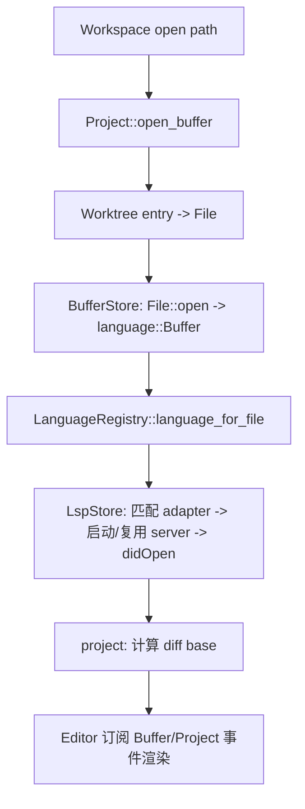

# Deep Reference: project & worktree

> 参考手册级：`crates/project`（"打开的项目"聚合根，`project.rs` 248KB + `lsp_store.rs` 683KB + `lsp_command.rs` 216KB）与 `crates/worktree`（文件系统树）。`Project` 把语言、LSP、Buffer、任务、调试、Agent、终端、协作全部**编排成一个 Entity**，是编辑器功能的中枢。

## 1. `struct Project`（[project.rs:216](../crates/project/src/project.rs)）——字段全景
| 字段 | 类型 | 子 store / 职责 |
|---|---|---|
| `languages` | `Arc<LanguageRegistry>` | 语言注册（[Language-Deep-Dive.md](Language-Deep-Dive.md)） |
| `worktree_store` | `Entity<WorktreeStore>` | 所有 `Worktree` |
| `buffer_store` | `Entity<BufferStore>` | buffer ↔ worktree 关联（`buffer_store.rs` 70KB） |
| `lsp_store` | `Entity<LspStore>` | **LSP 全部逻辑**（683KB：server 生命周期、请求路由、编辑操作） |
| `dap_store` | `Entity<DapStore>` | 调试（[Debugger.md](Debugger.md)） |
| `task_store` | `Entity<TaskStore>` | 任务（enum，[Tasks-and-Tooling.md](Tasks-and-Tooling.md)） |
| `context_server_store` | `Entity<ContextServerStore>` | MCP/context server（[Agent-and-AI.md](Agent-and-AI.md)） |
| `agent_server_store` | `Entity<AgentServerStore>` | ACP/外部 agent（85KB） |
| `toolchain_store` | `Option<Entity<ToolchainStore>>` | 语言运行时版本 |
| `terminals` | `Terminals` | 项目终端（[Terminal.md](Terminal.md)） |
| `image_store` | `Entity<ImageStore>` | 粘贴图片（[Misc-Items-and-Selectors.md](Misc-Items-and-Selectors.md)） |
| `bookmark_store` / `breakpoint_store` | `Entity<..>` | 书签 / 断点 |
| `snippets` | `Entity<SnippetProvider>` | snippet |
| `user_store` / `collab_client` | client | 用户 / 协作 |
| `collaborators` | `HashMap<PeerId,Collaborator>` | 在场协作者 |
| `client_state` | `ProjectClientState` | `Local`｜`Shared{remote_id}`｜`Collab{capability,replica_id,..}`([L315](../crates/project/src/project.rs)) |
| `environment` | `Entity<ProjectEnvironment>` | 语言服务器/任务用环境变量 |
| `settings_observer` | `Entity<SettingsObserver>` | 设置变更联动 |
| `search_history`(+included/excluded) | `SearchHistory` | 搜索历史 |
| `node` | `Option<NodeRuntime>` | 内置 Node（跑 LSP/扩展） |
| `agent_location` | `Option<AgentLocation>` | agent 当前定位（buffer+anchor） |
| `downloading_files` / `last_worktree_paths` / `remotely_created_models` | | 协作下载/远程模型保活 |

> `Project` 本身是**门面**：几乎每个方法都委托到某个 `Entity<XxxStore>`；子 store 各自 `EventEmitter`，`Project::Event`(L337) 再转发。

## 2. `Project::Event`（[project.rs:337](../crates/project/src/project.rs)）
`LanguageServerAdded(id,name,worktree_id)`、`SupplementaryLanguageServerAdded`、`LanguageServerStopped`、`LanguageServerEdited{local,remote}`、`BuildInitialLspPullDiffsFinished`、`SearchStarted`/`SearchFinished`、`FsWatcherEvent`、`ExplainDiagnostics`/`ResolveCodeAction`、`LanguageServerUnresponsive`、`DiskBasedDiagnosticsStarted/Finished`、`LanguageServerLog`、`OpenBufferByProjectId`、`Toast`、`PrettierDidFormat`、`RestartLanguageServers`… （editor/project_panel 订阅以刷新）。

## 3. Buffer / LSP 门面方法（真实锚点）
| 方法 | 位置 | 委托 |
|---|---|---|
| `create_buffer(replica_id,cx)` | [L3129](../crates/project/src/project.rs) | BufferStore |
| `open_buffer(remote_id,worktree_id,path,cx)` | [L3268](../crates/project/src/project.rs) | worktree→File→Buffer |
| `open_buffer_for_entry` / `open_unstaged_diff` / `open_conflict_lists` | project.rs | diff/冲突视图 |
| `search(query,...)` / `search_in_project` | [L4811](../crates/project/src/project.rs) | project_search.rs（见 §6） |
| `update_buffer` / `save_buffer` / `buffer_store` | project.rs | 编辑/保存（触发 LSP didSave、prettier、format） |
| LSP 请求：`completions`/`code_actions`/`hover`/`definition`/`references`/`rename`/`format`/`inlay_hints`/`signature_help`/`document_symbols` | project.rs → lsp_command.rs(216KB) | 每个是一个 `trait LspRequest`/`typed_lsp_request` |

## 4. `LspStore`（[lsp_store.rs](../crates/project/src/lsp_store.rs)，683KB）
- 持有 `Vec<LanguageServerContainer>`：每个含 `Vec<(Capability, LanguageServerId)>`、`live_local_servers`、`enabled`。
- server 生命周期：`start_language_server`→`adapter` 找命令→`node`/扩展提供可执行→initialize handshake→`didOpen`。
- 请求编解码在 [`lsp_command.rs`](../crates/project/src/lsp_command.rs)：`trait LspRequest`/`FromLsp`/`ToLsp`（`Completion`、`CodeAction`、`Hover`、`Rename`…），统一 `send_request`。
- 编辑类请求 `EditOrNavigateOperation`（rename/organize imports/code action resolve）会**产 `Operation` 应用到 buffer**（走 CRDT，可协作）。
- `pull_diagnostics`（项目级磁盘诊断）、`log_store`、`progress`（`$/progress`）。
- 子目录 `lsp_store/`：`rust_analyzer_ext`、`signature_help`、`inlay_hint_cache`、`diff_status_store`、`registration_attempts`。

## 5. `Worktree`（[worktree.rs:102](../crates/worktree/src/worktree.rs)）——**enum**
```rust
pub enum Worktree {
    Local(LocalWorktree),   // 真实磁盘 + watcher
    Remote(RemoteWorktree), // 协作会话中被邀请方经 RPC 同步的目录树
}
```
- 核心数据结构是 `SumTree<Entry>`（按路径 key 排序），见 [Sum-Tree-Deep-Dive.md](Sum-Tree-Deep-Dive.md)。
- `struct Entry`（[worktree.rs:3959](../crates/worktree/src/worktree.rs)）：一个文件/目录条目（`is_dir`、`path`、`id: ProjectEntryId`(L7095)、`inode`、`mtime`）。
- `struct ProjectEntryId(usize)`（[L7095](../crates/worktree/src/worktree.rs)）：条目稳定 id（跨刷新定位）。
- `WorktreeScanProgress`/background `Scanner`：异步遍历 + fs watcher 增量更新，发 `Event::Updated{entries}`。
- `entry_for_path`/`entry_for_id`/`paths_of_entries`/`prefixes_of_path`、`write`/`create_entry`/`rename`/`delete`（文件操作）。
- `WorktreeStore`（[worktree_store.rs](../crates/project/src/worktree_store.rs)，58KB）：管理多 worktree、worktree_id 分配、协作同步。

## 6. 搜索 / 其它子 store（真实文件）
| 子模块 | 文件(大小) | 要点 |
|---|---|---|
| project search | [project_search.rs](../crates/project/src/project_search.rs)(47KB)+[search.rs](../crates/project/src/search.rs)(23KB) | `SearchQuery`/`SearchResult`/`SearchMatch`，ripgrep 后端流式匹配，产 `MultiBuffer` excerpts |
| 任务 | [task_store.rs](../crates/project/src/task_store.rs)/[task_inventory.rs](../crates/project/src/task_inventory.rs) | `TaskStore`(enum)、`TaskTemplates` |
| agent | [agent_server_store.rs](../crates/project/src/agent_server_store.rs)(85KB)/[agent_registry_store.rs](../crates/project/src/agent_registry_store.rs) | ACP agent。→ [Agent-and-AI.md](Agent-and-AI.md) |
| context server | [context_server_store.rs](../crates/project/src/context_server_store.rs)(75KB) | MCP servers。→ [Agent-and-AI.md](Agent-and-AI.md) |
| prettier | [prettier_store.rs](../crates/project/src/prettier_store.rs) | JS/TS 格式化。 |
| manifest | [manifest_tree.rs](../crates/project/src/manifest_tree.rs) | 包/Cargo/package.json 树 |
| terminals | [terminals.rs](../crates/project/src/terminals.rs) | shell 环境注入 |
| toolchain | [toolchain_store.rs](../crates/project/src/toolchain_store.rs) | 运行时选择 |
| trusted | [trusted_worktrees.rs](../crates/project/src/trusted_worktrees.rs) | 信任目录（LSP/任务门控）。→ [Settings-and-Themes.md](Settings-and-Themes.md) |

## 7. 一次"打开文件到可编辑"的全链路


## 8. 相关页
[Language-Deep-Dive.md](Language-Deep-Dive.md)、[Editor-Deep-Dive.md](Editor-Deep-Dive.md)、[LSP-Features.md](LSP-Features.md)、[Project-Panel-and-FS.md](Project-Panel-and-FS.md)、[Workspace-Deep-Dive.md](Workspace-Deep-Dive.md)。
